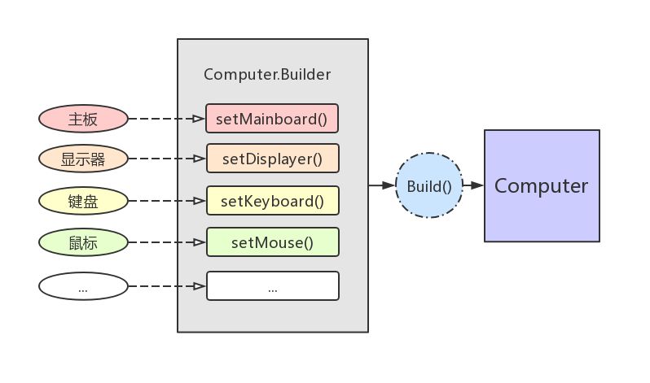

# Java 设计模式：建造者模式

建造者模式，是创建型设计模式的一种。

建造者模式将复杂对象的构建拆解成一系列的简单步骤，在构建过程中即使用户不知道内部的构建细节，也可以精细地对构建流程进行控制。

定义：
* 将一个复杂对象的构建与它的表示相分离，使得同样的构建过程在不同的控制下可以创建出不同的表示。

使用场景：
* 相同的方法，预期在不同的执行顺序下，能产生不同的结果。
* 不同的部件或零件都可以装配到一个对象中，但是获得的最终结果也是不同的。
* 当初始化一个对象特别复杂时，如参数多且很多参数都有默认值。


## 示例


假设我们现在要组装一台电脑 (这个够复杂了吧..)，该电脑的组装需要很多个零部件，比如：
* 主板 (Mainboard)
* 显示器 (Displayer)
* 键盘 (Keyboard)
* 鼠标 (Mouse)
* ...

模拟代码如下：

```java
public class Computer {
    private String mMainboard;
    private String mDisplayer;
    private String mKeyboard;
    private String mMouse;

    public Computer(String mainboard, String displayer, String keyboard, String mouse) {
        mMainboard = mainboard;
        mDisplayer = displayer;
        mKeyboard = keyboard;
        mMouse = mouse;
    }

    // 提供一个静态方法，以管理或简化 Builer 内部类实例的获取
    public static Builder newBuilder() {
        return new Builder();
    }

    // 内部静态的建造者类
    public static class Builder {
        private String mMainboard;
        private String mDisplayer;
        private String mKeyboard;
        private String mMouse;

        public Builder() {
            mMainboard = "默认主板";
            mDisplayer = "默认显示器";
            mKeyboard = "默认键盘";
            mMouse = "默认鼠标";
        }

        public Builder setMainboard(String mainboard) {
            mMainboard = mainboard;
            return this;
        }

        // else setter ..

        public Computer build() {
            return new Computer(mMainboard, mDisplayer, mKeyboard, mMouse);
        }
    }

    // getter, setter and toString ..
}
```

示意图如下：



注意其中的 `Builder` 静态内部类：
* 它的实例属性和 `Computer` 的实例属性是相同的。
* 它在构造函数中对实例属性进行了默认设置。
* 它提供的 `setter` 方法都返回了自身，以支持链式调用。
* 它提供的 `build()` 方法返回的是最终要构建的 `Computer` 实例。

下面是测试代码：

```java
public static void main(String[] args) {
    Computer.Builder builder = Computer.newBuilder();
    builder.setMainboard("华硕主板");
    builder.setDisplayer("三星显示器");
    builder.setKeyboard("罗技键盘");
    builder.setMouse("罗技鼠标");
    Computer computer1 = builder.build();
    System.out.println("第一台电脑：" + computer1);

    // 演示链式调用，以及默认值的使用
    Computer computer2 = Computer.newBuilder()
            .setMainboard("联想主板")
            .setDisplayer("戴尔显示器")
            .build();
    System.out.println("第二台电脑：" + computer2);
}
```

日志输出如下：

```java
第一台电脑：Computer{mMainboard='华硕主板', mDisplayer='三星显示器', mKeyboard='罗技键盘', mMouse='罗技鼠标'}
第二台电脑：Computer{mMainboard='联想主板', mDisplayer='戴尔显示器', mKeyboard='默认键盘', mMouse='默认鼠标'}
```

以上就是建造者模式的应用。


## 扩展

**何时使用？**
* 一些基本部件不变，但其组合经常变化时。

**有什么优点？**
* 建造者独立，容易扩展。
* 便于控制细节风险。

**有什么缺点？**
* 产品必须有共同点，范围有限制。
* 如果内部变化复杂，会有很多的建造类。

**与工厂模式的区别是？**
* 建造者模式更加关注零件装配的逻辑和顺序。


## 总结

在这篇文章中，我们通过「组装电脑」的例子演示了如何使用建造者模式。