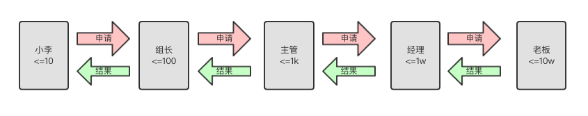

# Java 设计模式：责任链模式


责任链模式是一种行为型模式。

定义：
* 使得每一个对象都有机会处理请求，从而避开了请求发送者和请求接受者之间的耦合。
* 将这些对象连成一条链，沿着这条链传递请求，直到有对象处理为止。

使用场景：
* 多个对象可以处理同一请求，但具体由哪个对象处理是在运行时动态决定的。
* 在请求处理者不明确的情况下，向多个对象中的一个提交一个请求。
* 需要动态指定一组对象处理请求。

> 链式结构：
> * 具有很强的灵活性，每个节点都可以被拆开再连接。
> 
> 责任链模式：
> * 将链式结构应用到了编程领域，可将链中的节点看做是一个个对象，每一个对象都有不同的> 处理逻辑。
> * 当一个请求从链式的首端发出，该请求沿着链的路径依次传递给每一个节点对象，直至有对象处理为止。


## 示例


小李是某公司的员工，经常因公事出差需要向上级领导报销出差费用。该公司对报销金额的批复权限有着严格的规定，如下：
* <= 10 元，由员工自行负担。
* <= 100 元，组长级别即可批复。
* <= 1000 元，主管级别即可批复。
* <= 10000 元，经理级别即可批复。
* <= 100000 元，老板级别即可批复。
* 其它情况禁止批复，需重新发起报销流程。

首先，不管级别是员工还是其它，我们都可将其抽象一个为 `Leader` (领导)：
* 每个 `Leader` 都有一个报销金额的最大值。
* 除了老板这个 `Leader` 之外，其余每个 `Leader` 都会有一个直属的上级领导 `nextLeader`。

```java
public abstract class Leader {
    private Leader mNextHandler;

    public Leader(Leader nextHandler) {
        mNextHandler = nextHandler;
    }

    // 如果自己能处理该金额，则自己处理，否则需分发给下一级领导进行处理
    // 处理成功时，返回 true，否则返回 false
    public final boolean dispatchRequest(int money) {
        if (money <= getLimit()) {
            return handleRequest(money);
        }
        if (mNextHandler != null) {
            return mNextHandler.dispatchRequest(money);
        }
        return false;
    }

    public abstract int getLimit();
    public abstract boolean handleRequest(int money);
}
```

然后，有了抽象 `Leader` ，我们就可以构建出员工和其它领导了：

```java
// 老板
public class Boss extends Leader{
    public Boss(Leader nextHandler) {
        super(nextHandler);
    }

    @Override
    public int getLimit() {
        return 100000;
    }

    @Override
    public boolean handleRequest(int money) {
        System.out.println("老板批复报销" + money + "元");
        return true;
    }
}

// 经理
public class Manager extends Leader{

    public Manager(Leader nextHandler) {
        super(nextHandler);
    }

    @Override
    public int getLimit() {
        return 10000;
    }

    @Override
    public boolean handleRequest(int money) {
        System.out.println("经理批复报销" + money + "元");
        return true;
    }
}

// 主管
public class Director extends Leader{
    public Director(Leader nextHandler) {
        super(nextHandler);
    }

    @Override
    public int getLimit() {
        return 1000;
    }

    @Override
    public boolean handleRequest(int money) {
        System.out.println("主管批复报销" + money + "元");
        return true;
    }
}

// 组长
public class Grouper extends Leader{
    public Grouper(Leader nextHandler) {
        super(nextHandler);
    }

    @Override
    public int getLimit() {
        return 100;
    }

    @Override
    public boolean handleRequest(int money) {
        System.out.println("组长批复报销" + money + "元");
        return true;
    }
}

// 小李
public class XiaoLi extends Leader{
    public XiaoLi(Leader nextHandler) {
        super(nextHandler);
    }

    @Override
    public int getLimit() {
        return 10;
    }

    @Override
    public boolean handleRequest(int money) {
        System.out.println("小李自行花费" + money + "元");
        return true;
    }
}
```

最后，我们连接好「小李 - 组长 - 主管 - 经理 - 老板」这个链，并测试小李的报销逻辑：

```java
public static void main(String[] args) {
    Leader boss = new Boss(null);
    Leader manager = new Manager(boss);
    Leader director = new Director(manager);
    Leader grouper = new Grouper(director);
    Leader xiaoLi = new XiaoLi(grouper);

    printRequestState(xiaoLi.dispatchRequest(1));          // 小明上限 10 元
    printRequestState(xiaoLi.dispatchRequest(12));         // 组长上限 100 元
    printRequestState(xiaoLi.dispatchRequest(230));        // 主管上限 1000 元
    printRequestState(xiaoLi.dispatchRequest(3400));       // 经理上限 10000 元
    printRequestState(xiaoLi.dispatchRequest(45000));      // 老板上限 100000 元

    System.out.println("--------");
    printRequestState(xiaoLi.dispatchRequest(560000));
}

private static void printRequestState(boolean isSuccess) {
    if (isSuccess) {
        System.out.println("* 小李报销成功");
    } else {
        System.out.println("* 没有人批复，小李报销失败");
    }
}
```

日志输出如下：

```java
小李自行花费1元
* 小李报销成功
组长批复报销12元
* 小李报销成功
主管批复报销230元
* 小李报销成功
经理批复报销3400元
* 小李报销成功
老板批复报销45000元
* 小李报销成功
--------
* 没有人批复，小李报销失败
```

* 当小李出差费用为 1 元时，按照公司规定得 **自行** 处理。
* 当小李出差费用为 12 元时，按照公司规定可找 **组长** 批复报销。
* 当小李出差费用为 230 元时，按照公司规定可找 **主管** 批复报销。
* 当小李出差费用为 3400 元时，按照公司规定可找 **经理** 批复报销。
* 当小李出差费用为 45000 元时，按照公司规定可找 **老板** 批复报销。
* 当小李出差费用为 560000 元时，**无人批复**，得重新发起报销申请。

示意图如下：



> 假设在小李报销 3400 元过程的过程中，经理休假了，这条链也是能正常工作的 (因为报销申请会传到老板那里，因为 3400 元还是在老板最大批复限额内，所以可有老板批复报销申请)。


## 总结

在这篇文章中，我们通过「小李报销」的例子对责任链模式进行了讲解和应用。

责任链模式的优点：
* 将请求的发送者和接收者进行解耦，降低了耦合度。 
* 对象不需要知道链的结构，简化了对象。 
* 可自由改变链内的成员或者调动它们的次序，或者是动态地新增或者删除责任，增强了给对象指派职责的灵活性。

责任链模式的缺点：
* 不能保证请求一定被接收。 
* 系统性能可能会受到一定影响，进行代码调试时也不太方便，可能会造成循环调用。 
* 不容易观察出运行时的特征，不利于问题排查。