# Spring Boot 学习笔记：开发第一个应用程序

构建一个简单的阅读列表应用程序，用户可输入想读的图书信息、可查看图书列表、删除图书信息。

技术角度：
* 用 Spring MVC 来处理 Web 请求。
* 用 Thymeleaf 来定义Web视图。
* 用 Spring Data JPA 来持久化阅读列表数据到数据库中 (简单起见，使用嵌入式H2数据库)。

## 创建项目

可通过 [官方 Web 页面](https://start.spring.io/) 创建项目，也可通过 IDEA 中的 **Spring Initializer** 进行创建。  

### 使用官方 Web 页面创建

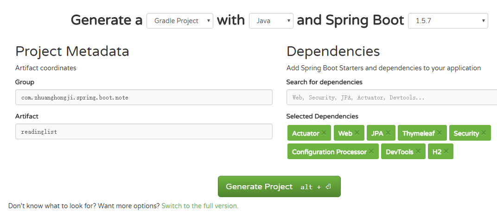

右边可以搜索并选择你需要的依赖，如果不知道依赖关键字，可以点击图中下方的 **Switch to the full version** 直接根据依赖分类和依赖具体描述进行勾选。

创建成功后的代码大致结构：

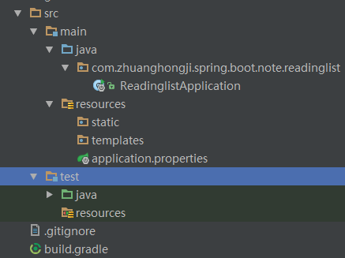  

* `src/main/java`：程序代码目录 
* `src/main/resources`：程序资源目录 
* `src/test/java`：测试代码目录   
* `src/testresources`：测试资源目录   
  * `build.gradle`: Gradle构建说明文件
  * `ReadinglistApplication.java`: 应用程序的启动引导类，也是主要配置类
  * `application.properties`: 配置应用程序和Spring Boot的属性
  * `ReadinglistApplicationTest.java`: 一个基本的集成测试类

#### 构建说明文件

本实例直接选择了 Gradle 作为构建工具，对应生成了一个 `build.gradle` 文件 (如果选择了 Maven 作为构建工具，则会生成一个 `pom.xml` 文件)。这两个文件都会描述项目的版本号、依赖，以及如何进行构建。下面来看一下 `build.gradle` 这个文件：

```gradle
buildscript {
    ext {
        springBootVersion = '1.5.7.RELEASE' // SpringBoot版本号
    }
    repositories {
        mavenCentral()
    }
    dependencies {
        // 依赖Spring Boot插件
        classpath("org.springframework.boot:spring-boot-gradle-plugin:${springBootVersion}")
    }
}

apply plugin: 'java'
apply plugin: 'eclipse'
apply plugin: 'org.springframework.boot' // 运用Spring Boot插件

version = '0.0.1-SNAPSHOT'
sourceCompatibility = 1.8

repositories {
    maven { url "http://repo.spring.io/milestone" }
    mavenCentral()
}

dependencies {
    // 起步依赖
    compile('org.springframework.boot:spring-boot-starter-actuator')
    compile('org.springframework.boot:spring-boot-starter-data-jpa')
    compile('org.springframework.boot:spring-boot-starter-security')
    compile('org.springframework.boot:spring-boot-starter-thymeleaf')
    compile("org.springframework.boot:spring-boot-configuration-processor")
    compile('org.springframework.boot:spring-boot-starter-web')
    runtime('org.springframework.boot:spring-boot-devtools')
    runtime('com.h2database:h2')
    testCompile('org.springframework.boot:spring-boot-starter-test')
    testCompile('org.springframework.security:spring-security-test')
}
```

#### 启动引导类

启动引导类的两个作用：配置和启动引导。  

先来看下 `ReadingListApplication` 的代码：

```java
@SpringBootApplication
public class ReadingListApplication {
    public static void main(String[] args) {
        SpringApplication.run(ReadingListApplication.class, args);
    }
}
```

再来看下 `@SpringBootApplication` 注解的代码：

```java
/**
 * Indicates a {@link Configuration configuration} class that declares one or more
 * {@link Bean @Bean} methods and also triggers {@link EnableAutoConfiguration
 * auto-configuration} and {@link ComponentScan component scanning}. This is a convenience
 * annotation that is equivalent to declaring {@code @Configuration},
 * {@code @EnableAutoConfiguration} and {@code @ComponentScan}.
 *
 * @author Phillip Webb
 * @author Stephane Nicoll
 * @since 1.2.0
 */
@Target(ElementType.TYPE)
@Retention(RetentionPolicy.RUNTIME)
@Documented
@Inherited
@SpringBootConfiguration
@EnableAutoConfiguration
@ComponentScan(excludeFilters = {
		@Filter(type = FilterType.CUSTOM, classes = TypeExcludeFilter.class),
		@Filter(type = FilterType.CUSTOM, classes = AutoConfigurationExcludeFilter.class) })
public @interface SpringBootApplication {
  // ...
}
```

* `@SpringBootConfiguration`: 标明该类使用 Spring 基于 Java 的配置。
* `@EnableAutoConfiguration`: 启用 Spring Boot 的自动配置 (使得我们不用再写成篇的配置代码)。
* `@ComponentScan`: 启用组件扫描 (使得Web控制器类和其他组件能被自动发现并注册为Spring应用程序上下文中的Bean)。

运行 Spring Boot 应用程序可以打包成一个传统的 WAR 文件进行部署，也可以通过生成为一个可执行 JAR 文件来运行。通过命令行执行上面的 `main()` 方法可向 `SpringApplication.run()` 方法中传递 `ReadingListApplication` 类的引用和命令行参数，通过这些东西便可启动应用程序。


#### 如何启动应用程序

* 最简单的方法是用 Gradle 的 **bootRun** 任务 (来自 Spring Boot 的 Gradle 插件)：  
执行命令 `gradlew bootRun`  
* 也可以使用 Gradle 构建项目生成 jar 包，然后在命令行里用 java 来运行它：  
执行命令：`gradlew build` `java -jar build/libs/readinglist-0.0.1-SNAPSHOT.jar`  
 (最终生成的 jar 包文件名可以在 gradle.build 文件中自定义)

应用程序正常运行之后，应用程序会启动一个监听 8080 端口的 Tomcat 服务器。

使用浏览器访问 [http://localhost:8080/](http://localhost:8080/)：
* 书上说因为没写控制器类，会收到一个 HTTP 404(NOT FOUND) 错误 (未验证)。
* 本项目将“阅读列表”功能监听端口设置为 8888，访问 8080 时会打开 Tomcat 页面。

#### 测试应用程序

`Initializer` 提供了一个测试类的骨架，可以基于它为我们的应用程序编写测试。

```java
@RunWith(SpringRunner.class)
@SpringBootTest
public class ReadinglistApplicationTests {
    @Test
    public void contextLoads() {  // 测试加载的上下文
        // ...
    }
}
```


#### 配置应用程序属性

`Initializer` 自动生成的 `application.properties` 文件是一个空文件，用来指定应用程序代码所需的配置项。这个文件是可选的，可以删掉，但留着也没什么问题。 

前面讲到可以配置端口，如果我们在 `applicaption.properties` 配置文件里面添加这样一行代码：  

```properties
server.port=8888
```

嵌入式 Tomcat 的监听端口就变成了 8888，而不是默认的 8080。需要注意的是，我们完全不用告诉 Spring Boot 去加载该文件，只要它存在就会被加载，Spring 和应用程序都能获取其中的属性。

#### Spring Boot 项目的构建过程分析

Spring Boot 为 Gradle 和 Maven 提供了构建插件，以辅助项目的构建：
* Gradle 的构建脚本参考上面代码。
* Maven 的构建脚本是一个 pom.xml 文件 (与 Gradle 类似，代码略)。

构建插件的主要功能是把项目打包成一个可执行的超级 JAR，包括把应用程序的所有依赖打入 JAR 文件内，并为 JAR 添加一个描述文件，其中的内容能让你用`java -jar`来运行应用程序。


## 阅读列表应用程序

### 登录页面：

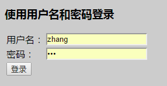

### 阅读列表页面

第一次登录，还未添加任何书籍：

```sql
-- 账号、密码、用户名称
insert into Reader (username, password, fullname) values ('zhang', 'san', '张三');
insert into Reader (username, password, fullname) values ('li', 'si', '李四');
```

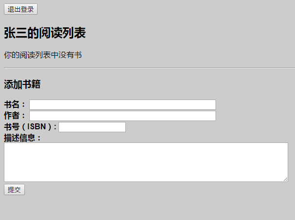

添加《Java编程思想》这本书，然后点击“提交”按钮：

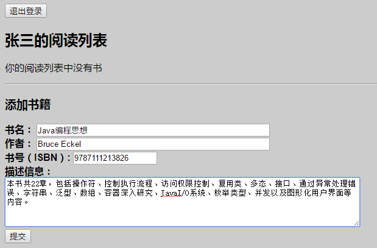

提交成功后会显示你提交的书籍，点击书名会跳转到亚马逊对应数据购买页面 (模拟跳转，打开页面可能获取不到对应数据信息)，添加书籍数量不受限制：

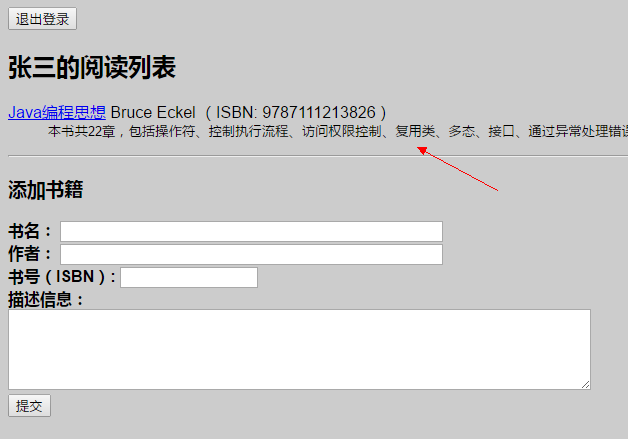


### 代码结构

Java 代码：

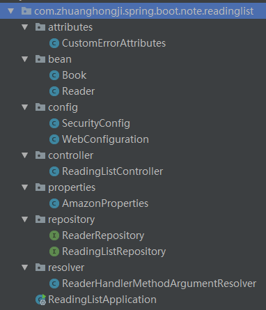  

资源代码：

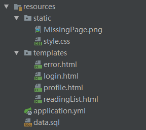

> 完整代码请参考我的 [ReadingList](https://github.com/zhuanghongji/ReadingList) 仓库。


## 使用起步依赖

### 指定基于功能的依赖

Spring Boot 提供的众多起步依赖可以大大降低“项目依赖”的复杂度。  

举个例子，现在我们正在做一个“阅读列表”应用，可以直接添加起步依赖来“声明”这是一个 Web 应用，而无需添加一堆单独的库依赖。与此同时，我们还想使用 Thymeleaf 作为 Web 视图、使用 JPA 来实现数据持久化等等，所以还在构建文件中添加这两者以及其他的起步依赖。

起步依赖代码如下：

```gradle
dependencies {
    compile('org.springframework.boot:spring-boot-starter-actuator')
    compile('org.springframework.boot:spring-boot-starter-data-jpa')
    compile('org.springframework.boot:spring-boot-starter-security')
    compile('org.springframework.boot:spring-boot-starter-thymeleaf')
    compile("org.springframework.boot:spring-boot-configuration-processor")
    compile('org.springframework.boot:spring-boot-starter-web')

    runtime('org.springframework.boot:spring-boot-devtools')
    runtime('com.h2database:h2')

    testCompile('org.springframework.boot:spring-boot-starter-test')
    testCompile('org.springframework.security:spring-security-test')
}
```
通过传递依赖，上面的 10 个依赖就等于于一大把独立的库，而且这些独立的库都是互相兼容的，我们不必担心需要维护哪些库，也不必担心他们的版本。  

如果你想知道自己具体在用哪些库，可以执行命令 `gradlew dependencies`  
比如上面的起步依赖具体用到的库有 (节选)：

```java
|    +--- org.hibernate:hibernate-core:5.0.12.Final
|    |    +--- org.jboss.logging:jboss-logging:3.3.0.Final -> 3.3.1.Final
|    |    +--- org.hibernate.javax.persistence:hibernate-jpa-2.1-api:1.0.0.Final
|    |    +--- org.javassist:javassist:3.18.1-GA -> 3.21.0-GA
|    |    +--- antlr:antlr:2.7.7
|    |    +--- org.jboss:jandex:2.0.0.Final
|    |    +--- dom4j:dom4j:1.6.1
|    |    \--- org.hibernate.common:hibernate-commons-annotations:5.0.1.Final
|    |         \--- org.jboss.logging:jboss-logging:3.3.0.Final -> 3.3.1.Final
|    +--- org.hibernate:hibernate-entitymanager:5.0.12.Final
|    |    +--- org.jboss.logging:jboss-logging:3.3.0.Final -> 3.3.1.Final
|    |    +--- org.hibernate:hibernate-core:5.0.12.Final (*)
|    |    +--- dom4j:dom4j:1.6.1
|    |    +--- org.hibernate.common:hibernate-commons-annotations:5.0.1.Final (*)
|    |    +--- org.hibernate.javax.persistence:hibernate-jpa-2.1-api:1.0.0.Final
|    |    \--- org.javassist:javassist:3.18.1-GA -> 3.21.0-GA
|    +--- javax.transaction:javax.transaction-api:1.2
|    +--- org.springframework.data:spring-data-jpa:1.11.7.RELEASE
|    |    +--- org.springframework.data:spring-data-commons:1.13.7.RELEASE
|    |    |    +--- org.springframework:spring-core:4.3.11.RELEASE
|    |    |    +--- org.springframework:spring-beans:4.3.11.RELEASE (*)
|    |    |    +--- org.slf4j:slf4j-api:1.7.25
|    |    |    \--- org.slf4j:jcl-over-slf4j:1.7.25 (*)
|    |    +--- org.springframework:spring-orm:4.3.11.RELEASE
|    |    |    +--- org.springframework:spring-beans:4.3.11.RELEASE (*)
|    |    |    +--- org.springframework:spring-core:4.3.11.RELEASE
|    |    |    +--- org.springframework:spring-jdbc:4.3.11.RELEASE (*)
|    |    |    \--- org.springframework:spring-tx:4.3.11.RELEASE (*)
|    |    +--- org.springframework:spring-context:4.3.11.RELEASE (*)
|    |    +--- org.springframework:spring-aop:4.3.11.RELEASE (*)
|    |    +--- org.springframework:spring-tx:4.3.11.RELEASE (*)
|    |    +--- org.springframework:spring-beans:4.3.11.RELEASE (*)
|    |    +--- org.springframework:spring-core:4.3.11.RELEASE
|    |    +--- org.slf4j:slf4j-api:1.7.25
|    |    \--- org.slf4j:jcl-over-slf4j:1.7.25 (*)
|    \--- org.springframework:spring-aspects:4.3.11.RELEASE
|         \--- org.aspectj:aspectjweaver:1.8.9 -> 1.8.10
+--- org.springframework.boot:spring-boot-starter-security: -> 1.5.7.RELEASE
|    +--- org.springframework.boot:spring-boot-starter:1.5.7.RELEASE (*)
|    +--- org.springframework:spring-aop:4.3.11.RELEASE (*)
|    +--- org.springframework.security:spring-security-config:4.2.3.RELEASE
|    |    +--- org.springframework.security:spring-security-core:4.2.3.RELEASE
|    |    |    +--- org.springframework:spring-aop:4.3.9.RELEASE -> 4.3.11.RELEASE (*)
|    |    |    +--- org.springframework:spring-beans:4.3.9.RELEASE -> 4.3.11.RELEASE (*)
|    |    |    +--- org.springframework:spring-context:4.3.9.RELEASE -> 4.3.11.RELEASE (*)
|    |    |    +--- org.springframework:spring-core:4.3.9.RELEASE -> 4.3.11.RELEASE
|    |    |    \--- org.springframework:spring-expression:4.3.9.RELEASE -> 4.3.11.RELEASE (*)
|    |    +--- org.springframework:spring-aop:4.3.9.RELEASE -> 4.3.11.RELEASE (*)
|    |    +--- org.springframework:spring-beans:4.3.9.RELEASE -> 4.3.11.RELEASE (*)
|    |    +--- org.springframework:spring-context:4.3.9.RELEASE -> 4.3.11.RELEASE (*)
|    |    \--- org.springframework:spring-core:4.3.9.RELEASE -> 4.3.11.RELEASE
|    \--- org.springframework.security:spring-security-web:4.2.3.RELEASE
|         +--- org.springframework.security:spring-security-core:4.2.3.RELEASE (*)
|         +--- org.springframework:spring-beans:4.3.9.RELEASE -> 4.3.11.RELEASE (*)
|         +--- org.springframework:spring-context:4.3.9.RELEASE -> 4.3.11.RELEASE (*)
|         +--- org.springframework:spring-core:4.3.9.RELEASE -> 4.3.11.RELEASE
|         +--- org.springframework:spring-expression:4.3.9.RELEASE -> 4.3.11.RELEASE (*)
|         \--- org.springframework:spring-web:4.3.9.RELEASE -> 4.3.11.RELEASE
|              +--- org.springframework:spring-aop:4.3.11.RELEASE (*)
|              +--- org.springframework:spring-beans:4.3.11.RELEASE (*)
|              +--- org.springframework:spring-context:4.3.11.RELEASE (*)
|              \--- org.springframework:spring-core:4.3.11.RELEASE
...
...
...
```

### 覆盖起步依赖引入的传递依赖

如果起步依赖所选的库仍有问题，可以通过构建工具中的功能，选择性地覆盖他们引入的传递依赖的版本号，排除传递依赖。同时，也可以为起步依赖中没有涵盖的库指定依赖。  

#### 排除依赖

以 Spring Boot 的 Web 依赖为例，它传递了 Jackson 库。如果你构建的是一个生产或消费JSON资源表述的REST服务，它会很有用。但是，如果你构建的是 Web 应用，可能就用不上它了。  

我们可以这样来排除传递依赖：

```gradle
compile('org.springframework.boot:spring-boot-starter-web') {
    exclude group: 'com.fasterxml.jackson.core'
}
```

#### 修改依赖版本

如果项目需要 Jackson，但你需要用另一个版本的 Jackson 来进行构建，而不是 Web 依赖里的那个。  

可以这样做来使用较新版本的依赖：

```gradle
compile("com.fasterxml.jackson.core:jackson-databind:2.4.3")
```
因为这个依赖的版本比 Spring Boot 的 Web 依赖引入的要新，所以是生效的。但是，如果你需要的是一个较早版本的依赖呢？ (Gradle 与 Maven不要一样，Gradle 倾向于使用库的最新版本)。

可以这样做来使用较早版本的依赖：

```gradle
// 把Web起步依赖的那个版本排除掉，加入较早版本的依赖
compile("org.springframework.boot:spring-boot-starter-web") {
exclude group: 'com.fasterxml.jackson.core'
}
compile("com.fasterxml.jackson.core:jackson-databind:2.3.1")
```
> 不管什么情况，在覆盖 Spring Boot 起步依赖引入的传递依赖时要多加小心，因为起步依赖中各个依赖版本之间的兼容性都经过了精心的测试，应该只在特殊的情况下做覆盖 (比如新版本修复了一个BUG等)。


## 使用自动配置

Spring Boot 的自动配置是一个运行时过程，运行时 (应用启动时)决定“使用哪个”和“不使用哪个” Spring 配置。  

比如说：

**Spring 的 JdbcTemplate 是不是在 Classpath 里面？**  
* 如果是并且有 DataSource 的 Bean，则自动配置一个 JdbcTemplate 的 Bean。

**Thymeleaf 是不是在 Classpath 里面？**  
* 如果是，则配置 Thymeleaf 的模板解析器、视图解析器、模板引擎。

**Spring Security 是不是在 Classpath 里面？**  
* 如果是，则进行一个非常基本的 Web 安全设置。

### 专注于应用程序功能

下面看看如何利用 Spring Boot 的自动配置，让我们专注于应用程序代码。

#### 定义领域模型

“阅读列表”应用程序的核心是书，所以需要定义一个实体类来表示这个概念：

```java
@Entity
public class Book {
    // 注意，需要显示声明一个构造方法
    public Book() {}
    @Id
    @GeneratedValue(strategy = GenerationType.AUTO)
    private Long id;
    @ManyToOne
    private Reader reader;
    private String isbn;
    private String title;
    private String author;
    private String description;
    // ignore getter and setter
}

@Entity
public class Reader implements UserDetails{
    private static final long serialVersionUID = 1L;
    public Reader() {}
    @Id
    private String username;  // Reader 字段
    private String fullname;  // Reader 字段
    private String password;  // Reader 字段
    // ignore getter and setter
    @Override
    public boolean isAccountNonExpired() {
        // 账户不过期
        return true;
    }
    @Override
    public boolean isAccountNonLocked() {
        // 不加锁
        return true;
    }
    @Override
    public boolean isCredentialsNonExpired() {
        // 证书不过期
        return true;
    }
    @Override
    public boolean isEnabled() {
        // 不禁用
        return true;
    }
    @Override
    public Collection<? extends GrantedAuthority> getAuthorities() {
        // 授予 ROLE_READER 权限
        return Arrays.asList(new SimpleGrantedAuthority("ROLE_READER"));
    }
```

* `@Entity` 注解表示该类是一个 JPA 实体。
* `@Id` 和 `@GeneratedValue(strategy = GenerationType.AUTO)` 表示 `id` 这个字段是实体的唯一标识，并且这个字段的值是自动生成的。

#### 定义仓库接口

应用程序需要将 `Book` 对象持久化到数据库中，因为用到了 Spring Data JPA，所以只需要简单定义一个接口：

```java
public interface ReadingListRepository extends JpaRepository<Book, Long>{
    // 根据读者来查找阅读列表
    List<Book> findByReader(Reader reader);
}
```

`JpaRepository` 是一个泛型接口，有两个参数：
* 仓库操作的领域对象类型。
* 该领域对象 ID 属性的类型。

在上述代码中，`ReadingListRepository` 从 `JpaRepository` 中继承的方法有：  

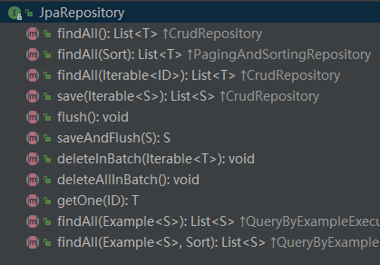  

而 `JpaRepository` 从 `PagingAndSortingRepository` 和 `QueryByExampleExecutor` 中继承的方法有：  

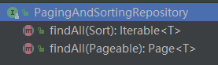  

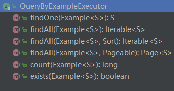

而 `PagingAndSortingRepository` 从 `CrudRepository` 中继承的方法有： 

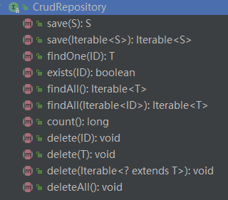

而 `CrudRepository` 继承自 `Repository`， `Repository`源代码 (空接口)如下：  

```java
/**
 * Central repository marker interface. Captures the domain type to manage as well as the domain type's id type. General
 * purpose is to hold type information as well as being able to discover interfaces that extend this one during
 * classpath scanning for easy Spring bean creation.
 * <p>
 * Domain repositories extending this interface can selectively expose CRUD methods by simply declaring methods of the
 * same signature as those declared in {@link CrudRepository}.
 *
 * @see CrudRepository
 * @param <T> the domain type the repository manages
 * @param <ID> the type of the id of the entity the repository manages
 * @author Oliver Gierke
 */
public interface Repository<T, ID extends Serializable> {

}
```

#### 创建Web页面

定义 Spring MVC 控制器来处理应用程序的 HTTP 请求：

```java
@Controller
@RequestMapping("/")
@ConfigurationProperties("amazon")
public class ReadingListController {

    private ReadingListRepository mReadingListRepository;
    private AmazonProperties mAmazonProperties;

    @Autowired
    public ReadingListController(ReadingListRepository readingListRepository, AmazonProperties amazonProperties) {
        mReadingListRepository = readingListRepository;
        mAmazonProperties = amazonProperties;
    }

    /**
    * 处理 GET 请求，根据 Reader 从仓库中获取 Book 列表器。
    * 通过键 books 将这个列表塞入到模型中，最后返回 **readingList** 作为逻辑视图名
    */
    @RequestMapping(method = RequestMethod.GET)
    public String readerBooks(Reader reader, Model model) {
        List<Book> readingList = mReadingListRepository.findByReader(reader);
        if (readingList != null) {
            model.addAttribute("books", readingList);
            model.addAttribute("reader", reader);
            model.addAttribute("amazonID", mAmazonProperties.getAssociatedId());
        }
        return "readingList";
    }

    /**
    * 处理 POST 请求，将请求的数据绑定到一个Book对象上，
    * 再设置当前读者为该对象的 Reader，
    * 然后通过仓库的 save() 方法保存修改后的对象，
    * 最后再进行重定向。
    */
    @RequestMapping(method = RequestMethod.POST)
    public String addToReadingList(Reader reader, Book book) {
        book.setReader(reader);
        mReadingListRepository.save(book);
        return "redirect:/";
    }
}
```

* `@Controller` 注解使得组件扫描会自动将 ReadingListController 注册为 Spring 应用程序上下文里的一个 Bean。
* `@RequestMapping("/")` 注解将其中所有的处理器方法 (这里有两个)都映射到了"/"这个 URL 路径上。
 * `readerBooks()` 方法：在源代码 `src\main\resources\templates` 目录下有一个 `readingList.html` 文件，便是用 Thymeleaf 为应用程序定义的视图，用于显示阅读列表和添加书籍等。
 * `addToReadingList()` 方法：重定向时发生的是 GET 请求，所以可以看做是添加书籍后再刷新列表页面。

#### 运行应用程序

运行具体效果看前文。


#### 运行过程中发生了什么

配置是 Spring Framewoek 的核心，必须要有东西告诉 Spring 该如何运行程序。  

在向应用程序加入 Spring Boot 时，有个名为 `spring-boot-autoconfigure` 的 JAR 文件。在 External libraries 中可以找到，如下图：  

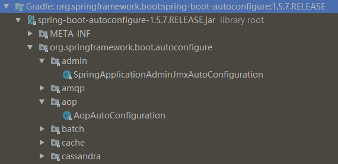  

其中包含了很多配置类，比如用于 Thymeleaf 的配置、用于 Spring Data JPA 的配置、用于 Spiring MVC 的配置等。  

每个配置类都在应用程序的 Classpath 里，我们可以自己选择是否在应用程序里使用它们。  

得益于 Spring 4.0 引入的条件化配置：
* **允许配置存在于应用程序中，但在满足某些特定条件之前都是忽略这个配置。** 

我们可以很方便的编写自己的条件：
* 实现 `Condition` 接口并覆盖它的 `matches()` 方法。    

举个例子：

```java
public class JdbcTemplateCondition implements Condition {
  @Override
  public boolean matches(ConditionContext context,
  AnnotatedTypeMetadata metadata) {
    try {
      context.getClassLoader().loadClass(
      "org.springframework.jdbc.core.JdbcTemplate");
      return true;
    } catch (Exception e) {
      return false;
    }
  }
}

// 当你用Java来声明Bean的时候，可以使用这个自定义条件类：
@Conditional(JdbcTemplateCondition.class)
public MyService myService() {
  ...
}
```
只有 `JdbcTemplateCondition` 类的条件成立时才会创建 `MyService` 这个 Bean。也就是说，Classpath 里有 JdbcTemplate 时才会创建，否则这个 Bean 的声明就会被忽略。  

Spring Boot 定义了很多有趣的条件并运用到了配置类上，这些配置类构成了 Spring Boot 的自动配置。  

Spring Boot运用条件化配置的方法：  
* **定义多个特殊的条件化注解，并将它们用在配置类上**

#### 自动配置中使用的条件化注解

|条件化注解|配置生效条件|  
|--|--|
|@ConditionalOnMissingBean| 没有配置特定的Bean
|@ConditionalOnClass| Classpath里有指定的类
|@ConditionalOnMissingClass| Classpath里缺少指定的类
|@ConditionalOnExpression| 给定的Spring Expression Language ( SpEL)表达式计算结果为true
|@ConditionalOnJava| Java的版本匹配特定值或者一个范围值
|@ConditionalOnJndi| 参数中给定的JNDI位置必须存在一个，如果没有给参数，则要有JNDI InitialContext
|@ConditionalOnProperty| 指定的配置属性要有一个明确的值
|@ConditionalOnResource| Classpath里有指定的资源
|@ConditionalOnWebApplication| 这是一个Web应用程序
|@ConditionalOnNotWebApplication| 这不是一个Web应用程序

下面分析 `DataSourceAutoConfiguration` 这个类，简单了解下 Spring Boot 的自动配置库：

> 一般来说我们是无需查看 Spring Boot 自动配置类的源代码的。

```java
@Configuration
@ConditionalOnClass({ DataSource.class, EmbeddedDatabaseType.class })
@EnableConfigurationProperties(DataSourceProperties.class)
@Import({ Registrar.class, DataSourcePoolMetadataProvidersConfiguration.class })
public class DataSourceAutoConfiguration {
    // ...
    @Configuration
    @ConditionalOnProperty(prefix = "spring.datasource", name = "jmx-enabled")
    @ConditionalOnClass(name = "org.apache.tomcat.jdbc.pool.DataSourceProxy")
    @Conditional(DataSourceAutoConfiguration.DataSourceAvailableCondition.class)
    @ConditionalOnMissingBean(name = "dataSourceMBean")
    protected static class TomcatDataSourceJmxConfiguration {
      @Bean
      public Object dataSourceMBean(DataSource dataSource) {
        if (dataSource instanceof DataSourceProxy) {
          try {
            return ((DataSourceProxy) dataSource).createPool().getJmxPool();
          }
          catch (SQLException ex) {
            logger.warn("Cannot expose DataSource to JMX (could not connect)");
          }
        }
        return null;
      }
    }
    // ...
}
```

* `@ConditionalOnClass` 注解：要求 Classpath 里必须要有 `DataSource` 和  `EmbeddedDatabaseType`。如果这两者不存在，条件就不成立，`DataSourceAutoConfiguration` 提供的配置都会被忽略掉。

```java
// @since 1.4.0
@Configuration
@ConditionalOnClass({ DataSource.class, JdbcTemplate.class })
@ConditionalOnSingleCandidate(DataSource.class)
@AutoConfigureAfter(DataSourceAutoConfiguration.class)
public class JdbcTemplateAutoConfiguration {
	private final DataSource dataSource;
	public JdbcTemplateAutoConfiguration(DataSource dataSource) {
		this.dataSource = dataSource;
	}

	@Bean
	@Primary
	@ConditionalOnMissingBean(JdbcOperations.class)
	public JdbcTemplate jdbcTemplate() {
		return new JdbcTemplate(this.dataSource);
	}

	// ...
}

public interface JdbcOperations {
  // ...
}

public class JdbcTemplate extends JdbcAccessor implements JdbcOperations {
  // ...
}
```

* `@ConditionalOnClass`注解：要求 Classpath 里必须要有 `DataSource` 和 `JdbcTemplate`。如果这两者不存在，条件就不成立，`JdbcTemplateAutoConfiguration` 提供的配置都会被忽略掉。
* `@Bean`注解：使得 `jdbcTemplate()` 方法会配置一个 JdbcTemplate Bean。
* `@ConditionalOnMissingBean`注解：说明只有不存在 `JdbcOperations` (`JdbcTemplate` 实现的接口)类型的 Bean 时，才会创建 `JdbcTemplate` Bean。

#### “阅读列表”应用程序中的配置决策

Classpath 里有 H2，所以会创建一个嵌入式的 H2 数据库 Bean。  
* 它的类型是 `javax.sql.DataSource`，JPA实现 (Hibernate)需要它来访问数据库。

Classpath 里有 Hibernate (由Spring Data JPA传递引入)的实体管理器，所以会自动配置与 Hibernate 相关的 Bean。  
* 包括 Spring 的 `LocalContainerEntityManagerFactoryBean` 和 `JpaVendorAdapter`。

Classpath 里有 Spring Data JPA，所以它会自动配置为根据仓库的接口创建仓库实现。

Classpath 里有 Thymeleaf，所以 Thymeleaf 会配置为 Spring MVC 的视图。  
* 包括一个 Thymeleaf 的模板解析器、模板引擎及视图解析器。  
* 视图解析器会解析相对于 Classpath 根目录的 `/templates` 目录里的模板。

Classpath 里 有 Spring MVC  (归功于 Web 起步依赖)，所以会配置 Spring 的 `DispatcherServlet` 并启用 Spring MVC。

Classpath 里有 Tomcat (通过 Web 起步依赖传递引用)，所以会启动一个嵌入式的Tomcat 容器。  
* 默认监听的是8080端口。

这是一个 Spring MVC Web 应用程序，所以会注册一个资源处理器。  
* 资源处理器会把相对于 Classpath 根目录的 **/static** 目录里的静态内容提供出来。  
* 这个资源处理器还能处理 **/public**、 **/resources** 和 **/META-INF/resources** 的静态内容。

#### 小结

Spring Boot 自动配置承担了配置 Spring 的重任，所以我们可以专注于编写自己的应用程序。

但有时在开发应用时，我们希望或者需要不一些同的配置，那该怎么办？  
* **通过自定义配置来进行覆盖自动配置，见下一部分内容。**


## 自定义配置

两种影响自动配置的方式：
* 使用显式配置进行覆盖。
* 使用属性进行精细化配置。
* 使用 Spring Boot 提供的钩子引人自定义错误页。

### 覆盖 Spring Boot 的自动配置

如果不用配置就能得到和显式配置一样的结果，那么不写配置是直接选择。但有些情况自动配置并不能进行很好的推断，这时就需要进行覆盖。  

举个例子：当你在应用程序中添加安全特性时，应用程序安全有很多决策要做，Spring Boot 虽然为安全提供了一定的自动配置，但我们还是需要自己覆盖一些配置以满足特定的安全需求。  

在“阅读列表”应用程序中我们在 `build.gradle` 文件中加了下面这个起步依赖：

```gradle
compile('org.springframework.boot:spring-boot-starter-security')
```

添加依赖之后运行即可，但是默认的安全配置并不复合理想，所以我们需要创建自定义的安全配置去覆盖自动配置。思想上很简单，**就当自动配置不存在，直接显式地写一段配置**。  

#### 创建自定义的安全配置

在编写显式配置时，我们会专注于Java形式的配置。  
在 Spring Boot 场景下，这意味着要写一个扩展了 `WebSecurityConfigurerAdapter` 的配置类。  

代码如下：

```java
@Configuration
public class SecurityConfig extends WebSecurityConfigurerAdapter {
    private final ReaderRepository mReaderRepository;
    @Autowired
    public SecurityConfig(ReaderRepository mReaderRepository) {
        this.mReaderRepository = mReaderRepository;
    }

    @Override
    protected void configure(HttpSecurity http) throws Exception {
        http.authorizeRequests()
                // 要求登录者有 ROLE_READER 角色
                .antMatchers("/").access("hasRole('ROLE_READER')")
                .antMatchers("/**").permitAll()
                .and()
                .formLogin()
                // 设置登录表单的路径
                .loginPage("/login")
                .failureUrl("/login?error=true");
    }

    @Override
    protected void configure(AuthenticationManagerBuilder auth) throws Exception {
        // 定义自定义 UserDetailsService
        // 这个服务可以是任意实现了 UserDetailsService 的类，用于查找
        // 指定用户名的用户
        auth.userDetailsService(userDetailsService());
    }

    @Bean
    @Override
    protected UserDetailsService userDetailsService() {
        return new UserDetailsService() {
            // 注意：我们之前定义的 Reader 实现了 UserDetails 接口
            @Override
            public UserDetails loadUserByUsername(String username) throws UsernameNotFoundException {
                UserDetails userDetails = mReaderRepository.findOne(username);
                if (userDetails != null) {
                    return userDetails;
                }
                throw new UsernameNotFoundException("User '" + username + "' not found");
            }
        };
    }
}
```
我们自定义的 `SecurityConfig` 是个非常基础的 Spring Security 配置，但它还是完成了不少安全定制工作，并且使得 Spring Boot 跳过了安全自动配置，转而使用我们自定义的安全配置。  

在上面代码中，我们覆盖了两个 `configure()` 方法，这里分析第一个：
* 指明了 “/” 路径的请求只有经过身份认证且拥有 **ROLE_READER** 角色的用户才能访问。
* 其他的所有请求路径向所有用户开放了访问权限。
* 登录页和登录失败页 (带有一个 `error` 属性)指定到了 `/login` 。

> Spring Security 为身份认证提供了众多选项，后端可以使 JDBC、LDAP 和内存用户存储。

在这个应用程序中，我们会通过 JPA 来存储用户信息。


#### 持久化读者信息

##### 实体类

前文已经提到了 `Reader` JPA 实体类，有几个字段分别用来存储用户名、用户名称和密码。  
这里再补充说明下，`Reader` 实现了 `UserDetails` 接口以及其中的方法，这样 Reader 字段就能代表 Spring Security 里的用户了。  

> 在一个大型应用程序里，赋予用户的授权本身也可能是实体，他们被维护在独立的数据表里。同样，表示一个账户是否为非过期、非锁定且可用的布尔值也是数据库里的字段。

重申一下，要想覆盖自动配置，需要做的仅仅是编写一个显式的配置。Spring Boot 会发现你的配置并降低自动配置的优先级，以你的配置为准。

##### 仓库接口

```java
public interface ReaderRepository extends JpaRepository<Reader, String> {
    // nothing
}
```

和前文提到的 `BookRepository` 类似，我们无需自己实现 `ReaderRepository` 。因为继承自 `JpaRepository`，Spring Data JPA 在运行时会自动创建它的实现。

#### 分析自动配置是如何实现的

##### JdbcTemplate

先来看一段代码 (节选自 `JdbcTemplateAutoConfiguration` 类):

```java
@Bean
@Primary
@ConditionalOnMissingBean(JdbcOperations.class)
public JdbcTemplate jdbcTemplate() {
  return new JdbcTemplate(this.dataSource);
}
```

`jdbcTemplate()` 方法使用该注解，要求当前不存在 `JdbcOperations` 类型的 Bean 时才生效，如果当前已经存在一个该类型的 Bean，那么该条件不满足，则不会执行该方法。  

> 大部分情况下，`@ConditionalOnMissingBean` 注解是覆盖自动配置的关键。  
> Spring Boot 的设计是 “记载应用级配置，然后再考虑加载自动配置类”。  

##### Spring Security

Spring Security 的自动配置会考虑几个配置类，在覆盖自动配置的安全配置时，最重要的一个类是 `SpringBootWebSecurityConfiguration`，看一下它的代码片段：

```java
@Configuration
@EnableConfigurationProperties
@ConditionalOnClass({ EnableWebSecurity.class, AuthenticationEntryPoint.class })
@ConditionalOnMissingBean(WebSecurityConfiguration.class)
@ConditionalOnWebApplication
@EnableWebSecurity
public class SpringBootWebSecurityConfiguration {
  // ...
}
```

* `@ConditionalOnWebApplication` 注解：说明这必须是个Web应用程序。
* `@ConditionalOnClass` 注解：说明Classpath里需要有 `EnableWebSecurity` 注解和 `AuthenticationEntryPoint` 接口的实现类。  
* `@ConditionalOnMissingBean` 注解：要求当下没有 `WebSecurityConfiguration` 类型的Bean，**这才是我们的安全配置类代替 SpringBootWebSecurityConfiguration 的关键所在**。

```java
@Retention(value = java.lang.annotation.RetentionPolicy.RUNTIME)
@Target(value = { java.lang.annotation.ElementType.TYPE })
@Documented
@Import({ WebSecurityConfiguration.class,
		SpringWebMvcImportSelector.class })
@EnableGlobalAuthentication
@Configuration
public @interface EnableWebSecurity {

	/**
	 * Controls debugging support for Spring Security. Default is false.
	 * @return if true, enables debug support with Spring Security
	 */
	boolean debug() default false;
}
```

表面上，我们并没有创建 `WebSecurityConfiguration` 的 Bean。实际上，`@EnableWebSecurity` 注解间接地创建了一个。也就是说，在自动配置时，这个 Bean 已经存在了，`@ConditionalOnMissingBean` 的条件不成立，故 `SpringBootWebSecurityConfiguration` 提供的配置就被跳过了。

### 通过属性文件外置配置

有时我们需要微调配置中的一些细节，比如修改端口、修改日志级别或重新设置数据库的URL。此时我们是不需要覆盖自动配置的，配置一个属性显得更加简单。  

Spring 提供了 300 多个用于微调的属性，调整途径有：

* 环境变量
* Java系统属性
* JNDI (Java Naming and Directory Interface)
* 命令行参数
* 属性文件

下面通过一个简单的例子来了解下这些属性。在启动 Spring Boot 应用程序时，我们会在命令行中看到这样一个 `Banner` :  

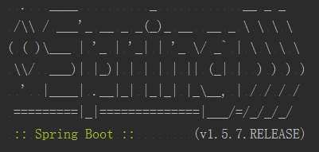  

如果想禁用它，需要将spring.main.show-banner属性置为false，简单介绍下常用的几种方式：  
* 在命令行参数中指定 `$ java -jar readinglist-0.0.1-SNAPSHOT.jar --spring.main.show-banner=false`。
* 创建一个名为 application.properties 的文件，包含内容 `spring.main.show-banner=false`。
* 或者创建一个名为 application.yml 的文件，包含内容：
```yml
spring:
  main:
    show-banner: false
```


### 定制程序错误页面

Spring Boot 提供了默认的错误页，大致如下图：  

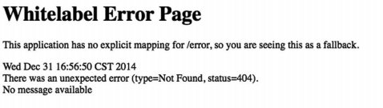  

Spring Boot 自动配置的默认错误处理器会查找名为 **error** 的视图，找不到就会使用默认的。因此，我们可以创建一个自定义视图，让解析出的视图名为 error，这一点取决于错误视图解析时的视图解析器。  

* 实现了 Spring 的 View 接口的 Bean，其 ID 为 error (由Spring的BeanNameViewResolver所解析)。
* 如果配置了 Thymeleaf，则有名为 error.html 的 Thymeleaf 模板。
* 如果配置了 FreeMarker，则有名为 error.ftl 的 FreeMarker 模板。
* 如果配置了 Velocity，则有名为 error.vm 的 Velocity 模板。
* 如果是用 JSP 视图，则有名为 error.jsp 的 JSP 模板。

在“阅读列表”应用程序中，我们使用了 Thymeleaf，所以需要创建一个名为 error.html 的文件，把它和其他的应用程序模板一起放在模板文件夹里面。效果图和代码如下：  

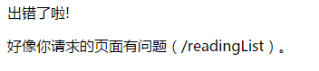  

```html
<!DOCTYPE html>
<html lang="en" xmlns:th="http://www.w3.org/1999/xhtml">
<head>
    <meta charset="UTF-8"/>
    <title>噢，出错了</title>
    <link rel="stylesheet" th:href="@{/style.css}"/>
</head>
<body>
    <div class="errorPage">
        <span class="oops">出错了啦!</span>
        
        <p>好像你请求的页面有问题 (<span text="${path}"></span>)。</p>
        <p th:text="${'详情：' + message}"></p>
    </div>
</body>
</html>
```

其中有两处特别的信息需要呈现：
* 错误的请求路径。
* 异常消息。

但这并非错误页上的全部细节。默认情况下，Spring Boot 会为错误视图提供如下错误属性 ：  
* `timestamp`：错误发生的时间
* `status`：HTTP状态码
* `error`：错误原因
* `exception`：异常的类名
* `message`：异常消息 (如果这个错误是由异常引起的)
* `errors`：BindingResult异常里的各种错误 (如果这个错误是由异常引起的)
* `trace`：异常跟踪信息 (如果这个错误是由异常引起的)
* `path`：错误发生时请求的URL路径


## 关于测试

前面我们差不多用 Spring Boot 写了一个相对完整应用程序，我们会验证它是否能满足预期。除了在浏览器中手动点击验证外，我们还需要写一些自动化、可重复运行的测试来进行检查。  

> Spring 鼓励松耦合、接口驱动的设计，这些使得编写单元测试更加轻松。  

在编写单元测试时，Spring 通常不需要介入。但是，在继承测试中需要用到 Spring。如果生产应用程序使用 Spring 来配置并组装组件，那么测试就需要用它来配置并组装那些组件。

Spring的 `SpringJUnit4ClassRunner` 可以在基于 `JUnit` 的应用程序测试里加载 Spring 应用程序上下文。在测试 Spring Boot 应用程序时，**Spring Boot 除了拥有 Spring 的集成测试支持，还开启了自动配置和 Web 服务器，并提供了不少实用的测试辅助工具**。

### 集成测试自动配置

对 Spring 应用程序进行集成测试时，让 Spring 遵照生产环境来组装测试目标 Bean 是非常重要的一点。当然，你也可以手动初始化并将它们注入其他组件，但对大型应用来说是件费力不讨好的事情。  

自 Spring 2.5 开始，集成测试支持的形式就变成了 `SpringJUnit4ClassRunner`。这是一个 JUnit 类运行器，会为 JUnit 测试加载 Spring 应用程序上下文，并为测试类自动织入所需的 Bean。  

看一个代码片段：

```java
// 开启Spring集成测试支持
@RunWith(SpringJUnit4ClassRunner.class)
// 加载应用程序上下文
@ContextConfiguration(classes=AddressBookConfiguration.class)
public class AddressServiceTests {
  // 注入地址服务
  @Autowired
  private AddressService addressService;

  // 测试服务地址
  @Test
  public void testService() {
    Address address = addressService.findByLastName("Sheman");
    assertEquals("P", address.getFirstName());
    assertEquals("Sherman", address.getLastName());
    assertEquals("42 Wallaby Way", address.getAddressLine1());
    assertEquals("Sydney", address.getCity());
    assertEquals("New South Wales", address.getState());
    assertEquals("2000", address.getPostCode());
  }
}
```

* 除了加载应用程序上下文，`SpringJUnit4ClassRunner` 还能通过自动织入从应用程序上下文里向测试本身注入 Bean。因为这是一个针对 `AddressService` Bean 的测试，所以需要将它注入测试。最后，`testService()` 方法调用地址服务并验证了结果。
* `@ContextConfiguration` 在加载 Spring 应用程序上下文的过程中做了很多事情，但它没能加载完整的 Spring Boot。 Spring Boot 应用程序最终是由 `SpringApplication` 加载的。

`SpringApplication` 不仅加载应用程序上下文，还会开启日志、加载外部属性 (application.properties 或 application.yml)以及其他 Spring Boot 特性。用 `@ContextConfiguration` 则得不到这些特性，要在集成测试中得到，可以把 `@ContextConfiguration` 替换为 Spring Boot 的 `@SpringApplicationConfiguration` :  

```java
@RunWith(SpringJUnit4ClassRunner.class)
@SpringApplicationConfiguration(classes=AddressBookConfiguration.class)
public class AddressServiceTests {
  // ...
}
```

两者用法大致相同，但也有不同的地方。  

> 我们有充分的理由说，在大多数情况下，为 Spring Boot 应用程序编写测试时应该用 `@SpringApplicationConfiguration` 代替 `@ContextConfiguration`。

### 测试 Web 应用程序

针对控制器编写测试，就像测试 POJO 一样。  

举个例子：

```java
@Controller
@RequestMapping("/")
@ConfigurationProperties("amazon")
public class ReadingListController {
    private ReadingListRepository mReadingListRepository;

    // ...

    @RequestMapping(method = RequestMethod.POST)
    public String addToReadingList(Reader reader, Book book) {
        book.setReader(reader);
        mReadingListRepository.save(book);
        return "redirect:/";
    }
}
```

如果忽略 `addToReadingList()` 方法的注解，这就是个简单的 Java 方法。  

但是不能简单的通过提供一个 `ReadingListRepository` 的模拟实现，然后调用 `addToReadingList()` 方法，再判断返回值并验证 `mReadingListRepository.save()` 方法是否有过调用这样子进行测试。因为我们 **不仅仅要测试方法本身，还要测试该方法处理POST请求的情况和测试表单域绑定到Book参数的情况**。  

> 要恰当的测试一个 Web 应用程序，需要投入一些实际的 HTTP 请求，确认它能正确地处理这些请求。  

在 Spring Boot 中，有两个可选的方案能实现这类测试：
* Spring Mock MVC：在一个近似真实的模拟 Servlet 容器中测试控制器，而不用实际启动应用服务器。
* Web 集成测试：在嵌入式 Servlet 容器中启动应用程序，在真正的应用服务器中执行测试。

#### 模拟 Spring MVC

要在测试里设置 Mock MVC，可以使用 `MockMvcBuilders` 类。该类提供了两个静态方法：

```java
public class MockMvcBuilders {

  // 使用Spring应用程序上下文来构建Mock MVC，该上下文里可以包含一个或多个配置好的控制器
  // 两者区别：基于一个WebApplicationContext实例，通常由Spring加载控制器和依赖，以
  // 便进行完整的集成测试。
	public static DefaultMockMvcBuilder webAppContextSetup(WebApplicationContext context) {
		return new DefaultMockMvcBuilder(context);
	}

	/**
	 * 构建一个 Mock MVC，提供一个或多个手工创建并配置的控制器配置好的控制器
   * 两者区别：希望你手工初始化并注入你要测试的控制器，同单元测试更加接近，你可能只
   * 想让它专注于单一控制器的测试。
	 * @param controllers one or more {@code @Controller} instances to test
	 */
	public static StandaloneMockMvcBuilder standaloneSetup(Object... controllers) {
		return new StandaloneMockMvcBuilder(controllers);
	}
}
```

“阅读列表”中用的是 `webAppContextSetup()`，Spring 完成了 `ReadingListController` 的初始化，并从 Spring Boot 自动配置的应用程序上下文中将其注入，我们可以直接对其进行测试：

```java
@RunWith(SpringJUnit4ClassRunner.class)
@ContextConfiguration(classes = ReadingListApplication.class)
@WebAppConfiguration                 // 开启Web上下文测试
public class MockMvcWebTests {

    @Autowired                      // 注入 WebApplicationContext
    private WebApplicationContext mWebApplicationContext;

    private MockMvc mMockMvc;

    @Before
    public void setupMockMvc() {    // 设置MockMvc
        mMockMvc = MockMvcBuilders
                .webAppContextSetup(mWebApplicationContext)
                .apply(springSecurity())
                .build();
    }

    // ...
}
```

* `webAppContextSetup()` 方法接受一个 WebApplicationContext 参数，所以我们需要为测试类加上 `@WebAppConfiguration` 注解。
* 然后使用 `@Autowired` 注解将 WebApplicationContext 作为实例变量注入测试类。
* `@Before` 注解表明该方法应该在测试方法之前执行。
* `springSecurity()` 方法返回了一个 Spring MVC 配置器，为 Mock MVC 开启了 Spring Security 支持。这样，Spring Security 会介入 MockMvc 上执行的每个请求。

现在我们有了一个 MockMvc，已经可以开始写测试方法了。

#### 测试 Web 安全

```java
    // 在请求主页的时候，如果未经身份验证，我们应该期待重定向到登录页面
    @Test
    public void homePage_unauthenticatedUser() throws Exception {
        mMockMvc.perform(get("/"))
                .andExpect(status().is3xxRedirection())
                .andExpect(header().string("Location", "http://localhost/login"));
    }

    @Test
    // 根据给定的用户名查找 UserDetail 对象，加载安全上下文
    @WithUserDetails("li")
    // 记载安全上下文，其中包含一个 UserDetails，使用了给定的用户名、密码和授权
    @WithMockUser(username = "li", password = "si", roles = "ROLE_READER")
    public void homePage_authenticatedUser() throws Exception {
        // 配置期望的Reader
        Reader expectedReader = new Reader();
        expectedReader.setUsername("li");
        expectedReader.setPassword("si");
        expectedReader.setFullname("李四");
        // 发起GET请求
        mMockMvc.perform(get("/"))
                .andExpect(status().isOk())
                .andExpect(view().name("readingList"))
                .andExpect(model().attribute("reader", samePropertyValuesAs(expectedReader)))
                .andExpect(model().attribute("books", hasSize(0)))
                .andExpect(model().attribute("amazonID", "zhuang"));
    }
```

测试成功页面：  

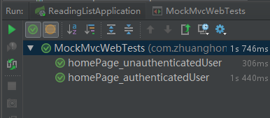

### 测试运行中的应用程序

#### 用随机端口启动服务器

#### 使用 Selenium 测试 HTML 页面

TBD..
