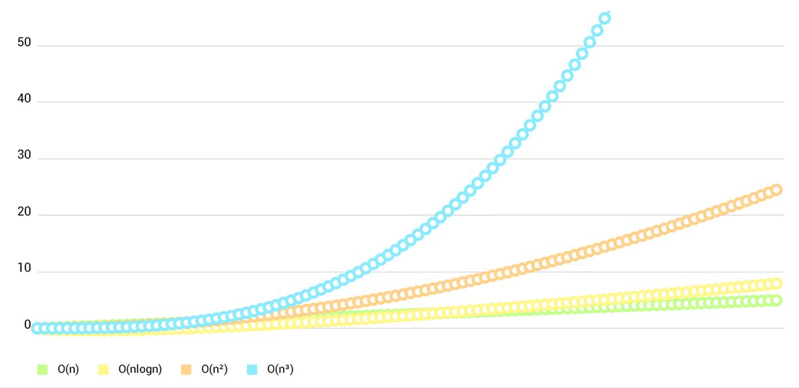

# MPAndroidChart 笔记：概述

## 序言

`MPAndroidChart 笔记` 系列文章是在 `2015` 年写的，内容可能已经过时了。

现在仅仅是将其搬运到 GitHub 上，后面如果有时间的话会对该系列文章进行迭代优化，并补充源码分析相关内容，但从 `2016年10月` 到现在都还没进行这部分的工作，所以也不用有任何期待，一切随缘。

```
2015 年发现和学习 MPAndroidChart 时，边学习边翻译了官方 Wiki，后来毕业后很长时间都没有继续用到这个库。工作后因为业务需要的特殊性，即使接触到一些图表功能开发也没有使用这个库，大多数时候都是自定义 View 来实现业务需求的图表功能。这并不意味着 MPAndroidChart 的扩展性不好，而是因为历史原因，继续使用自定义 View 开发更加方便快捷。

随着业务的发展，发现在原有自定义 View 上做改动实现新功能是比较困难的。前人在自定义 View 时封装性做得不够好、可扩展性相对较差（因为无法预料到业务的发展，也无需做到很好的扩展性）。

如今自己要新写图表时，发现难以下手，于是想了解 MPAndroidChart 是如何设计的，所以就决定进行一次彻底的源码分析。

-- 记于2016年10月17日
```

## 介绍

### MPAndroidChart 是什么

[MPAndroidChart](https://github.com/PhilJay/MPAndroidChart) 是 Android 平台上一个强大且容易使用的图表库：
* 支持线状图、柱状图、散点图、烛状图、气泡图、饼状图和蜘蛛网状图。
* 支持缩放、拖动(平移)、选择和动画。
* 适用于 Android 2.2 ( API 8 ) 和以上。


### MPAndroidChart 有哪些特性

* 8种不同的图表类型
* 两轴缩放（支持触摸手势,两轴单独或同时的放缩）
* 拖/平移/抛（触摸手势）
* Combined-Charts 组合图表（线状、柱状、散点图等）
* 双轴（比如说有两个独立的Y轴数据）
* 画值 （draw values into the chart with touch-gesture）
* 高亮显示值（我们可以自定义Popup-views来高亮显示我们选中的值）
* 多个 / 单独的轴
* 图保存到sd卡（图像或txt文件）
* 预定义的颜色模板
* Legends（自动生成，自定义）
* 自定义轴（x轴和y轴）
* 动画（建立x和y轴动画）
* 限制线（比如提供附加信息、最大值…）
* 完全自定义（paints、字体、legends、颜色、背景、手势、虚线…）
* 平滑缩放和滚动 30.000 数据点（线状，柱状图表）

### 如何接入

**Gradle :**

```gradle
repositories {
    maven { url 'https://jitpack.io' }
}

dependencies {
    implementation 'com.github.PhilJay:MPAndroidChart:v3.1.0'
}
```

**Maven :**

```xml
<!-- <repositories> section of pom.xml -->
<repository>
    <id>jitpack.io</id>
   <url>https://jitpack.io</url>
</repository>

<!-- <dependencies> section of pom.xml -->
<dependency>
    <groupId>com.github.PhilJay</groupId>
    <artifactId>MPAndroidChart</artifactId>
    <version>v3.1.0</version>
</dependency>
```

## 示例

**LineChart (with legend, simple design) :**


**LineChart (with legend, simple design) :**



**LineChart (cubic lines) :**


**LineChart (gradient fill) :**


**BarChart (with legend, simple design) :**


**BarChart (grouped DataSets) :**


**Horizontal-BarChart :**


**Combined-Chart (bar- and linechart in this case) :**


**PieChart (with selection, ...) :**


**ScatterChart (with squares, triangles, circles, ... and more) :**


**CandleStickChart (for financial data) :**


**BubbleChart (area covered by bubbles indicates the yValue) :**


**RadarChart (spider web chart) :**

