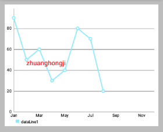

# MPAndroidChart 笔记：开始

## 使用
为了使用 `LineChart, BarChart, ScatterChart, CandleStickChart, PieChart, BubbleChart or RadarChart` ，要在 `.xml` 文件定义：

```xml
<com.github.mikephil.charting.charts.LineChart
    android:id="@+id/chart"
    android:layout_width="match_parent"
    android:layout_height="match_parent" />
```

然后在 Activity 或 Fragment 中拿到你定义的 chart：

```java
// in this example, a LineChart is initialized from xml
LineChart chart = (LineChart) findViewById(R.id.chart);
```

使用 java 代码创建它 (如果不是在布局文件中定义，需要将其加入你的布局)：

```java
// programmatically create a LineChart
LineChart chart = new LineChart(Context);

// get a layout defined in xml
RelativeLayout rl = (RelativeLayout) findViewById(R.id.relativeLayout);
rl.add(chart); // add the programmatically created chart
```

## 刷新

- `invalidate()`: 在chart中调用会使其刷新重绘
- `notifyDataSetChanged()`: 让chart知道它依赖的基础数据已经改变，并执行所有必要的重新计算 (比如偏移量，legend，最大值，最小值 …)。在动态添加数据时需要用到。


## 打印日志

- `setLogEnabled(boolean enabled)`: 设置为 `true` 将激活 chart 的 logcat 输出。但这不利于性能，如果不是必要的，应保持禁用。
  

## 基本 chart 风格

这里我们先定义一个 LineChart 范例：

```xml
<!--折线图,layout的背景色为 #bdbdbd 灰-->
<com.github.mikephil.charting.charts.LineChart
    android:id="@+id/line_chart"
    android:layout_width="match_parent"
    android:layout_height="300dp"
    android:background="#ffffff"
    android:layout_margin="16dp"/>
```


下面是一些可以直接在 chart 上使用的设置 style 的方法：

- `setBackgroundColor(int color)`: 设置背景颜色，将覆盖整个图表视图。 此外，背景颜色可以在布局文件 `.xml` 中进行设置。
  
 

> 注意：设置颜色时要ARGB完整的八位 (如 `0xff00ff00`)，否则可能会被视为“设置透明颜色” (如 `0xff0000`)

- `setDescription(String desc)`: 设置图表的描述文字，会显示在图表的右下角。
- `setDescriptionColor(int color)`: 设置描述文字的颜色。
  
  

- `setDescriptionPosition(float x, float y)`: 自定义描述文字在屏幕上的位置 (单位是像素)。
- `setDescriptionTypeface(Typeface t)`: 设置描述文字的 Typeface。
- `setDescriptionTextSize(float size)`: 设置以像素为单位的描述文字，最小6f，最大16f。

 

- `setNoDataTextDescription(String desc)`: 设置当 chart 为空时显示的描述文字。
  
 

- `setDrawGridBackground(boolean enabled)`: 如果启用，chart 绘图区后面的背景矩形将绘制。
  
 

- `setGridBackgroundColor(int color)`: 设置网格背景应与绘制的颜色。
  
 

- `setDrawBorders(boolean enabled)`: 启用/禁用绘制图表边框 (chart周围的线)。
- `setBorderColor(int color)`: 设置 chart 边框线的颜色。
- `setBorderWidth(float width)`: 设置 chart 边界线的宽度，单位 dp。

  

- `setMaxVisibleValueCount(int count)`: 设置最大可见绘制的 chart count 的数量。 只在 `setDrawValues()` 设置为 `true` 时有效。 