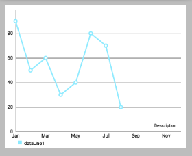

# MPAndroidChart 笔记：坐标轴，X轴，Y轴，Labels

## 坐标轴

### Document

在文档中，AxisBase 是 XAxis 和 YAxis 的父类。

- AxisBase: Baseclass of all labels.

- XAxis: Class representing the x-axis labels settings. Only use the setter methods to modify it. Do not access public variables directly. Be aware that not all features the XLabels class provides are suitable for the RadarChart. X轴标签设置。只使用setter方法来修改它，不要直接访问公共变量。请注意，not all features the XLabels class provides are suitable for the RadarChart（对于RadarChart蜘蛛网状图不是所有的Xlabels 都适用）。

- YAxis: Class representing the y-axis labels settings and its entries. Only use the setter methods to modify it. Do not access public variables directly. Be aware that not all features the YLabels class provides are suitable for the RadarChart. Customizations that affect the value range of the axis need to be applied before setting data for the chart. Y轴标签设置和它的条目。只使用setter方法来修改它，不要直接访问公共变量。请注意，not all features the XLabels class provides are suitable for the RadarChart（对于RadarChart蜘蛛网状图不是所有的Ylabels 都适用）。在为 `chart` 设置 data 之前，影响轴的值范围的 Customizations 需要先被应用。

### 概述

下面提及的方法可以适用于两个轴 。

"轴"类允许特定的Style，由以下  components/parts 组成（可以包含）：
- 轴的标签（y轴垂直绘制 或 x轴水平取向），contain 轴的描述值。
- 所谓 `axis-line` 被直接绘制在便签旁且平行。
- `grid-lines` 在水平方向，且源自每一个轴标签。
- `LimitLines` 允许呈现的特别信息，如边界或限制。

### 控制轴的哪些部分被绘制

- `setEnabled(boolean enabled)`: 设置轴启用或禁用。如果false，该轴的任何部分都不会被绘制（不绘制坐标轴/便签等）。比如：

 

```java
//上面右边效果图的部分代码，设置X轴
XAxis xAxis = chart.getXAxis();
xAxis.setPosition(XAxis.XAxisPosition.BOTTOM); // 设置X轴的位置
//        xAxis.setTypeface(mTf); // 设置字体
xAxis.setEnabled(false);
// 上面第一行代码设置了false,所以下面第一行即使设置为true也不会绘制AxisLine
xAxis.setDrawAxisLine(true); 

// 前面xAxis.setEnabled(false);则下面绘制的Grid不会有"竖的线"（与X轴有关）
xAxis.setDrawGridLines(true); // 效果如下图
```

- `setDrawGridLines(boolean enabled)`: 设置为true，则绘制网格线。

 

```java
// 上面左边效果图的代码
// 两个都设置为 true
xAxis.setEnabled(true);
xAxis.setDrawGridLines(true);

// 上面右边效果图的代码
xAxis.setEnabled(false);
// xAxis.setEnabled(false);则下面绘制的Grid不会有 "竖的线(与X轴有关)"
xAxis.setDrawGridLines(true);
```

- `setDrawAxisLine(boolean enabled)`: 设置为true，则绘制该行旁边的轴线（axis-line）。
  
 

- `setDrawLabels(boolean enabled)`: 设置为true，则绘制轴的标签。 
  
  


### Styling / 修改轴　

- `setTextColor(int color)`: 设置轴标签的颜色。
- `setTextSize(float size)`: 设置轴标签的文字大小。
- `setTypeface(Typeface tf)`: 设置轴标签的 Typeface。
- `setGridColor(int color)`: 设置该轴的网格线颜色。
- `setGridLineWidth(float width)`: 设置该轴网格线的宽度。
- `setAxisLineColor(int color)`: 设置轴线的轴的颜色。
- `setAxisLineWidth(float width)`: 设置该轴轴行的宽度。
  
  

```java
xAxis.setTextColor(Color.BLUE);
xAxis.setTextSize(24f);
xAxis.setGridLineWidth(10f);
xAxis.setGridColor(Color.RED);
xAxis.setAxisLineColor(Color.GREEN);
xAxis.setAxisLineWidth(5f);
```

- `enableGridDashedLine(float lineLength, float spaceLength, float phase)`: 启用网格线的虚线模式中得出，比如像这样“ - - - - - - ”。 
- “lineLength”控制虚线段的长度
- “spaceLength”控制线之间的空间
- “phase”controls the starting point.
 
   


### 限制线

两个轴支持 `LimitLines` 来呈现特定信息，如边界或限制线。`LimitLines` 加入到 `YAxis` 在水平方向上绘制，添加到 `XAxis` 在垂直方向绘制。 如何通过给定的轴添加和删除 `LimitLines`：
- `addLimitLine(LimitLine l)`: 给该轴添加一个新的 LimitLine 。
- `removeLimitLine(LimitLine l)`: 从该轴删除指定 LimitLine 。
- 还有其他的方法进行 添加/删除 操作。
  
 

```java
// 设置x轴的LimitLine，index是从0开始的
LimitLine xLimitLine = new LimitLine(4f,"xL 测试");
xLimitLine.setLineColor(Color.GREEN);
xLimitLine.setTextColor(Color.GREEN);
xAxis.addLimitLine(xLimitLine);

// 设置x轴的LimitLine
LimitLine yLimitLine = new LimitLine(50f,"yLimit 测试");
yLimitLine.setLineColor(Color.RED);
yLimitLine.setTextColor(Color.RED);
// 获得左侧侧坐标轴
YAxis leftAxis = chart.getAxisLeft();
leftAxis.addLimitLine(yLimitLine);
```

- `setDrawLimitLinesBehindData(boolean enabled)`: 控制 `LimitLines` 与 `actual data` 之间的 `z-order` 。 如果设置为 true，LimitLines 绘制在 actual data 的后面，否则在其前面。 默认值：false 
  
 

```java
// 查看setLimitLinesBehindData()方法，true或false的效果图
LimitLine xLimitLine = new LimitLine(2f,"is Behind");
xLimitLine.setLineColor(Color.BLUE);
xLimitLine.setTextColor(Color.BLUE);
xAxis.addLimitLine(xLimitLine);
xAxis.setDrawLimitLinesBehindData(true);

// xAxis.setDrawLimitLinesBehindData(false);
```

Limit lines（`LimitLine类`） 用来为用户提供简单明了的额外信息。

再举一个例子，在用户登录用的应用程序中，图表可能会显示各种血压测量结果。 为了让用户知道超过140mmHg 的血压是被认为是一个健康风险的用户，可以添加一个 `140` 的 `LimitLine` 来提供该信息。示例代码 ：

```java
YAxis leftAxis = chart.getAxisLeft();

LimitLine ll = new LimitLine(140f, "血压偏高");
ll.setLineColor(Color.RED);
ll.setLineWidth(4f);
ll.setTextColor(Color.BLACK);
ll.setTextSize(12f);
// .. and more styling options

leftAxis.addLimitLine(ll);
```

## X 坐标轴

### 概述

`XAxis` 类是 `AxisBase` 的一个子类。`XAxis` 类是所有与水平轴相关的 "数据和信息容器"。

每个 `Line-, Bar-, Scatter-, CandleStick- and RadarChart` 都有一个 `XAxis` 对象。 `XAxis` 对象展示了以 `ArrayList<String>` 或 `String[] ("xVals")` 形式递交给 `ChartData ` 对象的数据。

为了获得 `XAxis` 类的实例，可执行以下操作： 

```java
XAxis xAxis = chart.getXAxis();
```


### 自定义轴值

- `setSpaceBetweenLabels(int characters)`: 设置标签字符间的空隙，默认characters间隔是4 。
  
  

- `setLabelsToSkip(int count)`: 设置在"绘制下一个标签"时，要忽略的标签数。 This will disable the feature that automatically calculates an adequate space between the axis labels and set the number of labels to be skipped to the fixed number provided by this method. Call `resetLabelsToSkip(...)` to re-enable automatic calculation.
  
 

- `resetLabelsToSkip()`: 调用这个方法将使得通过 `setLabelsToSkip(...)` 的“忽略效果”失效 while drawing the x-axis. Instead, the number of values to skip will again be calculated automatically.

 

```java
// 上面左图的代码
xAxis.setLabelsToSkip(4);
// xAxis.resetLabelsToSkip();

// 上面右图的代码，会发现 xAxis.setLabelsToSkip(4); 的效果并没有出现
xAxis.setLabelsToSkip(4);
xAxis.resetLabelsToSkip(); 
```

- `setAvoidFirstLastClipping(boolean enabled)`: 如果设置为true，则在绘制时会避免“剪掉”在x轴上的图表或屏幕边缘的第一个和最后一个坐标轴标签项。

- `setPosition(XAxisPosition pos)`: 设置XAxis出现的位置。 
  - `TOP`，`BOTTOM`，
  - `TOP_INSIDE`，`BOTTOM_INSIDE` 或 `BOTH_SIDED`。 (从左到右，从上到下，对应下图)

 

 


 

### 格式化值

* `setValueFormatter(XAxisValueFormatter formatter)`: 设置自定义格式，在绘制之前动态调整 x 的值。 
  
    
### 范例代码

```java
XAxis xAxis = chart.getXAxis();
xAxis.setPosition(XAxisPosition.BOTTOM);
xAxis.setTextSize(10f);
xAxis.setTextColor(Color.RED);
xAxis.setDrawAxisLine(true);
xAxis.setDrawGridLines(false);
// set a custom value formatter
xAxis.setXValueFormatter(new MyCustomFormatter()); 
// and more...
```

## Y轴

### 概述

`YAxis` 是 `AxisBase` 的一个子类。

`YAxis` 类是一切与垂直轴相关的数据和信息的容器。 每个 Line-, Bar-, Scatter or CandleStickChart 都有 `left` 和 `right` 的 `YAxis` 的对象，分别在左右两边。 但是 `RadarChart` 只有一个 `YAxis` 。 缺省情况下，图表的两个轴都被启用，并且将被绘制。

通过以下方法可获得 `YAxis` 类实例 ： 

```java
YAxis leftAxis = chart.getAxisLeft();
YAxis rightAxis = chart.getAxisRight();

YAxis leftAxis = chart.getAxis(AxisDependency.LEFT);

YAxis yAxis = radarChart.getYAxis(); // this method radarchart only
```

在运行时，使用 `public AxisDependency getAxisDependency()` 方法以确定此轴表示图表的侧面。


### 自定义轴值

- `setStartAtZero(boolean enabled)`: 设置为 true，则无论图表显示的是哪种类型的数据，该轴最小值总是0 。
- `setAxisMaxValue(float max)`: 设置该轴的最大值。 如果设置了，这个值将不会是根据提供的数据计算出来的。
- `resetAxisMaxValue()`: 调用此方法撤销先前设置的最大值。 通过这样做，你将再次允许轴自动计算出它的最大值。
- `setAxisMinValue(float min)`: 设置该轴的自定义最小值。 如果设置了，这个值将不会是根据提供的数据计算出来的。
- `resetAxisMinValue()`: 调用此撤销先前设置的最小值。 通过这样做，你将再次允许轴自动计算它的最小值。
  
 

```java
// 上面的右图是以下代码设置后的效果图
leftAxis.setStartAtZero(false);
leftAxis.setAxisMinValue(30);
leftAxis.setAxisMaxValue(60);
```

- `setInverted(boolean enabled)`: 如果设置为true，该轴将被反转，这意味着最高值将在底部，顶部的最低值。
  
 

- `setSpaceTop(float percent)`: 设置图表中的最高值的顶部间距占最高值的值的百分比（设置的百分比 = 最高柱顶部间距/最高柱的值）。默认值是10f，即10% 。
  
 

```java
// 上面左图，间距长度是值长度的50%,间距长度是值长度的二分之一
leftAxis.setSpaceTop(20f);

// 上面左图，间距长度是值长度的100%，即两者相等
leftAxis.setSpaceTop(100f);
```

- `setSpaceBottom(float percent)`: Sets the bottom spacing (in percent of the total axis-range) of the lowest value in the chart in comparison to the lowest value on the axis. 

- `setLabelCount(int count, boolean force)`: 设置y轴的标签数量。 请注意，这个数字是不固定 `if(force == false)`，只能是近似的。 如果 `if(force == true)`，则确切绘制指定数量的标签，但这样可能导致轴线分布不均匀。
- `setShowOnlyMinMax(boolean enabled)`: 如果启用，该轴将只显示它的最小值和最大值。 如果 `force == true` 这可能会被 `忽略/覆盖` 。
  
 

```java
// 上面的左图
leftAxis.setLabelCount(5, false);
leftAxis.setShowOnlyMinMax(true);

// 上面的右图
leftAxis.setLabelCount(5, false);
leftAxis.setShowOnlyMinMax(true);
```

- `setPosition(YAxisLabelPosition pos)`: 设置，其中轴标签绘制的位置。 无论是 `OUTSIDE_CHART` 或 `INSIDE_CHART` 。 
  
 
 
为图表设定数据前，影响图表轴所需的值范围要先定义好。

### 自定义格式的轴标签

- `setValueFormatter(YAxisValueFormatterf)`: 设置该轴的自定义 ValueFormatter。 该接口允许 格式化/修改 原来的标签文本，返回一个自定义的文本。  

### 示例代码 

```java
YAxis yAxis = mChart.getAxisLeft();
yAxis.setTypeface(...); // set a different font
yAxis.setTextSize(12f); // set the textsize
yAxis.setAxisMaxValue(100f); // the axis maximum is 100
yAxis.setTextColor(Color.BLACK);
yAxis.setValueFormatter(new MyValueFormatter());
yAxis.setLabelCount(6, false);
//... and more
```