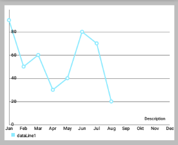
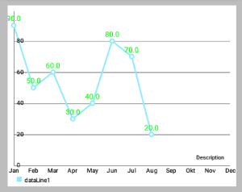
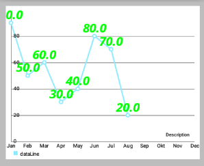
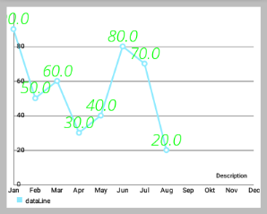
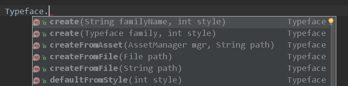
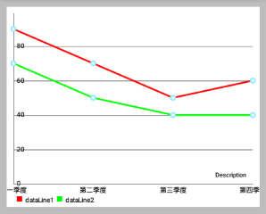
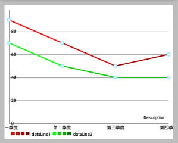

# MPAndroidChart 笔记：设置数据，设置颜色

## ChartData 类

为了让大家更容易理解，这里先简单介绍下 `MPAndroidChart` 的数据模型 `ChartData` 。后面有文章再详细介绍该图标库的其它数据类型。

`ChartData` 类是所有数据类的基类，比如 `LineData`，`BarData` 等，它是用来为 `Chart` 提供数据的，通过 `setData(ChartData data){...}` 方法。 

```java
public class LineData extends ChartData { ...
```

以下提到的方法是在 `ChartData` 类中被实现，因此可用于所有子类。

### Styling data

- `setDrawValues(boolean enabled)`: 启用/禁用 绘制所有 `DataSets` 数据对象包含的数据的值文本。 
- `setValueTextColor(int color)`: 设置 `DataSets` 数据对象包含的数据的值文本的颜色。
- `setValueTextSize(float size)`: 设置 `DataSets` 数据对象包含的数据的值文本的大小 (单位是dp) 。
  
 

```java
// LineDataSet可以看做是一条线
LineDataSet dataSet = new LineDataSet(entryList, "dataLine");
dataSet.setLineWidth(2.5f);
dataSet.setCircleSize(4.5f);
dataSet.setHighLightColor(Color.RED); // 设置点击某个点时，横竖两条线的颜色
dataSet.setDrawValues(true);          // 是否在点上绘制 Value
dataSet.setValueTextColor(Color.GREEN);
dataSet.setValueTextSize(12f);
allLinesList.add(dataSet);
```

- `setValueTypeface(Typeface tf)`: 设置Typeface的所有价值标签的所有DataSets这些数据对象包含。
  
  



```java
dataSet.setValueTextSize(24f);
allLinesList.add(dataSet);

// 设置上面左图的字体
Typeface tf1 = Typeface.createFromAsset(getAssets(), "OpenSans-BoldItalic.ttf");
dataSet.setValueTypeface(tf1);

// 设置上面右图的字体
Typeface tf2 = Typeface.createFromAsset(getAssets(), "OpenSans-LightItalic.ttf");
dataSet.setValueTypeface(tf2);
```

- `setValueFormatter(ValueFormatter f)`: 为`DataSets` 数据对象包含的数据设置自定义的 `ValueFormatter`。

    
### Getters / Convenience

- `getDataSetByIndex(int index)`: 返回目标 `DataSet` 列表中给定索引的数据对象。
- `contains(Entry entry)`: 检查此数据对象是否包含指定的Entry 。 注：这个相当影响性能，性能严峻情况下，不要过度使用。
- `contains(T dataSet)`: Returns true if this data object contains the provided DataSet , false if not.


### Clear

- `clearValues()`: 清除所有 `DataSet` 对象和所有 `Entries` 的数据 。 不会删除所提供的 `x-values`。 
  
### 选中高亮

- `setHighlightEnabled(boolean enabled)`: 设置为true，允许通过点击高亮突出 `ChartData` 对象和其 `DataSets` 。 

## 设置数据

### 概述

如果你想为图表添加数据，你可以通过下面这个方法：

```java
public void setData(ChartData data) { ... }
```

基类 `ChartData` 封装了渲染过程中所需要的图表中的所有数据和信息。 对于每种类型的图表，不同的 `ChartData` 子类 (例如 `LineData`) 应该被用于为图表设置数据。 在构造函数中，你可以通过 `ArrayList<? extends DataSet> ` 作为要显示的值，一个额外 `ArrayList` 的 `String` 用来描述 x 轴上的标签。 例如，通过 `LineData` 将数据添加到一个 `LineChart`:

```java
// this is just one of many constructors
public LineData(ArrayList<String> xVals, ArrayList<LineDataSet> sets) { ... }
```

那么，`DataSet` 到底是什么和为什么你会需要它？ 很简单，一个 `DataSet` 对象代表一组 `entries ` (数据类型 `Entry`) ，在图表内属于一个整体。 它在图表中被设计成 **逻辑上分离的不同组的值** 。 每种类型的图表，通过一个不同的 `DataSet` 对象 (如 `LineDataSet`) 来做出特定的 style 。

### 举个例子

你可能想用 `LineChart` 来 **显示两个不同公司一年的季度收入** 。在这种情况下，将建议创建两个不同的 `LineDataSet` 对象，每个包含四个值 (四个季度) 。 用一个 `ArrayList` 描述在x轴上的标签，您只需提供四个 `String`: `“第一季度”，“第二季度”，“第三季度”，“第四季度”`。

当然，也有可能只提供一个包含两个公司的所有8个值的 `LineDataSet` 对象。

那么，如何建立一个 `LineDataSet` 对象？

```java
// LineDataSet 类的源码
public class LineDataSet extends LineRadarDataSet<Entry> {
    // ...
    public LineDataSet(List<Entry> yVals, String label) {
        super(yVals, label);

        // mCircleSize = Utils.convertDpToPixel(4f);
        // mLineWidth = Utils.convertDpToPixel(1f);

        mCircleColors = new ArrayList<Integer>();

        // default colors
        // mColors.add(Color.rgb(192, 255, 140));
        // mColors.add(Color.rgb(255, 247, 140));
        mCircleColors.add(Color.rgb(140, 234, 255));
    }
    // ...
}  
```
在构造函数中，很明显 `LineDataSet` 需要一个 `Entry`  的 `ArrayList` 参数，和一个 `String` 参数作为 **图例 ** (`Legend`) 的 `label` 来描述 `LineDataSet`  。 此外， this label can be used to find the LineDataSet amongst other LineDataSet objects in the LineData object.

该  `Entry` 类型的 `ArrayList` 封装了图表所有的值。 `Entry` 相当一个容器，用来封装并保存“一对值”，and it's position on the x-axis ( `the index inside the ArrayList of String of the LineData object the value is mapped to`):

```java
public Entry(float val, int xIndex) { ... }
```

### 还是用之前的例子

以前面提到的 (这两家公司一年的季度营收) 为例：

总的数据包含和操作类似：

```java
// 假设是为 LineChart 设置数据，数据操作顺序大概如下：
new Entry(float val, int xIndex);
new ArrayList<Entry>();

new LineDataSet(ArrayList<Entry> , "label");
new ArrayList<LineDataSet>();

new LineData(List<String> xVals, List<LineDataSet> dataSets));
chart.setData(LineData);
// 详细步骤继续往下看
```

首先，创建类型的列表 Entry，将保留您的值： 

```java
ArrayList<Entry> valsComp1 = new ArrayList<Entry>();
ArrayList<Entry> valsComp2 = new ArrayList<Entry>();
```

然后，给 `lists` 集合添加 `Entry` 对象。 

确保 `Entry` 对象包含的 index 都是正确的(对于x轴来说) 。

```java
Entry c1e1 = new Entry(100.000f, 0); // 0 == quarter 1
valsComp1.add(c1e1);
Entry c1e2 = new Entry(50.000f, 1);  // 1 == quarter 2 ...
valsComp1.add(c1e2);
// and so on ...

Entry c2e1 = new Entry(120.000f, 0); // 0 == quarter 1
valsComp2.add(c2e1);
Entry c2e2 = new Entry(110.000f, 1); // 1 == quarter 2 ...
valsComp2.add(c2e2);
//...
```

现在，有了 `Entry` 对象的 `lists` 集合，再创建 `LineDataSet` 对象：

```java
LineDataSet setComp1 = new LineDataSet(valsComp1, "Company 1");
setComp1.setAxisDependency(AxisDependency.LEFT);
LineDataSet setComp2 = new LineDataSet(valsComp2, "Company 2");
setComp2.setAxisDependency(AxisDependency.LEFT);
```

通过调用 `setAxisDependency(...)` 使得  `DataSet` 对应指定轴，进行绘制。 

通过 `DataSets` 集合和  `x-axis entries` 集合，来创建我们的 `ChartData` 对象：

```java
//  public LineData(List<String> xVals, List<LineDataSet> dataSets) {
//        super(xVals, dataSets);
//  }

ArrayList<LineDataSet> dataSets = new ArrayList<LineDataSet>();
dataSets.add(setComp1);
dataSets.add(setComp2);

ArrayList<String> xVals = new ArrayList<String>();
xVals.add("1.Q"); xVals.add("2.Q"); xVals.add("3.Q"); xVals.add("4.Q"); 

LineData data = new LineData(xVals, dataSets);
mLineChart.setData(data);
mLineChart.invalidate(); // refresh
```

* 调用 `invalidate()` 后图表被刷新，所提供的数据重新绘制。

## 设置颜色

### ColorTemplate 类简介

- **Class that holds predefined color integer arrays (e.g. ColorTemplate.VORDIPLOM_COLORS) and convenience methods for loading colors from resources.**

该类封装有 **预定义的颜色整数数组** (例如 `ColorTemplate.VORDIPLOM_COLORS`) 和便利的从资源加载颜色的方法。

`ColorTemplate` 类的源码：

```java
public class ColorTemplate {

    /**
     * an "invalid" color that indicates that no color is set
     */
    public static final int COLOR_NONE = -1;

    /**
     * this "color" is used for the Legend creation and indicates that the next
     * form should be skipped
     */
    public static final int COLOR_SKIP = -2;

    /**
     * THE COLOR THEMES ARE PREDEFINED (predefined color integer arrays), FEEL
     * FREE TO CREATE YOUR OWN WITH AS MANY DIFFERENT COLORS AS YOU WANT
     */
    public static final int[] LIBERTY_COLORS = {
            Color.rgb(207, 248, 246), Color.rgb(148, 212, 212), Color.rgb(136, 180, 187),
            Color.rgb(118, 174, 175), Color.rgb(42, 109, 130)
    };
    public static final int[] JOYFUL_COLORS = {
            Color.rgb(217, 80, 138), Color.rgb(254, 149, 7), Color.rgb(254, 247, 120),
            Color.rgb(106, 167, 134), Color.rgb(53, 194, 209)
    };
    public static final int[] PASTEL_COLORS = {
            Color.rgb(64, 89, 128), Color.rgb(149, 165, 124), Color.rgb(217, 184, 162),
            Color.rgb(191, 134, 134), Color.rgb(179, 48, 80)
    };
    public static final int[] COLORFUL_COLORS = {
            Color.rgb(193, 37, 82), Color.rgb(255, 102, 0), Color.rgb(245, 199, 0),
            Color.rgb(106, 150, 31), Color.rgb(179, 100, 53)
    };
    public static final int[] VORDIPLOM_COLORS = {
            Color.rgb(192, 255, 140), Color.rgb(255, 247, 140), Color.rgb(255, 208, 140),
            Color.rgb(140, 234, 255), Color.rgb(255, 140, 157)
    };

    /**
     * Returns the Android ICS holo blue light color.
     * 
     * @return
     */
    public static int getHoloBlue() {
        return Color.rgb(51, 181, 229);
    }

    /**
     * turn an array of resource-colors (contains resource-id integers) into an
     * array list of actual color integers
     * 
     * @param r
     * @param colors an integer array of resource id's of colors
     * @return
     */
    public static List<Integer> createColors(Resources r, int[] colors) {

        List<Integer> result = new ArrayList<Integer>();

        for (int i : colors) {
            result.add(r.getColor(i));
        }

        return result;
    }

    /**
     * Turns an array of colors (integer color values) into an ArrayList of
     * colors.
     * 
     * @param colors
     * @return
     */
    public static List<Integer> createColors(int[] colors) {
        List<Integer> result = new ArrayList<Integer>();
        for (int i : colors) {
            result.add(i);
        }
        return result;
    }
}
```

- 当时自从 MPAndroidChart V1.4.0 之后，`ColorTemplate` 这个类就不再重要了。我们可以直接通过 `DataSet` 对象进行指定颜色，从而可以区分每个 `DataSet` 的 Style 。


### 举例说明

还是用公司季度营收的例子，我们有两个不同的 `LineDataSet` 代表两家公司，为此我们现在要设置不同的颜色。

我们希望：
- "公司1" 的颜色用四种不同变化“红”来表示
- "连队2" 的颜色用四种不同变化“绿”来表示
-  (效果如下面效果图的右图，左图是单色的) 

效果图如下所示： 

 

```java
ArrayList<LineDataSet> allLinesList = new ArrayList<LineDataSet>();
// LineDataSet可以看做是一条线
LineDataSet dataSet1 = new LineDataSet(entryList1, "dataLine1");
LineDataSet dataSet2 = new LineDataSet(entryList2, "dataLine2");

// 上面左效果图的代码
// dataSet1.setColor(Color.RED);
// dataSet2.setColor(Color.GREEN);

// sets colors for the dataset, 
// resolution of the resource name to a "real" color is done internally
dataSet1.setColors(new int[]{R.color.red1, R.color.red2, R.color.red3,
    R.color.red4}, context);
dataSet2.setColors(new int[]{R.color.green1, R.color.green2, R.color.green3,
    R.color.green4}, context);

allLinesList.add(dataSet1);
allLinesList.add(dataSet2);

List<String> quarterStrs = new ArrayList<String>();
quarterStrs.add("第一季度");
quarterStrs.add("第二季度");
quarterStrs.add("第三季度");
quarterStrs.add("第四季度");
// LineData表示一个LineChart的所有数据(即一个LineChart中所有折线的数据)
LineData mChartData = new LineData(quarterStrs, allLinesList);
```

除此之外，还有很多其他的方法来设置 `DataSet` 的颜色。下面是完整的文档：
- `setColors(int [] colors, Context c)`: 设置该 DataSet 的颜色。 
您可以使用 `new int[] {R.color.red，R.color.green，...}` 使得颜色值可以重用。 在内部，颜色是使用 `getResources().getColor(...)` 来实现获取的。

- `setColors(int [] colors)`: 设置该 DataSet 的颜色。Colors are reused as soon as the number of Entries the DataSet represents is higher than the size of the colors array. Make sure that the colors are already prepared (by calling `getResources().getColor(...))` before adding them to the DataSet.

- `setColors(ArrayList<Integer> colors)`: 设置该 DataSet 的颜色。Sets the colors that should be used fore this DataSet. Colors are reused as soon as the number of Entries the DataSet represents is higher than the size of the colors array. Make sure that the colors are already prepared (by calling `getResources().getColor(...))` before adding them to the DataSet.

- `setColor(int color)`: 设置该数据集 **唯一的颜色**。 在内部，实现方式类似上面的"颜色数组"，只不过"颜色数组都是同一种颜色"

### ColorTemplate 的使用例子 

```java
LineDataSet set = new LineDataSet(...);
set.setColors(ColorTemplate.VORDIPLOM_COLORS);
```

- 如果没有为 `DataSet` 设置颜色，则使用默认颜色。