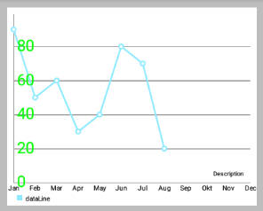
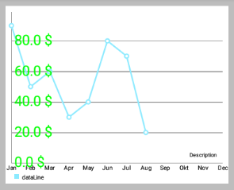
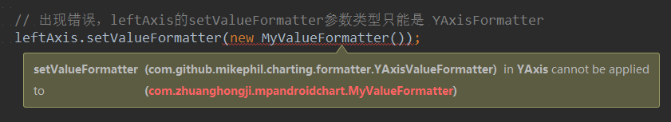

# MPAndroidChart 笔记：数据格式器

## ValueFormatter 接口

### 简介

- **Interface that allows custom formatting of all values inside the chart before they are being drawn to the screen. Simply create your own formatting class and let it implement ValueFormatter. Then override the getFormattedValue(...) method and return whatever you want.**
  
ValueFormatter 是一个接口，在被绘制到屏幕之前允许自定义图表内所有的值的格式。方法很简单，创建自己的格式类并让它实现 ValueFormatter 接口，然后覆盖 `getFormattedValue(...)` 方法返回你想要的。

### 源码

```java
public interface ValueFormatter {

    /**
     * Called when a value (from labels inside the chart) is formatted
     * before being drawn. For performance reasons, avoid excessive 
     * calculationsand memory allocations inside this method.
     *
     * @param value           the value to be formatted
     * @param entry           the entry the value belongs to - in 
     *     e.g. BarChart, this is of class BarEntry
     * @param dataSetIndex    the index of the DataSet the entry in 
     *     focus belongs to
     * @param viewPortHandler provides information about the current 
     *     chart state (scale, translation, ...)
     * @return the formatted label ready for being drawn
     */
    String getFormattedValue(float value, Entry entry, int dataSetIndex,
              ViewPortHandler viewPortHandler);
}
```

### 自定义数据格式例子

```java
public interface ValueFormatter {

    /**
     * Called when a value (from labels inside the chart) is formatted
     * before being drawn. For performance reasons, avoid excessive calculations
     * and memory allocations inside this method.
     *
     * @param value           the value to be formatted
     * @param entry           the entry the value belongs to - in e.g. BarChart, 
     *     this is of class BarEntry
     * @param dataSetIndex    the index of the DataSet the entry in focus belongs to
     * @param viewPortHandler provides information about the current 
     *     chart state (scale, translation, ...)
     * @return the formatted label ready for being drawn
     */
    String getFormattedValue(float value, Entry entry, int dataSetIndex, 
        ViewPortHandler viewPortHandler);
}
```

- 然后，设置格式为 ChartData 或 DataSet 对象：

```java
// usage on whole data object
lineData.setValueFormatter(new MyValueFormatter());

// usage on individual dataset object
lineDataSet.setValueFormatter(new MyValueFormatter());
```

### 预定义的自定义格式

#### LargeValueFormatter

可用于格式化 **大于"1.000"** 的值。它会被转变，比如：
- "1.000"变成"1k"
- "1.000.000"变成"1m"(million)
- "1.000.000.000"将“1b”(billion)

它不支持带有小数的数字，如“1.000,5”数字。**LargeValueFormatter 源码如下：**

```java
public class LargeValueFormatter implements ValueFormatter, YAxisValueFormatter {

    private static String[] SUFFIX = new String[]{
            "", "k", "m", "b", "t"
    };
    private static final int MAX_LENGTH = 4;
    private DecimalFormat mFormat;
    private String mText = "";

    public LargeValueFormatter() {
        mFormat = new DecimalFormat("###E0");
    }

    /**
     * Creates a formatter that appends a specified text to the result string
     *
     * @param appendix a text that will be appended
     */
    public LargeValueFormatter(String appendix) {
        this();
        mText = appendix;
    }

    // ValueFormatter
    @Override
    public String getFormattedValue(float value, Entry entry, int dataSetIndex, 
            ViewPortHandler viewPortHandler) {
        return makePretty(value) + mText;
    }

    // YAxisValueFormatter
    @Override
    public String getFormattedValue(float value, YAxis yAxis) {
        return makePretty(value) + mText;
    }

    /**
     * Set an appendix text to be added at the end of the formatted value.
     *
     * @param appendix
     */
    public void setAppendix(String appendix) {
        this.mText = appendix;
    }

    /**
     * Set custom suffix to be appended after the values.
     * Default suffix: ["", "k", "m", "b", "t"]
     *
     * @param suff new suffix
     */
    public void setSuffix(String[] suff) {
        if (suff.length == 5) {
            SUFFIX = suff;
        }
    }

    /**
     * Formats each number properly. Special thanks to Roman Gromov
     * (https://github.com/romangromov) for this piece of code.
     */
    private String makePretty(double number) {

        String r = mFormat.format(number);

        r = r.replaceAll("E[0-9]", 
            SUFFIX[Character.getNumericValue(r.charAt(r.length() - 1)) / 3]);

        while (r.length() > MAX_LENGTH || r.matches("[0-9]+\\.[a-z]")) {
            r = r.substring(0, r.length() - 2) + r.substring(r.length() - 1);
        }

        return r;
    }
}
```

#### PercentFormatter

**Used for displaying a "%" sign after each value with 1 decimal digit.** 

对于 `PieChart` 来说非常有用。**PercentFormatter 源码如下：**

```java
public class PercentFormatter implements ValueFormatter, YAxisValueFormatter {

    protected DecimalFormat mFormat;

    public PercentFormatter() {
        mFormat = new DecimalFormat("###,###,##0.0");
    }

    /**
     * Allow a custom decimalformat
     *
     * @param format
     */
    public PercentFormatter(DecimalFormat format) {
        this.mFormat = format;
    }

    // ValueFormatter
    @Override
    public String getFormattedValue(float value, Entry entry, int dataSetIndex, 
            ViewPortHandler viewPortHandler) {
        return mFormat.format(value) + " %";
    }

    // YAxisValueFormatter
    @Override
    public String getFormattedValue(float value, YAxis yAxis) {
        return mFormat.format(value) + " %";
    }
}
```

## XAxisValueFormatter 接口

### 概述

在 `v2.1.4` 后才有了这个接口。
- `XAxisValueFormatter` 接口可用于创建定制格式化器类，在它们绘制到屏幕之前 **动态地调整  x-values** 。
- 对于使用 `XValueFormatter` 只需创建一个新的类，让它实现接口，通过 `getXValue(...)` 方法返回任何你想要显示的 X 轴标签。  50 -> 50.0％
  
### 自定义格式示例

```java
public class MyCustomXAxisValueFormatter implements XAxisValueFormatter {

    @Override
    public String getXValue(String original, int index, ViewPortHandler viewPortHandler) {
        // original is the original value to use, x-index is the index in your x-values array
        // implement your logic here ...
        return ...;
    }
}
```

- 然后，为 X 轴设置格式器：

```java
// usage on XAxis, get axis instance:
XAxis xAxis = chart.getXAxis();

// set the formatter
xAxis.setValueFormatter(new MyCustomXAxisValueFormatter());
```
### 预定义了的 XAxisValueFormatters

- **XAxisValueFormatters 源码：**
 
```java
package com.github.mikephil.charting.formatter;
import com.github.mikephil.charting.utils.ViewPortHandler;

/**
 * Default formatter class for adjusting x-values before drawing them.
 * This simply returns the original value unmodified.
 */
public class DefaultXAxisValueFormatter implements XAxisValueFormatter {

    @Override
    public String getXValue(String original, int index, 
            ViewPortHandler viewPortHandler) {
        return original; // just return original, no adjustments
    }
}
```

### 自定义 XAxisValueFormatters 范例

- **MyCustomXAxisValueFormatter.java 代码：**
  
```java
package com.xxmassdeveloper.mpchartexample.custom;
import com.github.mikephil.charting.utils.ViewPortHandler;
import com.github.mikephil.charting.formatter.XAxisValueFormatter;

public class MyCustomXAxisValueFormatter implements XAxisValueFormatter {

    public MyCustomXAxisValueFormatter() {
        // maybe do something here or provide parameters in constructor
    }

    @Override
    public String getXValue(String original, int index, ViewPortHandler viewPortHandler) {

        /* Log.i("TRANS", "x: " + viewPortHandler.getTransX() 
            + ", y: " + viewPortHandler.getTransY()); */

        // e.g. adjust the x-axis values depending on scale / zoom level
        if (viewPortHandler.getScaleX() > 5)
            return "4";
        else if (viewPortHandler.getScaleX() > 3)
            return "3";
        else if (viewPortHandler.getScaleX() > 1)
            return "2";
        else
            return original;
    }
}
```

## YAxisValueFormatter 接口

### 概述

在 `v2.1.4` 后才有了这个接口：
- `YAxisValueFormatter` 接口可用于创建定制格式化器类，在它们绘制到屏幕之前 **动态地调整  x-values** 。
- 对于使用 `YValueFormatter` 只需创建一个新的类，让它实现接口，通过 `getFormattedValue(...) ` 方法返回任何你想要显示的 。 
 
### 自定义格式示例

```java
public class MyYAxisValueFormatter implements YAxisValueFormatter {

    private DecimalFormat mFormat;

    public MyYAxisValueFormatter () {
        mFormat = new DecimalFormat("###,###,##0.0"); // use one decimal
    }

    @Override
    public String getFormattedValue(float value, YAxis yAxis) {
        // write your logic here
        // access the YAxis object to get more information
        return mFormat.format(value) + " $"; // e.g. append a dollar-sign
    }
}
```

然后，为 `YAxis` 对象设置格式器：

```java
// get an instance of the YAxis (e.g. left axis)
YAxis leftAxis = chart.getAxisLeft();
leftAxis.setValueFormatter(new MyYAxisValueFormatter());
```

### 预定义的自定义格式

`LargeValueFormatter` 和 `PercentFormatter` .

- 详情请看前面介绍的 **ValueFormatter 接口** 的 **预定义的自定义格式** 。 

## 三种格式器的实例效果图分析

### 1. ValueFormatter
### 2. XValueFormatter
### 3. YValueFormatter

- 自定义的 `YValueFormatter` ：**MyYAxisValueFormatter.java**
  
```java
public class MyYAxisValueFormatter implements YAxisValueFormatter {

    private DecimalFormat mFormat;

    public MyYAxisValueFormatter() {
        mFormat = new DecimalFormat("###,###,###,##0.0");
    }

    @Override
    public String getFormattedValue(float value, YAxis yAxis) {
        return mFormat.format(value) + " $";
    }
}
```

 

```java
YAxis leftAxis = chart.getAxisLeft();
leftAxis.setTextSize(24f);
leftAxis.setTextColor(Color.GREEN);
// 给Y轴的标签文本设置数据各格式器，上面的左图未设置格式器
leftAxis.setValueFormatter(new MyYAxisValueFormatter());
```
注意：`leftAxis` 的 `setValueFormatter` 参数类型只能是 `YAxisFormatter` !

