# MPAndroidChart 笔记：图表的具体设置

## 线状图，柱状图，散点图，烛状图 & 气泡图

本章将重点介绍各个图表类型特定的设置。

- `setAutoScaleMinMaxEnabled(boolean enabled)`: 标志，指示自动缩放在y轴已启用。 如果启用Y轴自动调整到最小和当前的X轴的范围，只要视口变化的最大y值。 这是图表显示的财务数据特别有趣。默认值：false 

## 柱状图

- `setDrawValueAboveBar(boolean enabled)`: 如果设置为true，所有值都高于其 bar 的，而不是低于其顶部。默认：true
  
  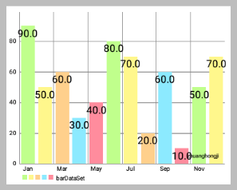
 
- `setDrawBarShadow(boolean enabled)`: 如果设置为true，会在各条 bar 后面绘制 "灰色全 bar"，用以指示最大值。 启用会降低性能约 40％ 。默认：false
  
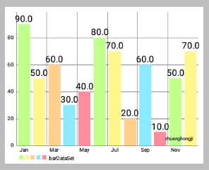 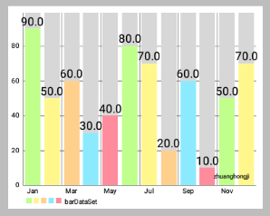

- `setDrawValuesForWholeStack(boolean enabled)`: If set to true, all values of stacked bars are drawn individually, and not just their sum on top of all.
  
- `setDrawHighlightArrow(boolean enabled)`: Set this to true to draw the highlightning arrow above each bar when highlighted.

## 饼形图

- `setCenterText(SpannableString text)`: 设置所绘制在饼图中心的文本。 较长的文本将被自动“wrapped”，以避免被裁剪成一段一段的。
- `setCenterTextRadiusPercent(float percent)`: 设置中心文本 **边框的矩形范围**，as a percentage of the pie hole default 1.0f (100%) , 该值可以大于 1.0f. 
  
要想真正改变中心文本的大小，要通过 `chart.setCenterTextSize(float size);` 来进行设置。

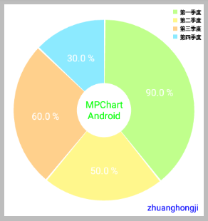 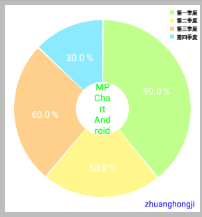

```java
chart.setCenterText("MPChart\nAndroid");
chart.setCenterTextSize(18f);
// 上面左图
chart.setCenterTextRadiusPercent(0.8f);
// 上面左图
chart.setCenterTextRadiusPercent(0.1f);
```

- `chart.setCenterTextSize(float size)`: 设置所绘制在饼图中心的文本大小。
  
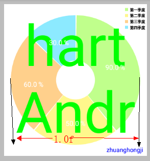 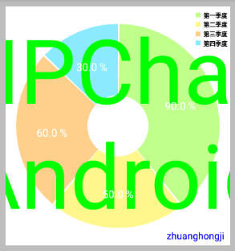

```java
chart.setCenterTextSize(150f);
// 上面左图
chart.setCenterTextRadiusPercent(1.0f);
// 上面右图
chart.setCenterTextRadiusPercent(3.0f);
```

- `setUsePercentValues(boolean enabled)`: 如果被启用，在图表内的值绘制在百分之，而不是与它们的原始值。 规定的值ValueFormatter进行格式化，然后以百分比规定。

- `setDrawSliceText(boolean enabled)`: 设置为true，在扇区绘制x值。
  
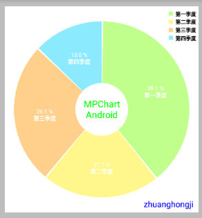 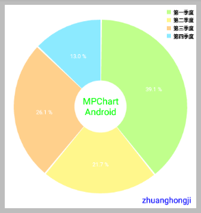

```java
ArrayList<String> xValues = new ArrayList<String>();
xValues.add("第一季度");
xValues.add("第二季度");
xValues.add("第三季度");
xValues.add("第四季度");
PieData mPieChartData = new PieData(xValues, mPieDataSet);
// 上面左图
chart.setDrawSliceText(ture);
// 上面右图
chart.setDrawSliceText(false);
```

- `setHoleRadius(float percent)`: 设置中心圆孔半径占整个饼状图半径的百分比 (100f 是最大=整个图表的半径)，默认的50％的百分比 (即50f)。
- `setTransparentCircleRadius(float percent)`: 设置中心透明圈半径占整个饼状图半径的百分比，默认是 **55％** 的半径 -> 大于默认是 **50％**  的中心圆孔半径。
- `setTransparentCircleColor(int color)`: 设置透明圈的颜色。
- `setTransparentCircleAlpha(int alpha)`: 设置透明圈的透明度 (0-255)。
- `setRotationAngle(float angle)`: 设置饼状图的旋转角度。默认是270f。
  
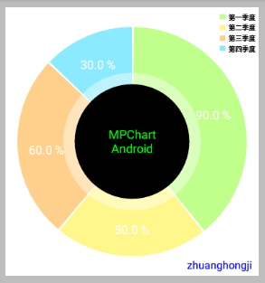 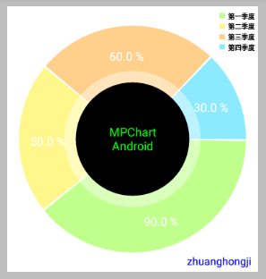

- 设置文字、颜色
  
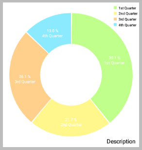 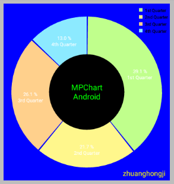

```java
// 左图是未进行以下代码设置的默认效果图

chart.setHoleRadius(50f);
chart.setTransparentCircleRadius(50f);
// 设置文字
chart.setCenterText("MPChart\nAndroid");
chart.setDescription("zhuanghongji");

// 设置颜色
chart.setCenterTextColor(Color.GREEN);
chart.setHoleColor(Color.BLACK);
chart.setHoleColorTransparent(false);
chart.setBackgroundColor(Color.BLUE);
chart.setDescriptionColor(Color.YELLOW);
```

- 注意：`HoleRadius` 和 `TransparentCircleRadius` 是独立不同的“中间的圆”的半径比，且`HoleRadius` 会覆盖 `TransparentCircleRadius`：
  
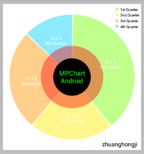 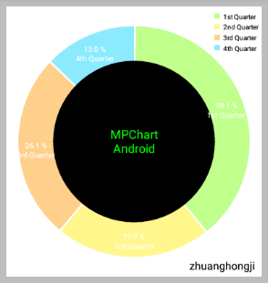

```java
chart.setHoleColor(Color.BLACK);
chart.setHoleColorTransparent(false);
chart.setTransparentCircleColor(Color.RED);
// 上面左图
chart.setHoleRadius(30f);
chart.setTransparentCircleRadius(50f);
// 上面右图
chart.setHoleRadius(70f);
chart.setTransparentCircleRadius(50f);
```

## 雷达图

- `setSkipWebLineCount(int count)`: Allows to skip web lines coming from the center of the chart. Especially useful if there are a lot of lines.
