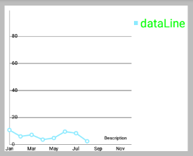
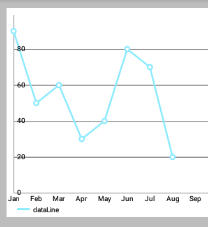

# MPAndroidChart 笔记：图例

## 概述

本章将重点介绍各个图表类型特定的设置。

默认情况下，所有的图表类型都支持 `Legend` 且在设置图表数据后会自动生成 `Legend` 。
`Legend` 通常由一个标签的 形式/形状 来表示多个条目 (`entries`) 的每一个。

`entries` 数量自动生成的 legend 取决于 DataSet 的标签 **不同颜色的数量** (在所有 `DataSet` 的对象)。`Legend` 的标签取决于图表中所使用的 `DataSet` 对象。 如果没有为 `DataSet` 对象指定标签，图表将自动生成它们。如果多个颜色用于一个 `DataSet` ，这些颜色分类，只通过一个标签说明。

对于定制的 `Legend` ，可以通过图表对象的 `getLegend()` 方法先获取 `Legen` 在进行调用对应方法： 

```java
Legend legend = chart.getLegend();
```

## 是否绘制 Legend

- `setEnabled(boolean enabled)`: 设置Legend启用或禁用。 如果禁用， `Legend` 将不会被绘制。
  
 


## 修改 Legend

- `setTextColor(int color)`: 设置图例标签的颜色。
- `setTextSize(float size)`: 设置在 DP 传说标签的文字大小。单位是"像素" min = 6f, max = 24f, default 10f
  
 

- `setTypeface(Typeface tf)`: 设置自定义Typeface图例标签。 


## Wrapping / clipping avoidance

- `setWordWrapEnabled(boolean enabled)`: 如果启用，Legend 的内容将不会超出图表边界之外，而是创建一个新的行。 请注意，这会降低性能和仅适用于 "legend 位于图表下面" 的情况。
- `setMaxSizePercent(float maxSize)`: 设置最大图例的百分比 (相对整个图表大小)。默认值：0.95f (95％) 

## 自定义 Legend

- `setPosition(LegendPosition pos)`: 通过 LegendPosition 设置 Legend 出现的位置。
- `RIGHT_OF_CHART` 
- `RIGHT_OF_CHART_CENTER`
- `RIGHT_OF_CHART_INSIDE`
- `BELOW_CHART_LEFT`
- `BELOW_CHART_RIGHT`
- `BELOW_CHART_CENTER`
- `PIECHART_CENTER` (`PieChart独有`)等等。
  
  

   

  

- `setFormSize(float size)`: 设置 legend-forms 的大小，单位dp。
- `setForm(LegendForm shape)`: 设置 `LegendForm` 。This is the shape that is drawn next to the legend-labels with the color of the DataSet the legend-entry represents. 正方形，圆形或线。
  
  

```java
legend.setFormSize(18f);
legend.setForm(Legend.LegendForm.SQUARE);
legend.setForm(Legend.LegendForm.CIRCLE);
legend.setForm(Legend.LegendForm.LINE);
```

- `setXEntrySpace(float space)`: 设置在水平轴上 `legend-entries` 的间隙。
- `setYEntrySpace(float space)`: 设置在垂直轴上 `legend-entries` 的间隙。
- `setFormToTextSpace(float space)`: 设置 `legend-form` 和 `legend-label` 之间的空间。
- `setWordWrapEnabled(boolean enabled)`: 设置 Legend 是否自动换行？ 目前仅支持`BelowChartLeft`，`BelowChartRight`，`BelowChartCenter`。 / you may want to set maxSizePercent when word wrapping, to set the point where the text wraps.

## 设置自定义标签和颜色

- `setCustom(int[] colors, String[] labels)`: 设置 `自定义Legend` 的标签和颜色。 颜色数应该匹配标签数，并且相对应。A null label will start a group. A (-2) color will avoid drawing a form This will disable the feature that automatically calculates the legend labels and colors from the datasets.  调用 `resetCustom()` 重新启用自动计算 (and then notifyDataSetChanged() is needed to auto-calculate the legend again)。
- `resetCustom()`: 调用此将禁用通过 `setCustom(...)`方法自定义的图例标签。在 `notifyDataSetChanged()` 被调用后，标签将再次被自动计算。
- `setExtra(int[] colors, String[] labels)`: Sets colors and labels that will be appended to the end of the auto calculated colors and labels arrays after calculating the legend. (if the legend has already been calculated, you will need to call `notifyDataSetChanged()` to let the changes take effect)

## 代码范例

```java
Legend l = chart.getLegend();
l.setFormSize(10f); // set the size of the legend forms/shapes
l.setForm(LegendForm.CIRCLE); // set what type of form/shape should be used
l.setPosition(LegendPosition.BELOW_CHART_LEFT);
l.setTypeface(...);
l.setTextSize(12f);
l.setTextColor(Color.BLACK);
l.setXEntrySpace(5f); // set the space between the legend entries on the x-axis
l.setYEntrySpace(5f); // set the space between the legend entries on the y-axis

// set custom labels and colors
l.setCustom(ColorTemplate.VORDIPLOM_COLORS, 
        new String[] { "Set1", "Set2", "Set3", "Set4", "Set5" });

// and many more...
```