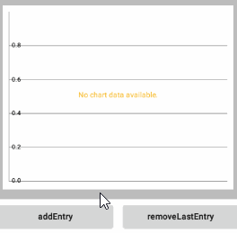
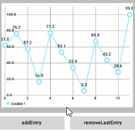
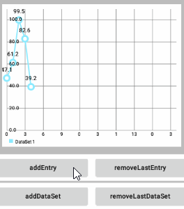
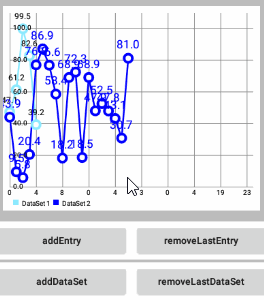
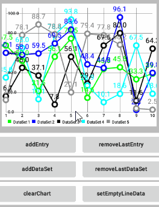

# MPAndroidChart 笔记：动态和实时数据

## 概述

在 MPAndroidChart `1.6.3` 版本得以实现，在更新版本不断得到提高。

存在各种方法为图表动态地 **增加新的数据** 或 **移除数据**：
- 允许添加或删除 `Entry` 对象到现有的 `DataSet` 。
- 允许添加或删除 `Entry` 对象到已存在的 `ChartData` 的`DataSet` 。


## 动态添加数据

### DataSet 类和所有子类

- `addEntry(Entry e)`: 添加的 `Entry` 对象到 `DataSet` 。 

### ChartData 类和所有子类

- `addEntry(Entry e, int dataSetIndex)`: 添加 `Entry` 到 `DataSet` 的指定索引处。
- `addDataSet(DataSet d)`: 添加 `DataSet` 对象到 `ChartData` 。 
除此之外，也有用于动态remove数据的方法。 

## 动态移除数据

### DataSet 类和所有子类

- `public boolean removeFirst()`: 删除该 `DataSet` 的第一个 `Entry` 项( 索引0 )。如果成功返回 true，否则为 false。
- `public boolean removeLast()`:  删除该 `DataSet` 的最后一个 `Entry` 项( 索引大小-1 )。如果成功返回 true，否则为 false。
- `public boolean removeEntry(Entry e)`: 从 `DataSet` 中移除给定的 `Entry` 对象。如果成功返回 true 。
- `public boolean removeEntry(int xIndex)`: 从 `DataSet` 中移除给定索引对应的 `Entry` 对象。如果成功返回 true。


### ChartData 类和所有子类

- `public boolean removeEntry(Entry e, int dataSetIndex)`: 移除给定索引对应的 `DataSet` 中给定的 `Entry` 对象。如果成功，返回true。
- `public boolean removeEntry(int xIndex, int dataSetIndex)`: 移除给定索引对应的 `DataSet` 中给定索引对应的 `Entry` 对象。如果成功，返回true。
- `public boolean removeDataSet(DataSet d)`: 从该 `ChartData` 对象中移除给定的 `DataSet` 对象。如果成功，返回true。
- `public boolean removeDataSet(int index)`: 从该 `ChartData` 对象中移除给定索引对应的 `DataSet` 对象。如果成功，返回true。
    
## 记住

动态添加或移除数据后，调用 `invalidate()` 刷新图表之前 **必须调用** `notifyDataSetChanged()`。

```java
// more code ...
exampleData.addEntry(...);
chart.notifyDataSetChanged(); // let the chart know it's data changed
chart.invalidate(); // refresh
```

> 注：`moveViewTo(...)` 方法会自动调用 `invalidate()`。 

## DynamicalAddingActivity.java

下面有 6 个演示动态添加(删除)数据的小例子：
- `addEntry()` , `removeLastEntry()` , `addDataSet()` , 
- `removeLastDataSet()` , `clearChart()` 和 `setEmptyLineData()` .


### addEntry()

为最后一个 `DataSet` 添加一个y值随机的 `Entry`，一开始如果没有 `DataSet` 则新增一个 `DataSet`。

效果图： 



对应代码如下：
```java
public void addEntry(View view) {
    LineData lineData = mChart.getData();

    if (lineData != null) {
        int indexLast = getLastDataSetIndex(lineData);
        LineDataSet lastSet = lineData.getDataSetByIndex(indexLast);
        // set.addEntry(...); // can be called as well

        if (lastSet == null) {
            lastSet = createLineDataSet();
            lineData.addDataSet(lastSet);
        }
        // 这里要注意，x轴的index是从零开始的
        // 假设index=2，那么getEntryCount()就等于3了
        int count = lastSet.getEntryCount();
        // add a new x-value first 这行代码不能少
        lineData.addXValue(count + "");

        float yValues = (float) (Math.random() * 100);
        // 位最后一个DataSet添加entry
        lineData.addEntry(new Entry(yValues, count), indexLast);

        mChart.notifyDataSetChanged();
        mChart.moveViewTo(yValues, count, YAxis.AxisDependency.LEFT);

        Log.d(TAG, "set.getEntryCount()=" + lastSet.getEntryCount()
                + " ; indexLastDataSet=" + indexLast);
    }
}
```

### removeLastEntry()

移除最后一个 `DataSet` 的最后一个 `Entry` 。在效果图中你会发现，即使没有 `Entry` 了，继续点击 "removeLastEntry" 按钮程序也不会 crash 掉。

效果图：
   


对应代码如下：

```java
public void removeLastEntry(View view) {
    LineData lineData = mChart.getLineData();
    if (lineData != null) {
        int indexLastDataSet = lineData.getDataSetCount() - 1;
        LineDataSet lastDataSet = lineData.getDataSetByIndex(indexLastDataSet);
        if (lastDataSet != null) {
            Entry lastEntry = lastDataSet.getEntryForXIndex(
                    lastDataSet.getEntryCount() - 1);
            lineData.removeEntry(lastEntry, indexLastDataSet);
            // or remove by index
            // mData.removeEntry(xIndex, dataSetIndex);

            mChart.notifyDataSetChanged();
            mChart.invalidate();
        }
    }
}
```

### addDataSet()

**动态添加一个 `DataSet`，可以添加N多个 `DataSet` ，没发现有上限**。

下面的效果图同时也演示了前面的 **为最后一个 `DataSet` 添加一个y值随机的 `Entry` ** 和 **移除最后一个 `DataSet` 的最后一个 `Entry` ** 。

效果图：



对应代码如下：
```java
public void addDataSet(View view) {
    LineData lineData = mChart.getLineData();
    if (lineData != null) {
        int count = (lineData.getDataSetCount() + 1);
        // create 10 y-value
        ArrayList<Entry> yValueList = new ArrayList<>();
        if (lineData.getXValCount() == 0) {
            for (int i = 0; i < 10; i++) {
                lineData.addXValue((i + 1) + "");
            }
        }

        for (int i = 0; i < lineData.getXValCount(); i++) {
            yValueList.add(new Entry((float) (Math.random() * 100f), i));
        }

        LineDataSet set = new LineDataSet(yValueList, "DataSet " + count);
        // 求余，防止数组越界异常
        int colorIndex = count % mColors.length;
        set.setColor(mColors[colorIndex]);
        set.setCircleColor(mColors[colorIndex]);
        set.setValueTextColor(mColors[colorIndex]);

        lineData.addDataSet(set);
        mChart.notifyDataSetChanged();
        mChart.invalidate();
    }
}
```


### removeLastDataSet()

**移除最后一个DataSet**。

在效果图中你会发现，即使没有 `DataSet` 了，继续点击 "removeLastDataSet" 程序也不会 crash 掉。

效果图：



对应代码如下：

```java
public void removeLastDataSet(View view) {
    LineData lineData = mChart.getData();
    if (lineData != null) {
        lineData.removeDataSet(lineData.getDataSetCount() - 1);
        mChart.notifyDataSetChanged();
        mChart.invalidate();
    }
}
```

### clearChart() 和 setEmptyLineData()

**清空图表** 和 **为图表设置一个空的LineData**.

在效果图中你会发现，`clearChart()` 后，点击"addDataSet"图表并没有新增 `DataSet` 的响应，clear 后要 `setEmptyLineData()` 才能 `addDataSet()`。

效果图：



对应代码如下：

```java
// 清空图表
public void clearChart(View view) {
    mChart.clear();
}
```

```java
// 为图表设置一个空的 LineData
public void setEmptyLineData(View view) {
    mChart.setData(new LineData());
    mChart.invalidate();
}
```
