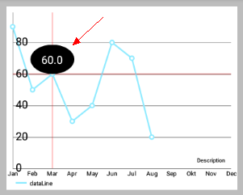
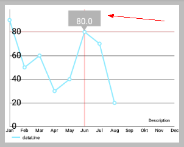
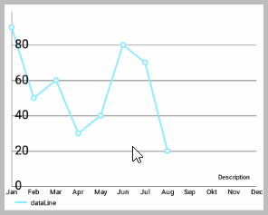

# MPAndroidChart 笔记：MarkerView

## 什么是MarkerView

首先来看 `MarkerView` 的效果图：

 

如上图所示，当点击折线图上的点时，会弹出一个View，这就是 `Markerview`：
- 上面的左图是一个 `TextView` 布局和一个椭圆黑色的 `background` 
- 右图是一个 `TextView` 布局和一个 `bitmap` 的 `background` 

那么这具体是如何实现的呢？

## MakerView 抽象类

### 简介

为显示自定义的 (弹出的) 扩展 View 并且使得点击的点的值在图表中突出显示，我们可以创建一个类并继承 `MakerView` 抽象类，然后实现该类的构造方法和继承自 `MarkerView` 类的抽象方法。

```java
// extend MarkerView
public class YourCustomMarkerView extends MarkerView { ... }
```

- `MarkerView` 类继承自 `RelativeLayout`。
  

### MarkerView 类源码

```java
/**
 * View that can be displayed when selecting values in the chart. 
 * Extend this class to provide custom layouts for your markers.
 */
public abstract class MarkerView extends RelativeLayout {

    /**
     * Constructor. Sets up the MarkerView with a custom layout resource.
     *
     * @param context
     * @param layoutResource the layout resource to use for the MarkerView
     */
    public MarkerView(Context context, int layoutResource) {
        super(context);
        setupLayoutResource(layoutResource);
    }

    /**
     * Sets the layout resource for a custom MarkerView.
     *
     * @param layoutResource
     */
    private void setupLayoutResource(int layoutResource) {

        View inflated = LayoutInflater.from(getContext())
            .inflate(layoutResource, this);

        inflated.setLayoutParams(
            new LayoutParams(RelativeLayout.LayoutParams.WRAP_CONTENT, 
            RelativeLayout.LayoutParams.WRAP_CONTENT));
            
        inflated.measure(MeasureSpec.makeMeasureSpec(0, MeasureSpec.UNSPECIFIED), 
                MeasureSpec.makeMeasureSpec(0, MeasureSpec.UNSPECIFIED));

        // measure(getWidth(), getHeight());
        inflated.layout(0, 0, inflated.getMeasuredWidth(), 
            inflated.getMeasuredHeight());
    }

    /**
     * Draws the MarkerView on the given position on the screen
     * with the given Canvas object.
     *
     * @param canvas
     * @param posx
     * @param posy
     */
    public void draw(Canvas canvas, float posx, float posy) {

        // take offsets into consideration
        posx += getXOffset(posx);
        posy += getYOffset(posy);

        // translate to the correct position and draw
        canvas.translate(posx, posy);
        draw(canvas);
        canvas.translate(-posx, -posy);
    }

    /**
     * This method enables a specified custom MarkerView to 
     * update it's content everytime the MarkerView is redrawn.
     *
     * @param e         The Entry the MarkerView belongs to. This can 
     * also be any subclass of Entry, like BarEntry or CandleEntry, 
     * simply cast it at runtime.
     * @param highlight The highlight object contains information 
     * about the highlighted value such as it's dataset-index, the
     * selected range or stack-index (only stacked bar entries).
     */
    public abstract void refreshContent(Entry e, Highlight highlight);

    /**
     * Use this to return the desired offset you wish the MarkerView 
     * to have on the x-axis. By returning -(getWidth() /
     * 2) you will center the MarkerView horizontally.
     *
     * @param xpos the position on the x-axis in pixels where the marker is drawn
     * @return
     */
    public abstract int getXOffset(float xpos);

    /**
     * Use this to return the desired position offset you wish the MarkerView 
     * to have on the y-axis. By returning
     * -getHeight() you will cause the MarkerView to be above the selected value.
     *
     * @param ypos the position on the y-axis in pixels where the marker is drawn
     * @return
     */
    public abstract int getYOffset(float ypos);
}
```

### 设置/获取 MarkerView 的方法

- `setMarkerView(MarkerView mv)`: 为 `chart` 设置一个 `MarkerView` 从而显示选中的值。
- `getMarkerView()`: 获取 `chart` 已经设置了的 `MarkerView`，未设置的话返回 `null`。 


## 实现步骤

后面你可以找到一个实现自定义 `MarkerView` 类的例子。重要的是，在这个过程中要实现以下从 `MarkerView` 抽象类继承来的方法：
- `refreshContent(Entry e, Highlight highlight)`: 每次 `MarkerView` 重绘此方法都会被调用，并为您提供更新它显示的内容的机会 (例如，为一个 `TextView` 设置文本 ，...) 。 它提供了当前突出显示的 `Entry` 和相应的Highlight对象以获得更多信息。
- `getXOffset(float xpos)`: 在这里，应返回要绘制的 `MarkerView` 在x轴的偏移位置。 默认情况下，`MarkerView` 的左上边缘处将绘制在 `entry` 的位置。 在 `xpos` 参数表示绘制 `MarkerView` 的默认位置。
- `getYOffset(float ypos)`: 在这里，应返回要绘制的 `MarkerView` 在y轴的偏移位置。 默认情况下，`MarkerView` 的左上边缘处将绘制在 `entry` 的位置。 在 `ypos` 参数表示绘制`MarkerView` 的默认位置。

实现自定义 `MarkerView` 类的例子：

```java
public class CustomMarkerView extends MarkerView {

    private TextView tvContent;

    public CustomMarkerView (Context context, int layoutResource) {
        super(context, layoutResource);
        // this markerview only displays a textview
        tvContent = (TextView) findViewById(R.id.tvContent);
    }

    // callbacks everytime the MarkerView is redrawn, can be used to update the
    // content (user-interface)
    @Override
    public void refreshContent(Entry e, Highlight highlight) {
        tvContent.setText("" + e.getVal()); // set the entry-value as the display text
    }

    @Override
    public int getXOffset(float xpos) {
        // this will center the marker-view horizontally
        return -(getWidth() / 2);
    }

    @Override
    public int getYOffset(float ypos) {
        // this will cause the marker-view to be above the selected value
        return -getHeight();
    }
}
```

- 实现自定义的 `MarkerView` 类后，需要创建一个 `.xml` 文件来作为 `MarkerView` 的布局。 本实例的布局仅是一个有背景图的且内含一个`TextView` 的 `RelativeLayout` ，但 **你可以创建任何你想要在这里显示的布局**。

```xml
<?xml version="1.0" encoding="utf-8"?>
<RelativeLayout xmlns:android="http://schemas.android.com/apk/res/android"
    android:layout_width="wrap_content"
    android:layout_height="40dp"
    android:background="@drawable/markerImage" >

    <TextView
        android:id="@+id/tvContent"
        android:layout_width="wrap_content"
        android:layout_height="wrap_content"
        android:layout_centerHorizontal="true"
        android:text=""
        android:textSize="12dp"
        android:textColor="@android:color/white"
        android:ellipsize="end"
        android:singleLine="true"
        android:textAppearance="?android:attr/textAppearanceSmall" />
</RelativeLayout>
```

- 最后，为图表设置你已经创建了的自定义 `MarkerView`。 创建 `MarkerView` 时请确保你创建的 `.xml` 文件提供了对应的 `layout` 资源。
  
```java
CustomMarkerView mv = new CustomMarkerView(Context, 
    R.layout.custom_marker_view_layout);

// set the marker to the chart
chart.setMarkerView(mv);
```

## 随手写的一个样例

### 动态效果图




### 主要代码

#### 背景图 bg_marker.xml

```xml
<!-- bg_marker.xml -->
<?xml version="1.0" encoding="utf-8"?>
<shape xmlns:android="http://schemas.android.com/apk/res/android"
       android:shape="oval">
    <solid android:color="@android:color/black"/>
</shape>
```

#### 布局代码 content_marker_view.xml

```xml
<!-- content_marker_view.xml -->
<?xml version="1.0" encoding="utf-8"?>
<RelativeLayout xmlns:android="http://schemas.android.com/apk/res/android"
    android:layout_width="72dp"
    android:layout_height="48dp"
    android:background="@drawable/bg_marker"
    android:gravity="center"
    android:orientation="vertical">

    <TextView
        android:id="@+id/tv_content_marker_view"
        android:layout_width="wrap_content"
        android:layout_height="wrap_content"
        android:padding="4dp"
        android:textAppearance="?android:attr/textAppearanceSmall"
        android:textColor="@android:color/white"
        android:textSize="18sp"/>
</RelativeLayout>
```

#### 自定义的 MyMarkerView.java

```java
public class MyMarkerView extends MarkerView {
    private TextView mContentTv;

    public MyMarkerView(Context context, int layoutResource) {
        super(context, layoutResource);
        mContentTv = (TextView) findViewById(R.id.tv_content_marker_view);
    }

    @Override
    public void refreshContent(Entry e, Highlight highlight) {
        mContentTv.setText("" + e.getVal());
    }

    @Override
    public int getXOffset(float xpos) {
        return -(getWidth() / 2);
    }

    @Override
    public int getYOffset(float ypos) {
        return -getHeight();
    }
}
```

#### 为图表设置 MarkerView

```java
// 设置MarkerView
MarkerView mv = new MyMarkerView(this,R.layout.content_marker_view);
chart.setMarkerView(mv);
```

本节完。