# MPAndroidChart 笔记：ChartData & DataSet

## ChartData 类

为了让大家更容易理解，这里先简单介绍下 `MPAndroidChart` 的数据模型 `ChartData` 。后面有文章再详细介绍该图标库的其它数据类型。

`ChartData` 类是所有数据类的基类，比如 `LineData`，`BarData` 等，它是用来为 `Chart` 提供数据的，通过 `setData(ChartData data){...}` 方法。 

```java
public class LineData extends ChartData { ...
```

以下提到的方法是在 `ChartData` 类中被实现，因此可用于所有子类。

### Styling data

- `setDrawValues(boolean enabled)`: 启用/禁用 绘制所有 `DataSets` 数据对象包含的数据的值文本。 
- `setValueTextColor(int color)`: 设置 `DataSets` 数据对象包含的数据的值文本的颜色。
- `setValueTextSize(float size)`: 设置 `DataSets` 数据对象包含的数据的值文本的大小 (单位是dp)。
  
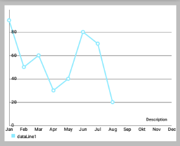 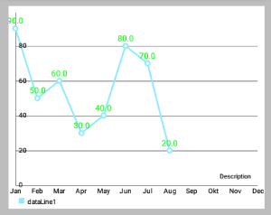

```java
// LineDataSet可以看做是一条线
LineDataSet dataSet = new LineDataSet(entryList, "dataLine");
dataSet.setLineWidth(2.5f);
dataSet.setCircleSize(4.5f);
dataSet.setHighLightColor(Color.RED); // 设置点击某个点时，横竖两条线的颜色
dataSet.setDrawValues(true); // 是否在点上绘制Value
dataSet.setValueTextColor(Color.GREEN);
dataSet.setValueTextSize(12f);
allLinesList.add(dataSet);
```

- `setValueTypeface(Typeface tf)`: 设置Typeface的所有价值标签的所有DataSets这些数据对象包含。
  
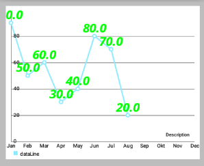 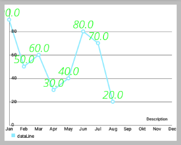

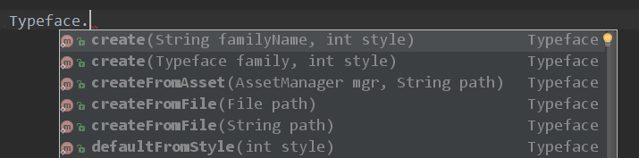

```java
dataSet.setValueTextSize(24f);
allLinesList.add(dataSet);

// 设置上面左图的字体
Typeface tf1 = Typeface.createFromAsset(getAssets(), "OpenSans-BoldItalic.ttf");
dataSet.setValueTypeface(tf1);

// 设置上面右图的字体
Typeface tf2 = Typeface.createFromAsset(getAssets(), "OpenSans-LightItalic.ttf");
dataSet.setValueTypeface(tf2);
```

- `setValueFormatter(ValueFormatter f)`: 为`DataSets` 数据对象包含的数据设置自定义的 `ValueFormatter`  。

    
### Getters / Convenience

- `getDataSetByIndex(int index)`: 返回目标 `DataSet` 列表中给定索引的数据对象。
- `contains(Entry entry)`: 检查此数据对象是否包含指定的Entry 。 注：这个相当影响性能，性能严峻情况下，不要过度使用。
- `contains(T dataSet)`: Returns true if this data object contains the provided DataSet , false if not.


### Clear

- `clearValues()`: 清除所有 `DataSet` 对象和所有 `Entries` 的数据 。 不会删除所提供的 `x-values` 。 


### 选中高亮

- `setHighlightEnabled(boolean enabled)`: 设置为true，允许通过点击高亮突出 `ChartData` 对象和其 `DataSets`。
 

## Data 类详情

这里主要是总结 `ChartData` 类的子类。 所有其他 `ChartData` 子类 (下面没有提到的) 都未提供任何特定的增强。

### BarData 类 (条形图) 

#### 父类结构

```java
java.lang.Object
  com.github.mikephil.charting.data.ChartData<T>
      com.github.mikephil.charting.data.BarLineScatterCandleBubbleData<BarDataSet>
          com.github.mikephil.charting.data.BarData 
```

#### 方法

- `setGroupSpace(float percent)`: 设置不同 `DataSet` 的 **bar组** 之间的间隙 (占一个bar的宽度的百分比)：
  - 如 20f，间隙刚好就是一个bar的宽度的十分之二 (下面左图效果) 
  - 如 100f，间隙刚好就是一个bar的宽度 (下面右图效果) ，默认：80
  
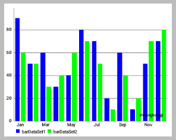 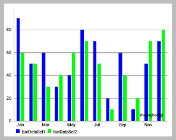

上面效果图的代码如下：

```java
private void loadBarChartData(BarChart chart) {
    //所有数据点的集合
    ArrayList<BarEntry> entries1 = new ArrayList<>();
    for (int i = 0; i < 12; i++) {
        entries1.add(new BarEntry(mDataYs1[i], i));
    }
    ArrayList<BarEntry> entries2 = new ArrayList<>();
    for (int i = 0; i < 12; i++) {
        entries2.add(new BarEntry(mDataYs2[i], i));
    }

    //柱形数据的集合
    BarDataSet barDataSet1 = new BarDataSet(entries1, "barDataSet1");
    barDataSet1.setBarSpacePercent(20f);
//        mBarDataSet1.setColors(ColorTemplate.VORDIPLOM_COLORS); // 设置每条柱子的颜色
    barDataSet1.setColors(new int[]{Color.BLUE}); // 设置每条柱子的颜色
    barDataSet1.setHighLightAlpha(255); // 设置点击后高亮颜色透明度
    barDataSet1.setHighLightColor(Color.RED);

    BarDataSet barDataSet2 = new BarDataSet(entries2, "barDataSet2");
    barDataSet2.setBarSpacePercent(20f);
    barDataSet2.setColors(new int[]{Color.GREEN}); // 设置每条柱子的颜色
    barDataSet2.setHighLightAlpha(125); // 设置点击后高亮颜色透明度
    barDataSet2.setHighLightColor(Color.GRAY);

    //BarData表示挣个柱形图的数据
    BarData barData = new BarData(getXAxisShowLable(), barDataSet1);
    barData.addDataSet(barDataSet2);
    chart.setData(barData);

    barDataSet1.setDrawValues(false);
    barDataSet2.setDrawValues(false);

    mBarData.setGroupSpace(20f); // 上面左效果图
    mBarData.setGroupSpace(100f); // 上面右效果图

    // 上面设置了barDataSet1和barDataSet2总共两条
    // 所以isGrouped()方法返回true
    if (barData.isGrouped()) {
        Log.d(TAG,"isGrouped() 为 true !");
    }

    // ...  
}
```

- `isGrouped()`: 返回true，如果该数据对象进行分组 (包括超过1 DataSet ) ，假如果不是。 


#### BarData 类源码

```java
/**
 * Data object that represents all data for the BarChart.
 */
public class BarData extends BarLineScatterCandleBubbleData<BarDataSet> {

    /** the space that is left between groups of bars */
    private float mGroupSpace = 0.8f;

    // /**
    // * The maximum space (in pixels on the screen) a single bar can consume.
    // */
    // private float mMaximumBarWidth = 100f;

    public BarData() {
        super();
    }

    public BarData(List<String> xVals) {
        super(xVals);
    }

    public BarData(String[] xVals) {
        super(xVals);
    }

    public BarData(List<String> xVals, List<BarDataSet> dataSets) {
        super(xVals, dataSets);
    }

    public BarData(String[] xVals, List<BarDataSet> dataSets) {
        super(xVals, dataSets);
    }

    public BarData(List<String> xVals, BarDataSet dataSet) {
        super(xVals, toList(dataSet));
    }

    public BarData(String[] xVals, BarDataSet dataSet) {
        super(xVals, toList(dataSet));
    }

    private static List<BarDataSet> toList(BarDataSet dataSet) {
        List<BarDataSet> sets = new ArrayList<BarDataSet>();
        sets.add(dataSet);
        return sets;
    }

    /**
     * Returns the space that is left out between groups of bars. Always returns
     * 0 if the BarData object only contains one DataSet (because for one
     * DataSet, there is no group-space needed).
     * 
     * @return
     */
    public float getGroupSpace() {

        if (mDataSets.size() <= 1)
            return 0f;
        else
            return mGroupSpace;
    }

    /**
     * Sets the space between groups of bars of different datasets in percent of
     * the total width of one bar. 100 = space is exactly one bar width,
     * default: 80
     * 
     * @param percent
     */
    public void setGroupSpace(float percent) {
        mGroupSpace = percent / 100f;
    }

    /**
     * Returns true if this BarData object contains grouped DataSets (more than
     * 1 DataSet).
     * 
     * @return
     */
    public boolean isGrouped() {
        return mDataSets.size() > 1 ? true : false;
    }
    
    //
    // /**
    // * Sets the maximum width (in density pixels) a single bar in the barchart
    // * should consume.
    // *
    // * @param max
    // */
    // public void setBarWidthMaximum(float max) {
    // mMaximumBarWidth = Utils.convertDpToPixel(max);
    // }
    //
    // /**
    // * Returns the maximum width (in density pixels) a single bar in the
    // * barchart should consume.
    // *
    // * @return
    // */
    // public float getBarWidthMaximum() {
    // return mMaximumBarWidth;
    // }
}
```

### ScatterData 类 (散点图) 

#### 方法

- `getGreatestShapeSize()`: 返回这个data对象中所有 `ScatterDataSets` 中的最大外形尺寸。 


#### ScatterData 类源码

```java
public class ScatterData extends BarLineScatterCandleBubbleData<ScatterDataSet> {

    public ScatterData() {
        super();
    }
    
    public ScatterData(List<String> xVals) {
        super(xVals);
    }

    public ScatterData(String[] xVals) {
        super(xVals);
    }

    public ScatterData(List<String> xVals, List<ScatterDataSet> dataSets) {
        super(xVals, dataSets);
    }

    public ScatterData(String[] xVals, List<ScatterDataSet> dataSets) {
        super(xVals, dataSets);
    }

    public ScatterData(List<String> xVals, ScatterDataSet dataSet) {
        super(xVals, toList(dataSet));
    }

    public ScatterData(String[] xVals, ScatterDataSet dataSet) {
        super(xVals, toList(dataSet));
    }

    private static List<ScatterDataSet> toList(ScatterDataSet dataSet) {
        List<ScatterDataSet> sets = new ArrayList<ScatterDataSet>();
        sets.add(dataSet);
        return sets;
    }

    /**
     * Returns the maximum shape-size across all DataSets.
     * 
     * @return
     */
    public float getGreatestShapeSize() {

        float max = 0f;

        for (ScatterDataSet set : mDataSets) {
            float size = set.getScatterShapeSize();

            if (size > max)
                max = size;
        }

        return max;
    }
}
```

### PieData 类 (饼状图) 

#### 方法

- `getDataSet()`: 返回已为这个data对象设置了的 `PieDataSet` 对象。`PieData` 对象不能包含多个 `PieDataSets` 对象。
- `setDataSet(PieDataSet set)`: 为这个data对象设置 `PieDataSet` 。 


#### PieData 类源码

```java
/**
 * A PieData object can only represent one DataSet. Unlike all other charts, the
 * legend labels of the PieChart are created from the x-values array, and not
 * from the DataSet labels. Each PieData object can only represent one
 * PieDataSet (multiple PieDataSets inside a single PieChart are not possible).
 */
public class PieData extends ChartData<PieDataSet> {

    public PieData() {
        super();
    }

    public PieData(List<String> xVals) {
        super(xVals);
    }

    public PieData(String[] xVals) {
        super(xVals);
    }

    public PieData(List<String> xVals, PieDataSet dataSet) {
        super(xVals, toList(dataSet));
    }

    public PieData(String[] xVals, PieDataSet dataSet) {
        super(xVals, toList(dataSet));
    }

    private static List<PieDataSet> toList(PieDataSet dataSet) {
        List<PieDataSet> sets = new ArrayList<PieDataSet>();
        sets.add(dataSet);
        return sets;
    }

    /**
     * Sets the PieDataSet this data object should represent.
     * 
     * @param dataSet
     */
    public void setDataSet(PieDataSet dataSet) {
        mDataSets.clear();
        mDataSets.add(dataSet);
        init();
    }

    /**
     * Returns the DataSet this PieData object represents. A PieData object can
     * only contain one DataSet.
     * 
     * @return
     */
    public PieDataSet getDataSet() {
        return mDataSets.get(0);
    }

    @Override
    public PieDataSet getDataSetByIndex(int index) {
        return index == 0 ? getDataSet() : null;
    }

    @Override
    public PieDataSet getDataSetByLabel(String label, boolean ignorecase) {
        return ignorecase ? label.equalsIgnoreCase(mDataSets.get(0).getLabel()) ? mDataSets.get(0)
                : null : label.equals(mDataSets.get(0).getLabel()) ? mDataSets.get(0) : null;
    }
}
```

### BubbleData 类

#### 方法

- `setHighlightCircleWidth(float width)`: Sets the width of the circle that surrounds the bubble when in highlighted state for all BubbleDataSet objects this data object contains, in dp.

#### BubbleData 类源码

```java
public class BubbleData extends BarLineScatterCandleBubbleData<BubbleDataSet> {

    public BubbleData() {
        super();
    }

    public BubbleData(List<String> xVals) {
        super(xVals);
    }

    public BubbleData(String[] xVals) {
        super(xVals);
    }

    public BubbleData(List<String> xVals, List<BubbleDataSet> dataSets) {
        super(xVals, dataSets);
    }

    public BubbleData(String[] xVals, List<BubbleDataSet> dataSets) {
        super(xVals, dataSets);
    }

    public BubbleData(List<String> xVals, BubbleDataSet dataSet) {
        super(xVals, toList(dataSet));
    }

    public BubbleData(String[] xVals, BubbleDataSet dataSet) {
        super(xVals, toList(dataSet));
    }

    private static List<BubbleDataSet> toList(BubbleDataSet dataSet) {
        List<BubbleDataSet> sets = new ArrayList<BubbleDataSet>();
        sets.add(dataSet);
        return sets;
    }

    /**
     * Sets the width of the circle that surrounds the bubble when highlighted
     * for all DataSet objects this data object contains, in dp.
     * 
     * @param width
     */
    public void setHighlightCircleWidth(float width) {
        for (BubbleDataSet set : mDataSets) {
            set.setHighlightCircleWidth(width);
        }
    }
}
```

### CombinedData 类

#### 概述

此 data 对象被设计来包含所有其他数据对象的实例，通过使用此对象提供的数据 `setData(...)` 方法。 这个仅用于 `CombinedChart` 。This data object is designed to contain instances of all other data objects. Use the setData(...) methods to provide the data for this object. This is used for the CombinedChart only.

这是它内部大致结构： 

```java
public class CombinedData extends ChartData {

    // ...

    public CombinedData(List<String> xVals) { ... }

    public CombinedData(String[] xVals) { ... }

    public void setData(LineData data) { ... }

    public void setData(BarData data) { ... }

    public void setData(ScatterData data) { ... }

    public void setData(CandleData data) { ... }

    // ...
}
```

#### CombinedData 类源码

```java
/**
 * Data object that allows the combination of Line-, Bar-, Scatter-, Bubble- and
 * CandleData. Used in the CombinedChart class.
 */
public class CombinedData extends BarLineScatterCandleBubbleData<BarLineScatterCandleBubbleDataSet<?>> {

    private LineData mLineData;
    private BarData mBarData;
    private ScatterData mScatterData;
    private CandleData mCandleData;
    private BubbleData mBubbleData;

    public CombinedData() {
        super();
    }

    public CombinedData(List<String> xVals) {
        super(xVals);
    }

    public CombinedData(String[] xVals) {
        super(xVals);
    }

    public void setData(LineData data) {
        mLineData = data;
        mDataSets.addAll(data.getDataSets());
        init();
    }

    public void setData(BarData data) {
        mBarData = data;
        mDataSets.addAll(data.getDataSets());
        init();
    }

    public void setData(ScatterData data) {
        mScatterData = data;
        mDataSets.addAll(data.getDataSets());
        init();
    }

    public void setData(CandleData data) {
        mCandleData = data;
        mDataSets.addAll(data.getDataSets());
        init();
    }

    public void setData(BubbleData data) {
        mBubbleData = data;
        mDataSets.addAll(data.getDataSets());
        init();
    }

    public BubbleData getBubbleData() {
        return mBubbleData;
    }

    public LineData getLineData() {
        return mLineData;
    }

    public BarData getBarData() {
        return mBarData;
    }

    public ScatterData getScatterData() {
        return mScatterData;
    }

    public CandleData getCandleData() {
        return mCandleData;
    }

    /**
     * Returns all data objects in row: line-bar-scatter-candle-bubble if not null.
     * @return
     */
    public List<ChartData> getAllData() {

        List<ChartData> data = new ArrayList<ChartData>();
        if(mLineData != null)
            data.add(mLineData);
        if(mBarData != null)
            data.add(mBarData);
        if(mScatterData != null)
            data.add(mScatterData);
        if(mCandleData != null)
            data.add(mCandleData);
        if(mBubbleData != null)
            data.add(mBubbleData);

        return data;
    }

    @Override
    public void notifyDataChanged() {
        if (mLineData != null)
            mLineData.notifyDataChanged();
        if (mBarData != null)
            mBarData.notifyDataChanged();
        if (mCandleData != null)
            mCandleData.notifyDataChanged();
        if (mScatterData != null)
            mScatterData.notifyDataChanged();
        if (mBubbleData != null)
            mBubbleData.notifyDataChanged();

        init(); // recalculate everything
    }
}
```

## DataSet 类

### 概述

`DataSet` 类是所有数据集类的基类，比如 `LineDataSet`，`BarDataSet` 等等。 

```java
public class LineDataSet extends DataSet { ... }
```

`DataSet` 类是 `Chart` 中一组或一类的 `Entry` 的集合。 它被设计成 `Chart` 内部逻辑上分离的不同值组 (例如， `LineChart` 中特定行的值或 `BarChart` 中特定bar组的值)。

以下提到的方法在 `DataSet` 类中被实现，因此可用于所有子类。 

### Styling data

- `setValueTextColor(int color)`: 设置该 `DataSet` 的文本的颜色 (color in which the value-labels are drawn) 。
- `setValueTextSize(float size)`: 设置该 `DataSet` 的文本的大小 (dp) 。
- `setValueTypeface(Typeface tf)`: 设置该 `DataSet` 的文本的字体 (Typeface) 。
- `setValueFormatter(ValueFormatter f)`: 设置该 `DataSet` 的文本的格式器。
- `setDrawValues(boolean enabled)`: 是否绘制该 `DataSet` 的文本。 

如果你的整个 `data` 对象 (非 `data-set` 对象) 的所有值都具有相同的颜色，you can simply call one of the above mentioned on the ChartData object.

### 突出显示

- `setHighlightEnabled(boolean enabled)`: 设置为true将允许通过触摸突出显示这个特定的`DataSet` 。 


### Getters / Convenience

- `contains(Entry entry)`: 检查此 `DataSet` 对象是否包含指定的 `Entry` 。
注意：使用这个方法会使得性能非常糟糕。 


## DataSet 类详细

### 概述

这里主要是总结 `DataSet` 类的子类。 所有其他 `DataSet` 子类 (下面没有提到的) 都未提供任何特定的增强。

* ***Line-, Bar-, Scatter-, Bubble- & CandleDataSet** (下面提到的方法可用于任何所述的`DataSet`类) 
  - `setHighLightColor(int color)`: 设置用于绘制加亮显示的颜色。 不要忘了使用 `getResources().getColor(...)` 或 `Color.rgb(...)` 或简单点的`Color.BLACK` 来解析颜色。

* ***Line-, Bar-, Scatter-, Candle- & RadarDataSet**
  - `setDrawHighlightIndicators(boolean enabled)`: 启用/禁用 垂直和水平 (两者) 的高亮指示线。 
  调用 `setDrawVerticalHighlightIndicator(...)` 和 `setDrawHorizontalHighlightIndicator(...)` 方法可进行于独立配置。
  - `setHighlightLineWidth(float width)`: 设置高亮线 (crosshairs) 的宽度 (dp) 。 

* **Line- & RadarDataSet ** (方法仅适用于 `LineDataSet` 和 `RadarDataSet`)
  - `setFillColor(int color)`: 设定填充线表面的颜色。
  - `setFillAlpha(int alpha)`: 设定填充线面的alpha值 (即透明度 0-255) 。默认：85。255 =完全不透明，0 =完全透明。
  - `setDrawFilled(boolean filled)`: Set to true if the DataSet should be drawn filled (surface, area)，而不仅仅是一条线，默认值：false 。**注意：禁止这将给予极大的性能提升！** 
  - `setLineWidth(float width)`: 设置该 `DataSet` 的线宽 (最小= 0.2F，最大= 10F) ；默认1F；**注意：线越细==性能越好，线越厚==性能越糟糕** 。

下面提到方法仅适用于特别提到的 `DataSet` 的子类。

### LineDataSet 类

- `setDrawCircles(boolean enabled)`: 设置为true，将绘制 `LineDataSet` 的线圈。默认为true。
- `setCircleSize(float size)`: 设置线圈的大小 (半径) ，默认为 4F 。
- `setCircleColor(int color)`: 设置线圈的颜色。
- `setCircleColors(List colors)`: 设置该 `LineDataSet` 的线圈的颜色 (一组颜色) 。 还有其它设置颜色的方法。
- `setCircleColorHole(int color)`: 设置线圈的内圆 (孔) 的颜色。
- `setDrawCircleHole(boolean enabled)`: 设置为true，允许在该 `DataSet` 的每个圈画了一个洞。 如果设置为false，圆将被填补 (无孔)。
- `enableDashedLine(float lineLength, float spaceLength, float phase)`: 启用虚线模式，是的连线像这样“- -- -- - ”。 “lineLength”是虚线线段的长度，“spaceLength”是虚线线段的间距，“phase”是偏移量 (通常，使用0)。
  
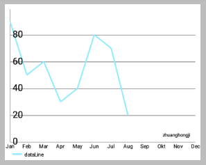 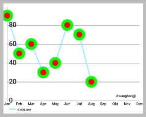

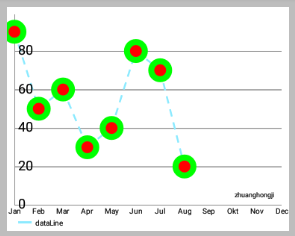 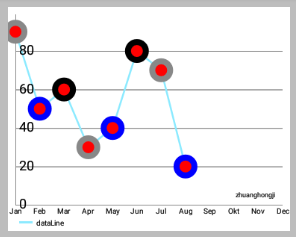

```java
// 图一
dataSet.setDrawCircles(false);

// 图二
dataSet.setDrawCircles(true);
dataSet.setDrawCircleHole(true);
dataSet.setCircleSize(16.0f);
dataSet.setCircleColor(Color.GREEN);
dataSet.setCircleColorHole(Color.RED);

// 图三
dataSet.enableDashedLine(10f,8f,0f);

// 图四
dataSet.setCircleColors(new int[]{Color.GRAY,Color.BLUE,Color.BLACK});  
```

- `setDrawCubic(boolean enabled)`: 如果设置为true，`LineChart` 线将被绘制成立体式的，而不是线性的。 **设置为true将对性能产生负面影响 ！** 默认值：false 。
- `setCubicIntensity(float intensity)`: 设置立体式的程度 (如果启用立体式绘制的话) 。 最大= 1F =非常立体，最小为0.05f =低的立体效果，默认：0.2F。
  
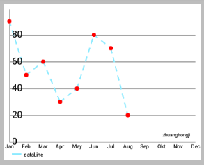 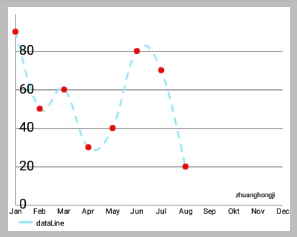

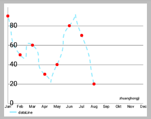 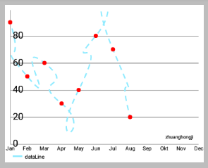

```java
// 图一
setDrawCubic(false);
// 图二
setDrawCubic(true); // 默认立体强度为0.2f
// 图三
setDrawCubic(true);
setCubicIntensity(0.5f);
// 图四
setDrawCubic(true);
setCubicIntensity(1.0f);
```

### BarDataSet 类

- `setBarSpacePercent(float percent)`: 设置在bar之间的间隙 (占一条bar宽度的百分比) 。
- `setBarShadowColor(int color)`: 设置绘制bar阴影的颜色。  **Don't for get to use `getResources().getColor(...)` to set this. Or `Color.rgb(...).`** 
- `setHighLightAlpha(int alpha)`: 设置绘制加亮显示的bar的透明度。 最小= 0 (完全透明) ，最大= 255 (完全不透明) 。
- `setStackLabels(String[] labels)`: Sets labels for different values of bar-stacks, in case there are one.


### ScatterDataSet 类

- `setScatterShapeSize(float size)`: 设置密度像素的绘制scattershape将有大小。 这仅适用于非自定义形状。Sets the size in density pixels the drawn scattershape will have. This only applies for non custom shapes.
- `setScatterShape(ScatterShape shape)`: 设置上绘制其中的值是在该位置的形状。 Sets the shape that is drawn on the position where the values are at.


### CandleDataSet 类

- `setBodySpace(float space)`: 设置留出每个烛体，默认0.1F (10％) ，最大值0.45F，最小0F的左侧和右侧的空间。Sets the space that is left out on the left and right side of each candle body, default 0.1f (10%), max 0.45f, min 0f
- `setShadowWidth(float width)`: 设置烛影线的DP的宽度。 默认3F。Sets the width of the candle-shadow-line in dp. Default 3f.
- `setShadowColor(int color)`: 设置烛影线的颜色。Sets the color of the candle-shadow-line.
- `setDecreasingColor(int color)`: 设置应该用于此独一无二的颜色DataSet时，开>关闭。Sets the one and ONLY color that should be used for this DataSet when open > close. 
- `setIncreasingColor(int color)`: 设置应该用于该数据集的独一无二的颜色，当打开<=关闭。Sets the one and ONLY color that should be used for this DataSet when open <= close. 
- `setDecreasingPaintStyle(Paint.Style style)`: 设置绘图方式时开>关闭 (填充或描边) 。Sets paint style when open > close (fill or stroke).
- `setIncreasingPaintStyle(Paint.Style style)`: 设置绘制风格，当打开<=关闭 (填充或描边) 。 Sets paint style when open <= close (fill or stroke).


### BubbleDataSet 类

- `setHighlightCircleWidth(float width)`: 设置环绕当高亮状态下的泡沫，在DP圆的宽度。Sets the width of the circle that surrounds the bubble when in highlighted state, in dp.

有关资料 CandleDataSet 颜色：通常 `setColors(...)` 方法仍然可以用于着色图表的一次。`setColor(...)` 如果特定的颜色 (身体，阴影......) 的需要，可使用上述方法。Information concerning CandleDataSet colors: The usual setColors(...), setColor(...), ... methods can still be used for coloring the chart all at once. If specific colors (for body, shadow, ...) are needed, use the above mentioned methods.


### PieDataSet 类

- `setSliceSpace(float degrees)`: 设置被排除在饼图切片，默认之间的空间：0°- >没有空间，最大的45岁，最小0 (无空格) 。Sets the space that is left out between the piechart-slices, default: 0° --> no space, maximum 45, minimum 0 (no space)
- `setSelectionShift(float shift)`: 将选中的饼图切片该数据集是距离从图表中，缺省12F中心“转移”掉 。Sets the distance the highlighted piechart-slice of this DataSet is "shifted" away from the center of the chart, default 12f