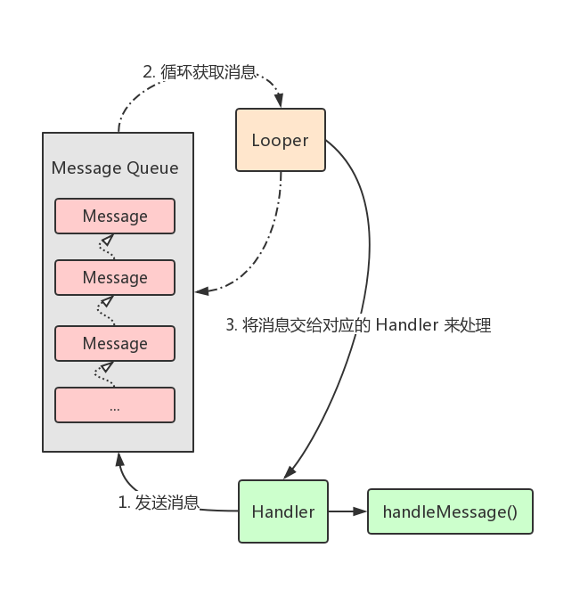
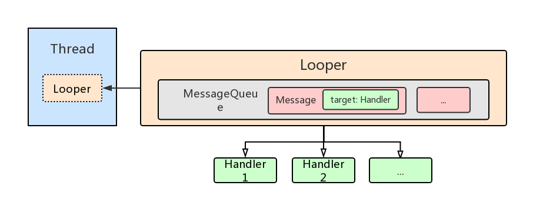
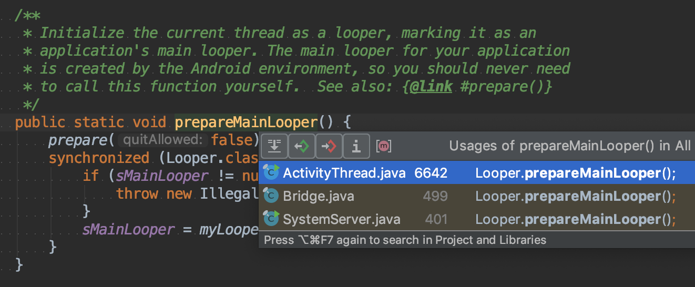
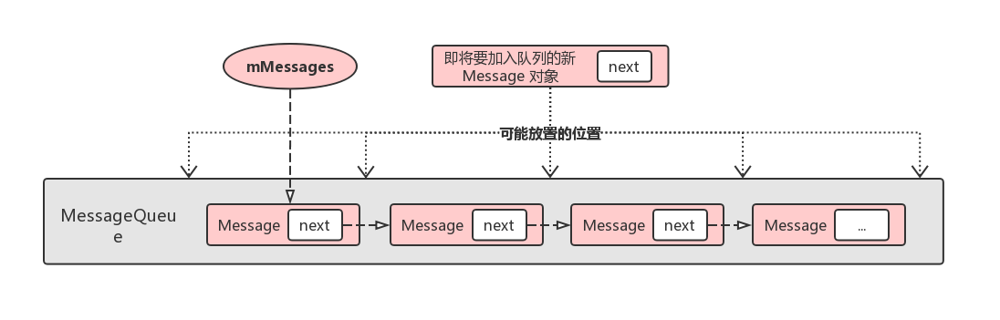

# 深入理解 Handler

在 Android 开发过程中，我们经常会通过 Handler 从子线程切换到主线程以进行 UI 更新的操作，或是进行一些其它操作。总的来说：
* `Handler` 是 Android SDK 提供的、方便开发者进行异步消息处理的类。
* 我们平时使用的 `AsyncTask` 和 `Retrofit`，其内部都使用了 Handler 消息机制，并进行了一定程度的巧妙封装。

在这篇文章中，我们会从「基础知识」和「源码分析」这两个维度去深入理解 Handler，以便日后能够在开发过程能够写出更高质量的代码。

## 基础知识

### 介绍

> 这段介绍主要翻译自官方文档：[Handler](https://developer.android.com/reference/android/os/Handler)

`Handler` 允许你发送并处理 `Message` 和 `Runnable` 对象 (这些对象会存储在跟线程相关联的 `MessageQueue` 中)。每个 Handler 实例都与「一个线程」以及「该线程的消息队列」相关联。当你创建一个新的 Handler 时，它会被绑定到正在创建它的线程的 "线程/消息队列"。从此以后，我们就可以通过 Handler 实例来传递 messages 和 runnables 到消息队列中，然后在它们出队列时执行相关逻辑。

`Handler` 主要有两个用途：
1. 调度 messages 和 runnables 在将来的某个时刻执行。
2. 将在「不同线程上执行的操作」加入到消息队列中。

已实现的消息调度方法有：
* `post(Runnable)`
* `postAtTime(java.lang.Runnable, long)`
* `postDelayed(Runnable, Object, long)`
* `sendEmptyMessage(int)`
* `sendMessage(Message)` 
* `sendMessageAtTime(Message, long)` 
* `sendMessageDelayed(Message, long)`

Handler 提供的 `post(Runnable)` 方法允许你将 `Runnable` 对象放到消息队列中，并在它们被消息队列接收后马上进行处理 (即执行 Runnable 对象的 `run` 方法)。另外提供的 `sendMessage(Message)` 方法允许你将一个包含 bundle 数据的 `Message` 对象加入到消息队列中，并在合适的时机将该消息对象作为参数传递给 "该 Handler 子类覆写的 `handleMessage(Message)` 方法" 中进行处理。

不管是 postRunnable 还是 sendMessage，你都可以指定其是在消息队列准备好后马上 (或延迟一段时间后、或在 Android `SystemClock` 的某个具体时间) 进行处理。后两者允许你实现超时 (timeouts)、嘀嗒 (ticks) 等一些基于时间的行为 (在下文中会通过示例演示如何编写相关代码)。

在为应用程序创建进程时，其主线程专门用于运行 (run) 对应的消息队列，这个队列负责管理顶级 (top-level) 的应用程序对象 (比如 Activity，BroadcastReceiver) 及其创建的任何窗口 (Window)。

你也可以创建自己的线程，并通过 Handler 的 post 或 sendMessage 方法与主线程进行通信，给定的 Runnable 或 Message 对象会在一个适当的时机被消息队列调度和处理。

### 使用示例

我们先来看一个简单的 handleeMessage 示例：

```java
// 创建一个 Handler 实例并覆写它的 handleMessage 方法
// 在触发按钮事件后，在子线程中发送一个空消息到消息队列
public class MainActivity extends AppCompatActivity {

    private static final String TAG = "MainActivity";
    private static final int MSG_WHAT_FINISH = 0x01;

    @SuppressLint("HandlerLeak")
    private Handler mHandler = new Handler() {
        @Override
        public void handleMessage(Message msg) {
            super.handleMessage(msg);
            switch (msg.what) {
                case MSG_WHAT_FINISH:
                    Log.i(TAG, "mHandler 所在线程的 id = "
                            + Thread.currentThread().getId());
                    break;
                default:
                    break;
            }
        }
    };

    @Override
    protected void onCreate(Bundle savedInstanceState) {
        super.onCreate(savedInstanceState);
        setContentView(R.layout.activity_main);
        Button btnStart = findViewById(R.id.btn_start);
        btnStart.setOnClickListener(new View.OnClickListener() {
            @Override
            public void onClick(View v) {
                // 启动一个耗时线程
                new Thread(new Runnable() {
                    @Override
                    public void run() {
                        try {
                            Log.i(TAG, "耗时线程的 id = "
                                    + Thread.currentThread().getId());
                            Thread.sleep(2000);
                            mHandler.sendEmptyMessage(MSG_WHAT_FINISH);
                        } catch (InterruptedException e) {
                            e.printStackTrace();
                        }

                    }
                }).start();
            }
        });
    }
}
```

点击 `btnStart` 按钮后，日志输出如下：

```java
2019-03-12 16:56:27.731 I/MainActivity: 耗时线程的 id = 7269
2019-03-12 16:56:29.733 I/MainActivity: mHandler 所在线程的 id = 2
```

在上面的示例代码中，你可能注意到在创建 `mHandler` 时我们加了个 `@SuppressLint("HandlerLeak")` 注解，以抑制 Lint 的 `This Handler class should be static or leaks might occur..` 警告。如果你不想增加这个注解，也不想看到 Lint 警告，可以换成这种写法：

```java
private Handler mHandler = new Handler(new Handler.Callback() {
    @Override
    public boolean handleMessage(Message msg) {
        switch (msg.what) {
            case MSG_WHAT_FINISH:
                Log.i(TAG, "mHandler 所在线程的 id = "
                        + Thread.currentThread().getId());
                return true;
            default:
                return false;
        }
    }
});
```

> 注意：不管是上述哪种写法，其实都没有真正解决 Handler 可能带来的内存泄漏问题。

在前面的介绍中，我们提到可以利用 Handler 来实现超时、滴答等基于时间的行为，下面是要演示的代码和分析。

**超时示例：**

```java
Log.i(TAG, "开始");
int delayMillis = 6000;
final Runnable timeoutRunnable = new Runnable() {
    @Override
    public void run() {
        Log.i(TAG, "超时了噢...");
    }
};
mHandler.postDelayed(timeoutRunnable, delayMillis);

btnRemove.setOnClickListener(new View.OnClickListener() {
    @Override
    public void onClick(View v) {
        Log.i(TAG, "移除 timeoutRunnable");
        mHandler.removeCallbacks(timeoutRunnable);
    }
});
```

如果你在 `6000` 内都没有点击 `btnRemove` 按钮，日志输出如下：

```java
2019-03-12 17:19:31.160 I/MainActivity: 开始
2019-03-12 17:19:37.168 I/MainActivity: 超时了噢...
```

如果你在 `6000` 内都点击了 `btnRemove` 按钮，日志输出如下：

```java
2019-03-12 17:20:54.895 I/MainActivity: 开始
2019-03-12 17:20:57.319 I/MainActivity: 移除 timeoutRunnable
```


**滴答示例：**

```java
final int delayMillis = 1000;
final Runnable ticksRunnable = new Runnable() {
    @Override
    public void run() {
        Log.i(TAG, "滴..");
        mHandler.postDelayed(this, delayMillis);
    }
};
mHandler.postDelayed(ticksRunnable, delayMillis);

btnStop.setOnClickListener(new View.OnClickListener() {
    @Override
    public void onClick(View v) {
        Log.i(TAG, "停止滴答");
        mHandler.removeCallbacks(ticksRunnable);
    }
});
```

执行这段代码后，会每隔一秒输出一行 `滴..` 日志，直到你点击了 `btnStop` 按钮。

```java
2019-03-12 17:26:03.702 I/MainActivity: 滴..
2019-03-12 17:26:04.705 I/MainActivity: 滴..
2019-03-12 17:26:05.709 I/MainActivity: 滴..
2019-03-12 17:26:06.722 I/MainActivity: 停止滴答
```

### Handler 的四大组件和运作机制

Handler 的消息机制主要有以下四个部分组成：
* `Handler`
* `Looper` 
* `Message` 
* `MessageQueue`

先来看一个示意图：



* `Handler`: 可用来发送和处理消息对象。
* `Looper`: 读取消息队列中的消息并交由对应的 Handler 对象进行分发和处理。
* `Message`: 消息，消息对象由 Handler 发送和处理。
* `MessageQueue`: 管理 Message 的队列，即我们所说的消息队列。


再来看一个示意图：



* Looper 由线程持有，一个线程最多只有一个 Lopper 对象。
* MessageQueue 由 Looper 进行创建和管理，其中的消息对象有着严格的时间顺序，先进不一定先出。
* Message 会持有发送它的 Handler 对象的引用，在 Looper 将其从消息队列中取出时会调用 `msg.target.dispatchMessage(msg);` 进行分发和处理。
* 一个 Looper 可对应多个 Handler 实例。
* 如果希望 Handler 能够正常创建，那创建 Handler 对象的线程必须有一个 Looper 对象。

怎么理解 **一个 Looper 可对应多个 Handler 实例** 这句话？
* 比如说，如果你在 Activity 的 `onCreate()` 方法中创建了多个 Handler 对象。因为 `onCreate()` 方法是在主线程中执行的，所以这些创建的 Handler 对象内部持有的 Looper 对象其实是同一个。

怎么理解 **创建 Handler 对象的线程必须有一个 Looper 对象** 这句话？
* 因为 Handler 的构造函数中会先从当前线程中获取 `Looper` 对象，如果该对象为 `null` 就会直接抛出异常。

我们来演示一下当前线程没有 Looper 对象的情况：

```java
new Thread(new Runnable() {
    @Override
    public void run() {
        Handler handler = new Handler();    // 1
    }
}).start();
```

铛铛铛.. 在执行 `1` 这行代码时报错了，日志如下：

```java
2019-03-12 17:43:22.151 E/AndroidRuntime: FATAL EXCEPTION: Thread-2
    Process: com.zhuanghongji.handler, PID: 30186
    java.lang.RuntimeException: Can't create handler inside thread Thread[Thread-2,5,main] that has not called Looper.prepare()
        at android.os.Handler.<init>(Handler.java:205)
        at android.os.Handler.<init>(Handler.java:118)
        at com.zhuanghongji.handler.MainActivity$2.run(MainActivity.java:78)
        at java.lang.Thread.run(Thread.java:764)
```

报错日志上说：不能在没有调用 `Looper.prepare()` 的线程中创建 Handler 对象。

那如果我们想在子线程中创建 Handler 对象，应该怎么做呢？

修改上面会报错的代码，得到正确姿势如下：

```java
// 正确姿势1
new Thread(new Runnable() {
    @Override
    public void run() {
        Looper.prepare();
        @SuppressLint("HandlerLeak")
        Handler handler = new Handler() {
            @Override
            public void handleMessage(Message msg) {
                super.handleMessage(msg);
                Log.i(TAG, "姿势1A：current thread id = " + Thread.currentThread().getId());
            }
        };
        handler.sendEmptyMessage(0x01);
        handler.post(new Runnable() {
            @Override
            public void run() {
                Log.i(TAG, "姿势1B：current thread id = " + Thread.currentThread().getId());
            }
        });
        Looper.loop();
        Log.i(TAG, "这行代码不会执行");
    }
}).start();

// 正确姿势2
new Thread(new Runnable() {
    @Override
    public void run() {
        Handler handler = new Handler(getMainLooper());
        handler.post(new Runnable() {
            @Override
            public void run() {
                Log.i(TAG, "姿势2：current thread id = " + Thread.currentThread().getId());
            }
        });
    }
}).start();
```

执行正确姿势的代码片段后，日志输出如下：

```java
2019-03-13 01:22:10.073 I/MainActivity: main thread id = 2
2019-03-13 01:22:10.075 I/MainActivity: 姿势1A：current thread id = 7540
2019-03-13 01:22:10.075 I/MainActivity: 姿势1B：current thread id = 7540
2019-03-13 01:22:10.127 I/MainActivity: 姿势2：current thread id = 2
```

注意看，上面的日志输出中并没有 `这行代码不会执行` 噢。因为 `Looper.loop()` 方法内部有一个 `for (;;) { ... }` 死循环，该死循环会阻塞当前线程的运行。除非你显式调用了 `handler.getLooper().quit()` 来结束这个循环，否者 `looper()` 之后的代码不会被执行。

另外从日志输出的线程 id 可以看出，"正确姿势1" 中创建的 Handler 不管是 sendMessage 还是 postRunnable，最后处理逻辑都是在子线程中执行的。也就是说，Handler 对应的 `handleMessage` 和 `run` 方法并不都是在主线程中执行。决定在哪个线程执行实际上是由 `Handler` 中 `Looper` 对象决定的，`Looper` 在是在哪个线程创建的，就在哪个线程执行相关逻辑。


## 源码分析

源码分析主要分为以下几个部分：
* 创建 `Handler`
* `handler.sendMessage(Message)` 和 `handler.post(Runnable)`
* 创建 `Looper`
* 创建 `MessageQueue`
* `messageQueue.next()`
* `messageQueue.enqueueMessage(Message msg, long when)`
* `messageQueue.quit(boolean safe)`

### 创建 `Handler`

`Handler` 隐式继承自 `Object`，它的一个主要构造方法源代码如下：

```java
public class Handler {

    final Callback mCallback;

    public Handler(Callback callback, boolean async) {
        if (FIND_POTENTIAL_LEAKS) {
            final Class<? extends Handler> klass = getClass();
            if ((klass.isAnonymousClass() || klass.isMemberClass() || klass.isLocalClass()) &&
                    (klass.getModifiers() & Modifier.STATIC) == 0) {
                Log.w(TAG, "The following Handler class should be static or leaks might occur: " +
                    klass.getCanonicalName());
            }
        }

        mLooper = Looper.myLooper();                // 1
        if (mLooper == null) {
            throw new RuntimeException(
                "Can't create handler inside thread " + Thread.currentThread()
                        + " that has not called Looper.prepare()");
        }
        mQueue = mLooper.mQueue;                    // 2
        mCallback = callback;                       // 3
        mAsynchronous = async;
    }

    public interface Callback {
        public boolean handleMessage(Message msg);
    }

    // ...
}
```

```java
public final class Looper {
    // sThreadLocal.get() will return null unless you've called prepare().
    static final ThreadLocal<Looper> sThreadLocal = new ThreadLocal<Looper>();
    private static Looper sMainLooper;  // guarded by Looper.class

    public static @Nullable Looper myLooper() {     // 4
        return sThreadLocal.get();
    }

    // ...
}
```

* 结合 `1` 和 `4` 两处代码可以看出，在创建 Handler 对象的时候会先通过 `ThreadLocal` 获取到存储在当前线程中的 `Looper` 对象。如果该对象为 `null`，则抛出 `... not called Looper.prepare()` 异常。
* 在 `2` 代码处，存储 Looper 对象中的消息队列的引用。
* 在 `3` 代码处，存储创建 Handler 对象时传入的 `Handler.Callback` 实例，如果其不为 `null` 的话，最终从消息队列中取出来的没有 Runnable 的消息对象就由实例进行处理了。

那 `Looper` 应该怎样去 prepare 呢？

Looper 类中暴露了两个用于 prepare Looper 对象的静态方法，其中一个源代码如下：

```java
public final class Looper {

    // sThreadLocal.get() will return null unless you've called prepare().
    static final ThreadLocal<Looper> sThreadLocal = new ThreadLocal<Looper>();

    // 公开的
    public static void prepare() {
        prepare(true);
    }

    // 私有的
    private static void prepare(boolean quitAllowed) {  
        if (sThreadLocal.get() != null) {
            throw new RuntimeException("Only one Looper may be created per thread");
        }
        sThreadLocal.set(new Looper(quitAllowed));
    }

    // ...
}
```

在 `prepare(boolean quitAllowed)` 方法中，会先从 `sThreadLocal` 中获取 `Looper` 对象。如果该对象不为 `null` 则抛出异常，因为一个线程中只能有一个 `Looper` 对象。也就是说，在同一个线程中，我们只能调用 `Looper.prepare()` 一次。

看到这里可能你会想，我们平时在 `Activity` 中创建 `Handler` 时并不需要显式调用 `Looper.prepare()` 方法呀，这是为什么呢？这只是因为在 `Activity` 创建之前就有人在主线程中提前帮你调用了 "另一个用于 prepare Looper 对象的静态方法"，该静态方法会创建 Looper 对象并保存到主线程中：

```java
public final class Looper {
    // 主线程的 Looper 实例
    private static Looper sMainLooper;  // guarded by Looper.class

    // 另一个用于 prepare Looper 对象的静态方法
    // 其中调用 prepare(false) 方法的 false 参数表示
    // 在创建 Looper 对象的消息队列时，该消息队列不能被终止
    public static void prepareMainLooper() {
        prepare(false);
        synchronized (Looper.class) {
            if (sMainLooper != null) {
                throw new IllegalStateException("The main Looper has already been prepared.");
            }
            sMainLooper = myLooper();
        }
    }

    // 获取主线程 Looper 实例的静态方法
    // 如果想在主线程中创建 Handler 对象，可以先通过这个方法来获取主线程的 Looper 对象，比如
    // Handler mainHandler = new Handler(Looper.getMainLooper()) 
    public static Looper getMainLooper() {
        synchronized (Looper.class) {
            return sMainLooper;
        }
    }

    // ...
}
```

既然说有人提前调用了 `prepareMainLooper()` 静态方法，那具体是什么时候调用的呢？`Command + Mouse Left` 点击该方法，弹出菜单如下：



来看下 `ActivityThread` 类中的第 6624 行代码：

```java

/**
 * Defines operations that a {@link android.app.servertransaction.ClientTransaction} or its items
 * can perform on client.
 */
public abstract class ClientTransactionHandler {
    // ...
}

/**
 * This manages the execution of the main thread in an
 * application process, scheduling and executing activities,
 * broadcasts, and other operations on it as the activity
 * manager requests.
 */
public final class ActivityThread extends ClientTransactionHandler {
  // ...

  public static void main(String[] args) {
        // ...

        Process.setArgV0("<pre-initialized>");

        Looper.prepareMainLooper();                 // Line 6624

        // ...
  }
}
```

由上面的代码片段可知，在 `ActivityThread` 的静态 `main` 方法中会通过调用 `Looper.prepareMainLooper();` 来创建主线程的 Looper 对象，这样我们在主线程中创建 Handler 时就不用 (也不能) 再调用 `Looper.prepare()` 方法了。

`ActivityThread` 是应用程序的核心类之一，它的 `main` 方法是整个应用进程的入口。

> 注意：`ActivityThread` 并非继承自 `java.lang.Thread` 类，而是继承自抽象类 `ClientTransactionHandler`。 


### `handler.sendMessage(Message)` 和 `handler.post(Runnable)`

**Message**

在分析 Handler 的 `sendMessage()` 和 `post(Runnable)` 方法之前，我们先来看一下 `Message` 类的定义。

```java
public final class Message implements Parcelable {
  public int what;
  long when;
  Bundle data;
  Handler target;
  Runnable callback;
  
  // sometimes we store linked lists of these things
  Message next;

  private static Message sPool;
  private static int sPoolSize = 0;

  public Message() {}

  /**
   * Return a new Message instance from the global pool. Allows us to
   * avoid allocating new objects in many cases.
   */
  public static Message obtain() {
      synchronized (sPoolSync) {
          if (sPool != null) {
              Message m = sPool;
              sPool = m.next;
              m.next = null;
              m.flags = 0; // clear in-use flag
              sPoolSize--;
              return m;
          }
      }
      return new Message();
  }

  /**
   * Recycles a Message that may be in-use.
   * Used internally by the MessageQueue and Looper when disposing of queued Messages.
   */
  void recycleUnchecked() {
      // Mark the message as in use while it remains in the recycled object pool.
      // Clear out all other details.
      flags = FLAG_IN_USE;
      what = 0;
      // ...
      when = 0;
      target = null;
      callback = null;
      data = null;

      synchronized (sPoolSync) {
          if (sPoolSize < MAX_POOL_SIZE) {
              next = sPool;
              sPool = this;
              sPoolSize++;
          }
      }
  }

  // ...
}
```

贴的代码有点长，没关系我们慢慢看。

由上面的代码可以看出，`Message` 实际上是一个 Parcelable 包装类，其内部包装了：
* 公开的、由用户定义的消息标识 `what`。
* 用于传递 Bundle 数据的 `data` 。
* 发送该消息对象的 Handler 对象的引用 `target`。
* 可执行的 Runnable 对象 `callback`。
* 下一条消息的引用 `next`。

与此同时，`Message` 也暴露出了一系列 `obtain()` 静态方法来辅助我们创建新的 `Message` 对象，或是从消息队列中复用旧的 `Message` 对象 (可有效避免频繁的分配新消息对象)。

**Handler.sendMessage(Message)**

```java
public class Handler {
  public final boolean sendMessage(Message msg){
      return sendMessageDelayed(msg, 0);
  }

  public final boolean sendMessageDelayed(Message msg, long delayMillis) {
      if (delayMillis < 0) {
          delayMillis = 0;
      }
      return sendMessageAtTime(msg, SystemClock.uptimeMillis() + delayMillis);
  }

  public boolean sendMessageAtTime(Message msg, long uptimeMillis) {
      MessageQueue queue = mQueue;
      if (queue == null) {
          RuntimeException e = new RuntimeException(
                  this + " sendMessageAtTime() called with no mQueue");
          Log.w("Looper", e.getMessage(), e);
          return false;
      }
      return enqueueMessage(queue, msg, uptimeMillis);
  }

  private boolean enqueueMessage(MessageQueue queue, Message msg, long uptimeMillis) {
      msg.target = this;
      if (mAsynchronous) {
          msg.setAsynchronous(true);
      }
      return queue.enqueueMessage(msg, uptimeMillis);
  }

  // ...
}
```

由上面节选出来的代码片段可以看出，所有与发送消息相关的方法最终都会调用到 `enqueueMessage()` 方法。在 `enqueueMessage()` 方法内部，先是把消息对象中的 `target` 引用指向发送该消息的 Handler 对象，然后再通过消息队列的 `enqueueMessage(Message msg, long when)` 方法将该消息对象加入队列中。

> `sendEmptyMessage(int what)` 也是通过间接调用 `sendMessageAtTime()` 方法来将消息对象加入到队列中，只不过是中间是多了一个调用 `Message.obtain()` 创建消息对象并设置对应 `what` 属性值的过程。


**Handler.post(Runnable)**

前面我们讲到，`Message` 内部有一个 `Runnable callback` 引用。咦？难道我们 `post` 出去的 Runnable 对象最终是包装为 Message 对象，然后再加入到消息队列中的？没有，确实是酱紫的，相关源代码如下：

```java
public class Handler {

    public final boolean post(Runnable r) {
       return sendMessageDelayed(getPostMessage(r), 0);
    }

    public final boolean postDelayed(Runnable r, long delayMillis) {
        return sendMessageDelayed(getPostMessage(r), delayMillis);
    }

    private static Message getPostMessage(Runnable r) {
        Message m = Message.obtain();
        m.callback = r;
        return m;
    }

    // ...
}
```

由上面的代码片段可看出，在 `post(Runnable r)` 方法中，先是通过 `getPostMessage(r)` 方法来获取包装了 Runnable 的消息对象，然后再调用 `sendMessageDelayed()` 方法发送该消息对象，以达到最终调用 `enqueueMessage()` 方法来将该消息对象加入到队列中。


### 创建 Looper

`Looper` 类中有两个关键的静态方法：
* `Looper.prepare()` 
* `Looper.loop()` 

前面我们讲到，在子线程中可以通过调用 `Looper.prepare()` 静态方法来为当前线程创建对应的 `Looper` 对象。下面我们来分析一下相关源代码：

```java
public final class Looper {

    static final ThreadLocal<Looper> sThreadLocal = new ThreadLocal<Looper>();
    final MessageQueue mQueue;
    final Thread mThread;

    public static void prepare() {
        prepare(true);
    }

    private static void prepare(boolean quitAllowed) {
        if (sThreadLocal.get() != null) {
            throw new RuntimeException("Only one Looper may be created per thread");
        }
        sThreadLocal.set(new Looper(quitAllowed));
    }

    private Looper(boolean quitAllowed) {
        mQueue = new MessageQueue(quitAllowed);
        mThread = Thread.currentThread();
    }

    // ...
}
```

在我们调用 `Looper.prepare()` 时，会创建一个 `Looper` 对象并通过 `sThreadLocal` 的 `set()` 方法作为该对象作为副本保存到当前线程的本地中。

`Looper` 的构造方法很简单，先是创建一个消息队列的实例并将其引用赋值给 `mQueue` 变量，然后再将实例变量 `mThread` 指向当前创建 `Looper` 对象的线程。

> `ThreadLocal` 提供了线程本地的实例，它与普通变量的区别在于：
> * 每个使用该变量的线程都会初始化一个完全独立的实例副本。
>
> `ThreadLocal` 变量通常使用 `private static` 进行修饰。当一个线程结束时，它所对应的所有 `ThreadLocal` 实例副本都会被回收。


在之前的 “正确姿势1” 中可以看到，在调用 `Looper.prepare()` 方法并创建好 Handler 之后，我们还调用了 `Looper.loop()` 方法，因为不调用的话是不会执行处理消息对象相关逻辑的。

那这个 `Looper.loop()` 到底做了什么呢？来看下相关源代码：

```java
public final class Looper {

  public static void loop() {
    final Looper me = myLooper();
    if (me == null) {
        throw new RuntimeException("No Looper; Looper.prepare() wasn't called on this thread.");
    }
    final MessageQueue queue = me.mQueue;
    // ...

    for (;;) {
        Message msg = queue.next(); // might block
        if (msg == null) {
            // No message indicates that the message queue is quitting.
            return;
        }
        // ...

        final long dispatchStart = needStartTime ? SystemClock.uptimeMillis() : 0;
        final long dispatchEnd;
        try {
            msg.target.dispatchMessage(msg);
            dispatchEnd = needEndTime ? SystemClock.uptimeMillis() : 0;
        } finally {
            if (traceTag != 0) {
                Trace.traceEnd(traceTag);
            }
        }
        // ...

        msg.recycleUnchecked();
    }

    public static @Nullable Looper myLooper() {
        return sThreadLocal.get();
    }

    // ...
}
```

由上面这段代码可知，`Looper.loop()` 方法：
1. 首先会从当前线程中拿到 `Looper` 对象，
2. 如果该 `Looper` 对象不为 `null` ，则从该对象中拿到其内部的 `MessageQueue` 对象 (消息队列)，
3. 紧接着会通过 `for(;;)` 执行一个死循环，不断通过调用 `queue.next()` 来从消息队列中获取消息对象。
4. 拿到消息对象后，会通过 `msg.target` 拿到发送该消息的 Handler 实例并调用其 `dispatchMessage(msg)` 方法来分发这个消息对象。

在 Handler 中分发消息对象之后会做什么呢？继续往下看：

```java
public class Handler {
    public void dispatchMessage(Message msg) {
        if (msg.callback != null) {
            handleCallback(msg);
        } else {
            if (mCallback != null) {
                if (mCallback.handleMessage(msg)) {
                    return;
                }
            }
            handleMessage(msg);
        }
    }

    private static void handleCallback(Message message) {
        message.callback.run();
    }

    public void handleMessage(Message msg) {}

    // ...
}
```

可以看出，在 `dispatchMessage(Message msg)` 方法中：
* 场景1：如果 `msg.callback` (类型是 Runnable) 不为 `null`，则直接调用其 `run` 方法。
* 场景2：如果 `msg.callback` (类型是 Runnable) 为 `null`，再判断 Handler 的 `mCallback` 是否为 `null`，以确定是调用 `mCallback` 的 `handleMessage(Message msg)` 方法还是调用该 Handler 对象的 `handleMessage(Message msg)` 方法来处理消息对象。 

综合前面的代码分析可以知道：
* "场景1" 会在我们直接调用 `handler.post(Runnable)` 之后发生。
* "场景2" 会在我们直接调用 `handler.sendMessage(Message)` 之后发生。

> Handler 的 `handleMessage(Message msg)` 方法默认是个空实现，所以如果需要自行处理分发后的消息对象，就必须在创建 Handler 实例时覆写该 `handleMessage` 方法。

埋个坑后面再填：`Looper.loop()` 方法的 `Message msg = queue.next(); // might block` 这行后面有个注释，说这行代码可能会发生阻塞，这是为什么？


### 创建 `MessageQueue`

前面讲到，在创建 `Looper` 对象的同时会创建 `MessageQueue` 对象。在创建  `MessageQueue` 这个消息队列对象时，背后都做了哪些操作？再接着往下看：

**`MessageQueue(boolean quitAllowed)`：**

```java
public final class MessageQueue {
    // True if the message queue can be quit.
    private final boolean mQuitAllowed;

    Message mMessages;
    private boolean mQuitting;

    // Indicates whether next() is blocked waiting in pollOnce() with a non-zero timeout.
    private boolean mBlocked;

    private native static long nativeInit();

    MessageQueue(boolean quitAllowed) {
        mQuitAllowed = quitAllowed;
        mPtr = nativeInit();
    }

    boolean hasMessages(Handler h, int what, Object object) { /* ... */ }
    boolean hasMessages(Handler h, Runnable r, Object object) { /* ... */ }
    void removeMessages(Handler h, int what, Object object) { /* ... */ }
    void removeMessages(Handler h, Runnable r, Object object) { /* ... */ }
    void removeCallbacksAndMessages(Handler h, Object object) { /* ... */ }

    // ...
}
```

从上面的代码片段可以看出，创建 `MessageQueue` 时只是做了一些普通操作：
* 其构造函数接收一个 "是否可以停止消息队列" 的标识，该表示会作为消息队列的成员变量。
* 在构造函数内部会调用 native 方法进行相关初始化操作。

### `messageQueue.enqueueMessage(Message msg, long when)`

```java
public final class MessageQueue {

    Message mMessages;
    private boolean mQuitting;

    // Indicates whether next() is blocked waiting in pollOnce() with a non-zero timeout.
    private boolean mBlocked;

    boolean enqueueMessage(Message msg, long when) {
        if (msg.target == null) {
            throw new IllegalArgumentException("Message must have a target.");
        }
        if (msg.isInUse()) {
            throw new IllegalStateException(msg + " This message is already in use.");
        }

        synchronized (this) {
            if (mQuitting) {
                IllegalStateException e = new IllegalStateException(
                        msg.target + " sending message to a Handler on a dead thread");
                Log.w(TAG, e.getMessage(), e);
                msg.recycle();
                return false;
            }

            msg.markInUse();
            msg.when = when;
            Message p = mMessages;
            boolean needWake;
            if (p == null || when == 0 || when < p.when) {
                // New head, wake up the event queue if blocked.
                msg.next = p;
                mMessages = msg;
                needWake = mBlocked;
            } else {
                // Inserted within the middle of the queue.  Usually we don't have to wake
                // up the event queue unless there is a barrier at the head of the queue
                // and the message is the earliest asynchronous message in the queue.
                needWake = mBlocked && p.target == null && msg.isAsynchronous();
                Message prev;
                for (;;) {
                    prev = p;
                    p = p.next;
                    if (p == null || when < p.when) {
                        break;
                    }
                    if (needWake && p.isAsynchronous()) {
                        needWake = false;
                    }
                }
                msg.next = p; // invariant: p == prev.next
                prev.next = msg;
            }
            // ...
        }
        return true;
    }

    // ...
}
```

* 在调用 `enqueueMessage` 方法将消息对象加入队列时，消息对象的 `target`(Handler) 是不能为 `null` 的。
* 在加锁的代码块中将消息对象加入队列时，有三行关键代码 
  * `msg.when = when;`
  * `Message p = mMessages;` 
  * `msg.next = p;`。
* 前面讲过，`next` 指向的是下一个消息对象，并且每一个消息对象在队列中的位置严格按照 **时间顺序**的，所以在加锁代码块中需要通过 `if(p == null || when == 0 || when < p.when) { ... } else { for (;;) { ... } }` 这个逻辑来确定新加入队列的消息对象是 "直接放在队列头部第一个位置" 还是 "从头部第一个位置往后遍历以来找到对应 `when` 的位置"。

代码分析到这里，应该要特意提醒一下：
* 在 `MessageQueue` 中是没有 `List<Message>` 这样的代码结构的，
* 其内部是通过一个 `mMessages` 变量引用了 "消息队列" 中头部第一个位置的消息对象，然后该消息对象会通过其内部的 `next` 变量引用其下一个消息对象，这样通过 `next` 形成的链式引用就形成了队列。

附张图，文字太抽象了：


 
看到这里你有木有想过，为什么在将消息对象加入到队列中时要加锁？
* 因为我们可能会写出在多个线程中同时调用同一个 Handler 的 `post(Runnable)` 或 `sendMessage(Message)` 方法的代码呀，如果不加锁的话消息队列就乱套了。


### `messageQueue.quit(boolean safe)`

```java
public final class MessageQueue {
    // True if the message queue can be quit.
    private final boolean mQuitAllowed;

    Message mMessages;
    private boolean mQuitting;

    void quit(boolean safe) {
        if (!mQuitAllowed) {
            throw new IllegalStateException("Main thread not allowed to quit.");
        }

        synchronized (this) {
            if (mQuitting) {
                return;
            }
            mQuitting = true;

            if (safe) {
                removeAllFutureMessagesLocked();
            } else {
                removeAllMessagesLocked();
            }

            // We can assume mPtr != 0 because mQuitting was previously false.
            nativeWake(mPtr);
        }
    }

    private void removeAllMessagesLocked() {
        Message p = mMessages;
        while (p != null) {
            Message n = p.next;
            p.recycleUnchecked();
            p = n;
        }
        mMessages = null;
    }

    // ...
}
```

* 当我们需要想要结束某个消息队列时，可以调用 Looper 实例的 `quit()` 方法以间接调用 `MessageQueue` 的 `quit(boolean safe)` 方法。
* 如果 Looper 实例对应的消息队列是不允许结束的话，强行调用 `queue.quick(boolean safe)` 方法会抛出异常。
  * 比如说，主线程的消息队列就是不可以结束的，因为主线程在创建消息队列的时候入参 `quitAllowed` 为 `false`。
  * 而我们在子线程中调用 `Looper.prepare()` 创建的消息队列是可以结束的。
* 消息队列在结束时需要在代码锁中执行相关逻辑 (以避免在多个线程中同时调用 `quit` 方法时导致逻辑异常)。
* 在将 `mQuitting` 置为 `true` 之后，即使调用了 `enqueueMessage()` 方法，也不会将新的消息对象加入队列中。
* 最后，通过 `mMessages` 引用遍历消息队列以进行回收操作并将 `mMessages` 置为 `null`。


### `messageQueue.next()`

还记不记得前面，我们埋了一个说 `queue.next()` 可能会导致线程阻塞的坑？是时候来填了：

```java
public final class MessageQueue {

    // Indicates whether next() is blocked waiting in pollOnce() with a non-zero timeout.
    private boolean mBlocked;

    Message next() {
        // Return here if the message loop has already quit and been disposed.
        // This can happen if the application tries to restart a looper after quit
        // which is not supported.
        final long ptr = mPtr;
        if (ptr == 0) {
            return null;
        }

        int pendingIdleHandlerCount = -1; // -1 only during first iteration
        int nextPollTimeoutMillis = 0;
        for (;;) {
            if (nextPollTimeoutMillis != 0) {
                Binder.flushPendingCommands();
            }

            nativePollOnce(ptr, nextPollTimeoutMillis);

            synchronized (this) {
                // Try to retrieve the next message.  Return if found.
                final long now = SystemClock.uptimeMillis();
                Message prevMsg = null;
                Message msg = mMessages;
                if (msg != null && msg.target == null) {
                    // Stalled by a barrier.  Find the next asynchronous message in the queue.
                    do {
                        prevMsg = msg;
                        msg = msg.next;
                    } while (msg != null && !msg.isAsynchronous());
                }
                if (msg != null) {
                    if (now < msg.when) {
                        // Next message is not ready.  Set a timeout to wake up when it is ready.
                        nextPollTimeoutMillis = (int) Math.min(msg.when - now, Integer.MAX_VALUE);
                    } else {
                        // Got a message.
                        mBlocked = false;
                        if (prevMsg != null) {
                            prevMsg.next = msg.next;
                        } else {
                            mMessages = msg.next;
                        }
                        msg.next = null;
                        if (DEBUG) Log.v(TAG, "Returning message: " + msg);
                        msg.markInUse();
                        return msg;
                    }
                } else {
                    // No more messages.
                    nextPollTimeoutMillis = -1;
                }

                // Process the quit message now that all pending messages have been handled.
                if (mQuitting) {
                    dispose();
                    return null;
                }

                // ...
            }

            // ...
        }
    }

    // ...
}
```

从上面的代码片段可以看出：
* 消息队列对象的 `next()` 方法里面也有一个 `for(;;)` 死循环。
* 在该死循环的加锁代码块中，如果消息队列的第一个 `Message` 对象不为 `null` ，就会判断其 `when` 属性来确定其是否到时间出队列了。
  * 如果到时间了就将该消息对象作为返回值返回到 `Looper.loop()` 方法中 (同时将消息队列的 `mMessages` 指向 "该消息对象的 `next` 引用指向的对象")，然后再由 Handler 进行分发和处理。 
  * 否则，等待下一次的 `when` 判断。


## 总结

在这篇文章中，我们学习了如何使用 Handler，同时也通过源码分析了 Handler 内部的消息机制是如何实现的。
