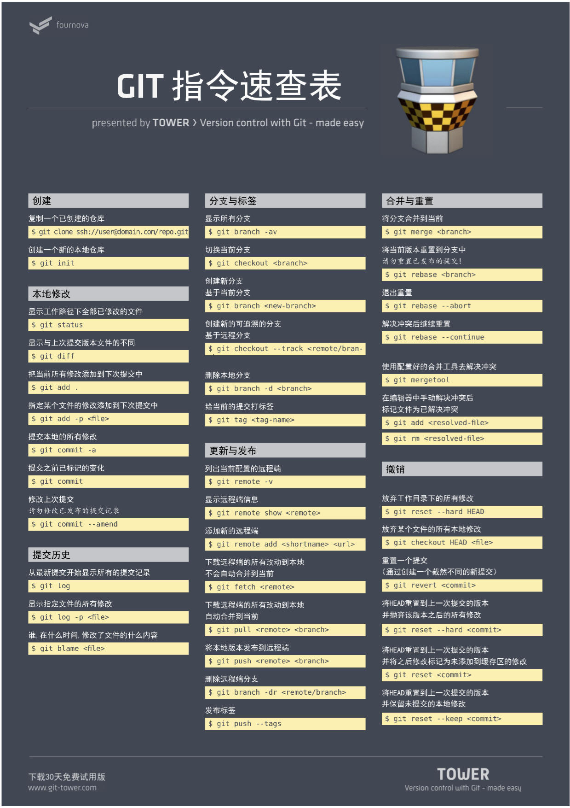

# Git 常用命令总结

在工作中我们经常会使用到 Git 命令，但有时会出现 "想使用某个 Git 功能但突然想不起来对应具体命令" 的情况。所以有必要写一篇简洁性、总结性的文章来汇总下 Git 的常用命令。

## 速查表

骚话不多说，上 "命令总结" 之图一张：


一张不爽？再来一张：



## 概述

接着，上 "命令关联" 之图一张，并通过关联关系记住 6 个主要命令： 


* `Remote`: 远程仓库。
* `Repository`: 本地仓库。
* `Workspace`: 工作区。
* `Stage`: 暂存区。

[]()

* `fetch`: 从另一个仓库中下载对象和引用。
* `clone`: 将存储库克隆到新目录中。
* `push`: 将本地分支的更新推送到远程主机。
* `pull`: 取回远程主机某个分支的更新，再与本地的指定分支合并。
* `checkout`: 切换分支或恢复工作树文件。
* `add`: 将文件内容添加到索引 (将修改添加到暂存区)。
* `commit`: 将更改记录 (提交) 到存储库。

> `git pull` 和 `git fetch` 的区别：`git pull = git fetch + git merge` 。


## 类别

### 新建代码库

```shell
# 在当前目录初始化一个 Git 仓库
$ git init

# 新建一个目录，然后将其初始化为 Git 仓库
$ git init [project-name]

# 克隆一个 Git 仓库
$ git clone [url]
```


### 配置

```shell
# 显示当前的 Git 配置
$ git config --list

# 编辑 Git 配置文件
$ git config -e [--global]

# 设置提交代码时的用户信息
$ git config [--global] user.name "[name]"
$ git config [--global] user.email "[email address]"
```


### 增加/删除文件

```shell
# 将指定文件添加到暂存区
$ git add [file1] [file2] ...

# 将指定目录 (含子目录) 添加到暂存区
$ git add [dir]

# 将当前目录的所有文件添加到暂存区
$ git add .

# 添加每个变更前，都会要求确认
# 对于同一个文件的多处变化，可以实现分次提交
$ git add -p

# 删除工作区文件，并且将这次删除变更添加到暂存区
$ git rm [file1] [file2] ...

# 停止跟踪指定文件，但该文件会保留在工作区
$ git rm --cached [file]

# 重命名文件，并且将这个重命名变更添加到暂存区
$ git mv [file-original] [file-renamed]
```


### 代码提交

```shell
# 提交暂存区到 Git 仓库中
$ git commit -m [message]

# 提交暂存区中的指定文件到 Git 仓库中
$ git commit [file1] [file2] ... -m [message]

# 直接将工作区 "自上次 Commit 之后的变化" 提交到 Git 仓库中
$ git commit -a

# 提交时显示所有 diff 信息
$ git commit -v

# 使用一次新的 Commit 来替代上一次提交
# 如果代码没有任何新变化，则用来改写上一次 Commit 的提交信息
$ git commit --amend -m [message]

# 重做上一次 Commit，并包括指定文件的新变化
$ git commit --amend [file1] [file2] ...
```


### 分支管理

```shell
# 列出所有本地分支
$ git branch

# 列出所有远程分支
$ git branch -r

# 列出所有本地分支和远程分支
$ git branch -a

# 新建一个分支，但依然停留在当前分支
$ git branch [branch-name]

# 新建一个分支，并切换到该分支
$ git checkout -b [branch]

# 新建一个分支，指向指定 Commit
$ git branch [branch] [commit]

# 新建一个分支，与指定的远程分支建立跟踪关系
$ git branch --track [branch] [remote-branch]

# 切换到指定分支，并更新工作区
$ git checkout [branch-name]

# 切换到上一个分支
$ git checkout -

# 建立跟踪关系，在现有分支与指定的远程分支之间
$ git branch --set-upstream [branch] [remote-branch]

# 合并指定分支到当前分支
$ git merge [branch]

# 选择一个 Commit，合并进当前分支
$ git cherry-pick [commit]

# 删除分支
$ git branch -d [branch-name]

# 删除远程分支
$ git push origin --delete [branch-name]
$ git branch -dr [remote/branch]
```


### 标签管理

```shell
# 列出所有 Tag
$ git tag

# 在当前 Commit 新建一个 Tag
$ git tag [tag]

# 在指定 Commit 新建一个 Tag
$ git tag [tag] [commit]

# 删除本地 Tag
$ git tag -d [tag]

# 删除远程 Tag
$ git push origin :refs/tags/[tagName]

# 查看 Tag 信息
$ git show [tag]

# 提交指定 Tag
$ git push [remote] [tag]

# 提交所有 Tsag
$ git push [remote] --tags

# 新建一个分支，指向某个 Tag
$ git checkout -b [branch] [tag]
```


### 信息查看

```shell
# 显示有变更的文件
$ git status

# 显示当前分支的版本历史
$ git log

# 显示 Commit 历史，以及每次 Commit 发生变更的文件
$ git log --stat

# 根据关键词搜索提交历史
$ git log -S [keyword]

# 显示某个 Commit 之后的所有变动，每个 Commit 占据一行
$ git log [tag] HEAD --pretty=format:%s

# 显示某个 Commit 之后的所有变动，其 "提交说明" 必须符合搜索条件
$ git log [tag] HEAD --grep feature

# 显示某个文件的版本历史，包括文件改名
$ git log --follow [file]
$ git whatchanged [file]

# 显示指定文件相关的每一次 Diff
$ git log -p [file]

# 显示过去 5 次提交
$ git log -5 --pretty --oneline

# 显示所有提交过的用户，按提交次数排序
$ git shortlog -sn

# 显示指定文件是什么人在什么时间修改过
$ git blame [file]

# 显示暂存区和工作区的差异
$ git diff

# 显示暂存区和上一个 Commit 的差异
$ git diff --cached [file]

# 显示工作区与当前分支最新 Commit 之间的差异
$ git diff HEAD

# 显示两次提交之间的差异
$ git diff [first-branch]...[second-branch]

# 显示今天你写了多少行代码
$ git diff --shortstat "@{0 day ago}"

# 显示某次提交的元数据和内容变化
$ git show [commit]

# 显示某次提交发生变化的文件
$ git show --name-only [commit]

# 显示某次提交时，某个文件的内容
$ git show [commit]:[filename]

# 显示当前分支的最近几次提交
$ git reflog
```


### 远程同步

```shell
# 下载远程仓库的所有变动
$ git fetch [remote]

# 显示所有远程仓库
$ git remote -v

# 显示某个远程仓库的信息
$ git remote show [remote]

# 增加一个新的远程仓库，并命名
$ git remote add [shortname] [url]

# 取回远程仓库的变化，并与本地分支合并
$ git pull [remote] [branch]

# 推送本地指定分支到远程仓库
$ git push [remote] [branch]

# 强行推送当前分支到远程仓库，即使有冲突
$ git push [remote] --force

# 推送所有分支到远程仓库
$ git push [remote] --all
```


### 撤销修改

```shell
# 恢复暂存区的指定文件到工作区
$ git checkout [file]

# 恢复某个 Commit 的指定文件到暂存区和工作区
$ git checkout [commit] [file]

# 恢复暂存区的所有文件到工作区
$ git checkout .

# 重置暂存区的指定文件，与上一次 Commit 保持一致，但工作区不变
$ git reset [file]

# 重置暂存区与工作区，与上一次 Commit 保持一致
$ git reset --hard

# 重置当前分支的指针为指定 Commit，同时重置暂存区，但工作区不变
$ git reset [commit]

# 重置当前分支的 HEAD 为指定 Commit，同时重置暂存区和工作区，与指定 Commit 一致
$ git reset --hard [commit]

# 重置当前 HEAD 为指定 Commit，但保持暂存区和工作区不变
$ git reset --keep [commit]

# 新建一个 Commit，用来撤销指定 Commit
# 后者的所有变化都将被前者抵消，并且应用到当前分支
$ git revert [commit]

# 暂时将未提交的变化移除，稍后再移入
$ git stash
$ git stash pop
```

### 其它

```shell
# 生成一个可供发布的压缩包
$ git archive
```


## 总结

略 :stuck_out_tongue_closed_eyes: