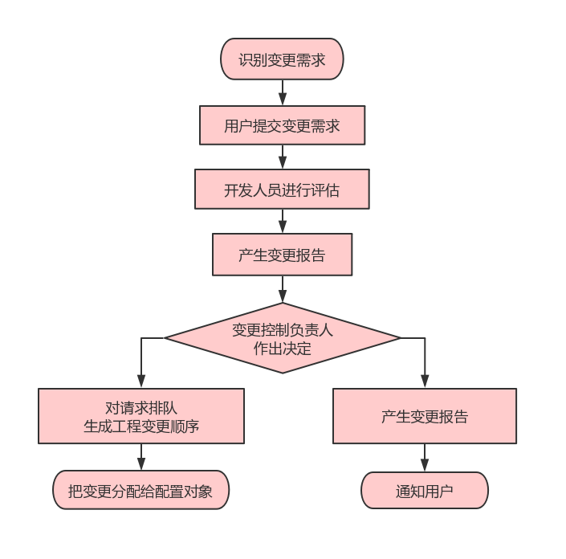
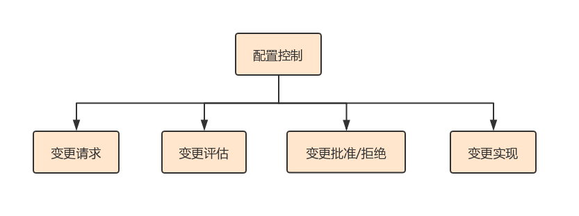
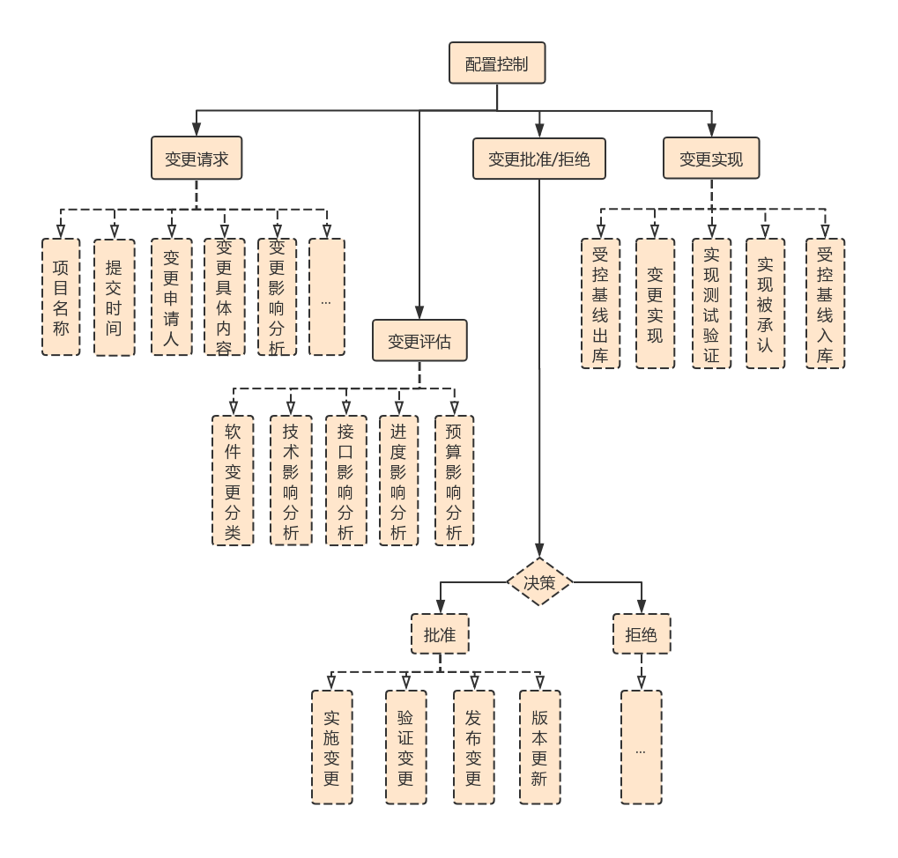

# 谈谈软件配置管理

小明是公司「前端小组」里面的一名开发者，坐在它旁边是另外一个小组：
* 这个小组名为「配置组」。
* 每当小明需要开发新项目或新功能的时候，配置组都会为他创建一个新的代码仓库或新的代码分支。
* 小明在开发过程中写的一些需求分析文档，会提交到配置组指定的文档管理仓库中。
* 在小明完成开发之后，配置组会将他开发的新项目或新功能进行上线。
* 有一天，小明的因为开发环境的一些原因需要开通网络策略，于是就向旁边的配置组小哥寻求了帮助。
* 有一天，小明的项目经理想分析一下生成环境的用户数据，于是写了一封邮件发给了配置组的经理，详细描述了需要什么样的数据，以及使用这个数据是为了达成什么目的。
* 又有一天，...

听说以小明开头的故事都是虚构的，这里也不例外。

举这个例子主要是想表达：
* 在一个软件开发相关的公司内部，一般都会有一个配置小组。
* 这个小组负责管理公司的代码、文档、数据等资产，并保证了公司的软件开发流程的正常运转。

> 当然，具有管理和分配这些资产的人并不一定是配置小组成员，视情况而定。

## 概述

这篇文章的标题是《谈谈软件配置管理》：
* 什么是软件配置管理？
* 软件配置管理是为了达成什么目的？

**首先，回答什么是软件配置管理**

我们将在软件开发过程中产生的一些输出项称为软件配置，这些输出项大概有以下三个类别：
* 计算机程序 (源代码和可执行程序)
* 描述计算机程序的文档 (针对技术开发者和用户)
* 数据 (包含在程序内部和外部)

当软件配置多了，就需要有人进行管理。软件配置管理英文为 `Software Configuration Manager`，可以简称为 `SCM`，它是一种通过对产品变更进行标识、存储和控制，以维护其完整性、可追溯性和正确性的一种技术。

软件配置管理主要分为三个方面：
* 变更控制 (Change Control)：软件是会进行更新迭代的，也就是说会有变更。
* 版本控制 (Version Control)：在迭代过程中，可每次变更后的状态视为一个版本。
* 过程支持 (Process Support)：迭代过程中可能会遇到一些困难或问题，需要相关支持。

**然后，再回答它是为了达成什么哪些目的**

软件配置管理作为一种标识、组织和控制修改的技术，它的主要目的是：
* 记录软件产品的演化过程。
* 确保软件开发者在软件生命周期的各个阶段，都能得到精确的产品配置。
* 最终保证软件产品的完整性、一致性、追溯性和可控性。
* 使错误达到最小，并有效地提高生产效率。

## 角色职责

对于任何一个项目管理流程来说，正常运转需要一些前提条件：
* 项目中有着明确的人员角色、职责和权限的定义。
* 组织内所有人员按照不同的角色要求，并根据被赋予的权限去执行相应的工作。

在软件配置的管理流程中，一般会涉及到以下五个角色：
1. **项目经理**：是整个软件研发活动的负责人，控制着配置管理各项活动的进程。
2. **配置控制委员会**：负责指导和控制配置管理的各项具体活动的进行。
3. **配置管理员**：根据配置项计划执行各项管理任务。
4. **系统集成员**：负责生成和管理项目的内外发布版本。
5. **开发人员**：按照软件配置管理工具的使用模型来完成开发任务。

## 关键活动

整个配置管理过程是围绕着以下几个活动进行的：

* **配置标识**：按照规定统一所有配置项的编号，并以一定的目录结构将其保存在配置库中。
* **工作空间管理**：通过类似于 SVN 或 Git 之类的工具来辅助软件配置，所有开发人员都需要把自己的工作成果提交到对应的配置库中。
* **版本控制**：置于配置库中的所有元素都予以版本标识，并有者相应的访问权限。
* **变更控制**：通过结合人的规程和自动化工具，提供一个变化可控的机制。
* **状态报告**：定期根据配置项操作数据库中的记录，向管理者报告开发活动的进展情况。
* **配置审计**：作为变更控制的补充手段，确保变更的需求都被切实实现了。

## 管理过程

### 变更控制

变更控制是软件配置管理过程中的一个关键活动，其大致流程如下：

在这个流程中，我们需要加强团队成员之间的沟通，来掌握好开发的状态和进程。

> 比如早上开个十分钟的站会，各自简单描述一下今天的工作计划，有没有遇到一些会阻塞开发进度的问题。

一般情况下，变更可分为两种情况：
1. 为修正小错误所进行的变更。
2. 为增加删或除某些功能、或改变现有功能所进行的变更。 

作为变更控制负责人：
* 如果变更的代价比较小且对软件系统其它部分没有影响或影响较小，通常会批准这个变更。
* 但如果变更的代价比较大或影响范围比较广，就必须权衡利弊 (成本/效益)，以决定是否进行该变更的调整。

**基线变更管理**

基线，也就说我们常说的 `Baseline`，它是软件开发过程中各个开发阶段末尾的一个特定点，也称为里程碑。它的存在是为了能够将软件开发过程中的各个阶段划分得更加明确，以便于进行校验，或是肯定阶段成果。

一个 (或一组) 配置项在通过审核之后，就构成了一个相对稳定的逻辑实体，也就是所说的基线。基线中的配置项被冻结之后，项目中的成员都不能对其地进行随意修改。通常情况下，我们可以将交付给客户的基线称为 `Release`，将内部开发用的基线称为 `Build`。

> 基线的主要属性有：名称、标识符、版本和日期等。

因为一些特殊原因，项目的基线也有可能需要进行变更的，比如：客户需求发生了变化、成本或进度做了调整等。基线变更也称为「配置控制」，其流程大致如下：

进一步细化，如下：

### 配置审核

配置审核也是关键活动之一，主要包括两个方面：
* **配置管理审核**：确保项目组成员的所有配置管理活动，都遵循了软件配置管理方针和规程。
* **基线审核**：保证基线的配置项能够正确地进行构造和实现，并且满足了功能要求。

主要有以下四种形式：
* **过程审核**
* **功能审核**：核实软件配置项的实际性能是否符合它的需求。
* **物理审核**：验证软件的功能是否与其设计一致，是否可以发布。
* **质量系统审核**

^_^

功能审核一般由项目经理提出请求，由软件质量工程师计划并实施，步骤如下：
* 准备一个验证表，列出所有功能的需求 (预期)。
* 核实是否已正确实施了所有的变更请求。
* 核实对软件应用的所有更改是否正确。
* 检查文档的差异、建立纠正操作和完成的时间。

> 注：每个需求都需要有对应的测试过程、测试行为实例、相应测试结果以及验证情况的完整分析记录。

物理审核跟随在功能审核之后，一般也是由项目经理提出请求，其计划并实施是由软件质量工程师和项目配置经理共同进行的。

> 在实际开发中，人们一般认为审核是一种事后活动，很容易忽视它。但要注意到，所谓的 “事后” 也是有相对性的。在项目初期审核发现的问题，对项目后期的工作是有指导和参考价值的。

### 配置统计

我们再来讲下配置统计这个关键活动。

在配置统计过程中，我们需要检查配置管理系统以及内容、检测配置项变更历史。检查范围视项目而定，但通常情况下用于计算配置状态的最小数据集应包括：
* 被批准的配置项
* 配置项所有请求的变化状态
* 配置项所有被批准的变更的实现状态

**如何评估一个配置系统的状态？** 

从以下几点入手：
* 变更请求的数量
* 变更请求的历史报告
* 存储量的增长
* 配置管理系统在运作中发生异常的次数

## 总结

在这篇文章中，我们主要是总结了下软件配置管理的理论知识，这些内容主要是参考自网络上的一些文章或词条，然后加上了一些自己的见解。

> 注意：可能跟实际上的、大众理解上的软件配置管理有所差异，请勿模仿。