# Git 快速学习

## 概述

Git 是一个开源的分布式版本控制系统，可以有效地、高效地处理从很小到非常大的项目版本管理。在 Linus 设计 Git 时，就有着以下几个目标：

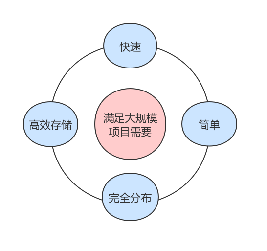

之前我们应该都有用过 SVN 吧，SVN 作为一种集中式版本控制系统，它与 Git 的主要区别是什么？先来看一张图：

> * 集中式版本控制系统：Centralized Version Control Systems 
> * 分布式版本控制系统：Distributed Version Control Systems 

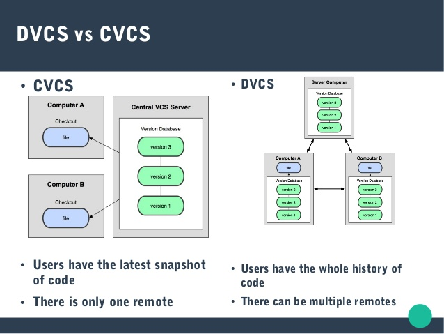

*(图片来源：[https://www.slideshare.net...](https://www.slideshare.net/omidkhosrojerdi/simple-introduction-to-git))*

由上图可以看出：
* 集中式版本控制系统：使用者只有最新代码的快照，并且只有一个部署在服务器端的远程分支。
* 分布式版本控制系统：使用者有着整个仓库的代码及其提交历史记录，而且每个分支都可以有多个远程分支。

与此同时，SVN 和 Git 的工作流程也是不太一样的，看下面两张图：

| CVCS | DVCS
| - | - 
|  | 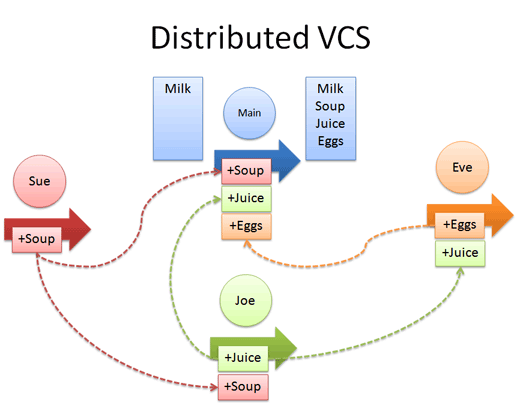


*(图片来源：[https://betterexplained.com...](https://betterexplained.com/articles/intro-to-distributed-version-control-illustrated/))*

由上面两张图可以看出：
* 集中式版本控制系统：每个人都需要同步检查 Main Trunk，比如 `Sue 添加 Soup`、`Joe 添加 Juice` 以及 `Eve 添加 Eggs`。
* 分布式版本控制系统：每个开发者都可以有自己的仓库，比如 Sue 可以在自己的仓库中进行提交操作，同时也可以向 Joe 或 Eggs 分享。

## 常用术语

| 名称 | 英文 | 说明
| - | - | -
| 仓库 | Repository | 受版本控制的所有文件修订历史的共享数据库。
| 工作空间 | Workspace | 本地硬盘或 Unix 用户帐户上编辑的文件副本。
| 工作树 | Working-tree | 工作树中包含了仓库的工作文件，你可以修改这些文件的内容，在将修改方暂存在暂存区之后，就可以提交到仓库。
| 暂存区 | Staging area | 在提交文件内容变更之前，需要将这些修改暂存在暂存区，然后才能提交。
| 索引 | Index | 索引是暂存区的另一种术语。
| 签入 | Checkin | 将新版本复制回仓库。
| 签出 | Checkout | 将仓库中的文件的最新修订版本复制到工作空间。
| 提交 | Commit | 对各自文件的工作副本做了更改，并将这些更改提交到仓库的行为。
| 冲突 | Conflict | 在多人对同一文件的工作副本进行更改后，工具不能自动进行合并操作的情况。
| 合并 | Merge | 将某分支上的更改联接到此主干或同为主干的另一个分支的行为。
| 分支 | Branch | 从主线上分离开的副本，默认分支叫 master。
| 锁 | Lock | 获得修改文件的专有权限。
| 头 | HEAD | 头是一个象征性的参考，用以指向当前选择的分支。
| 修订 | Revision | 表示代码的一个版本状态。Git 通过用 SHA1 Hash 算法表示的 ID 来标识不同的版本。
| 标记 | Tags | 标记指的是某个分支在某个特定时间点的状态。通过标记，我们可以很方便的将代码切换到对应时间点的状态。


## 工作流程

常言道，磨刀不误砍柴工。如果把 “使用 Git” 比喻是砍柴，那把 "了解 Git 工作流程" 比喻是磨刀的行为，毫无违和感。

先来看一张图：

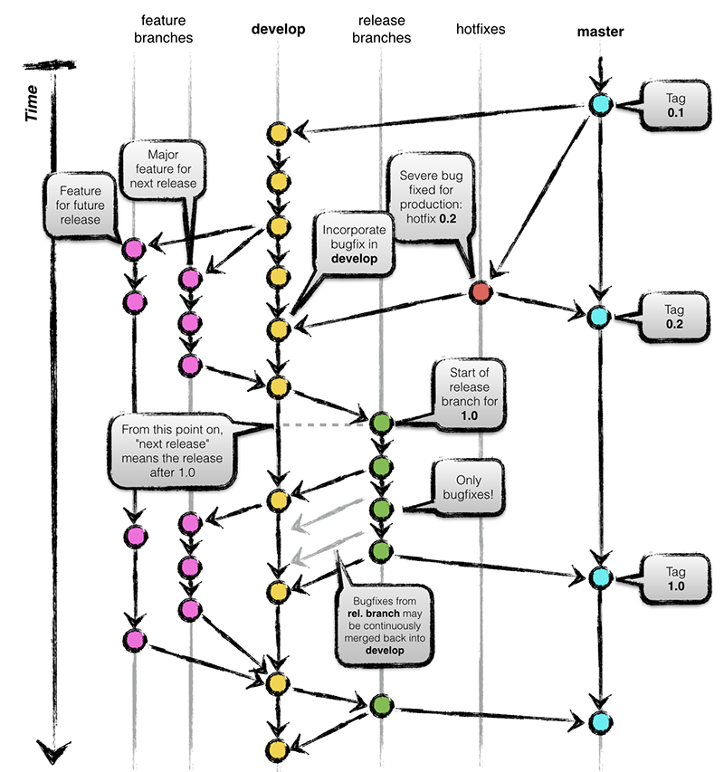

在 Git 工作流程中，一般会创建有 5 种类型的分支：
* `master`：有且仅有一个，用于生产发布的分支。
* `hotfixes`：用于紧急修复生产问题的分支。
* `release branches`：用于发布给测试组进行功能验证的分支。
* `develop`：有且仅有一个，用于进行开发管理的分支。
* `feature`：用于进行功能开发的分支。

这里不会深入讲解 Git 的工作流程，但需要讲一下容易混淆的内容：
* `feature` 分支从 `develop` 分支来，最后也会回到 `develop` 分支中去。
* `develop` 分支合并 `feature` 分支时，说明 `feature` 分支上的功能都已经开发完了，后面不会再在这个分支上进行功能开发。所以，在合并  `feature` 分支之后需要删除掉该分支，并同时在这个合并节点创建出一个 `release` 分支给测试组进行功能验证。
* 测试组在测试过程中发现有 Bug 时，开发人员直接在 `release` 分支上进行修正。在这个测试过程中，我们也可以将修正 Bug 的变更合并回 `develop` 分支。
* 一段时间后，测试组说没问题了可以投产了，这时就可以将 `release` 分支的代码合并回到 `develop` 分支了。与此同时，也将 `release` 分支的代码合并到 `master` 分支，然后打个 `Tag` 并告知配置组：嘿，根据这个 `Tab` 发布生产包吧。

注意：`master` 分支只在第一次创建 `develop` 分支时和紧急修复生产问题时有「读」的操作，在正常的功能迭代中就再也没有「读」操作，只有「写」操作了。


## 开始学习

这部分内容有点长和繁琐，主要分为以下几个部分：

* 帮助
* 配置
* 初始化
* 分支管理
* 功能开发
* 图形界面
* 撤销修改
* 远程分支

在这几个部分的内容中，会穿插这一些示例和命名说明。

### 帮助

不管学啥，最重要的就是官方文档，而 Git 也提供了相关的帮助文档，通过命令就可以进行查看。

```shell
# 查看 Git 的帮助信息
$ git help 

# 查看 Git 所有的帮助信息
$ git help -a

# 查看 Git 具体命令的帮助信息
$ git help add 
```

先来看一下 `git help` :

```shell
[zhuanghongji-mbp:Git zhuanghongji$ git help
usage: git [--version] [--help] [-C <path>] [-c name=value]
           [--exec-path[=<path>]] [--html-path] [--man-path] [--info-path]
           [-p | --paginate | --no-pager] [--no-replace-objects] [--bare]
           [--git-dir=<path>] [--work-tree=<path>] [--namespace=<name>]
           <command> [<args>]

These are common Git commands used in various situations:

start a working area (see also: git help tutorial)
   clone      Clone a repository into a new directory
   init       Create an empty Git repository or reinitialize an existing one

work on the current change (see also: git help everyday)
   add        Add file contents to the index
   mv         Move or rename a file, a directory, or a symlink
   reset      Reset current HEAD to the specified state
   rm         Remove files from the working tree and from the index

examine the history and state (see also: git help revisions)
   bisect     Use binary search to find the commit that introduced a bug
   grep       Print lines matching a pattern
   log        Show commit logs
   show       Show various types of objects
   status     Show the working tree status

grow, mark and tweak your common history
   branch     List, create, or delete branches
   checkout   Switch branches or restore working tree files
   commit     Record changes to the repository
   diff       Show changes between commits, commit and working tree, etc
   merge      Join two or more development histories together
   rebase     Reapply commits on top of another base tip
   tag        Create, list, delete or verify a tag object signed with GPG

collaborate (see also: git help workflows)
   fetch      Download objects and refs from another repository
   pull       Fetch from and integrate with another repository or a local branch
   push       Update remote refs along with associated objects

'git help -a' and 'git help -g' list available subcommands and some
concept guides. See 'git help <command>' or 'git help <concept>'
to read about a specific subcommand or concept.
```

由上面输出的帮助信息可以看出，`git` 有很多种使用形式，一般情况下我们会用到以下三种：
* `git --version`: 输出 Git 的版本信息，比如输出 `git version 2.15.0`。
* `git --help`: 输出 Git 的帮助信息，效果同 `git help`。
* `git <cammand> [<args>]`: 执行 Git 的提供的一些具体命令。

同时，上面的帮助信息也列举了针对各种情况需要使用的一些命令，如下：

**开始工作区域**
* `clone`: 将存储库克隆到新的目录中。
* `init`: 创建一个空的 Git 存储库，或重新初始化现有的存储库。

**处理当前的变化**
* `add`: 将文件内容添加到索引 (暂存区) 中。
* `mv`: 移动或重命名文件、目录或符号链接。
* `reset`: 将当前 HEAD 重置为指定的状态。
* `rm`: 从工作树和索引中删除文件。

**检查历史和状态**
* `bisect`: 使用二进制搜索来查找引入错误的提交。
* `grep`: 打印与 pattern 匹配的 lines。
* `log`: 显示提交日志。
* `show`: 显示各种类型的对象。
* `status`: 显示工作树状态。

**成长，标记和调整你的共同历史**
* `branch`: 列出、创建或删除分支。
* `checkout`: 切换分支，或恢复工作树的文件。
* `commit`: 将更改记录到存储库。
* `merge`: 将两个或多个开发历史连接在一起。
* `rebase`: Reapply commits on top of another base tip。
* `tag`: 创建、列出、删除或验证使用 GPG 签名的标记对象。

**协作**
* `fetch`: 从另一个存储库下载对象和引用。
* `pull`: 从另一个存储库或本地分支中获取并集成。
* `push`: 更新远程引用以及相关联的对象。

再来看下 `git help -a` :

```shell
[zhuanghongji-mbp:Git zhuanghongji$ git help -a
usage: git [--version] [--help] [-C <path>] [-c name=value]
           [--exec-path[=<path>]] [--html-path] [--man-path] [--info-path]
           [-p | --paginate | --no-pager] [--no-replace-objects] [--bare]
           [--git-dir=<path>] [--work-tree=<path>] [--namespace=<name>]
           <command> [<args>]

available git commands in '/usr/local/git/libexec/git-core'

  add                       fsck-objects              receive-pack
  add--interactive          gc                        reflog
  am                        get-tar-commit-id         remote
  annotate                  grep                      remote-ext
  apply                     gui                       remote-fd
  archimport                gui--askpass              remote-ftp
  archive                   hash-object               remote-ftps
  bisect                    help                      remote-http
  bisect--helper            http-backend              remote-https
  blame                     http-fetch                remote-testsvn
  branch                    http-push                 repack
  bundle                    imap-send                 replace
  cat-file                  index-pack                request-pull
  check-attr                init                      rerere
  check-ignore              init-db                   reset
  check-mailmap             instaweb                  rev-list
  check-ref-format          interpret-trailers        rev-parse
  checkout                  log                       revert
  checkout-index            ls-files                  rm
  cherry                    ls-remote                 send-email
  cherry-pick               ls-tree                   send-pack
  citool                    mailinfo                  sh-i18n--envsubst
  clean                     mailsplit                 shell
  clone                     merge                     shortlog
  column                    merge-base                show
  commit                    merge-file                show-branch
  commit-tree               merge-index               show-index
  config                    merge-octopus             show-ref
  count-objects             merge-one-file            stage
  credential                merge-ours                stash
  credential-cache          merge-recursive           status
  credential-cache--daemon  merge-resolve             stripspace
  credential-store          merge-subtree             submodule
  cvsexportcommit           merge-tree                submodule--helper
  cvsimport                 mergetool                 subtree
  cvsserver                 mktag                     svn
  daemon                    mktree                    symbolic-ref
  describe                  mv                        tag
  diff                      name-rev                  unpack-file
  diff-files                notes                     unpack-objects
  diff-index                p4                        update-index
  diff-tree                 pack-objects              update-ref
  difftool                  pack-redundant            update-server-info
  difftool--helper          pack-refs                 upload-archive
  fast-export               patch-id                  upload-pack
  fast-import               prune                     var
  fetch                     prune-packed              verify-commit
  fetch-pack                pull                      verify-pack
  filter-branch             push                      verify-tag
  fmt-merge-msg             quiltimport               web--browse
  for-each-ref              read-tree                 whatchanged
  format-patch              rebase                    worktree
  fsck                      rebase--helper            write-tree

git commands available from elsewhere on your $PATH

  credential-osxkeychain

'git help -a' and 'git help -g' list available subcommands and some
concept guides. See 'git help <command>' or 'git help <concept>'
to read about a specific subcommand or concept.
```

由上面的输出信息可以看出，`git help -a` 其实是简简单的列出了 Git 支持的所有命令，并没有输出命令对应的说明，那么我们应该怎样查看具体 Git 命令的信息呢？通过 `git help [command]` 即可。

比如我们想查看 `add` 命令的信息：

```
GIT-ADD(1)                          Git Manual                         GIT-ADD(1)

NAME
       git-add - Add file contents to the index

SYNOPSIS
       git add [--verbose | -v] [--dry-run | -n] [--force | -f] [--interactive | -i] [--pa
tch | -p]
                 [--edit | -e] [--[no-]all | --[no-]ignore-removal | [--update | -u]]
                 [--intent-to-add | -N] [--refresh] [--ignore-errors] [--ignore-missing]
                 [--chmod=(+|-)x] [--] [<pathspec>...]

DESCRIPTION
       This command updates the index using the current content found in the
       working tree, to prepare the content staged for the next commit. It
       typically adds the current content of existing paths as a whole, but with
       some options it can also be used to add content with only part of the
       changes made to the working tree files applied, or remove paths that do
       not exist in the working tree anymore.

       The "index" holds a snapshot of the content of the working tree, and it is
       this snapshot that is taken as the contents of the next commit. Thus after
       making any changes to the working tree, and before running the commit
       command, you must use the add command to add any new or modified files to
       the index.

       This command can be performed multiple times before a commit. It only adds
       the content of the specified file(s) at the time the add command is run;
       if you want subsequent changes included in the next commit, then you must
       run git add again to add the new content to the index.

       The git status command can be used to obtain a summary of which files have
       changes that are staged for the next commit.

       The git add command will not add ignored files by default. If any ignored
       files were explicitly specified on the command line, git add will fail
       with a list of ignored files. Ignored files reached by directory recursion
       or filename globbing performed by Git (quote your globs before the shell)
       will be silently ignored. The git add command can be used to add ignored
       files with the -f (force) option.

       Please see git-commit(1) for alternative ways to add content to a commit.

OPTIONS
       <pathspec>...
           Files to add content from. Fileglobs (e.g.  *.c) can be given to add
           all matching files. Also a leading directory name (e.g.  dir to add
           dir/file1 and dir/file2) can be given to update the index to match the
           current state of the directory as a whole (e.g. specifying dir will
           record not just a file dir/file1 modified in the working tree, a file
           dir/file2 added to the working tree, but also a file dir/file3 removed
           from the working tree. Note that older versions of Git used to ignore
           removed files; use --no-all option if you want to add modified or new
           files but ignore removed ones.

           For more details about the <pathspec> syntax, see the pathspec entry
           in gitglossary(7).

       -n, --dry-run
           Don't actually add the file(s), just show if they exist and/or will be
           ignored.

       -v, --verbose
           Be verbose.

       -f, --force
           Allow adding otherwise ignored files.

       -i, --interactive
           Add modified contents in the working tree interactively to the index.
           Optional path arguments may be supplied to limit operation to a subset
           of the working tree. See "Interactive mode" for details.

       -p, --patch
           Interactively choose hunks of patch between the index and the work
           tree and add them to the index. This gives the user a chance to review
           the difference before adding modified contents to the index.

           This effectively runs add --interactive, but bypasses the initial
           command menu and directly jumps to the patch subcommand. See
           "Interactive mode" for details.

       -e, --edit
           Open the diff vs. the index in an editor and let the user edit it.
           After the editor was closed, adjust the hunk headers and apply the
           patch to the index.

           The intent of this option is to pick and choose lines of the patch to
           apply, or even to modify the contents of lines to be staged. This can
           be quicker and more flexible than using the interactive hunk selector.
           However, it is easy to confuse oneself and create a patch that does
           not apply to the index. See EDITING PATCHES below.

       -u, --update
           Update the index just where it already has an entry matching
           <pathspec>. This removes as well as modifies index entries to match
           the working tree, but adds no new files.

           If no <pathspec> is given when -u option is used, all tracked files in
           the entire working tree are updated (old versions of Git used to limit
           the update to the current directory and its subdirectories).

       -A, --all, --no-ignore-removal
           Update the index not only where the working tree has a file matching
           <pathspec> but also where the index already has an entry. This adds,
           modifies, and removes index entries to match the working tree.

           If no <pathspec> is given when -A option is used, all files in the
           entire working tree are updated (old versions of Git used to limit the
           update to the current directory and its subdirectories).

       --no-all, --ignore-removal
           Update the index by adding new files that are unknown to the index and
           files modified in the working tree, but ignore files that have been
           removed from the working tree. This option is a no-op when no
           <pathspec> is used.

           This option is primarily to help users who are used to older versions
           of Git, whose "git add <pathspec>..." was a synonym for "git add
           --no-all <pathspec>...", i.e. ignored removed files.

       -N, --intent-to-add
           Record only the fact that the path will be added later. An entry for
           the path is placed in the index with no content. This is useful for,
           among other things, showing the unstaged content of such files with
           git diff and committing them with git commit -a.

       --refresh
           Don't add the file(s), but only refresh their stat() information in
           the index.

       --ignore-errors
           If some files could not be added because of errors indexing them, do
           not abort the operation, but continue adding the others. The command
           shall still exit with non-zero status. The configuration variable
           add.ignoreErrors can be set to true to make this the default
           behaviour.

       --ignore-missing
           This option can only be used together with --dry-run. By using this
           option the user can check if any of the given files would be ignored,
           no matter if they are already present in the work tree or not.

       --no-warn-embedded-repo
           By default, git add will warn when adding an embedded repository to
           the index without using git submodule add to create an entry in
           .gitmodules. This option will suppress the warning (e.g., if you are
           manually performing operations on submodules).

       --chmod=(+|-)x
           Override the executable bit of the added files. The executable bit is
           only changed in the index, the files on disk are left unchanged.

       --
           This option can be used to separate command-line options from the list
           of files, (useful when filenames might be mistaken for command-line
           options).

CONFIGURATION
       The optional configuration variable core.excludesFile indicates a path to
       a file containing patterns of file names to exclude from git-add, similar
       to $GIT_DIR/info/exclude. Patterns in the exclude file are used in
       addition to those in info/exclude. See gitignore(5).

EXAMPLES
       o   Adds content from all *.txt files under Documentation directory and
           its subdirectories:

               $ git add Documentation/\*.txt

           Note that the asterisk * is quoted from the shell in this example;
           this lets the command include the files from subdirectories of
           Documentation/ directory.

       o   Considers adding content from all git-*.sh scripts:

               $ git add git-*.sh

           Because this example lets the shell expand the asterisk (i.e. you are
           listing the files explicitly), it does not consider subdir/git-foo.sh.

INTERACTIVE MODE
       When the command enters the interactive mode, it shows the output of the
       status subcommand, and then goes into its interactive command loop.

       The command loop shows the list of subcommands available, and gives a
       prompt "What now> ". In general, when the prompt ends with a single >, you
       can pick only one of the choices given and type return, like this:

               *** Commands ***
                 1: status       2: update       3: revert       4: add untracked
                 5: patch        6: diff         7: quit         8: help
               What now> 1

       You also could say s or sta or status above as long as the choice is
       unique.

       The main command loop has 6 subcommands (plus help and quit).

       status
           This shows the change between HEAD and index (i.e. what will be
           committed if you say git commit), and between index and working tree
           files (i.e. what you could stage further before git commit using git
           add) for each path. A sample output looks like this:

                             staged     unstaged path
                    1:       binary      nothing foo.png
                    2:     +403/-35        +1/-1 git-add--interactive.perl

           It shows that foo.png has differences from HEAD (but that is binary so
           line count cannot be shown) and there is no difference between indexed
           copy and the working tree version (if the working tree version were
           also different, binary would have been shown in place of nothing). The
           other file, git-add--interactive.perl, has 403 lines added and 35
           lines deleted if you commit what is in the index, but working tree
           file has further modifications (one addition and one deletion).

       update
           This shows the status information and issues an "Update>>" prompt.
           When the prompt ends with double >>, you can make more than one
           selection, concatenated with whitespace or comma. Also you can say
           ranges. E.g. "2-5 7,9" to choose 2,3,4,5,7,9 from the list. If the
           second number in a range is omitted, all remaining patches are taken.
           E.g. "7-" to choose 7,8,9 from the list. You can say * to choose
           everything.

           What you chose are then highlighted with *, like this:

                          staged     unstaged path
                 1:       binary      nothing foo.png
               * 2:     +403/-35        +1/-1 git-add--interactive.perl

           To remove selection, prefix the input with - like this:

               Update>> -2

           After making the selection, answer with an empty line to stage the
           contents of working tree files for selected paths in the index.

       revert
           This has a very similar UI to update, and the staged information for
           selected paths are reverted to that of the HEAD version. Reverting new
           paths makes them untracked.

       add untracked
           This has a very similar UI to update and revert, and lets you add
           untracked paths to the index.

       patch
           This lets you choose one path out of a status like selection. After
           choosing the path, it presents the diff between the index and the
           working tree file and asks you if you want to stage the change of each
           hunk. You can select one of the following options and type return:

               y - stage this hunk
               n - do not stage this hunk
               q - quit; do not stage this hunk or any of the remaining ones
               a - stage this hunk and all later hunks in the file
               d - do not stage this hunk or any of the later hunks in the file
               g - select a hunk to go to
               / - search for a hunk matching the given regex
               j - leave this hunk undecided, see next undecided hunk
               J - leave this hunk undecided, see next hunk
               k - leave this hunk undecided, see previous undecided hunk
               K - leave this hunk undecided, see previous hunk
               s - split the current hunk into smaller hunks
               e - manually edit the current hunk
               ? - print help

           After deciding the fate for all hunks, if there is any hunk that was
           chosen, the index is updated with the selected hunks.

           You can omit having to type return here, by setting the configuration
           variable interactive.singleKey to true.

       diff
           This lets you review what will be committed (i.e. between HEAD and
           index).

EDITING PATCHES
       Invoking git add -e or selecting e from the interactive hunk selector will
       open a patch in your editor; after the editor exits, the result is applied
       to the index. You are free to make arbitrary changes to the patch, but
       note that some changes may have confusing results, or even result in a
       patch that cannot be applied. If you want to abort the operation entirely
       (i.e., stage nothing new in the index), simply delete all lines of the
       patch. The list below describes some common things you may see in a patch,
       and which editing operations make sense on them.

       added content
           Added content is represented by lines beginning with "+". You can
           prevent staging any addition lines by deleting them.

       removed content
           Removed content is represented by lines beginning with "-". You can
           prevent staging their removal by converting the "-" to a " " (space).

       modified content
           Modified content is represented by "-" lines (removing the old
           content) followed by "+" lines (adding the replacement content). You
           can prevent staging the modification by converting "-" lines to " ",
           and removing "+" lines. Beware that modifying only half of the pair is
           likely to introduce confusing changes to the index.

       There are also more complex operations that can be performed. But beware
       that because the patch is applied only to the index and not the working
       tree, the working tree will appear to "undo" the change in the index. For
       example, introducing a new line into the index that is in neither the HEAD
       nor the working tree will stage the new line for commit, but the line will
       appear to be reverted in the working tree.

       Avoid using these constructs, or do so with extreme caution.

       removing untouched content
           Content which does not differ between the index and working tree may
           be shown on context lines, beginning with a " " (space). You can stage
           context lines for removal by converting the space to a "-". The
           resulting working tree file will appear to re-add the content.

       modifying existing content
           One can also modify context lines by staging them for removal (by
           converting " " to "-") and adding a "+" line with the new content.
           Similarly, one can modify "+" lines for existing additions or
           modifications. In all cases, the new modification will appear reverted
           in the working tree.

       new content
           You may also add new content that does not exist in the patch; simply
           add new lines, each starting with "+". The addition will appear
           reverted in the working tree.

       There are also several operations which should be avoided entirely, as
       they will make the patch impossible to apply:

       o   adding context (" ") or removal ("-") lines

       o   deleting context or removal lines

       o   modifying the contents of context or removal lines

SEE ALSO
       git-status(1) git-rm(1) git-reset(1) git-mv(1) git-commit(1) git-update-
       index(1)

GIT
       Part of the git(1) suite

Git 2.15.0                          10/30/2017                         GIT-ADD(1)
```

可以看到，官方帮助文档中对具体命令的使用描述得非常详细，当然，你也可以理解成繁琐。

> 为避免你再有繁琐的感觉，后面我们讲述的内容都有意地避开了一些细节，以方便初学者快速的学习和应用 Git 进行代码管理。


### 配置

别急，在开始创建仓库之前，我们先来了解 Git 仓库相关的配置知识。

```shell
# 查看当前仓库的 Git 配置
$ git config -l

# 查看全局的 Git 配置
$ git config --global -l 

# 设置全局下的 Git 用户名
$ git config --global user.name "Your Name"

# 设置全局下的 Git 用户邮箱
$ git config --global user.email "email@example.com"
```

下面我们执行 "查看全局的 Git 配置" 命令，来看下都有哪些配置项：

```shell
zhuanghongji-mbp:Git zhuanghongji$ git config --global -l 
filter.lfs.clean=git-lfs clean -- %f
filter.lfs.smudge=git-lfs smudge -- %f
filter.lfs.process=git-lfs filter-process
filter.lfs.required=true
user.name=zhuanghongji
user.email=zhuanghongji.com@gmail.com
core.autocrlf=input
http.postbuffer=524288000
```

接着我们尝试修改全局下的用户名和邮箱，看看有木有生效：

```shell
zhuanghongji-mbp:Git zhuanghongji$ git config --global user.name "zhangsan"
zhuanghongji-mbp:Git zhuanghongji$ git config --global user.email "zhangsan@gmail.com"
zhuanghongji-mbp:Git zhuanghongji$ git config --global -l
filter.lfs.clean=git-lfs clean -- %f
filter.lfs.smudge=git-lfs smudge -- %f
filter.lfs.process=git-lfs filter-process
filter.lfs.required=true
user.name=zhangsan
user.email=zhangsan@gmail.com
core.autocrlf=input
http.postbuffer=524288000
```

嗯，修改生效了。


### 初始化

到目前为止，我们已经学会如何利用官方文档来查看一些帮助内容，以及如何查看或修改 Git 的配置信息。

所以，是时候来创建一个仓库了：

> * 假设你是一个熟悉 JavaScript 的开发者，
> * 假设你已在电脑上安装了 VS Code 等开发工具，
> * 假设你创建仓库的目的是为了写一个类似计算器功能的程序。

```shell
zhuanghongji-mbp:Git zhuanghongji$ git init Calculator
Initialized empty Git repository in /Users/zhuanghongji/Documents/Develop/Git/Calculator/.git/
```

在上面的示例中，我们通过 `git init Calculator` 从零创建了一个 Git 仓库，而且 Git 自动帮我创建了一个 `Calculator` 及该目录下的一个 `.git` 文件。然后，我们执行 `cd Calculator` 和 `code ./` 来打开该仓库：

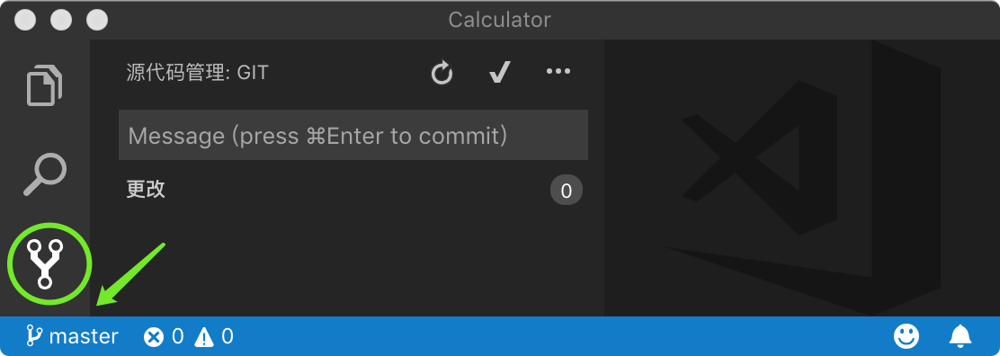

可以看到，VS Code 已经默认集成 Git 版本管理，并且左下角也显示我们当前是处于 `master` 分支。很是方便，所以在后面的演示，增删或修改文件，甚至是 `Git` 相关命令的执行的执行我们都是在 VS Code 中进行的。

创建 Git 仓库还有一些其它方法，比如我们本来已经有一个 `Calculator2` 目录了，我们只是想在将该目录直接初始化为一个 Git 仓库，这时我们只需要通过 `cd Calculator2` 命令进入该目录然后再执行 `git init` 命令即可。

还有一种情况，我们在服务器端已经有一个 Git 仓库了，这时我们怎么将这个仓库弄到本地呢？假设该仓库的地址是 `https://github.com/zhuanghongji/calculator3.git`，那么我们只需要执行下面的命令即可：

```shell
# 将服务端的 Git 仓库克隆到本地
$ git clone https://github.com/zhuanghongji/calculator3.git
```

此时本地就会自动生成一个目录名为 `calculator3` 的 Git 仓库，并且拥着这个仓库中的所有文件和提交历史记录。有人会想，`calculator3` 这个目录名我不喜欢，我能不能换一个？当然可以，你只需在 `git clone ..` 命令的最后加上你想要的目录名即可，比如：

```shell
# 将服务端的 Git 仓库克隆到本地，并重命名
$ git clone https://github.com/zhuanghongji/calculator3.git MyCaculator
```

注意：Git 的分支必须指向一个 Commit，所以刚初始化的 Git 仓库是没有任何分支的。不相信的话，你可以执行 `git branch` 命令，然后会发现没有任何输出信息。

在使用 GitHub 时，我们一般都会在创建仓库的时候自动初始化一个 README.md 文件。到目前为止，我们还没有用到 GitHub 相关功能，所以先来手动增加一个 README.md 文件吧：

```shell
zhuanghongji-mbp:Calculator zhuanghongji$ touch README.md
zhuanghongji-mbp:Calculator zhuanghongji$ vi README.md 
# 输入以下内容，然后 `:wq!` 写入并结束编辑
# # Caculator 
#
# This is a git example repo.
```

现在我们已经在工作空间中增加一个文件，也就是说已经发生了变更。但我们还不能进行提交相关的操作，因为在 Git 中有个暂存区的概念，我们必须先将变更从工作空间中添加到暂存区，然后才能进行提交操作。

Git 提供了一些处理现有变更的命令：

```shell
# 查看当前工作空间的状态
$ git status

# 将变更文件增加到暂存区
$ git add <file>...

# 将暂存区中的文件移除掉
$ git rm --cached <file>...

# 提交暂存区的变更到仓库，-m 后面是提交说明的内容
$ git commit -m ”Commit Message“

# 查看提交记录
$ git log
```

下面我们来实践一下：

```shell
zhuanghongji-mbp:Caculator zhuanghongji$ git status
On branch master

No commits yet

Untracked files:
  (use "git add <file>..." to include in what will be committed)

        README.md

nothing added to commit but untracked files present (use "git add" to track)
```

上面的输出的状态信息说：
* 当前是在 master 分支。
* 暂时没有提交记录。
* 有一个未跟踪的文件，你可以通过 `git add <file>...` 命令来将其加入可进行提交的暂存区中。

好，我们现在就将 README.md 文件加入暂存区：

```shell
zhuanghongji-mbp:Caculator zhuanghongji$ git add README.md 
zhuanghongji-mbp:Caculator zhuanghongji$ git status
On branch master

No commits yet

Changes to be committed:
  (use "git rm --cached <file>..." to unstage)

        new file:   README.md

```

在将 README.md 文件加入暂存区之后，发现输出的状态信息发生了点变化：
* 有变更可以提交，这个变更是增加了个名为 README.md 的新文件。
* 你可以通过 `git rm --cached <file>...` 命令来将这个变更文件从暂存区中移除。

哎哟，有点意思。我们来玩下这个移除命令：

```shell
zhuanghongji-mbp:Caculator zhuanghongji$ git rm --cached README.md 
rm 'README.md'
zhuanghongji-mbp:Caculator zhuanghongji$ git status
On branch master

No commits yet

Untracked files:
  (use "git add <file>..." to include in what will be committed)

        README.md

```

哈，好玩，状态信息又说我们有未加入暂存区的文件了。

不行，不能再玩了，在玩的话这篇文章就写不完了。现在我们再次将该文件添加到暂存区，并正式执行一次提交操作：

```shell
zhuanghongji-mbp:Caculator zhuanghongji$ git commit -m "Add README.md"
[master (root-commit) 0b99c57] Add README.md
 1 file changed, 3 insertions(+)
 create mode 100644 README.md
```

上面的输出信息告诉我们：
* 我们现在真的有一个 master (root-comit) 分支了。
* 这个提交操作导致了 `1 个文件变更，3 处插入 (+)`。

这时我们再执行 `git branch` 命令时，仓库就能正确的输出分支信息了：

```shell
zhuanghongji-mbp:Caculator zhuanghongji$ git branch
* master
```

呃.. 好像忘记讲 `git log` 命令了：

```shell
zhuanghongji-mbp:Caculator zhuanghongji$ git log
commit 0b99c570ea25fdc454a3c4c62ac7550f66053989 (HEAD -> master)
Author: zhuanghongji <zhuanghongji.com@gmail.com>
Date:   Sun Apr 28 21:44:23 2019 +0800

    Add README.md
```

上面的输出信息告诉我们：
* 在 `Sun Apr 28 21:44:23 2019 +0800` 这个时间点，有个名为 `zhuanghongji` 和邮箱为 `zhuanghongji.com@gmail.com` 的哥们做了一次提交操作。
* 另外，这个哥们在进行提交操作时也附带了提交说明：`Add README.md`。


### 分支管理

在前面的 "Git 工作流程" 中，我们讲到了分支的概念，所以在这一小节中我们就来讲讲 Git 中的分支管理。

Git 提供了一些用于管理分支的命令：

```shell
# 查看当前分支
$ git branch

# 创建一个分支
$ git branch <branchname>

# 切换到某个分支
$ git checkout <branchname>

# 创建一个分支并切换到该分支 (上述两步的合并操作)
$ git checkout -b <branchname>

# 合并某个分支到当前分支
$ git merge <branchname>

# 删除某个分支
$ git branch -d <branchname>
```

我们来尝试创建一个名为 `develop` 的分支并立即进行切换：

```shell
zhuanghongji-mbp:Caculator zhuanghongji$ git checkout -b develop
Switched to a new branch 'develop'
zhuanghongji-mbp:Caculator zhuanghongji$ git branch
* develop
  master
```

由上面的输出信息可以看出，我们已经成功创建了 `develop` 分支并立即切换到了这个新分支。在执行 `git branch` 之后，输出了当前所有的分支名称，标识有 `*` 符号的分支表示该分支是当前分支。另外，如果你仔细看 VS Code 的左下角就会发现，且我们切换分支的同时它显示内容也变了：

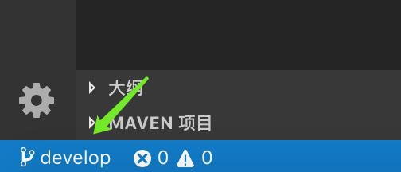

开发分支创建好了，我们还需要一个 `feature` 分支进行功能开发。所以我们接下来需要创建一个名为 `feature_sum` 的功能分支，以便开发人员进行计算器的 "加运算" 功能开发：

```shell
zhuanghongji-mbp:Calculator zhuanghongji$ git branch feature_sum
zhuanghongji-mbp:Calculator zhuanghongji$ git checkout feature_sum
Switched to branch 'feature_sum'
zhuanghongji-mbp:Caculator zhuanghongji$ git branch
  develop
* feature_sum
  master
```

我们再来看一下 VS Code 的坐下角，发现内容又变了。到这里你应该明白了吧，VS Code 左下角显示的信息就是 "当前分支的名称"。

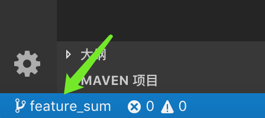

> 注：如果你点击该显示区域，是可以进行分支快速切换的。


### 功能开发

功能分支 `feature_sum` 创建好了，开发人员也应该开始动手了。

一顿猛如虎的噼噼啪啪操作后，代码写好了。开发的哥们创建一个名为 `index.js` 代码文件，并编写好了 "加运算" 的相关代码：

```js
// This is index.js

function sum(a, b) {
  return a + b;
}
```

接着，开发哥们自己测了下发现没问题，于是想将这个变更提交到 `feature_sum` 分支：

```shell
zhuanghongji-mbp:Caculator zhuanghongji$ git add .
zhuanghongji-mbp:Caculator zhuanghongji$ git commit -m "Add index.js and sum operation finished"
[feature_sum 2aa9197] Add index.js and sum operation finished
 1 file changed, 5 insertions(+)
 create mode 100644 index.js
```

嗯，功能完成了，代码也提交了，坐等提测。

铛铛铛，项目经理发现今天提测试了。于是经理先是切换到了 `develop` 分支，然后再将 `feature_sum` 分支的代码合并过来，操作如下：

```shell
zhuanghongji-mbp:Caculator zhuanghongji$ git checkout develop
Switched to branch 'develop'
zhuanghongji-mbp:Caculator zhuanghongji$ git merge feature_sum --no-ff
Merge made by the 'recursive' strategy.
 index.js | 5 +++++
 1 file changed, 5 insertions(+)
 create mode 100644 index.js
zhuanghongji-mbp:Caculator zhuanghongji$ git log
commit 3bc4c15ba32c9b1d10674fc4cdf964a6a5bf89fa (HEAD -> develop)
Merge: 0b99c57 2aa9197
Author: zhuanghongji <zhuanghongji.com@gmail.com>
Date:   Sun Apr 28 22:42:25 2019 +0800

    Merge branch 'feature_sum' into develop

commit 2aa9197b1acc118bedcaa7eba6fb5dfa11a5fbdd (feature_sum)
Author: zhuanghongji <zhuanghongji.com@gmail.com>
Date:   Sun Apr 28 22:41:37 2019 +0800

    Add index.js and sum operation finished

commit 0b99c570ea25fdc454a3c4c62ac7550f66053989 (master)
Author: zhuanghongji <zhuanghongji.com@gmail.com>
Date:   Sun Apr 28 21:44:23 2019 +0800

    Add README.md
```

由 `git log` 命令的输出信息可以看出，我们不仅是将 `feature_sum` 分支的代码合并过来，连同 `feature_sum` 分支的提交记录也一起合并过来了。与此同时，因为经理在执行 `merge` 命令时增加了个 `--no-ff` 参数，所以合并成功之后也产生了一条合并记录：`Merge branch 'feature_sum' into develop`。

既然 `feature_sum` 的东西都合并过来了，就不留着它过年了：

```shell
zhuanghongji-mbp:Caculator zhuanghongji$ git branch -d feature_sum
Deleted branch feature_sum (was 2aa9197).
zhuanghongji-mbp:Caculator zhuanghongji$ git branch
* develop
  master
```

在经理删除 `feature_sum` 分支之后，可以看到当前仓库只剩下 `develop` 和 `master` 这两个分支了。

紧接着，经理创建了一个名为 `release_sum` 的分支以便测试进行功能验证：

```shell
zhuanghongji-mbp:Caculator zhuanghongji$ git checkout -b release_sum
Switched to a new branch 'release_sum'
zhuanghongji-mbp:Caculator zhuanghongji$ git branch
  develop
  master
* release_sum
```

啧啧，经理泡了杯咖啡，坐等测试完毕。

测试组开始测试..

```js
// ...

// 模拟测试
console.log(sum(2, 3) == 5)
```

```shell
zhuanghongji-mbp:Caculator zhuanghongji$ node index.js
true
```

铛铛铛.. 功能正常，测试通过！ 

于是经理放下手中的咖啡，又是一段操作：

```shell
zhuanghongji-mbp:Caculator zhuanghongji$ git checkout master
Switched to branch 'master'
zhuanghongji-mbp:Caculator zhuanghongji$ git merge release_sum
Updating 0b99c57..3bc4c15
Fast-forward
 index.js | 5 +++++
 1 file changed, 5 insertions(+)
 create mode 100644 index.js
zhuanghongji-mbp:Caculator zhuanghongji$ git tag "V1.0"
zhuanghongji-mbp:Caculator zhuanghongji$ git log
commit 3bc4c15ba32c9b1d10674fc4cdf964a6a5bf89fa (HEAD -> master, tag: V1.0, release_sum, develop)
Merge: 0b99c57 2aa9197
Author: zhuanghongji <zhuanghongji.com@gmail.com>
Date:   Sun Apr 28 22:42:25 2019 +0800

    Merge branch 'feature_sum' into develop

commit 2aa9197b1acc118bedcaa7eba6fb5dfa11a5fbdd
Author: zhuanghongji <zhuanghongji.com@gmail.com>
Date:   Sun Apr 28 22:41:37 2019 +0800

    Add index.js and sum operation finished

commit 0b99c570ea25fdc454a3c4c62ac7550f66053989
Author: zhuanghongji <zhuanghongji.com@gmail.com>
Date:   Sun Apr 28 21:44:23 2019 +0800

    Add README.md
```

在这段操作中，经理将 `release_sum` 分支的东西都合并到了 `master` 分支，然后通过 `git tag` 命令在当前合并的这个节点打了一个名为 `V1.0` 的标签。注意，在这段操作的 `merge` 命令中我们故意不使用 `--no-ff` 参数，所以当经理执行 `git log` 的时候，我们看不到 "合并操作" 这个提交记录。

> 在实际开发过程中的合并操作，我们应尽可能多的使用 `--no-ff` 参数，这样 `master` 或其它分支的提交记录就更加清晰点，同时也方便我们在必要时进行回退操作。比如说，因为一些原因，我们需要回退到之前合并的那个版本..

然后，经理发了个邮件给配置小组，说："配置组小哥，你们可以根据 `master` 分支的 `V1.0` 标签发布生产包了"。

再然后，经理回到命令行界面，删除了 `release_sum` 分支，并将当前分支切换回了 `develop` 分支：

```shell
zhuanghongji-mbp:Caculator zhuanghongji$ git branch -d release_sum
Deleted branch release_sum (was 3bc4c15).
zhuanghongji-mbp:Caculator zhuanghongji$ git checkout develop
Switched to branch 'develop'
```

最后，经理拿起桌上的咖啡并戴上了刚买的 AirDrop 耳机，坐等需求..


### 图形界面

号外，号外.. 

经理刚才想起来 Git 也是支持图形界面的，于是就把面前的笔记本电脑放到了开发小哥面前，然后说："需求都开发完了，要不你给大伙儿演示下如何使用 Git 的图形界面 ？"

经理都这样说了，开发小哥能拒绝？于是马上在命令行窗口中输入了 `gitk`，然后用力敲了下 `Enter` 键。神奇的事情发生了，电脑桌面上弹出了一个窗口：

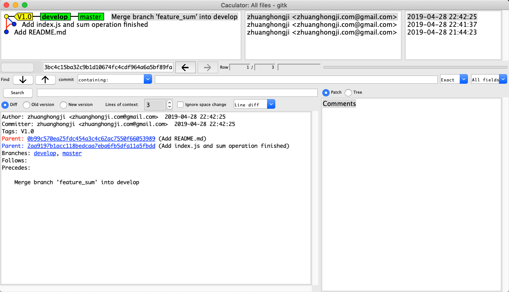

`gitk` 是一个强悍的 Git 图形化工具。它可不仅仅是 Git 命令行的一个简单替代，在实际使用中你会发现，它能实现很多命令行不能提供功能。

下面做一下简单的介绍：

**颜色和字体**：
* 黄色背景：表示是 Tab 标签。
* 绿色背景：表示是本地分支。
* 混合橘色绿色的背景：表示是远程分支。
* 黄色圆点：表示是当前的 HEAD。
* 字体加粗：表示是当前分支。

**代码库操作**：
* 右键单击分支名称：可进行修改分支名称、删除分支等操作。
* 右键单击提交信息：可进行查看 Diff、创建 Tag、创建分支等操作。


**主菜单**：
* `Reload`：重新加载相关内容。
* `Start git gui`：启动 Git Gui。

比如我们在 `index.js` 文件中随意做了点变更，然后通过主菜单中的 `Start git gui` 选项启动了 Git Gui，截图如下：

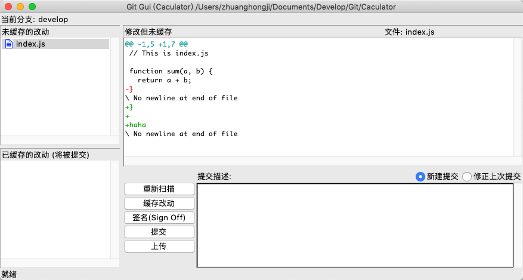

然后点击 `缓存改动` 按钮，并填写 `提交描述`：

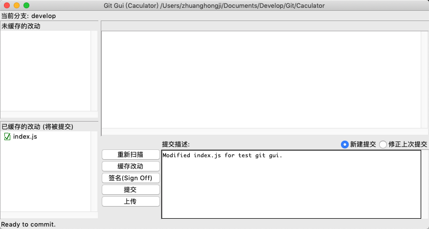

最后，点击 `提交` 按钮执行提交操作：

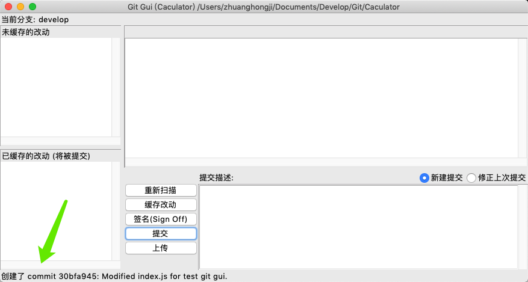

由上图左下角可以看出我们已经进行了 `index.js` 文件的变更提交，如果你还想确认一下，可以回到 gitk 窗口中，然后点击主菜单中的 `Reload` 选项：

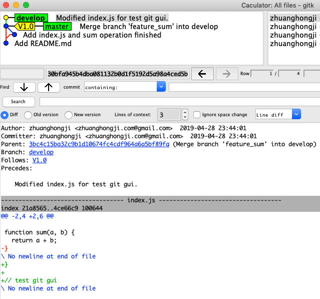

从 reload 之后的 gitk 窗口中，我们可以在提交记录中看到我们刚才在 `Git Gui` 中做的提交操作的记录。也可以看到在这次提交操作中，我们是对哪个文件、做了哪些变更的信息。


### 撤销修改