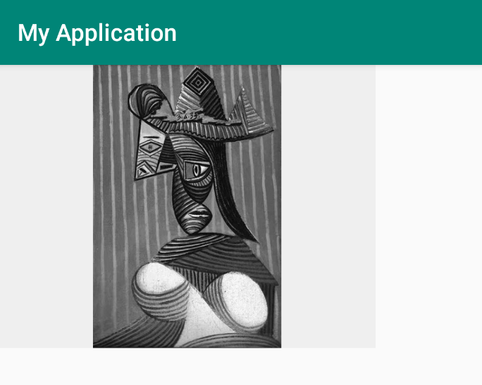

# Picasso 基本使用

## 概述

[Picasso](https://github.com/square/picasso) 是美国一家移动支付公司 Square 开源出来的图片加载库，在其 [官方文档](http://square.github.io/picasso/) 中是这样描述它的：

```
A powerful image downloading and caching library for Android.
```

正如官方文档所述，Picasso 确实是 Android 平台上一个强大的图片下载和缓存库，并且在使用上简介方便，允许你仅通过一行代码来轻松加载图片。比如：

```java
Picasso.get().load("an_image_url").into(imageView);
```

在这行代码执行过程中，Picasso 会自动帮你处理好 Android 平台上图片加载的一些缺，比如：
* 在 Adapter 中处理 `ImageView` 的回收和取消下载。
* 使用最少的内存来完成复杂的图像变换。
* 自动的内存和硬盘缓存。


## 简单示例

我们来一步一步地实现一个简单的、完整的图片加载示例。

**1. 准备一些图片素材，然后通过免费图床上传**

将上传后的图片地址包装成一个 `Data` 类：

```java
public class Data {

    private static final String BASE = "https://s2.ax1x.com/2019/04/25/";
    private static final String EXT = ".jpg";

    public static final String[] URLS = {

            BASE + "EeTi4A" + EXT, BASE + "EeT33q" + EXT, BASE + "EeTEgP" + EXT,
            BASE + "EeTA3t" + EXT, BASE + "EeTPNd" + EXT, BASE + "EeTVjf" + EXT,
            BASE + "EeTnHg" + EXT, BASE + "EeTKEQ" + EXT, BASE + "EeTmDS" + EXT,
            BASE + "EeTQ4s" + EXT, BASE + "EeT8g0" + EXT, BASE + "EeTGvV" + EXT,
            BASE + "EeT1Cn" + EXT, BASE + "EeTdUJ" + EXT, BASE + "EeTNbF" + EXT,
            BASE + "EeTYuT" + EXT, BASE + "EeTBCR" + EXT, BASE + "EeTD81" + EXT,
            BASE + "EeTsv6" + EXT, BASE + "EeTw59" + EXT, BASE + "EeT6KK" + EXT,
            BASE + "EeTcDO" + EXT, BASE + "EeT4PA" + EXT, BASE + "EeTgbD" + EXT,
            BASE + "EeTf5d" + EXT, BASE + "EeToxP" + EXT, BASE + "EeTRVe" + EXT,
            BASE + "EeTWUH" + EXT, BASE + "EeT58I" + EXT, BASE + "EeTX5j" + EXT,
            BASE + "EeT7Kf" + EXT, BASE + "EeTvPs" + EXT, BASE + "EeTLVg" + EXT,
            BASE + "EeTxGn" + EXT,
    };

    private Data() {

        // No instances.
    }
}
```

图片素材预览和对应上传地址，见文末 [附录](#附录)。


**2. 添加 Picasso 依赖，并声明相关权限**

```gradle
implementation 'com.squareup.picasso:picasso:2.71828'

// 如果需要统一 com.android.support 的版本：
// implementation 'com.android.support:exifinterface:28.0.0'
// implementation ('com.squareup.picasso:picasso:2.71828') {
//      exclude group: 'com.android.support'
// }
```

```xml
<!-- Picasso 能正常工作的必要权限 -->
<uses-permission android:name="android.permission.INTERNET"/>


<!-- 以下权限是可选的 -->

<!-- 用以根据设备使用的网络类型来调整工作负载 -->
<uses-permission android:name="android.permission.ACCESS_NETWORK_STATE"/>
<!-- 用以加载相册图片 -->
<uses-permission android:name="android.permission.READ_EXTERNAL_STORAGE"/>
<!-- 用以加载联系人头像 -->
<uses-permission android:name="android.permission.READ_CONTACTS"/>
```

**3. 编写布局文件**

`activity_main.xml`

```xml
<?xml version="1.0" encoding="utf-8"?>
<LinearLayout
    xmlns:android="http://schemas.android.com/apk/res/android"
    xmlns:app="http://schemas.android.com/apk/res-auto"
    xmlns:tools="http://schemas.android.com/tools"
    android:layout_width="match_parent"
    android:layout_height="match_parent"
    tools:context=".MainActivity">

    <ImageView
        android:id="@+id/image_view"
        android:layout_width="320dp"
        android:layout_height="240dp"
        android:background="#EFEFEF"/>

</LinearLayout>
```

**4. 编写页面代码**

`MainActivity.java`

```java
public class MainActivity extends AppCompatActivity {

    @Override
    protected void onCreate(Bundle savedInstanceState) {
        super.onCreate(savedInstanceState);
        setContentView(R.layout.activity_main);

        ImageView imageView = findViewById(R.id.image_view);
        Picasso.get().load(Data.URLS[0]).into(imageView);
    }
}
```

**5. 编译和运行**

效果图如下：


## 进阶使用

### 占位符

Picasso 同时支持下载和错误两种占位符，并且是可选使用的。

示例代码如下：

```java
Picasso.get()
    .load(url)
    .placeholder(R.drawable.user_placeholder)
    .error(R.drawable.user_placeholder_error)
    .into(imageView);
```

> 注：在显示错误占位符之前，一个请求会重试三次。


### 资源加载

像 resources, assets, files, content providers 这些来源都支持作为图片资源。

示例代码如下：

```java
Picasso.get().load(R.drawable.landing_screen).into(imageView1);
Picasso.get().load("file:///android_asset/DvpvklR.png").into(imageView2);
Picasso.get().load(new File(...)).into(imageView3);
```

## 调试指示器

开发模式下，你可以在 Picasso 实例上调用 `setIndicatorsEnabled(true)` 以启用 "彩色色带" 来指示图片来源。下面是官网上的一张示例图：


### 图片变换

**方式一：变换图片高宽度以更好地适应布局，同时减少内存使用。**

关键代码：

```java
Picasso.get()
    .load(url)
    .resize(50, 50)
    .centerCrop()
    .into(imageView)
```

示例代码：

```java
public class MainActivity extends AppCompatActivity {

    @Override
    protected void onCreate(Bundle savedInstanceState) {
        super.onCreate(savedInstanceState);
        setContentView(R.layout.activity_main);

        final ImageView imageView = findViewById(R.id.image_view);              
        imageView.post(new Runnable() {                                         // 1
            @Override
            public void run() {
                Picasso.get()
                        .load(Data.URLS[0])
                        .resize(imageView.getWidth(), imageView.getHeight())    // 2
                        .centerCrop()
                        .into(imageView);
            }
        });
    }
}
```

注意：在上面示例代码的 `1` 处我们通过使用 `post runnable` 来避免了 `2` 处因 `imageView` 高宽度为零所带来的 `IllegalArgumentException: At least one dimension has to be positive number.` 异常。

示例效果图：


**方式二：自定义 Transformation 以实现更多变换**

源码中 `Transformation` 的定义：

```java
public interface Transformation {
  /**
   * 变换参数中的 source 成新的 Bitmap 并作为结果进行返回。
   * 1. 如果创建了新的 Bitmap，你必须调用 source.rerecycle() 来回收图片。
   * 2. 如果不需要进行变换，可直接返回 source 噢。
   */
  Bitmap transform(Bitmap source);

  /**
   * 返回 "该变换操作的唯一对应 key" 以便处理图片的缓存逻辑。
   * 如果该变换有 size, scale factor 等参数，则这些参数应该称为 key 的一部分。
   */
  String key();
}
```

自定义时的关键代码：

```java
public class CustomTransformation implements Transformation {

    @Override
    public Bitmap transform(Bitmap source) {
        // ...
        // Bitmap result = ...
        return result;
    }

    @Override
    public String key() {
        return "...";
    }
}
```

```java
Picasso.get()
    .load(url)
    .transform(new CustomTransformation())
    .into(imageView)
```

**示例一：**

```java
// 裁剪出 source 中间一半的正方形区域部分的图像
public class CropSquareTransformation implements Transformation {
  @Override public Bitmap transform(Bitmap source) {
    int size = Math.min(source.getWidth(), source.getHeight());
    int x = (source.getWidth() - size) / 2;
    int y = (source.getHeight() - size) / 2;
    Bitmap result = Bitmap.createBitmap(source, x, y, size, size);
    if (result != source) {
      source.recycle();
    }
    return result;
  }

  @Override public String key() { return "square()"; }
}
```

```java
public class MainActivity extends AppCompatActivity {

    @Override
    protected void onCreate(Bundle savedInstanceState) {
        super.onCreate(savedInstanceState);
        setContentView(R.layout.activity_main);

        final ImageView imageView = findViewById(R.id.image_view);
        Picasso.get()
                .load(Data.URLS[0])
                .transform(new CropSquareTransformation())
                .into(imageView);
    }
}
```


**示例二：**

```java
// 将 source 图片变成灰色
public class GrayTransformation implements Transformation {

    @Override
    public Bitmap transform(Bitmap source) {
        ColorMatrix matrix = new ColorMatrix();
        matrix.setSaturation(0);
        ColorMatrixColorFilter filter = new ColorMatrixColorFilter(matrix);
        Paint paint = new Paint();
        paint.setColorFilter(filter);

        Bitmap result = Bitmap.createBitmap(source.getWidth(), source.getHeight(), Bitmap.Config.ARGB_8888);
        Canvas canvas = new Canvas(result);
        canvas.drawBitmap(source, 0, 0, paint);
        if (result != source) {
            source.recycle();
        }
        return result;
    }

    @Override
    public String key() {
        return "gray()";
    }
}
```

```java
public class MainActivity extends AppCompatActivity {

    @Override
    protected void onCreate(Bundle savedInstanceState) {
        super.onCreate(savedInstanceState);
        setContentView(R.layout.activity_main);

        final ImageView imageView = findViewById(R.id.image_view);
        Picasso.get()
                .load(Data.URLS[0])
                .transform(new GrayTransformation())
                .into(imageView);
    }
}
```




**示例三：**

前面的的 "示例一" 和 "示例二" 分别实现了两个 `Transformation`，我们在使用 Picasso 加载图片的时候能不能同时应用这两个？答案是能，代码和效果图如下：

```java
public class MainActivity extends AppCompatActivity {

    @Override
    protected void onCreate(Bundle savedInstanceState) {
        super.onCreate(savedInstanceState);
        setContentView(R.layout.activity_main);

        final ImageView imageView = findViewById(R.id.image_view);
        List<Transformation> transformations = new ArrayList<>();
        transformations.add(new CropSquareTransformation());
        transformations.add(new GrayTransformation());
        Picasso.get()
                .load(Data.URLS[0])
                .transform(transformations)
                .into(imageView);
    }
}
```


**扩展：**

有木有发现： 
* "示例一" 和 "示例二" 中设置 `transform` 时需要 `new` 一个出来的方式不太友好？
* "示例三" 中的图片加载操作已经不算是链式的了？

呃.. 好像是酱紫..

其实不要紧，因为我们可以通过设计一个 `TransformationFactory` 工厂类来集中管理 Picasso 的自定义变换器。代码示例如下：

```java
public class TransformationFactory {

    public static Transformation createCropSquare() {
        return new CropSquareTransformation();
    }

    public static Transformation createGray() {
        return new GrayTransformation();
    }

    public static List<Transformation> createCropSquareAndGray() {
        List<Transformation> result = new ArrayList<>(2);
        result.add(createCropSquare());
        result.add(createGray());
        return result;
    }
}
```

此后，我们加载图片的姿势就变成了酱紫：

```java
final ImageView imageView = findViewById(R.id.image_view);

Picasso.get()
        .load(Data.URLS[0])
        .transform(TransformationFactory.createCropSquare())
        .into(imageView);

Picasso.get()
        .load(Data.URLS[0])
        .transform(TransformationFactory.createGray())
        .into(imageView);

Picasso.get()
        .load(Data.URLS[0])
        .transform(TransformationFactory.createCropSquareAndGray())
        .into(imageView);
```

## 在 Adapter 中加载图片

在 Adapter 中使用 Picasso 加载图片时，重用机制是可以自动检测和取消之前下载的。

**关键代码如下：**

```java
@Override public void getView(int position, View convertView, ViewGroup parent) {
  SquaredImageView view = (SquaredImageView) convertView;
  if (view == null) {
    view = new SquaredImageView(context);
  }
  String url = getItem(position);

  Picasso.get().load(url).into(view);
}
```

**我们来实例操作一下：**

`activity_main.xml` 

```xml
<?xml version="1.0" encoding="utf-8"?>
<GridView xmlns:android="http://schemas.android.com/apk/res/android"
    android:id="@+id/grid_view"
    android:layout_width="match_parent"
    android:layout_height="match_parent"
    android:listSelector="@null"
    android:numColumns="3"
    android:scrollbarStyle="insideOverlay"
    android:scrollbars="none" />
```

`SquaredImageView.java`

```java
/**
 * 一个始终保持高度与宽度一样的 ImageView
 */
public class SquaredImageView extends AppCompatImageView {

    public SquaredImageView(Context context) {
        this(context, null);
    }

    public SquaredImageView(Context context, @Nullable AttributeSet attrs) {
        this(context, attrs, 0);
    }

    public SquaredImageView(Context context, @Nullable AttributeSet attrs, int defStyleAttr) {
        super(context, attrs, defStyleAttr);
    }

    @Override
    protected void onMeasure(int widthMeasureSpec, int heightMeasureSpec) {
        super.onMeasure(widthMeasureSpec, heightMeasureSpec);
        setMeasuredDimension(widthMeasureSpec, widthMeasureSpec);
    }
}
```

`SampleGridViewAdapter.java`

```java
public class SampleGridViewAdapter extends BaseAdapter {

    private final Context mContext;
    private final List<String> mUrls = new ArrayList<>();

    public SampleGridViewAdapter(Context context) {
        mContext = context;

        // 确保我们每次运行的时候获取到的图片顺序都是不一样的
        Collections.addAll(mUrls, Data.URLS);
        Collections.shuffle(mUrls);

        // 列表图片数量三倍化
        ArrayList<String> copy = new ArrayList<>(mUrls);
        mUrls.addAll(copy);
        mUrls.addAll(copy);
    }

    @Override
    public int getCount() {
        return mUrls.size();
    }

    @Override
    public String getItem(int position) {
        return mUrls.get(position);
    }

    @Override
    public long getItemId(int position) {
        return position;
    }

    @Override
    public View getView(int position, View convertView, ViewGroup parent) {
        SquaredImageView view = (SquaredImageView) convertView;
        if (view == null) {
            view = new SquaredImageView(mContext);
            view.setScaleType(ImageView.ScaleType.CENTER_CROP);
        }

        // 根据当前 position 获取图片地址
        String url = getItem(position);

        // 触发图片异步下载并显示到 ImageView 中
        Picasso.get()
                .load(url)
                .placeholder(R.drawable.placeholder)
                .error(R.drawable.error)
                .fit()
                .tag(mContext)
                .into(view);
        return view;
    }
}
```

`MainActivity.java`

```java
public class MainActivity extends AppCompatActivity {

    @Override
    protected void onCreate(Bundle savedInstanceState) {
        super.onCreate(savedInstanceState);
        setContentView(R.layout.activity_main);

        GridView gridView = findViewById(R.id.grid_view);
        SampleGridViewAdapter adapter = new SampleGridViewAdapter(this);
        gridView.setAdapter(adapter);
    }
}
```

运行后效果如下：

 


## 附录

资源图片：

| placeholder | error
| - | -
|  | 

图片素材：

| - | - | -
| - | - | -
|  |  | 
|  |  | 
|  |  | 
|  |  | 
|  |  | 
|  |  | 
|  |  | 
|  |  | 
|  |  | 
|  |  | 
|  |  | 
|  

图片上传到图传后的地址：

```
https://s2.ax1x.com/2019/04/25/EeTi4A.jpg
https://s2.ax1x.com/2019/04/25/EeT33q.jpg
https://s2.ax1x.com/2019/04/25/EeTEgP.jpg
https://s2.ax1x.com/2019/04/25/EeTA3t.jpg
https://s2.ax1x.com/2019/04/25/EeTPNd.jpg
https://s2.ax1x.com/2019/04/25/EeTVjf.jpg
https://s2.ax1x.com/2019/04/25/EeTnHg.jpg
https://s2.ax1x.com/2019/04/25/EeTKEQ.jpg
https://s2.ax1x.com/2019/04/25/EeTmDS.jpg
https://s2.ax1x.com/2019/04/25/EeTQ4s.jpg
https://s2.ax1x.com/2019/04/25/EeT8g0.jpg
https://s2.ax1x.com/2019/04/25/EeTGvV.jpg
https://s2.ax1x.com/2019/04/25/EeT1Cn.jpg
https://s2.ax1x.com/2019/04/25/EeTdUJ.jpg
https://s2.ax1x.com/2019/04/25/EeTNbF.jpg
https://s2.ax1x.com/2019/04/25/EeTYuT.jpg
https://s2.ax1x.com/2019/04/25/EeTBCR.jpg
https://s2.ax1x.com/2019/04/25/EeTD81.jpg
https://s2.ax1x.com/2019/04/25/EeTsv6.jpg
https://s2.ax1x.com/2019/04/25/EeTw59.jpg
https://s2.ax1x.com/2019/04/25/EeT6KK.jpg
https://s2.ax1x.com/2019/04/25/EeTcDO.jpg
https://s2.ax1x.com/2019/04/25/EeT4PA.png
https://s2.ax1x.com/2019/04/25/EeTgbD.jpg
https://s2.ax1x.com/2019/04/25/EeTf5d.jpg
https://s2.ax1x.com/2019/04/25/EeToxP.jpg
https://s2.ax1x.com/2019/04/25/EeTRVe.jpg
https://s2.ax1x.com/2019/04/25/EeTWUH.jpg
https://s2.ax1x.com/2019/04/25/EeT58I.jpg
https://s2.ax1x.com/2019/04/25/EeTX5j.jpg
https://s2.ax1x.com/2019/04/25/EeT7Kf.jpg
https://s2.ax1x.com/2019/04/25/EeTvPs.jpg
https://s2.ax1x.com/2019/04/25/EeTLVg.jpg
https://s2.ax1x.com/2019/04/25/EeTxGn.jpg
```

## 总结

在这篇文章中，我们讲解了 Picasso 的基本用法。