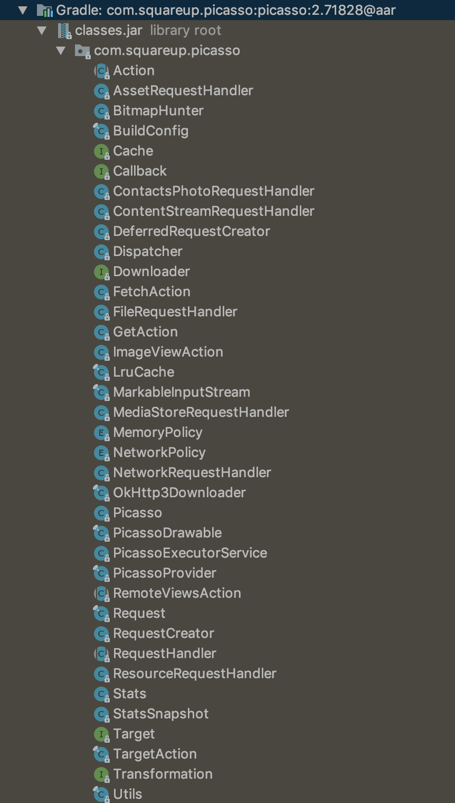
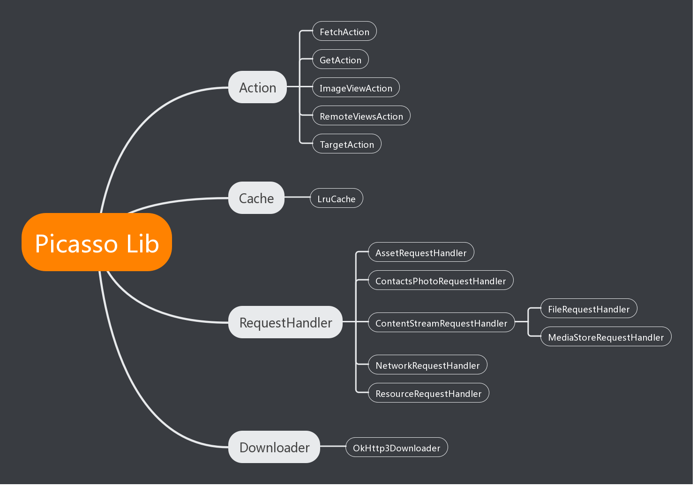
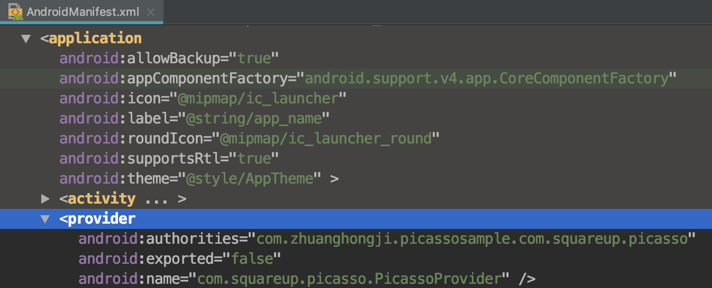
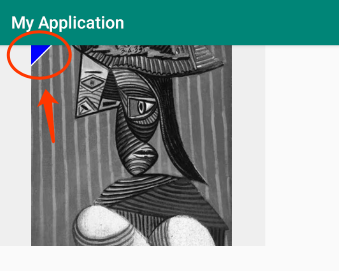
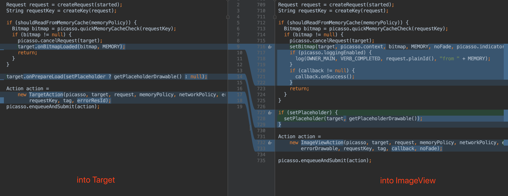

# Picasso 源码解析：概述

在这篇文章中，我们先简单描述下 Picasso 中的代码文件结构，然后通过 `get()`、`load()` 和 `into()` 这三个方法来对其中的图片加载流程做一个简单了解。

## 代码文件结构

Picasso 源码中的代码文件并不多，数了下大概是 40 来个，下面是相关截图以及自己画的 "接口实现或类继承关系" 图：

| 接口或类文件 | 接口实现或类继承关系
| - | -
|  | 

看图后有了点结构性的认识，接着对其中的一些关键类做下简单描述：

* `Picasso`：图片加载、转换、缓存的管理类。单例模式，其中的 `Picasso` 单例可进行自定义设置，使用时通过静态的 `Picasso.get()` 方法获取。

* `Request`：图片加载请求，包装了图片及其变换相关的数据。
  
* `RequestCreator`：图片加载请求生产者，其内部通过构建者模式设计了一个 `Request.Builder data` 成员变量，并通过巧妙的设计使得我们可以通过链式调用来设置相关属性 (比如占位图、缓存策略、裁剪规则、显示大小、优先级等)。
  
* `DeferredRequestCreator`：`RequestCreator` 的包装类，如果创建请求时还不能获取 `ImageView` 的宽高，就会包装出一个 `DeferredRequestCreator` 实例。
  
* `Action`：图片加载请求的包装类，包装了该请求及在 RequestCreator 中设置的属性，最终会交给 `Dispatcher` 进行分发和下载。

* `Dispatcher`：分发器，分发执行各种请求和请求结果。

* `PicassoExecutorService`：Picasso 自定义的线程池，默认线程数量为 `3`。

* `BitmapHunter`：Picasso 的一个核心类，开启线程执行下载，获取结果后解码成 Bitmap，然后做一些转换操作 (如图片旋转、裁剪等)。如果请求设置了转换器 `Transformation`，也会在 `BitmapHunter` 里执行这些转换操作

* `RequestHandler`：请求处理者，抽象类，允许你扩展出 Picasso 默认不支持的一些图片加载请求的处理操作。
  
* `NetworkRequestHandler`：内置的请求处理者，执行从网络进行图片加载的操作。

* `FileRequestHandler`：内置的请求处理者，执行图片存在于文件系统时的加载操作。

* `AssetRequestHandler`：内置的请求处理者，执行来自 asset 目录下的图片的加载操作。

* `ResourceRequestHandler`：内置的请求处理者，执行来自 res 下的图片的加载操作。

* `ContentStreamRequestHandler`：内置的请求处理者，执行 ContentProvider 提供的图片的加载操作。

* `MediaStoreRequestHandler`：内置的请求处理者，执行来自 MediaStore 的图片的加载操作。

* `ContactsPhotoRequestHandler`：内置的请求处理者，执行来自 `com.android.contacts/` 下的图片的加载操作。

* `PicassoDrawable`：继承自 `BitmapDrawable`，实现了过渡动画和图片来源的标识 (通过 `setIndicatorsEnabled(true)` 方法时)，请求成功后会包装成 `BitmapDrawable` 显示到 `ImageView` 上。

* `OkHttpDownloader`：用 OkHttp 实现的图片下载器，默认使用。不想使用这个下载器的话，需要自己构建 `Picasso` 实例进行设置。
  
* `LruCache`：一个使用最近最少使用的内存缓存清除的策略。
  
* `MemoryPolicy`：枚举类型，指定处理内存缓存时要使用的策略。。

* `NetworkPolicy`：枚举类型，指定用于网络请求的策略。

* `Stats`：状态，用于记录了 "内存缓存的命中次数"、"丢失次数"、"下载次数"、"转换此时" 等数据。我们可以通过 `StatsSnapshot` 类将日志打印出来，以了解整个应用的图片加载情况。

* `StatsSnapshot`：状态快照，表示在某个时间点上 Picasso 实例的所有状态。我们可以通过其 `dump()` 方法来将这些状态数据打印到 Logcat 中。


## 加载流程分析

完成一个图片加载操作的最简代码如下：

```java
Picasso.get().load(image).into(imageView);
```

在上面只用到了 `get()`、`load` 和 `into()` 三个方法，所以接下来可以通过这个三个方法的源码分析来使得我们对 Picasso 的图片加载流程有一个简单的了解。

### `get()`

先来看下 `Picasso.get()` 方法的相关源码：

```java
public class Picasso {
  // ...

  @SuppressLint("StaticFieldLeak") 
  static volatile Picasso singleton = null;

  public static Picasso get() {
    if (singleton == null) {
      synchronized (Picasso.class) {
        if (singleton == null) {
          if (PicassoProvider.context == null) {                        // 1
            throw new IllegalStateException("context == null");
          }
          singleton = new Builder(PicassoProvider.context).build();     // 2
        }
      }
    }
    return singleton;
  }
}
```

从上面代码片段很容易看出，Picssao 采用了双重检验锁的单例设计模式，由静态的 `get()` 方法来提供实例，这样就能保证在同一个进程中只有一个 `Picasso` 实例。

在 `1` 处，我们看到了一个 `PicassoProvider` 类和一个判断其静态 `context` 属性是否为 `null` 的逻辑。所以我们接着来看下 `PicassoProvider` 类的源代码：

```java
@RestrictTo(LIBRARY)
public final class PicassoProvider extends ContentProvider {

  @SuppressLint("StaticFieldLeak") static Context context;

  @Override public boolean onCreate() {
    context = getContext();
    return true;
  }

  // 其它不做任何特殊逻辑的抽象方法实现... 
}
```

我们都知道，`ContentProvider` 是 Android 四大组件之一，可以用来进行进程间的通信，在使用时必须要在 AndroidManifest.xml 文件中进行注册。可能你会觉得很奇怪，我们平时在使用 Picasso 的时候并没有显式注册这个 `PicassoProvider` 呀，也没见到抛出任何 `IllegalStateException("context == null")` 相关的异常。

如果你打断点进行 Debug 的话，会发现 `PicassoProvider` 的 `onCreate` 方法永远在 `Picasso.get()` 方法之前执行。这是因为，Picasso 库的源码中已经在其 AndroidManifest.xml 文件中注册好 `PicassoProvider` 了，作为库使用者直接依赖这个库即可 (无需配置，即开即用)：

```xml
<manifest xmlns:android="http://schemas.android.com/apk/res/android"
    package="com.squareup.picasso">

  <application>
    <provider
        android:name=".PicassoProvider"
        android:authorities="${applicationId}.com.squareup.picasso"
        android:exported="false"/>
  </application>
</manifest>
```

另外，如果你想查看下该 Provider 的注册逻辑，可以在 `Merged Manifest` 中 进行查看。比如，我在当前项目中看到是酱紫的：



回到 `get()` 方法源码，在发现 `PicassoProvider.context` 不为 `null` 之后，在 `2` 处会将 `PicassoProvider.context` 作为 `Builder` 类的构造函数的参数来创建一个 `Builder` 对象，然后直接调用该对象的 `build()` 方法来创建 `Picasso` 实例。


本着探索的精神，我们接下来看一下 `Builder` 的相关源码：

```java
public class Picasso {
  // ...

  public static class Builder {
    private final Context context;
    private Downloader downloader;
    private ExecutorService service;
    private Cache cache;
    private Listener listener;
    private RequestTransformer transformer;
    private List<RequestHandler> requestHandlers;
    private Bitmap.Config defaultBitmapConfig;

    private boolean indicatorsEnabled;
    private boolean loggingEnabled;

    public Builder(@NonNull Context context) {
      if (context == null) {
        throw new IllegalArgumentException("Context must not be null.");
      }
      this.context = context.getApplicationContext();
    }

    // 注：暴露这些构造方法，使得库使用者可以自定义 
    // "图片质量"、"图片下载器"、"线程池"、"内存缓存策略"、"事件监听器"、"请求变换器"、
    // "请求处理者"、"是否启用调试指示"、"是否启用日志"
    public Builder defaultBitmapConfig(@NonNull Bitmap.Config bitmapConfig) { /* ... */ return this; }
    public Builder downloader(@NonNull Downloader downloader) { /* ... */ return this; }
    public Builder executor(@NonNull ExecutorService executorService) { /* ... */ return this; }
    public Builder memoryCache(@NonNull Cache memoryCache) { /* ... */ return this; }
    public Builder listener(@NonNull Listener listener) { /* ... */ return this; }
    public Builder requestTransformer(@NonNull RequestTransformer transformer) { /* ... */ return this; }
    public Builder addRequestHandler(@NonNull RequestHandler requestHandler) { /* ... */ return this; }
    public Builder indicatorsEnabled(boolean enabled) { /* ... */ return this; }
    public Builder loggingEnabled(boolean enabled) { /* ... */ return this; }

    public Picasso build() {
      Context context = this.context;
      if (downloader == null) {
        downloader = new OkHttp3Downloader(context);
      }
      if (cache == null) {
        cache = new LruCache(context);
      }
      if (service == null) {
        service = new PicassoExecutorService();
      }
      if (transformer == null) {
        transformer = RequestTransformer.IDENTITY;
      }

      Stats stats = new Stats(cache);
      Dispatcher dispatcher = new Dispatcher(context, service, HANDLER, downloader, cache, stats);
      return new Picasso(context, dispatcher, cache, listener, transformer, requestHandlers, stats,
          defaultBitmapConfig, indicatorsEnabled, loggingEnabled);
    }
  }

  // ...
}
```

不管是从命名还是从上面的代码片段，都可以看出这里采用了构建者模式来构建 `Picasso` 的实例，并在 `build()` 方法中做了一些默认实现：
* 不自定义下载器的话，默认使用 `OkHttp3Downloader`。
* 不自定义内存缓存策略的话，默认使用 `LruCache`。
* 不自定义线程池话，默认使用 `PicassoExecutorService`。
* 不自定义请求变换器话，默认使用 `RequestTransformer.IDENTITY`。

> `Picasso` 类的构造函数接收的参数较多，通过构建者模式可以简化这个复杂的构建过程。

又发现一个奇怪问题，我们平时都是 `Picasso.get().load(..).into(..);` 这样直接使用的，为什么 Picasso 还要设计这么一个构建逻辑？只能说你图样图森破了，继续往下看，`Picasso` 类中还设计了一个这样的静态方法：

```java
public class Picasso {
  // ...

  public static void setSingletonInstance(@NonNull Picasso picasso) {
    if (picasso == null) {
      throw new IllegalArgumentException("Picasso must not be null.");
    }
    synchronized (Picasso.class) {
      if (singleton != null) {
        throw new IllegalStateException("Singleton instance already exists.");
      }
      singleton = picasso;
    }
  }
}
```

顾名思义，这个静态方法是用来设置自定义的 Picasso 单例的，但它必须在调用 `Picasso.get()` 方法之前调用，且可能只调用一次。比如：

```java
public class App extends Application {

    @Override
    public void onCreate() {
        super.onCreate();

        // init Picasso
        // 在 Debug 包中全局启用调试指示器和日志输出
        Picasso customSingleton = new Picasso.Builder(this)
                .indicatorsEnabled(BuildConfig.DEBUG)
                .loggingEnabled(BuildConfig.DEBUG)
                .build();
        Picasso.setSingletonInstance(customSingleton);
    }
}
```

```java
public class MainActivity extends AppCompatActivity {

    @Override
    protected void onCreate(Bundle savedInstanceState) {
        super.onCreate(savedInstanceState);
        setContentView(R.layout.activity_main);

        final ImageView imageView = findViewById(R.id.image_view);
        // 注意，我们这里不需要再次启用调试指示器和日志输出了噢
        Picasso.get()
                .load(Data.URLS[0])
                .transform(TransformationFactory.createCropSquareAndGray())
                .into(imageView);
    }
}
```

运行后，可以看到调试指示器和日志输出如下：



```
D/Picasso: Main        created      [R0] Request{https://s2.ax1x.com/2019/04/25/EeTi4A.jpg square() gray()}
D/Picasso: Dispatcher  enqueued     [R0]+10ms 
D/Picasso: Hunter      executing    [R0]+10ms 
D/Picasso: Hunter      decoded      [R0]+77ms 
D/Picasso: Hunter      transformed  [R0]+84ms from custom transformations
D/Picasso: Dispatcher  batched      [R0]+86ms for completion
D/Picasso: Dispatcher  delivered    [R0]+302ms 
D/Picasso: Main        completed    [R0]+4345ms from DISK
```

在本小节中，我们最后来看下 `Picasso` 类的构造函数源代码：

```java
public class Picasso {
  // ...

  Picasso(Context context, Dispatcher dispatcher, Cache cache, Listener listener,
      RequestTransformer requestTransformer, List<RequestHandler> extraRequestHandlers, Stats stats,
      Bitmap.Config defaultBitmapConfig, boolean indicatorsEnabled, boolean loggingEnabled) {
    this.context = context;
    this.dispatcher = dispatcher;
    this.cache = cache;
    this.listener = listener;
    this.requestTransformer = requestTransformer;
    this.defaultBitmapConfig = defaultBitmapConfig;

    int builtInHandlers = 7; // Adjust this as internal handlers are added or removed.
    int extraCount = (extraRequestHandlers != null ? extraRequestHandlers.size() : 0);
    List<RequestHandler> allRequestHandlers = new ArrayList<>(builtInHandlers + extraCount);

    // ResourceRequestHandler needs to be the first in the list to avoid
    // forcing other RequestHandlers to perform null checks on request.uri
    // to cover the (request.resourceId != 0) case.
    allRequestHandlers.add(new ResourceRequestHandler(context));
    if (extraRequestHandlers != null) {
      allRequestHandlers.addAll(extraRequestHandlers);
    }
    allRequestHandlers.add(new ContactsPhotoRequestHandler(context));
    allRequestHandlers.add(new MediaStoreRequestHandler(context));
    allRequestHandlers.add(new ContentStreamRequestHandler(context));
    allRequestHandlers.add(new AssetRequestHandler(context));
    allRequestHandlers.add(new FileRequestHandler(context));
    allRequestHandlers.add(new NetworkRequestHandler(dispatcher.downloader, stats));
    requestHandlers = Collections.unmodifiableList(allRequestHandlers);

    this.stats = stats;
    this.targetToAction = new WeakHashMap<>();
    this.targetToDeferredRequestCreator = new WeakHashMap<>();
    this.indicatorsEnabled = indicatorsEnabled;
    this.loggingEnabled = loggingEnabled;
    this.referenceQueue = new ReferenceQueue<>();
    this.cleanupThread = new CleanupThread(referenceQueue, HANDLER);
    this.cleanupThread.start();
  }

  // ...
}
```

呃.. 好像没什么要特别说明的。自己先意会下，后面有需要的话再做补充。


### `load()`

获取到 `Picasso` 的实例之后，我们会调用其 `load()` 方法：

```java
public class Picasso {    
  // ...                          

  public RequestCreator load(@Nullable Uri uri) {
    return new RequestCreator(this, uri, 0);
  }

  public RequestCreator load(@Nullable String path) {
    if (path == null) {
      return new RequestCreator(this, null, 0);
    }
    if (path.trim().length() == 0) {
      throw new IllegalArgumentException("Path must not be empty.");
    }
    return load(Uri.parse(path));
  }

  public RequestCreator load(@NonNull File file) {
    if (file == null) {
      return new RequestCreator(this, null, 0);
    }
    return load(Uri.fromFile(file));
  }

  public RequestCreator load(@DrawableRes int resourceId) {
    if (resourceId == 0) {
      throw new IllegalArgumentException("Resource ID must not be zero.");
    }
    return new RequestCreator(this, null, resourceId);
  }
}
```

从上面代码片段可以看出，`Picasso` 类共有四个重载的 `load()` 实例方法，可用来进行加载网络图片、文件图片、资源图片等操作。在这四个实例方法中，最终的目的都是为了创建 `RequestCreator` 对象，然后将其作为返回值进行返回。

下面我们来看下 `RequestCreator` 类的源码：

```java
public class RequestCreator {
  private static final AtomicInteger nextId = new AtomicInteger();

  private final Picasso picasso;
  private final Request.Builder data;

  private boolean noFade;
  private boolean deferred;
  private boolean setPlaceholder = true;
  private int placeholderResId;
  private int errorResId;
  private int memoryPolicy;
  private int networkPolicy;
  private Drawable placeholderDrawable;
  private Drawable errorDrawable;
  private Object tag;

  RequestCreator(Picasso picasso, Uri uri, int resourceId) {
    if (picasso.shutdown) {
      throw new IllegalStateException(
          "Picasso instance already shut down. Cannot submit new requests.");
    }
    this.picasso = picasso;
    this.data = new Request.Builder(uri, resourceId, picasso.defaultBitmapConfig);
  }

  public RequestCreator noPlaceholder() { /* ... */ return this; }
  public RequestCreator placeholder(@DrawableRes int placeholderResId) { /* ... */ return this; }
  public RequestCreator placeholder(@NonNull Drawable placeholderDrawable) { /* ... */ return this; }
  public RequestCreator error(@DrawableRes int errorResId) { /* ... */ return this; }
  public RequestCreator error(@NonNull Drawable errorDrawable) { /* ... */ return this; }
  public RequestCreator tag(@NonNull Object tag) { /* ... */ return this; }
  public RequestCreator fit() { /* ... */ return this; }
  public RequestCreator resize(int targetWidth, int targetHeight) { /* ... */ return this; }
  public RequestCreator centerCrop(int alignGravity) { /* ... */ return this; }
  public RequestCreator centerCrop() {
    data.centerCrop(Gravity.CENTER);        
    return this;
  }
  // ...
  // 上面的这些方法都会通过 `data` 存储参数行为，
  // 并通过 `return this;` 返回自身，以便形成链式调用
}
```

在 `RequestCreator` 的构造方法中，有一个 `Picasso` 实例参数，这是因为后续需要通过该实例进行一些诸如 "获取 Context"、"获取 Resources"、"发起请求"、"取消请求"、"是否打印日志" 的操作，这些会在后面的文章中细讲。我们再来看构造方法中另外两个参数 (`Uri uri` 和 `int resourceId`) 的相关操作：

```java
this.data = new Request.Builder(uri, resourceId, picasso.defaultBitmapConfig);
```

从命名可以看出，这也是一个构建者模式，我敢肯定最终会有一个 `build()` 方法来构建 `Request` 对象。不信来看下相关源代码：

```java
public final class Request {
  // ...

  // 参数极其复杂的构造函数
  private Request(Uri uri, int resourceId, String stableKey, List<Transformation> transformations,
      int targetWidth, int targetHeight, boolean centerCrop, boolean centerInside,
      int centerCropGravity, boolean onlyScaleDown, float rotationDegrees,
      float rotationPivotX, float rotationPivotY, boolean hasRotationPivot,
      boolean purgeable, Bitmap.Config config, Priority priority) {
    // ...
  }

  public static final class Builder {
    // ...

    Builder(Uri uri, int resourceId, Bitmap.Config bitmapConfig) {
      this.uri = uri;
      this.resourceId = resourceId;
      this.config = bitmapConfig;
    }

    public Builder resize(@Px int targetWidth, @Px int targetHeight) {
      if (targetWidth < 0) {
        throw new IllegalArgumentException("Width must be positive number or 0.");
      }
      if (targetHeight < 0) {
        throw new IllegalArgumentException("Height must be positive number or 0.");
      }
      if (targetHeight == 0 && targetWidth == 0) {
        throw new IllegalArgumentException("At least one dimension has to be positive number.");
      }
      this.targetWidth = targetWidth;
      this.targetHeight = targetHeight;
      return this;
    }

    public Builder clearResize() {
      targetWidth = 0;
      targetHeight = 0;
      centerCrop = false;
      centerInside = false;
      return this;
    }

    // 哈！你要的 build() 方法 ..
    public Request build() {
      if (centerInside && centerCrop) {
        throw new IllegalStateException("Center crop and center inside can not be used together.");
      }
      if (centerCrop && (targetWidth == 0 && targetHeight == 0)) {
        throw new IllegalStateException(
            "Center crop requires calling resize with positive width and height.");
      }
      if (centerInside && (targetWidth == 0 && targetHeight == 0)) {
        throw new IllegalStateException(
            "Center inside requires calling resize with positive width and height.");
      }
      if (priority == null) {
        priority = Priority.NORMAL;
      }
      return new Request(uri, resourceId, stableKey, transformations, targetWidth, targetHeight,
          centerCrop, centerInside, centerCropGravity, onlyScaleDown, rotationDegrees,
          rotationPivotX, rotationPivotY, hasRotationPivot, purgeable, config, priority);
    }
  }
}
```

这里我们故意贴出了 `resize()` 和 `build()` 方法的完整代码，是为了说明，其实 Picasso 内部做了很多的逻辑判断，如果使用者设置的一些参数不符合实际的话就会抛出相关异常。

总结下这小节：
* `Picasso` 的实例 `load()` 方法会返回一个的 `RequestCreator` 实例，通过该实例我们可以通过链式调用来设置 `Request` 中的参数。
* `RequestCreator` 实例内部有一个 `Request.Builder data` 变量，该变量在设计上采用了构建者模式，最后可以 build 出一个 `Request` 对象。


### `into()`

在讲解 `load` 方法时，我们故意避开了同在 `RequestCreator` 类中的 `into()` 系列的几个方法，现在一起来看下：

```java
public class RequestCreator {
  // ...

  // T1
  public void into(@NonNull Target target) { /* ... */ }

  // R1
  public void into(@NonNull RemoteViews remoteViews, @IdRes int viewId, int notificationId,
      @NonNull Notification notification) {
    into(remoteViews, viewId, notificationId, notification, null);
  }

  // R2
  public void into(@NonNull RemoteViews remoteViews, @IdRes int viewId, int notificationId,
      @NonNull Notification notification, @Nullable String notificationTag) {
    into(remoteViews, viewId, notificationId, notification, notificationTag, null);
  }

  // R3
  public void into(@NonNull RemoteViews remoteViews, @IdRes int viewId, int notificationId,
      @NonNull Notification notification, @Nullable String notificationTag, Callback callback) {
    // ...
  }

  // R4
  public void into(@NonNull RemoteViews remoteViews, @IdRes int viewId,
      @NonNull int[] appWidgetIds) {
    into(remoteViews, viewId, appWidgetIds, null);
  }

  // R5
  public void into(@NonNull RemoteViews remoteViews, @IdRes int viewId, @NonNull int[] appWidgetIds,
      Callback callback) {
    // ...
  }

  // I1
  public void into(ImageView target) {
    into(target, null);
  }

  // I2
  public void into(ImageView target, Callback callback) { /* ... */ }
}
```

从上面的代码片段可以看出，在 `RequestCreator` 中共定义了 8 个 `into()` 方法，其中：
* T1: 适用于任意加载图片的操作。
* R1 ~ R5: 可用于 `RemoteViews` 的图片加载操作。
* I1 ~ I2: 可用于 `ImageView` 相关的图片加载操作。

> 因为 R1 ~ R5 比较少用，在这篇文章中就当它没出现过吧，哈哈哈..

先看下 T1 中 `into(@NonNull Target target)` 方法的 `Target` 参数源代码：

```java
public interface Target {

  // 当图片加载成功时回调 
  // 注意：这里不能调用 `bitmap.recycle()`
  void onBitmapLoaded(Bitmap bitmap, LoadedFrom from);

  // 当图片加载失败时回调 
  // 注意：如果调用 into 之前未在 RequestCreator 中设置 `error` 的话，则参数 `errorDrawable` 为 null
  void onBitmapFailed(Exception e, Drawable errorDrawable);

  // 在图片请求提交之前回调
  // 注意：如果调用 into 之前未在 RequestCreator 中设置 `placeholder` 的话，则参数 `placeHolderDrawable` 为 null
  void onPrepareLoad(Drawable placeHolderDrawable);
}

// LoadedFrom 是一个枚举类，用于标识图片来源：内存、硬盘或网络
public enum LoadedFrom {
  MEMORY(Color.GREEN),
  DISK(Color.BLUE),
  NETWORK(Color.RED);

  final int debugColor;

  LoadedFrom(int debugColor) {
    this.debugColor = debugColor;
  }
}
```

接着来看 `into(@NonNull Target target)` 方法本身的具体实现：

```java
public void into(@NonNull Target target) {
  long started = System.nanoTime();
  checkMain();

  if (target == null) {
    throw new IllegalArgumentException("Target must not be null.");
  }
  if (deferred) {
    throw new IllegalStateException("Fit cannot be used with a Target.");
  }

  if (!data.hasImage()) {
    picasso.cancelRequest(target);
    target.onPrepareLoad(setPlaceholder ? getPlaceholderDrawable() : null);
    return;
  }

  Request request = createRequest(started);
  String requestKey = createKey(request);

  if (shouldReadFromMemoryCache(memoryPolicy)) {
    Bitmap bitmap = picasso.quickMemoryCacheCheck(requestKey);
    if (bitmap != null) {
      picasso.cancelRequest(target);
      target.onBitmapLoaded(bitmap, MEMORY);
      return;
    }
  }

  target.onPrepareLoad(setPlaceholder ? getPlaceholderDrawable() : null);

  Action action =
      new TargetAction(picasso, target, request, memoryPolicy, networkPolicy, errorDrawable,
          requestKey, tag, errorResId);
  picasso.enqueueAndSubmit(action);
}
```

因为显示图片是一个 UI 操作，所以 `into()` 方法 (`T1`、`I1`、`I2`) 在一开始的时候都需要检查当前是否在主线程，不是在主线程的话就会抛出 `IllegalStateException("Method call should happen from the main thread.")` 异常。

> `checkMain()` 方法内部主要是通过 `Looper.getMainLooper().getThread() == Thread.currentThread()` 这个逻辑来判断当前是否在主线程的。

再接着我们来看 `I1` 和 `I2`，因为 `I1` 最终也是调用 `I2`，所以直接看 `I2` 的具体实现即可：

```java
public void into(ImageView target, Callback callback) {
  long started = System.nanoTime();
  checkMain();

  if (target == null) {
    throw new IllegalArgumentException("Target must not be null.");
  }

  if (!data.hasImage()) {
    picasso.cancelRequest(target);
    if (setPlaceholder) {
      setPlaceholder(target, getPlaceholderDrawable());
    }
    return;
  }

  if (deferred) {
    if (data.hasSize()) {
      throw new IllegalStateException("Fit cannot be used with resize.");
    }
    int width = target.getWidth();
    int height = target.getHeight();
    if (width == 0 || height == 0) {
      if (setPlaceholder) {
        setPlaceholder(target, getPlaceholderDrawable());
      }
      picasso.defer(target, new DeferredRequestCreator(this, target, callback));
      return;
    }
    data.resize(width, height);
  }

  Request request = createRequest(started);
  String requestKey = createKey(request);

  if (shouldReadFromMemoryCache(memoryPolicy)) {
    Bitmap bitmap = picasso.quickMemoryCacheCheck(requestKey);
    if (bitmap != null) {
      picasso.cancelRequest(target);
      setBitmap(target, picasso.context, bitmap, MEMORY, noFade, picasso.indicatorsEnabled);
      if (picasso.loggingEnabled) {
        log(OWNER_MAIN, VERB_COMPLETED, request.plainId(), "from " + MEMORY);
      }
      if (callback != null) {
        callback.onSuccess();
      }
      return;
    }
  }

  if (setPlaceholder) {
    setPlaceholder(target, getPlaceholderDrawable());
  }

  Action action =
      new ImageViewAction(picasso, target, request, memoryPolicy, networkPolicy, errorResId,
          errorDrawable, requestKey, tag, callback, noFade);
  picasso.enqueueAndSubmit(action);
}

// 附1：第二个参数 callback 的源代码
public interface Callback {
  // 图片加载成功时回调
  void onSuccess();
  // 图片加载失败时回调
  void onError(Exception e);

  class EmptyCallback implements Callback {

    @Override public void onSuccess() {
    }

    @Override public void onError(Exception e) {
    }
  }
}

// 附2：静态的 setBitmap 方法源代码，会将 bitmap 包装成 PicassoDrawable 再设置到 ImageView
final class PicassoDrawable extends BitmapDrawable {
  // ...

  static void setBitmap(ImageView target, Context context, Bitmap bitmap,
      Picasso.LoadedFrom loadedFrom, boolean noFade, boolean debugging) {
    Drawable placeholder = target.getDrawable();
    if (placeholder instanceof Animatable) {
      ((Animatable) placeholder).stop();
    }
    PicassoDrawable drawable =
        new PicassoDrawable(context, bitmap, placeholder, loadedFrom, noFade, debugging);
    target.setImageDrawable(drawable);
  }
}
```

结合上面两段 `into()` 方法的源代码来看，两者的主要区别在于后半部分的图片加载操作，见下图：



> 左 `into(@NonNull Target target)`，右 `into(ImageView target, Callback callback)`

* 如果能从内存缓存中获取到图片，into Target 会直接回调 `target` 的 `onBitmapLoaded()` 方法，而 into ImageView 会直接调用 `setBitmap` 来显示图片并回调 `callback` 的 `onSuccess()` 方法。
* 如果内存缓存中没有图片，into Target 会先将图片加载请求包装成 `TargetAction` 然后等待发起，而 into ImageView 则是包装成 `ImageViewAction` 再等待发起。

请求成功后，自然会再回调相关方法或设置图片显示到 `ImageView` 上，这些内容我们下回分解。

## 总结

在这篇 `Picasso 源码：概述` 文章中，我们已经对 Picasso 的源码结构和加载流程有了一个简单的认识，也算是为后面的源码分析文章打下了基础。

山顶的朋友们，下次见。 :kissing_heart: