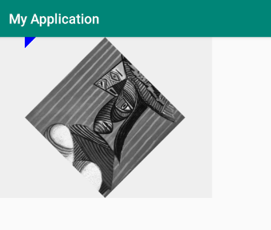

# Picasso 源码解析：内存缓存设计和请求分发器逻辑

在对 Picassso 的图片加载流程有一个简单了解后，我们接着来看下其内存缓存设计和线程池调度逻辑。

## 内存缓存设计

在 Picasso 的内存缓存设计中，主要涉及到两个代码文件：`Cache` 接口及其实现类 `LruCache`。

### Cache

`Cache` 接口完整代码：

```java
public interface Cache {
  /** 检索指定 key 的图片 */
  Bitmap get(String key);

  /** 在缓存中存储指定的 key 的图片 */
  void set(String key, Bitmap bitmap);

  /** 以字节为单位返回缓存的当前大小 */
  int size();

  /** 返回缓存可以容纳的最大字节数 */
  int maxSize();

  /** 清空缓存 */
  void clear();

  /** 删除 key 前缀为 keyPrefix 的缓存项  */
  void clearKeyUri(String keyPrefix);

  /** 不存储任何值的缓存 */
  Cache NONE = new Cache() {
    @Override public Bitmap get(String key) {
      return null;
    }

    @Override public void set(String key, Bitmap bitmap) {
      // Ignore.
    }

    @Override public int size() {
      return 0;
    }

    @Override public int maxSize() {
      return 0;
    }

    @Override public void clear() {}

    @Override public void clearKeyUri(String keyPrefix) {}
  };
}
```

`Cahce` 接口抽象出了内存缓存相关的处理逻辑，这样库使用者在自行构建 Picasso 单例时就可以对内存缓存进行定制。`Cahce` 内部的接口方法介绍已做相关注释，这里不再细讲。

但有点意思需要补充的是，如果你不需要内存缓存的话可以在调用 `Picasso.get()` 方法之前这样做：

```java
Picasso customSingleton = new Picasso.Builder(context)
        .memoryCache(Cache.NONE)
        .build();
Picasso.setSingletonInstance(customSingleton);
```

### LruCache

**`LruCache` 类完整代码：**

```java
public final class LruCache implements Cache {
  final android.util.LruCache<String, LruCache.BitmapAndSize> cache;

  /** 使用可用 RAM 的适当部分作为最大大小创建缓存 */
  public LruCache(@NonNull Context context) {
    this(Utils.calculateMemoryCacheSize(context));
  }

  /** 创建以字节为单位的给定最大大小的缓存 */
  public LruCache(int maxByteCount) {
    cache = new android.util.LruCache<String, LruCache.BitmapAndSize>(maxByteCount) {
      @Override protected int sizeOf(String key, BitmapAndSize value) {
        return value.byteCount;
      }
    };
  }

  @Nullable @Override public Bitmap get(@NonNull String key) {
    BitmapAndSize bitmapAndSize = cache.get(key);
    return bitmapAndSize != null ? bitmapAndSize.bitmap : null;
  }

  @Override public void set(@NonNull String key, @NonNull Bitmap bitmap) {
    if (key == null || bitmap == null) {
      throw new NullPointerException("key == null || bitmap == null");
    }
    int byteCount = Utils.getBitmapBytes(bitmap);

    // 如果位图对于缓存来说太大，不要尝试存储它，并尝试清除对应缓存。
    // 相反，如果现有元素存在，则使用相同的键驱逐它。
    if (byteCount > maxSize()) {
      cache.remove(key);
      return;
    }
    cache.put(key, new BitmapAndSize(bitmap, byteCount));
  }

  @Override public int size() {
    return cache.size();
  }

  @Override public int maxSize() {
    return cache.maxSize();
  }

  @Override public void clear() {
    // evict: 驱逐，逐出
    cache.evictAll();
  }

  @Override public void clearKeyUri(String uri) {
    // key 的前缀是 URI，后跟 '\n'
    for (String key : cache.snapshot().keySet()) {
      if (key.startsWith(uri)
          && key.length() > uri.length()
          && key.charAt(uri.length()) == KEY_SEPARATOR) {
        cache.remove(key);
      }
    }
  }

  /** 返回 get 返回有效值的次数 */
  public int hitCount() {
    return cache.hitCount();
  }

  /** 返回 get 返回 null 的次数 */
  public int missCount() {
    return cache.missCount();
  }

  /** 返回调用 set(String, Bitmap) 的次数 */
  public int putCount() {
    return cache.putCount();
  }

  /** 返回已清除的值的数目 */
  public int evictionCount() {
    return cache.evictionCount();
  }

  static final class BitmapAndSize {
    final Bitmap bitmap;
    final int byteCount;

    BitmapAndSize(Bitmap bitmap, int byteCount) {
      this.bitmap = bitmap;
      this.byteCount = byteCount;
    }
  }
}
```

前面将到，`LruCache` 是 `Cache` 接口的实现类，在官方文章中是这样描述它的：

```
A memory cache which uses a least-recently used eviction policy.
一个使用最近最少使用的清除策略的内存缓存。
```

在其具体实现的源代码中，内部只有一个 `android.util.LruCache<String, LruCache.BitmapAndSize> cache` 实例变量，并且会在构造函数中对其进行初始化。发现命名是一样的没？浏览一下整体代码逻辑你就会发现，原来 Picasso 的 `LruCache` 只是在 Android 默认提供的 `android.util.LruCache` 上包装了一层，然后在包装层执行特定的逻辑以操作 `android.util.LruCache`。

再仔细看会发现，`LruCache` 类共有两个构造函数，在 Picasso 单例的默认构造逻辑中调用的是 `LruCache(@NonNull Context context)` 构造函数。在将该构造函数委托到 `LruCache(int maxByteCount)` 构造函数之前，有一个 `Utils.calculateMemoryCacheSize(context)` 逻辑，我们来看下相关源代码：

```java
final class Utils {
  // ...

  // 计算默认内存缓存大小
  static int calculateMemoryCacheSize(Context context) {
    ActivityManager am = getService(context, ACTIVITY_SERVICE);
    boolean largeHeap = (context.getApplicationInfo().flags & FLAG_LARGE_HEAP) != 0;
    int memoryClass = largeHeap ? am.getLargeMemoryClass() : am.getMemoryClass();
    // Target ~15% of the available heap.
    return (int) (1024L * 1024L * memoryClass / 7);
  }
}
```

在该静态方法中，会通过 `ActivityManager` 来获取该应用在该设备中可使用的最大内存或内存，然后将其大概 15% 的大小来作为内存缓存大小。

如果我们自行调整缓存大小，就需要在自定义构建 Picasso 单例并设置预期的缓存大小，比如我们想要 20% 的大小：

```java
// init Picasso

ActivityManager am = (ActivityManager) getSystemService(Context.ACTIVITY_SERVICE);
boolean largeHeap = (getApplicationInfo().flags & FLAG_LARGE_HEAP) != 0;
int memoryClass = largeHeap ? am.getLargeMemoryClass() : am.getMemoryClass();
int customSize = (int) (1024L * 1024L * memoryClass / 5);   // 20%

Picasso customSingleton = new Picasso.Builder(this)
        .indicatorsEnabled(BuildConfig.DEBUG)
        .loggingEnabled(BuildConfig.DEBUG)
        .memoryCache(new LruCache(customSize))
        .build();
Picasso.setSingletonInstance(customSingleton);
```

### 缓存使用逻辑

**回到我们之前讲的其中一个 `into()` 方法：**

```java
public class RequestCreator {
  // ...

  public void into(ImageView target, Callback callback) {
    long started = System.nanoTime();
    // ...

    Request request = createRequest(started);                           // 1
    String requestKey = createKey(request);                             // 2

    if (shouldReadFromMemoryCache(memoryPolicy)) {                      // 3
      Bitmap bitmap = picasso.quickMemoryCacheCheck(requestKey);
      if (bitmap != null) {
        picasso.cancelRequest(target);
        setBitmap(target, picasso.context, bitmap, MEMORY, noFade, picasso.indicatorsEnabled);
        if (picasso.loggingEnabled) {
          log(OWNER_MAIN, VERB_COMPLETED, request.plainId(), "from " + MEMORY);
        }
        if (callback != null) {
          callback.onSuccess();
        }
        return;
      }
    }

    if (setPlaceholder) {
      setPlaceholder(target, getPlaceholderDrawable());
    }

    Action action =
        new ImageViewAction(picasso, target, request, memoryPolicy, networkPolicy, errorResId,
            errorDrawable, requestKey, tag, callback, noFade);
    picasso.enqueueAndSubmit(action);
  }
}
```

从上面节选出来的代码可以看到：
* 在 `1` 处首先会根据系统时间构造一个图片加载请求对象 `request`，再根据该请求对象构造一个 `requestKey` 值。
* 然后在 `3` 处会根据内存缓存策略来决定是否应该先从内存中读取图片。
* 如果应该先从内存中读取，则将 `requestKey` 作为参数来调用 `picasso` 实例的 `quickMemoryCacheCheck(String key)` 方法。接着如果读取到的 bitmap 不为 `null`，则取消请求、显示图片并回调相关方法。
* 如果应该忽略内存缓存逻辑，则设置 palcaholder 并将请求包装成 `Action` 进行分发。

> 从上面的分析可以看出，如果从内存中获取且获取到的 Bitmap 不为 `null`，即内存缓存有效，是不会显示 placeholder 的。

**下面是上述 `into()` 方法的一些相关代码的分析：**

`Utils.createKey(Request data)`

```java
final class Utils {
  // ...

  private static final int KEY_PADDING = 50; // Determined by exact science.
  static final char KEY_SEPARATOR = '\n';

  /** Thread confined to main thread for key creation. */
  static final StringBuilder MAIN_THREAD_KEY_BUILDER = new StringBuilder();

  static String createKey(Request data) {
    String result = createKey(data, MAIN_THREAD_KEY_BUILDER);
    MAIN_THREAD_KEY_BUILDER.setLength(0);
    return result;
  }

  static String createKey(Request data, StringBuilder builder) {
    if (data.stableKey != null) {
      builder.ensureCapacity(data.stableKey.length() + KEY_PADDING);
      builder.append(data.stableKey);
    } else if (data.uri != null) {
      String path = data.uri.toString();
      builder.ensureCapacity(path.length() + KEY_PADDING);
      builder.append(path);
    } else {
      builder.ensureCapacity(KEY_PADDING);
      builder.append(data.resourceId);
    }
    builder.append(KEY_SEPARATOR);

    if (data.rotationDegrees != 0) {
      builder.append("rotation:").append(data.rotationDegrees);
      if (data.hasRotationPivot) {
        builder.append('@').append(data.rotationPivotX).append('x').append(data.rotationPivotY);
      }
      builder.append(KEY_SEPARATOR);
    }
    if (data.hasSize()) {
      builder.append("resize:").append(data.targetWidth).append('x').append(data.targetHeight);
      builder.append(KEY_SEPARATOR);
    }
    if (data.centerCrop) {
      builder.append("centerCrop:").append(data.centerCropGravity).append(KEY_SEPARATOR);
    } else if (data.centerInside) {
      builder.append("centerInside").append(KEY_SEPARATOR);
    }

    if (data.transformations != null) {
      //noinspection ForLoopReplaceableByForEach
      for (int i = 0, count = data.transformations.size(); i < count; i++) {
        builder.append(data.transformations.get(i).key());
        builder.append(KEY_SEPARATOR);
      }
    }

    return builder.toString();
  }
}
```

可以看出，上面的 `createKey()` 方法主要是通过 `Request` 对象的 `stableKey`、`rotationDegrees`、`resize`、`centerCrop` 和 `transformations` 等相关属性来拼接 `requestKey`。

如果我们通过下面这段代码来加载图片：

```java
final ImageView imageView = findViewById(R.id.image_view);
Picasso.get()
        .load(Data.URLS[0])
        .rotate(45)
        .resize(320, 240)
        .centerCrop()
        .transform(TransformationFactory.createCropSquareAndGray())
        .into(imageView);
```

则最终显示效果和拿到的 requestKey 的值如下 (注意 `\n`)：



```
https://s2.ax1x.com/2019/04/25/EeTi4A.jpg
rotation:45.0
resize:320x240
centerCrop:17
square()
gray()
```

`MemoryPolicy.java`

```java
// 枚举类，内存缓存策略
public enum MemoryPolicy {
  NO_CACHE(1 << 0),
  NO_STORE(1 << 1);

  static boolean shouldReadFromMemoryCache(int memoryPolicy) {
    return (memoryPolicy & MemoryPolicy.NO_CACHE.index) == 0;
  }

  // 在图片加载请求成功后才会执行写入检查
  static boolean shouldWriteToMemoryCache(int memoryPolicy) {
    return (memoryPolicy & MemoryPolicy.NO_STORE.index) == 0;
  }

  final int index;

  MemoryPolicy(int index) {
    this.index = index;
  }
}
```

结合 `shouldReadFromMemoryCache()` 方法的具体实现可以看出，如果我们不通过 `requestCreator.memoryPolicy()` 修改缓存策略的话，该方法默认是会返回 `true` 的，也就是说 "应该使用内存缓存"。同理，`shouldWriteToMemoryCache` 也是如此。

`picasso.quickMemoryCacheCheck(String key)`

```java
public class Picasso {
  // ...

  final Cache cache;                              // 1
  final Stats stats;

  // 根据 requestKey 来查询内存缓存中的 Bitmap
  Bitmap quickMemoryCacheCheck(String key) {      
    Bitmap cached = cache.get(key);               // 2
    if (cached != null) {
      stats.dispatchCacheHit();
    } else {
      stats.dispatchCacheMiss();
    }
    return cached;
  }

  // 根据 ImageView 来取消图片加载请求
  public void cancelRequest(@NonNull ImageView view) {
    // checkMain() is called from cancelExistingRequest()
    if (view == null) {
      throw new IllegalArgumentException("view cannot be null.");
    }
    cancelExistingRequest(view);
  }
}
```

上面代码片段中：
* `1` 处的 `Cache` 是我们构建 (或 Picasso 默认构建) Picasso 单例时设置的内存缓存。
* 在 `2` 处，会根据传进来的 `requestKey` 从内存缓存中获取对应的 `Bitmap`。

结合前面的讲到的 `Utils.createKey()` 方法，你就会知道我们之前自定义 `Transformation` 时为什么要实现 `String key()` 方法来返回 key 了。

以上就是 Picasso 中的内存缓存设计，其内部经缓存操作逻辑抽象到了 `Cache` 接口中，并默认实现了一个 `LruCache` 类。在发起图片请求之前如果能从内存缓存中获取图片，就取消请求并显示图片。


## 请求分发器逻辑

### 概述

从上一节内容可知，如果加载图片时不使用内存缓存或无法获取到有效的缓存 Bitmap，就会将 `Request` 对象包装成不同的 `Action`，并通过 `Picasso` 的实例方法 `enqueueAndSubmit(Action action)` 进行提交、分发。相关源代码如下：

```java
public class RequestCreator {
  // ...

  public void into(@NonNull Target target) {
    // ...

    Action action =
        new TargetAction(picasso, target, request, memoryPolicy, networkPolicy, errorDrawable,
            requestKey, tag, errorResId);
    picasso.enqueueAndSubmit(action);
  }

  public void into(ImageView target, Callback callback) {
    // ...

    Action action =
        new ImageViewAction(picasso, target, request, memoryPolicy, networkPolicy, errorResId,
            errorDrawable, requestKey, tag, callback, noFade);
    picasso.enqueueAndSubmit(action);
  }
}
```

接着我们来看下 `Picasso` 中 `enqueueAndSubmit()` 方法源代码：

```java
public class Picasso {
  // ...

  final Dispatcher dispatcher;
  final Map<Object, Action> targetToAction;
  final ReferenceQueue<Object> referenceQueue;

  void enqueueAndSubmit(Action action) {
    Object target = action.getTarget();
    if (target != null && targetToAction.get(target) != action) {
      // This will also check we are on the main thread.
      cancelExistingRequest(target);
      targetToAction.put(target, action);
    }
    submit(action);
  }

  void cancelExistingRequest(Object target) {
    checkMain();
    Action action = targetToAction.remove(target);
    if (action != null) {
      action.cancel();
      dispatcher.dispatchCancel(action);
    }
    if (target instanceof ImageView) {
      ImageView targetImageView = (ImageView) target;
      DeferredRequestCreator deferredRequestCreator =
          targetToDeferredRequestCreator.remove(targetImageView);
      if (deferredRequestCreator != null) {
        deferredRequestCreator.cancel();
      }
    }
  }

  void submit(Action action) {
    dispatcher.dispatchSubmit(action);
  }
}
```

在 `Picasso` 类中：
* `Dispatcher dispatcher`：专门处理 `Action` 的分发和一些逻辑的调度工作。
* `Map<Object, Action> targetToAction`：通过一个 Map 集合来存储未完成的 Action，其 key 是 `action.tartget`，value 是 `action` 本身。

在上面的方法逻辑中，如果 `targetToAction` 中已有对应 key 的 `action`，则通过这个 key 来取消已有的请求并更新 `targetToAction` 中的值，然后再次提交 (通过 `dispatcher` 分发) 该 `action`。

咋一看，好像 `Action` 和 `Dispatcher` 才是关键的类。

### `Action.java`

来看一下 `Action.java` 的部分源代码：

```java
abstract class Action<T> {
  static class RequestWeakReference<M> extends WeakReference<M> {
    final Action action;

    RequestWeakReference(Action action, M referent, ReferenceQueue<? super M> q) {
      super(referent, q);
      this.action = action;
    }
  }

  final Picasso picasso;
  final Request request;
  final WeakReference<T> target;
  final boolean noFade;
  final int memoryPolicy;
  final int networkPolicy;
  final int errorResId;
  final Drawable errorDrawable;
  final String key;
  final Object tag;

  // ...

  Action(Picasso picasso, T target, Request request, int memoryPolicy, int networkPolicy,
      int errorResId, Drawable errorDrawable, String key, Object tag, boolean noFade) {
    this.picasso = picasso;
    this.request = request;
    this.target =
        target == null ? null : new RequestWeakReference<>(this, target, picasso.referenceQueue);
    // ...
  }
}
```

`Action` 类同样持有 `Picasso` 和 `Request` 等对象的引用，其中要作为 Picasso 的 `targetToAction` Map 集合的 key 的 `target` 实际上是弱应用，以避免内存泄漏的问题。另外，`Action` 其实是一个抽象类，它有以下几个具体实现：
* `FetchAction`
* `GetAction`
* `ImageViewAction`
* `RemoteViewsAction`
* `TargetAction`


### `Dispatcher.java`

接着来看下 `Dispatcher.java` 的源代码：

```java
class Dispatcher {
  final DispatcherThread dispatcherThread;
  final ExecutorService service;
  final Downloader downloader;
  final Handler handler;
  final Handler mainThreadHandler;
  final List<BitmapHunter> batch;
  final NetworkBroadcastReceiver receiver;
  // ...

  Dispatcher(Context context, ExecutorService service, Handler mainThreadHandler,
      Downloader downloader, Cache cache, Stats stats) {
    this.dispatcherThread = new DispatcherThread();
    this.dispatcherThread.start();
    // ...
    this.handler = new DispatcherHandler(dispatcherThread.getLooper(), this);
    this.mainThreadHandler = mainThreadHandler;
    this.scansNetworkChanges = hasPermission(context, Manifest.permission.ACCESS_NETWORK_STATE);
    this.receiver = new NetworkBroadcastReceiver(this);
    receiver.register();
  }

  void dispatchSubmit(Action action) { 
    handler.sendMessage(handler.obtainMessage(REQUEST_SUBMIT, action));
  }
  // 其它各种 dispatchXxxx() 方法..

  void performSubmit(Action action) {
    performSubmit(action, true);
  }
  void performSubmit(Action action, boolean dismissFailed) {
    // ...
  }
  // 其它各种 performXxxx() 方法..
}
```

可以看到，`Dispatcher` 的构造函数接收线程池、主线程的 Handler、下载器和内存缓存等参数。另外，在构造函数中会初始化一个 `DispatcherThread` 线程并启动，同时也通过 `DispatcherThread` 的 `Looper` 来初始化一个 `DispatcherHandler`。与此同时，构造方法中会判断是否有读取网络状态的权限，并执行注册网络广播监听器等逻辑。

先来看下 `DispatcherThread` 是个啥东西，其相关源代码 (注意继承关系) 是这样的：

```java
class Dispatcher {
  // ...

  static class DispatcherThread extends HandlerThread {
    DispatcherThread() {
      super(Utils.THREAD_PREFIX + DISPATCHER_THREAD_NAME, THREAD_PRIORITY_BACKGROUND);
    }
  }
}

package android.os;
public class HandlerThread extends Thread {
  // ...
  public HandlerThread(String name, int priority) {
    super(name);
    mPriority = priority;
  }

  @Override
  public void run() {
    mTid = Process.myTid();
    Looper.prepare();
    synchronized (this) {
        mLooper = Looper.myLooper();
        notifyAll();
    }
    Process.setThreadPriority(mPriority);
    onLooperPrepared();
    Looper.loop();
    mTid = -1;
  }
}
```

可以看出，`DispatcherThread` 的本质其实是 `Thread` 线程，只不过该线程会在其 `run` 方法执行的时候会进行 `Looper.prepare` 和 `Looper.loop()` 等初始化操作。在该线程中，Picasso 会利用 `Handler` 机制来执行后台 (非 UI 线程) 的异步逻辑，比如加载文件系统中的图片等。

再来看下 `DispatcherHandler` 是个啥东西，其源代码节选如下：

```java
class Dispatcher {
  // ...
  private static class DispatcherHandler extends Handler {
    private final Dispatcher dispatcher;

    DispatcherHandler(Looper looper, Dispatcher dispatcher) {
      super(looper);
      this.dispatcher = dispatcher;
    }

    @Override public void handleMessage(final Message msg) {
      switch (msg.what) {
        case REQUEST_SUBMIT: {
          Action action = (Action) msg.obj;
          dispatcher.performSubmit(action);
          break;
        }
        // 其它各种 dispatcher.performXxxx() 逻辑..
      }
    }
  }
}
```

可以看出，`DispatcherHandler` 跟 `DispatcherThread` 一样，都是 `Dispatcher` 的静态内部类。`DispatcherHandler` 继承自 `Handler` 并覆写了 `handleMessage()` 方法来处理其实例通过 `sendMessage` 发送过来的消息。结合前面讲到的内容可知，`handleMessage` 方法运行时是在 `DispatcherThread` 而不是 `MainThread`，所以不会影响主线程从而导致卡顿或其它问题。

现在我们已经知道 `DispatcherThread` 和 `DispatcherHandler` 是啥了，是时候回头来分析下 `Dispatcher` 中的 `performSubmit()` 方法：

```java
class Dispatcher {
  // ...
  final ExecutorService service;
  final Map<String, BitmapHunter> hunterMap;
  final Map<Object, Action> failedActions;
  final Map<Object, Action> pausedActions;
  final Set<Object> pausedTags;
  
  void performSubmit(Action action, boolean dismissFailed) {
    if (pausedTags.contains(action.getTag())) {
      pausedActions.put(action.getTarget(), action);
      if (action.getPicasso().loggingEnabled) {
        log(OWNER_DISPATCHER, VERB_PAUSED, action.request.logId(),
            "because tag '" + action.getTag() + "' is paused");
      }
      return;
    }

    BitmapHunter hunter = hunterMap.get(action.getKey());
    if (hunter != null) {
      hunter.attach(action);
      return;
    }

    if (service.isShutdown()) {
      if (action.getPicasso().loggingEnabled) {
        log(OWNER_DISPATCHER, VERB_IGNORED, action.request.logId(), "because shut down");
      }
      return;
    }

    hunter = forRequest(action.getPicasso(), this, cache, stats, action);
    hunter.future = service.submit(hunter);
    hunterMap.put(action.getKey(), hunter);
    if (dismissFailed) {
      failedActions.remove(action.getTarget());
    }

    if (action.getPicasso().loggingEnabled) {
      log(OWNER_DISPATCHER, VERB_ENQUEUED, action.request.logId());
    }
  }
}
```

* `Map<String, BitmapHunter> hunterMap`：每个 action key 对应一个 `BitmapHunter`，以用来加载图片数据。
* `Map<Object, Action> failedActions`：存储失败的 `Action`。
* `Map<Object, Action> pausedActions`：存储暂停的 `Action`。
* `Set<Object> pausedTags`：存储暂停的 Tag。

在 `performSubmit()` 方法中，会打印出一些关键日志，其中最关键的逻辑是通过 `forRequest` 创建 `BitmapHunter` 实例并将其提交到 `ExecutorService` 线程池中执行。

我们来看下 `BitmapHunter` 的源代码：

```java
class BitmapHunter implements Runnable {
  // ...

  static BitmapHunter forRequest(Picasso picasso, Dispatcher dispatcher, Cache cache, Stats stats,
      Action action) {
    Request request = action.getRequest();
    List<RequestHandler> requestHandlers = picasso.getRequestHandlers();

    // Index-based loop to avoid allocating an iterator.
    //noinspection ForLoopReplaceableByForEach
    for (int i = 0, count = requestHandlers.size(); i < count; i++) {
      RequestHandler requestHandler = requestHandlers.get(i);
      if (requestHandler.canHandleRequest(request)) {
        return new BitmapHunter(picasso, dispatcher, cache, stats, action, requestHandler);
      }
    }

    return new BitmapHunter(picasso, dispatcher, cache, stats, action, ERRORING_HANDLER);
  }

  @Override public void run() {
    try {
      updateThreadName(data);
      if (picasso.loggingEnabled) {
        log(OWNER_HUNTER, VERB_EXECUTING, getLogIdsForHunter(this));
      }

      result = hunt();                            // 1
      if (result == null) {
        dispatcher.dispatchFailed(this);
      } else {
        dispatcher.dispatchComplete(this);
      }
    } catch (Exception e) {
      // ... 省略了多个 catch 逻辑
      exception = e;
      dispatcher.dispatchFailed(this);
    } finally {
      Thread.currentThread().setName(Utils.THREAD_IDLE_NAME);
    }
  }
}
```

> 这里涉及到 `RequestHandler` 类，我们知道它是用于加载不同来源的图片即可，连同 `ExecutorService` 的设计会在下一篇文章做详细讲解。

看了上面的代码片段才发现，原来 `BitmapHunter` 只是个 `Runnable` 接口实现类。在其静态方法 `forRequest` 中会遍历 `requestHandlers` 来找到合适的 `RequestHandler` 实现类，从而作为构造函数参数来创建 `BitmapHunter` 对象。

`BitmapHunter` 内部的 `run()` 方法的核心逻辑在于 `1` 处的 `hunt()` 方法。hunt 意为狩猎，我们可以将其理解是一个狩猎图片的方法。下面的该方法的完整实现：

```java
class BitmapHunter implements Runnable {
  // ...

  Bitmap hunt() throws IOException {
    Bitmap bitmap = null;
    if (shouldReadFromMemoryCache(memoryPolicy)) {                              // 1
      bitmap = cache.get(key);
      if (bitmap != null) {
        stats.dispatchCacheHit();
        loadedFrom = MEMORY;
        if (picasso.loggingEnabled) {
          log(OWNER_HUNTER, VERB_DECODED, data.logId(), "from cache");
        }
        return bitmap;
      }
    }

    networkPolicy = retryCount == 0 ? NetworkPolicy.OFFLINE.index : networkPolicy;
    RequestHandler.Result result = requestHandler.load(data, networkPolicy);    // 2            
    if (result != null) {
      loadedFrom = result.getLoadedFrom();
      exifOrientation = result.getExifOrientation();
      bitmap = result.getBitmap();
      // If there was no Bitmap then we need to decode it from the stream.
      if (bitmap == null) {
        Source source = result.getSource();
        try {
          bitmap = decodeStream(source, data);
        } finally {
          try {
            //noinspection ConstantConditions If bitmap is null then source is guranteed non-null.
            source.close();
          } catch (IOException ignored) {
          }
        }
      }
    }

    if (bitmap != null) {
      if (picasso.loggingEnabled) {
        log(OWNER_HUNTER, VERB_DECODED, data.logId());
      }
      stats.dispatchBitmapDecoded(bitmap);
      if (data.needsTransformation() || exifOrientation != 0) {                 // 3
        synchronized (DECODE_LOCK) {
          if (data.needsMatrixTransform() || exifOrientation != 0) {
            bitmap = transformResult(data, bitmap, exifOrientation);
            if (picasso.loggingEnabled) {
              log(OWNER_HUNTER, VERB_TRANSFORMED, data.logId());
            }
          }
          if (data.hasCustomTransformations()) {
            bitmap = applyCustomTransformations(data.transformations, bitmap);
            if (picasso.loggingEnabled) {
              log(OWNER_HUNTER, VERB_TRANSFORMED, data.logId(), "from custom transformations");
            }
          }
        }
        if (bitmap != null) {
          stats.dispatchBitmapTransformed(bitmap);
        }
      }
    }
    return bitmap;
  }
}
```

可以看到：
* 在 `1` 处会再次执行是否需要从内存缓存中获取图片的逻辑，因为搞不好在 "与上次执行该逻辑的间隙时间内" 刚好就有对应图片缓存到内存中了呀。
* 如果未能从内存缓存中获取到预期图片，在 `2` 处会通过 `requestHandler` 的 `load()` 方法来加载图片，获取到加载结果 `RequestHandler.Result` 之后，会获取其中的 `Bitmap` 或将其中的流解析成 `Bitmap`。
* 在 `3` 处，如果获取到的或解析出来的 `Bitmap` 需要通过 `Transformation` 进行变换，就变换之后再作为结果进行返回。


## 总结

在这篇文章中，我们主要是讲了 Picasso 中的内存缓存设计，及其内部请求分发器的相关逻辑。