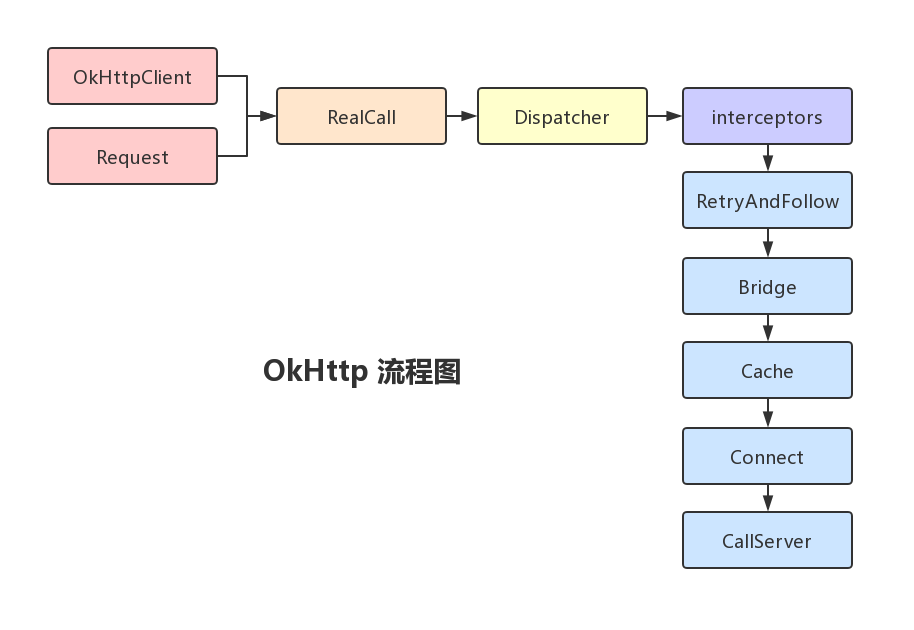

# OkHttp 源码分析：同步请求流程和异步请求流程

在分析同步请求和异步请求相关源码前，我们先来看一下 OkHttp 框架对请求的处理流程大致是怎样的。

## 框架流程

我们知道，OkHttp 其实是一个处理网络请求的框架。同时，它让我们处理网络请求的速度更快也更节省流量。我们来看一张流程图：



首先，我们会创建一个 `OkHttpClient` 的对象，它表示的是处理所有请求的一个客户端的类。在使用它时通常我们只会创建一次，也就是所谓的单例。

接着，我们会创建一个 `Request` 对象，该对象包装了我们请求的 URL 地址、请求方法以及各种各样的请求头。在它内部，是通过构建者模式来进行创建的。

在创建好 `OkHttpClient` 对象和`Request` 对象之后，我们会通过一个 `newCall()` 方法来创建一个 `Call` 对象。`Call` 其实是一个继承自 `Cloneable` 接口的泛型接口，它的一个具体实现类是 `RealCall`。`RealCall` 它代表的就是一个实际的 HTTP 请求，是链接 `Request` 和 `Response` 的一个非常重要的桥梁。

有了 `RealCall` 对象之后，我们就可以通过其 `execute()` 或 `enqueue()` 方法来执行同步或异步的请求。那同步和异步的请求是由 OkHttp 的哪个部分来管理的呢？这就要讲到其中的 `Dispatcher` 类了。`Dispatcher` 是 OkHttp 的一个核心类，它内部维护了一个线程池和三个队列，以分发和执行同步或异步的请求。

OkHttp 中有一个拦截器链的概念，不管是同步还是异步的请求和响应，再执行时都会依次经过拦截器链中每一个拦截器的处理。而 OkHttp 内部主要涉及到下面五个拦截器：

* `RetryAndFollow`: 网络请求失败后进行重试，或者服务器告知重定向时立即重新发起请求。
* `Bridge`: 主要是负责设置内容长度、内容编码、gzip 压缩等这些请求前的操作。
* `Cache`: 负责缓存的管理，当网络请求有符合的缓存时可以支持返回缓存内容给客户端，而不需要真正去请求服务端。
* `Connect`: 为当前请求找到一个合适的连接，当连接可以被复用的话就不用重新创建了，这里主要是涉及到了连接池的概念。
* `CallServer`: 负责向服务器发起真正的请求，并读取响应结果。


## 同步请求流程

我们知道，通过 OkHttp 发起一个同步请求的代码大致是这样的：

```java
OkHttpClient client = new OkHttpClient.Builder().build();
Request request = new Request.Builder().url(url).build();
Response response = client.newCall(request).execute();
```

先来看下 `OkHttpClient` 内部类 `OkHttpClient.Builder` 的构造方法： 

```java
public class OkHttpClient implements Cloneable, Call.Factory, WebSocket.Factory {
  ...
  public static final class Builder {
    ...
    public Builder() {
      dispatcher = new Dispatcher();                      // 1
      protocols = DEFAULT_PROTOCOLS;
      connectionSpecs = DEFAULT_CONNECTION_SPECS;
      eventListenerFactory = EventListener.factory(EventListener.NONE);
      proxySelector = ProxySelector.getDefault();
      if (proxySelector == null) {
        proxySelector = new NullProxySelector();
      }
      cookieJar = CookieJar.NO_COOKIES;
      socketFactory = SocketFactory.getDefault();
      hostnameVerifier = OkHostnameVerifier.INSTANCE;
      certificatePinner = CertificatePinner.DEFAULT;
      proxyAuthenticator = Authenticator.NONE;
      authenticator = Authenticator.NONE;
      connectionPool = new ConnectionPool();              // 2
      dns = Dns.SYSTEM;
      followSslRedirects = true;
      followRedirects = true;
      retryOnConnectionFailure = true;
      callTimeout = 0;
      connectTimeout = 10_000;                            // 3
      readTimeout = 10_000;
      writeTimeout = 10_000;
      pingInterval = 0;
    }

    public OkHttpClient build() {
      return new OkHttpClient(this);
    }
  }
}
```

可以看到，在 `OkHttpClient.Builder` 的构造函数中：
* 在最开始的 `1` 处就创建了 `Dispatcher` 对象，作为 OkHttp 的请求分发器，它决定着请求是直接进行处理还是加入队列中进行等待。
* 然后在 `2` 处创建了一个连接池，它也是 OkHttp 中一个很重要的概念，管理着客户端和服务器的连接 (比如哪些网络连接可以保持打开状态、哪些连接是可以在后面进行复用的)。
* 最后，构造函数中也进行了一些默认参数的设置操作，比如在 `3` 处设置默认的连接超时时间为 10 秒。

获得 `OkHttpClient.Builder` 对象之后，我们就可以可以通过其 `build()` 方法来创建一个 `OkHttpClient` 对象。

另外，`Request` 对象其实也是通过构建者模式来进行创建的，我们也来看下其内部类的构造函数源代码：

```java
public final class Request {
  ...
  public static class Builder {
    @Nullable HttpUrl url;
    String method;
    Headers.Builder headers;
    @Nullable RequestBody body;

    /** A mutable map of tags, or an immutable empty map if we don't have any. */
    Map<Class<?>, Object> tags = Collections.emptyMap();

    public Builder() {
      this.method = "GET";                      // 1
      this.headers = new Headers.Builder();     // 2
    }

    public Request build() {
      if (url == null) throw new IllegalStateException("url == null");
      return new Request(this);
    }

    ...
    }
}
```

可以看到，其构造函数比较简单：
1. 指定默认的请求方法为 `GET`。
2. 创建 `Headers` 内部类 `Headers.Builder` 的对象来保存一些请求头信息。

与前面讲到的创建 `OkHttpClient` 对象类似，在 `build()` 方法中都是通过传入自身到对应构造函数中来创建目标对象，原理很简单，我们来看下 `Request` 的构造函数：

```java
public final class Request {
  final HttpUrl url;
  final String method;
  final Headers headers;
  final @Nullable RequestBody body;
  final Map<Class<?>, Object> tags;

  Request(Builder builder) {
    this.url = builder.url;
    this.method = builder.method;
    this.headers = builder.headers.build();
    this.body = builder.body;
    this.tags = Util.immutableMap(builder.tags);
  }

  ...
}
```

可以看出，在 `Request` 构造函数中，我们只是将 `Request.Builder` 对象中的值赋值给 `Request` 对象而已。

简单总结一下我们前面的两步操作：
1. 创建一个 `OkHttpClient` 对象。
2. 构建一个携带请求信息的 `Request` 对象。

好了，现在进入我们要将的第三步操作，通过 `OkHttpClient` 对象和 `Request` 对象来构建出代表真正请求的 `Call` 对象：

```java
Call call = client.newCall(request);
```

相关源代码如下：

```java
public class OkHttpClient implements Cloneable, Call.Factory, WebSocket.Factory {
  ...
  @Override public Call newCall(Request request) {
    return RealCall.newRealCall(this, request, false /* for web socket */);
  }
}
```

```java
final class RealCall implements Call {
  ...
  static RealCall newRealCall(OkHttpClient client, Request originalRequest, boolean forWebSocket) {
    // Safely publish the Call instance to the EventListener.
    RealCall call = new RealCall(client, originalRequest, forWebSocket);
    call.eventListener = client.eventListenerFactory().create(call);
    return call;
  }
}
```

```java
public interface Call extends Cloneable {
  Request request();
  Response execute() throws IOException;
  void enqueue(Callback responseCallback);
  void cancel();
  boolean isExecuted();
  boolean isCanceled();
  Timeout timeout();

  Call clone();
  interface Factory {
    Call newCall(Request request);
  }
}
```

我们来分析一下 `RealCall` 的构造方法：

```java
final class RealCall implements Call {
  ...
  private RealCall(OkHttpClient client, Request originalRequest, boolean forWebSocket) {
    this.client = client;
    this.originalRequest = originalRequest;
    this.forWebSocket = forWebSocket;
    this.retryAndFollowUpInterceptor = new RetryAndFollowUpInterceptor(client, forWebSocket);
    this.timeout = new AsyncTimeout() {
      @Override protected void timedOut() {
        cancel();
      }
    };
    this.timeout.timeout(client.callTimeoutMillis(), MILLISECONDS);
  }

  @Override public void cancel() {
    retryAndFollowUpInterceptor.cancel();
  }
}
```

```java
package okio;
// This timeout uses a background thread to take action exactly when the timeout occurs.
public class AsyncTimeout extends Timeout { ... } 
```

```java
package okio;
// A policy on how much time to spend on a task before giving up. 
public class Timeout { ... }
```

可以看到：
* 首先，`RealCall` 对象会持有我们之前创建好的 `OkHttpClient` 对象和 `Request` 对象。
* 接着，创建了一个重定向拦截器 `RetryAndFollowUpInterceptor` 对象，拦截器相关分析我们后续文章再讲。
* 最后，还创建了一个 `AsyncTimeout` 对象。`AsyncTimeout` 是 okio 库中的一个类，该类使用后台线程在超时发生时能够精确地执行对应操作。这里的对应操作就是通过 `retryAndFollowUpInterceptor` 来关闭 soket 连接。 


## 异步请求流程

通过 OkHttp 发起一个同步请求的代码大致是这样的：

```java
OkHttpClient client = new OkHttpClient.Builder().build();
Request request = new Request.Builder().url(url).build();
client.newCall(request).enqueue(new Callback() {
    @Override
    public void onFailure(Call call, IOException e) {
        // failed
    }

    @Override
    public void onResponse(Call call, Response response) throws IOException {
        // response
    }
});
```

常见 `OkHttpClient` 和 `Request` 对象的流程与同步请求相同，这里就不再分析了。我们来看下主要的不同点 `enqueue()` 方法。