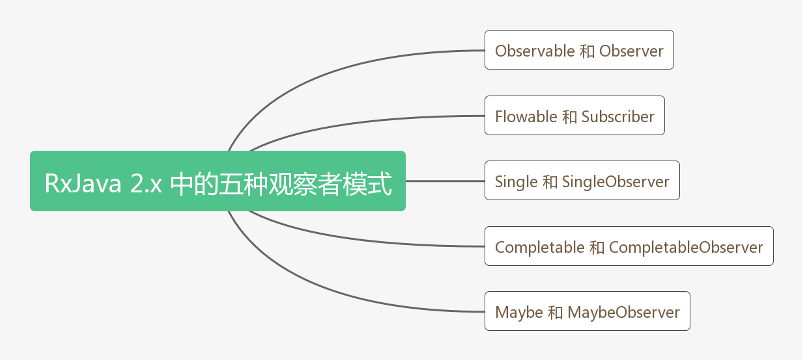
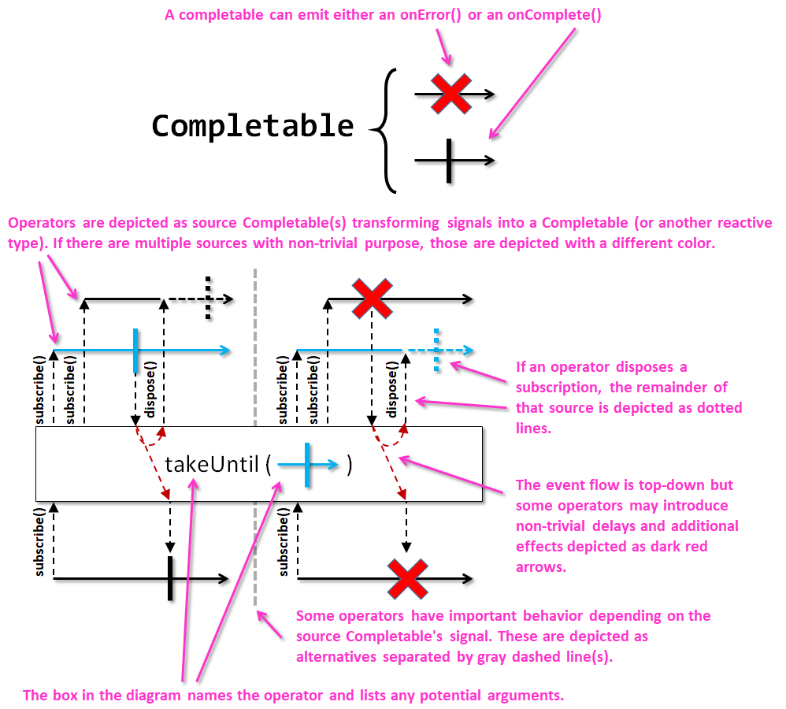
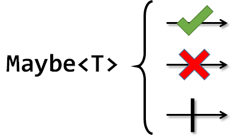

# RxJava 基础知识：五种观察者模式和生命周期

## 五种观察者模式

### 概述

RxJava 2 的 5 种观察者模式如下图：



对应描述如下表：

| 类型 | 描述
| - | -
| `Observable` | 发射 0 或 n 个数据，并以成功或错误事件终止。
| `Flowable` | 发射 0 或 n 个数据，并以成功或错误事件终止。且支持背压，以控制数据源发射的速度。
| `Single` | 只能发射单个数据或错误事件。
| `Completable` | 从不发射任何数据，只处理 `onComplete` 和 `onError` 事件。可以看成 Rx 的 `Runnable`。
| `Maybe` | 发射 0 或 1 个数据，要么成功要么失败。有点类似 `Optional`。

> 可以看出，上述 5 种被观察者类型中只有 `Flowable` 支持背压。如果有需要背压的情况，则必须使用 `Flowable`。


### 源码注释

#### Observable 

io.reactivex   
public abstract class `Observable<T>`  
extends `Object`  
implements `ObservableSource<T>`  

The Observable class is the non-backpressured, optionally multi-valued base reactive class that offers factory methods, intermediate operators and the ability to consume synchronous and/or asynchronous reactive dataflows.

Many operators in the class accept ObservableSource(s), the base reactive interface for such non-backpressured flows, which Observable itself implements as well.  

The Observable's operators, by default, run with a buffer size of 128 elements (see `Flowable.bufferSize()`, that can be overridden globally via the system parameter rx2.buffer-size. Most operators, however, have overloads that allow setting their internal buffer size explicitly.
The documentation for this class makes use of marble diagrams. The following legend explains these diagrams:


The design of this class was derived from the `Reactive-Streams design and specification`  by removing any backpressure-related infrastructure and implementation detail, replacing the org.reactivestreams.Subscription with `Disposable` as the primary means to dispose of a flow.

The Observable follows the protocol

```
    onSubscribe onNext* (onError | onComplete)?
```
where the stream can be disposed through the Disposable instance provided to consumers through Observer.onSubscribe.

Unlike the Observable of version 1.x, `subscribe(Observer)` does not allow external disposal of a subscription and the Observer instance is expected to expose such capability.

Example:

```java
Disposable d = Observable.just("Hello world!")
    .delay(1, TimeUnit.SECONDS)
    .subscribeWith(new DisposableObserver<String>() {
        @Override public void onStart() {
            System.out.println("Start!");
        }
        @Override public void onNext(String t) {
            System.out.println(t);
        }
        @Override public void onError(Throwable t) {
            t.printStackTrace();
        }
        @Override public void onComplete() {
            System.out.println("Done!");
        }
    });

Thread.sleep(500);
// the sequence can now be disposed via dispose()
d.dispose();
```


#### Observer 

io.reactivex   
public interface `Observer<T>`

Provides a mechanism for receiving push-based notifications.
When an Observer is subscribed to an `ObservableSource` through the `ObservableSource.subscribe(Observer)` method, the ObservableSource calls `onSubscribe(Disposable)` with a `Disposable` that allows disposing the sequence at any time, then the ObservableSource may call the Observer's `onNext` method any number of times to provide notifications. A well-behaved ObservableSource will call an Observer's `onComplete` method exactly once or the Observer's `onError` method exactly once.

Calling the Observer's method must happen in a serialized fashion, that is, they must not be invoked concurrently by multiple threads in an overlapping fashion and the invocation pattern must adhere to the following protocol:

```
    onSubscribe onNext* (onError | onComplete)?
```
Subscribing an Observer to multiple ObservableSources is not recommended. If such reuse happens, it is the duty of the Observer implementation to be ready to receive multiple calls to its methods and ensure proper concurrent behavior of its business logic.
Calling `onSubscribe(Disposable)`, `onNext(Object)` or `onError(Throwable)` with a null argument is forbidden.

The implementations of the onXXX methods should avoid throwing runtime exceptions other than the following cases (see Rule 2.13  of the Reactive Streams specification):

* If the argument is null, the methods can throw a NullPointerException. Note though that RxJava prevents nulls to enter into the flow and thus there is generally no need to check for nulls in flows assembled from standard sources and intermediate operators.
* If there is a fatal error (such as VirtualMachineError).
  
Violating Rule 2.13 results in undefined flow behavior. Generally, the following can happen:

* An upstream operator turns it into an `onError` call.
* If the flow is synchronous, the `ObservableSource.subscribe(Observer)` throws instead of returning normally.
* If the flow is asynchronous, the exception propagates up to the component (`Scheduler` or `java.util.concurrent.Executor`) providing the asynchronous boundary the code is running and either routes the exception to the global `io.reactivex.plugins.RxJavaPlugins.onError(Throwable)` handler or the current thread's `Thread.UncaughtExceptionHandler.uncaughtException(Thread, Throwable)` handler.

From the Observable's perspective, an Observer is the end consumer thus it is the Observer's responsibility to handle the error case and signal it "further down". This means unreliable code in the onXXX methods should be wrapped into `try-catch`es, specifically in `onError(Throwable)` or `onComplete()`, and handled there (for example, by logging it or presenting the user with an error dialog). However, if the error would be thrown from `onNext(Object)`, Rule 2.13  mandates the implementation calls Disposable.dispose() and signals the exception in a way that is adequate to the target context, for example, by calling `onError(Throwable)` on the same Observer instance.

If, for some reason, the Observer won't follow Rule 2.13, the `Observable.safeSubscribe(Observer)` can wrap it with the necessary safeguards and route exceptions thrown from onNext into onError and route exceptions thrown from onError and onComplete into the global error handler via `io.reactivex.plugins.RxJavaPlugins.onError(Throwable)`.


#### Flowable 

io.reactivex   
public abstract class `Flowable<T>`  
extends `Object`  
implements `Publisher<T>`  

The Flowable class that implements the Reactive-Streams Pattern and offers factory methods, intermediate operators and the ability to consume reactive dataflows.

Reactive-Streams operates with Publishers which Flowable extends. Many operators therefore accept general Publishers directly and allow direct interoperation with other Reactive-Streams implementations.

The Flowable hosts the default buffer size of 128 elements for operators, accessible via `bufferSize()`, that can be overridden globally via the system parameter rx2.buffer-size. Most operators, however, have overloads that allow setting their internal buffer size explicitly.

The documentation for this class makes use of marble diagrams. The following legend explains these diagrams:


### Subscriber

org.reactivestreams  
public interface `Subscriber<T>`

Will receive call to `onSubscribe(Subscription)` once after passing an instance of `Subscriber` to `Publisher.subscribe(Subscriber)`.

No further notifications will be received until `Subscription.request(long)` is called.

After signaling demand:

* One or more invocations of `onNext(Object)` up to the maximum number defined by `Subscription.request(long)`
* Single invocation of `onError(Throwable)` or `onComplete()` which signals a terminal state after which no further events will be sent.
  
Demand can be signaled via `Subscription.request(long)` whenever the `Subscriber` instance is capable of handling more.


### Single

io.reactivex  
public abstract class `Single<T>`  
extends `Object`  
implements `SingleSource<T>`  

The Single class implements the Reactive Pattern for a single value response.

Single behaves similarly to `Observable` except that it can only emit either a single successful value or an error (there is no "onComplete" notification as there is for an `Observable`).

The Single class implements the `SingleSource` base interface and the default consumer type it interacts with is the `SingleObserver` via the `subscribe(SingleObserver)` method.

The Single operates with the following sequential protocol:

```
    onSubscribe (onSuccess | onError)?
```   

Note that onSuccess and onError are mutually exclusive events; unlike Observable, onSuccess is never followed by onError.
Like Observable, a running Single can be stopped through the `Disposable` instance provided to consumers through `SingleObserver.onSubscribe`.

Like an Observable, a Single is lazy, can be either "hot" or "cold", synchronous or asynchronous. Single instances returned by the methods of this class are cold and there is a standard hot implementation in the form of a subject: SingleSubject.
The documentation for this class makes use of marble diagrams. The following legend explains these diagrams:


See Flowable or Observable for the implementation of the Reactive Pattern for a stream or vector of values.
For more information see the ReactiveX documentation .
Example:

```java
Disposable d = Single.just("Hello World")
  .delay(10, TimeUnit.SECONDS, Schedulers.io())
  .subscribeWith(new DisposableSingleObserver<String>() {
      @Override
      public void onStart() {
          System.out.println("Started");
      }

      @Override
      public void onSuccess(String value) {
          System.out.println("Success: " + value);
      }

      @Override
      public void onError(Throwable error) {
          error.printStackTrace();
      }
  });

Thread.sleep(5000);

d.dispose();
```

Note that by design, subscriptions via `subscribe(SingleObserver)` can't be disposed from the outside (hence the void return of the `subscribe(SingleObserver)` method) and it is the responsibility of the implementor of the SingleObserver to allow this to happen. 

RxJava supports such usage with the standard `DisposableSingleObserver` instance. For convenience, the `subscribeWith(SingleObserver)` method is provided as well to allow working with a SingleObserver (or subclass) instance to be applied with in a fluent manner (such as in the example above).


### 

io.reactivex   
public interface `SingleObserver<T>`

Provides a mechanism for receiving push-based notification of a single value or an error.

When a SingleObserver is subscribed to a `SingleSource` through the `SingleSource.subscribe(SingleObserver)` method, the SingleSource calls `onSubscribe(Disposable)` with a Disposable that allows disposing the sequence at any time. A well-behaved SingleSource will call a SingleObserver's `onSuccess(Object)` method exactly once or the SingleObserver's `onError` method exactly once as they are considered mutually exclusive **terminal signals**.

Calling the SingleObserver's method must happen in a serialized fashion, that is, they must not be invoked concurrently by multiple threads in an overlapping fashion and the invocation pattern must adhere to the following protocol:

```
    onSubscribe (onSuccess | onError)?
```

Subscribing a SingleObserver to multiple SingleSources is not recommended. If such reuse happens, it is the duty of the SingleObserver implementation to be ready to receive multiple calls to its methods and ensure proper concurrent behavior of its business logic.

Calling `onSubscribe(Disposable)`, `onSuccess(Object)` or `onError(Throwable)` with a null argument is forbidden.

The implementations of the onXXX methods should avoid throwing runtime exceptions other than the following cases:

* If the argument is `null`, the methods can throw a **NullPointerException**. Note though that RxJava prevents nulls to enter into the flow and thus there is generally no need to check for nulls in flows assembled from standard sources and intermediate operators.
* If there is a fatal error (such as VirtualMachineError).


### Completable

io.reactivex  
public abstract class `Completable`  
extends `Object`  
implements `io.reactivex.CompletableSource`  

The Completable class represents a deferred computation without any value but only indication for completion or exception.

Completable behaves similarly to `Observable` except that it can only emit either a completion or error signal (there is no onNext or onSuccess as with the other reactive types).

The Completable class implements the `CompletableSource` base interface and the default consumer type it interacts with is the `CompletableObserver` via the `subscribe(CompletableObserver)` method. The Completable operates with the following sequential protocol:

```
    onSubscribe (onError | onComplete)?
```

Note that as with the Observable protocol, onError and onComplete are mutually exclusive events.

Like `Observable`, a running Completable can be stopped through the `Disposable` instance provided to consumers through `SingleObserver.onSubscribe`.

Like an Observable, a Completable is lazy, can be either "hot" or "cold", synchronous or asynchronous. Completable instances returned by the methods of this class are cold and there is a standard hot implementation in the form of a subject: `CompletableSubject`.

The documentation for this class makes use of marble diagrams. The following legend explains these diagrams:



See `Flowable` or `Observable` for the implementation of the Reactive Pattern for a stream or vector of values.

Example:

```java
Disposable d = Completable.complete()
  .delay(10, TimeUnit.SECONDS, Schedulers.io())
  .subscribeWith(new DisposableCompletableObserver() {
      @Override
      public void onStart() {
          System.out.println("Started");
      }

      @Override
      public void onError(Throwable error) {
          error.printStackTrace();
      }

      @Override
      public void onComplete() {
          System.out.println("Done!");
      }
  });

Thread.sleep(5000);

d.dispose();
```

Note that by design, subscriptions via `subscribe(CompletableObserver)` can't be disposed from the outside (hence the void return of the `subscribe(CompletableObserver)` method) and it is the responsibility of the implementor of the CompletableObserver to allow this to happen. RxJava supports such usage with the standard `DisposableCompletableObserver` instance. For convenience, the `subscribeWith(CompletableObserver)` method is provided as well to allow working with a CompletableObserver (or subclass) instance to be applied with in a fluent manner (such as in the example above).


### CompletableObserver

io.reactivex  
public interface `CompletableObserver`  

Provides a mechanism for receiving push-based notification of a valueless completion or an error.

When a CompletableObserver is subscribed to a `CompletableSource` through the `CompletableSource.subscribe(CompletableObserver)` method, the CompletableSource calls `onSubscribe(Disposable)` with a `Disposable` that allows disposing the sequence at any time. A well-behaved CompletableSource will call a CompletableObserver's `onError(Throwable)` or `onComplete()` method exactly once as they are considered mutually exclusive terminal signals.

Calling the CompletableObserver's method must happen in a serialized fashion, that is, they must not be invoked concurrently by multiple threads in an overlapping fashion and the invocation pattern must adhere to the following protocol:

```
    onSubscribe (onError | onComplete)?
```

Subscribing a CompletableObserver to multiple CompletableSources is not recommended. If such reuse happens, it is the duty of the CompletableObserver implementation to be ready to receive multiple calls to its methods and ensure proper concurrent behavior of its business logic.

Calling `onSubscribe(Disposable)` or `onError(Throwable)` with a null argument is forbidden.

The implementations of the onXXX methods should avoid throwing runtime exceptions other than the following cases:

* If the argument is null, the methods can throw a NullPointerException. Note though that RxJava prevents nulls to enter into the flow and thus there is generally no need to check for nulls in flows assembled from standard sources and intermediate operators.
* If there is a fatal error (such as VirtualMachineError).


### Maybe

io.reactivex  
public abstract class `Maybe<T>`  
extends `Object`  
implements `MaybeSource<T>`

The Maybe class represents a deferred computation and emission of a single value, no value at all or an exception.

The Maybe class implements the `MaybeSource` base interface and the default consumer type it interacts with is the `MaybeObserver` via the `subscribe(MaybeObserver)` method.

The Maybe operates with the following sequential protocol:

```
    onSubscribe (onSuccess | onError | onComplete)?
```
   
Note that onSuccess, onError and onComplete are mutually exclusive events; unlike Observable, onSuccess is never followed by onError or onComplete.

Like `Observable`, a running Maybe can be stopped through the `Disposable` instance provided to consumers through `MaybeObserver.onSubscribe`.

Like an Observable, a Maybe is lazy, can be either "hot" or "cold", synchronous or asynchronous. Maybe instances returned by the methods of this class are cold and there is a standard hot implementation in the form of a subject: `MaybeSubject`.

The documentation for this class makes use of marble diagrams. The following legend explains these diagrams:



See `Flowable` or `Observable` for the implementation of the Reactive Pattern for a stream or vector of values.

Example:

```java
Disposable d = Maybe.just("Hello World")
  .delay(10, TimeUnit.SECONDS, Schedulers.io())
  .subscribeWith(new DisposableMaybeObserver<String>() {
      @Override
      public void onStart() {
          System.out.println("Started");
      }

      @Override
      public void onSuccess(String value) {
          System.out.println("Success: " + value);
      }

      @Override
      public void onError(Throwable error) {
          error.printStackTrace();
      }

      @Override
      public void onComplete() {
          System.out.println("Done!");
      }
  });

Thread.sleep(5000);

   d.dispose();
```

Note that by design, subscriptions via `subscribe(MaybeObserver)` can't be disposed from the outside (hence the void return of the `subscribe(MaybeObserver)` method) and it is the responsibility of the implementor of the MaybeObserver to allow this to happen. RxJava supports such usage with the standard `DisposableMaybeObserver` instance. For convenience, the `subscribeWith(MaybeObserver)` method is provided as well to allow working with a MaybeObserver (or subclass) instance to be applied with in a fluent manner (such as in the example above).


### MaybeObserver

io.reactivex  
public interface `MaybeObserver<T>`

Provides a mechanism for receiving push-based notification of a single value, an error or completion without any value.

When a MaybeObserver is subscribed to a `MaybeSource` through the `MaybeSource.subscribe(MaybeObserver)` method, the MaybeSource calls `onSubscribe(Disposable)` with a `Disposable` that allows disposing the sequence at any time. A well-behaved MaybeSource will call a MaybeObserver's `onSuccess(Object)`, `onError(Throwable)` or `onComplete()` method exactly once as they are considered mutually exclusive terminal signals.

Calling the MaybeObserver's method must happen in a serialized fashion, that is, they must not be invoked concurrently by multiple threads in an overlapping fashion and the invocation pattern must adhere to the following protocol:

```
    onSubscribe (onSuccess | onError | onComplete)?
```

Note that unlike with the Observable protocol, `onComplete()` is not called after the success item has been signalled via `onSuccess(Object)`.

Subscribing a MaybeObserver to multiple MaybeSources is not recommended. If such reuse happens, it is the duty of the MaybeObserver implementation to be ready to receive multiple calls to its methods and ensure proper concurrent behavior of its business logic.

Calling `onSubscribe(Disposable)`, `onSuccess(Object)` or `onError(Throwable)` with a null argument is forbidden.
The implementations of the onXXX methods should avoid throwing runtime exceptions other than the following cases:

* If the argument is null, the methods can throw a NullPointerException. Note though that RxJava prevents nulls to enter into the flow and thus there is generally no need to check for nulls in flows assembled from standard sources and intermediate operators.
* If there is a fatal error (such as VirtualMachineError).


## 声明周期

RxJava 提供的一些列 **do 操作符** 使得我们可以在 `Observable` 的生命周期的各个阶段加上一系列的回调监听，当 `Observable` 执行到某一阶段时就会触发对应的回调。

比如下面的栗子，基本包含了 `Observable` 的完整生命周期：

```java
Observable.just("Hello")
        .doOnNext(new Consumer<String>() {
            @Override
            public void accept(String s) throws Exception {
                System.out.println("doOnNext: " + s);
            }
        })
        .doAfterNext(new Consumer<String>() {
            @Override
            public void accept(String s) throws Exception {
                System.out.println("doAfterNext: " + s);
            }
        })
        .doOnComplete(new Action() {
            @Override
            public void run() throws Exception {
                System.out.println("doOnComplete.");
            }
        })
        .doOnSubscribe(new Consumer<Disposable>() {
            @Override
            public void accept(Disposable disposable) throws Exception {
                System.out.println("doOnSubscribe.");
            }
        })
        .doAfterTerminate(new Action() {
            @Override
            public void run() throws Exception {
                System.out.println("doAfterTerminate.");
            }
        })
        .doFinally(new Action() {
            @Override
            public void run() throws Exception {
                System.out.println("doFinally.");
            }
        })
        .doOnEach(new Consumer<Notification<String>>() {
            @Override
            public void accept(Notification<String> stringNotification) throws Exception {
                String text = stringNotification.isOnNext() ? "onNext"
                        : stringNotification.isOnComplete() ? "onComplete"
                            : "onError";
                System.out.println("doOnEach: " + text);
            }
        })
        .doOnLifecycle(new Consumer<Disposable>() {
            @Override
            public void accept(Disposable disposable) throws Exception {
                System.out.println("doOnLifecycle: " + disposable.isDisposed());
            }
        }, new Action() {
            @Override
            public void run() throws Exception {
                System.out.println("doOnLifecycle run.");
            }
        })
        .subscribe(new Consumer<String>() {
            @Override
            public void accept(String s) throws Exception {
                System.out.println("收到消息.");
            }
        });
```

日志输出：

```java
doOnSubscribe.
doOnLifecycle: false
doOnNext: Hello
doOnEach: onNext
收到消息.
doAfterNext: Hello
doOnComplete.
doOnEach: onComplete
doFinally.
doAfterTerminate.
```

上面的日志输出表明了 RxJava 的内部数据流向。一开始是 `doOnSubscribe`，然后在观察者消费完之后，再执行 `doFinally`、`doAfterTerminate`。

下面是对这些 `do 操作符` 用途的一个总结表：

| 操作符 | 用途
| - | -
| `doOnSubscribe` | 一旦观察者订阅了 `Observable`，他就会被调用。
| `doOnLifecycle` | 可以在观察者订阅之后，设置是否取消订阅。
| `doOnNext` | 对应 `Observable` 每发射一项数据就会被调用一次，其 `Consumer` 可接收发射的数据，一般用于在 `subscribe` 之前对数据进行处理。
| `doOnEach` | 对应 `Observable` 每发射一项数据就会被调用一次，不仅包括 `onNext`，还包括 `onError` 和 `onCompleted`。
| `doAfterNext` | 在 `onNext` 之后执行 (`doOnNext` 是在 `onNext` 之前执行)。
| `doOnComplete` | 对应 `Observable` 