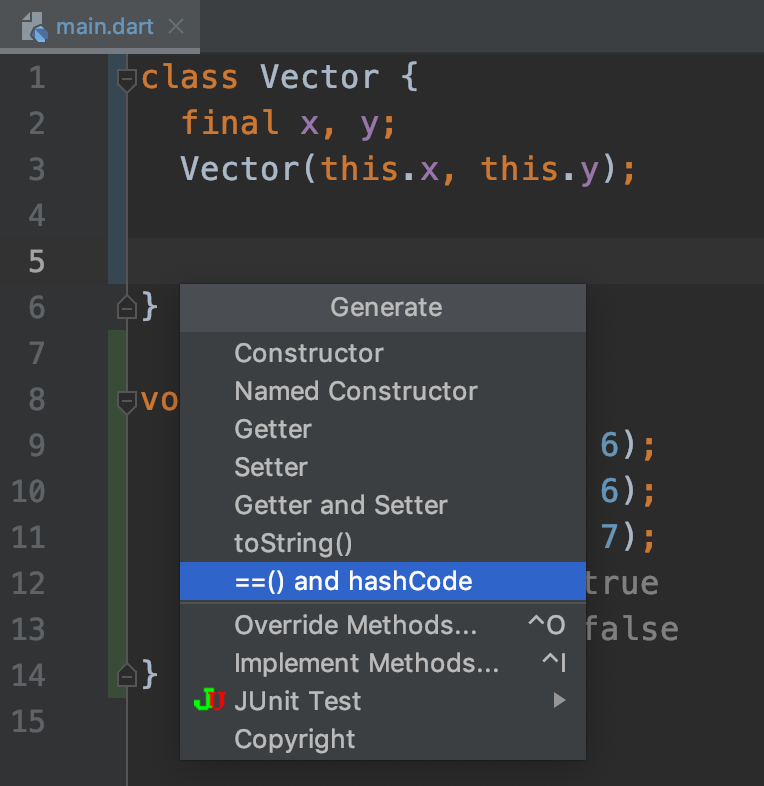

# Dart 笔记：A tour of the Dart language

## 序言

事实上，在 2018 年的时候就练习过一段时间 Flutter，转眼间现在已经是 2019 年下半年，而且 Flutter 的热度在这期间一直在蹭蹭蹭的往上涨。加上目前自己对 TypeScript 和 React Native 的熟练程度已经能满足大多数场景下的开发，所以想将主要精力往 Flutter 上倾斜一点。自然而然就有了 "Dart 笔记" 这一系列文章，以系统的学习 Dart 并记录这一过程。


## 搭建环境

之前尝试了使用 VSCode 写 Flutter，发现并没有像写 React Native 那么趁手，所以切换到了 IntelliJ IEAD 社区版。从此以后，我开发相关的主要工具变成了酱紫：
* Android Studio: 开发 Android 应用。
* IntelliJ IDEA (Community Edition): 开发 Flutter 跨平台应用。
* VSCode: 开发 React 和 React Native 应用。

那么，我们怎么在 Mac 上基于 IntelliJ IDEA 来搭建 Dart 学习环境呢？

### 安装插件

假设你现在已经安装好了 IDEA：
* 点击左上角的 "IntelliJ IEAD -> Preferences"。
* 然后选择 "Plugins"，点击 "Marketplace" 标签。
* 搜索并安装 "Dart" 和 "Flutter" 插件。

因为我已经安装好了这两个插件，所以在 "Installed" 标签下也能看到相关信心，如下图：


如果我们点击这两个插件的标题，便可打开对应的插件信息详情页面，比如：


### 创建 Dart 项目

安装好这两款插件后，我们就可以开始创建 Dart 项目了。

点击左上角的 "File -> New -> New Project" 后，可以看到下图：


然后点击 "Next"，输入项目的名称 "dart-note"，此时看到的页面大概是这样的：


然后，点击 "Finish" 即可完成创建，创建成功后：


这时我们主要是得到两个文件：
* `pubspec.yaml`: Dart 项目的配置文件，类似 React Native 中的 `package.json`。
* `dart-note.dart`: Dart 代码文件，默认有一个无参数的 `main()` 方法。

点击工具栏的 "播放/执行" 按钮，我们可以在控制台中看到以下输出信息：

```
/usr/local/dart-sdk/bin/dart --enable-asserts --enable-vm-service:52895 /Users/zhuanghongji/Documents/Develop/GitHub/dart-note/bin/dart-note.dart
Observatory listening on http://127.0.0.1:52895/L9q5mhMLuI8=/

Hello, World!

Process finished with exit code 0
```

`Hello, World!` 这行不用说了，我们来看下第一行：

```shell
/usr/local/dart-sdk/bin/dart --enable-asserts --enable-vm-service:52895 /Users/zhuanghongji/Documents/Develop/GitHub/dart-note/bin/dart-note.dart
```

这行输出日志是说：
* 执行 `/usr/local/dart-sdk/bin/` 目录下的 `dart` 命令
* 执行参数有 `--enable-asserts` 和 `--enable-vm-service:52895`
* 目标文件路径是 `/Users/zhuanghongji/Documents/Develop/GitHub/dart-note/bin/dart-note.dart`.

不信的话我们可以手动来执行以下，打开底部的 Terminal 标签：

```shell
zhuanghongji-mbp:dart-note zhuanghongji$ dart --version
Dart VM version: 2.4.0 (Wed Jun 19 11:53:45 2019 +0200) on "macos_x64"
zhuanghongji-mbp:dart-note zhuanghongji$ dart ./bin/dart-note.dart 
Hello, World!
zhuanghongji-mbp:dart-note zhuanghongji$ 
```

在上面命令中，我们先来通过查看 `dart --version` 查看 dart 命令是否已经配置好，然后执行 `dart ./bin/dart-note.dart` 来编译并执行 `dart-note.dart` 文件，再然后就可以看到熟悉的 `Hello, World!` 了。

哈，现在相信我了吧。

### 注意事项

事实上，搭建 Dart 学习环境可能并没有这么轻松。因为在上述步骤中，我有意忽略了 "安装 Dart SDK" 这一步骤。按道理来说，安装 Dart SDK 的优雅姿势是这样的：

```shell
# install
$ brew tap dart-lang/dart
$ brew install dart            // 安装稳定版
$ brew install dart --devel    // 安装dev版
```

然而我这边一直停留在 "Downloading..." 这一步骤直至报错，而且 Fang Qiang 也解决不了这个问题。希望你不会有此困境，哈哈哈。那如果遇到了呢？车到山前必有路：
* 点击报错信息中的链接直接下载 Dart SDK
* 然后将下载好的 `.zip` 文件解压到某个目录
* 接着配置 Dart 相关的路径
* 执行 `dart --version` 命令验证是否配置成功。

> 正因为我遇到了这个问题，所以在上文创建 Dart 项目时你会看到 Dart SDK 路径配置是 `/usr/local/dart-sdk`。

看到这里你可能会想我现在用的是 Windows 电脑怎么办，或者你还不确切知道怎么解决 Dart SDK 下载失败的问题。没关系，我在网络上看到了一篇文章，[点此查看](https://blog.csdn.net/weixin_41000111/article/details/82056210)。

看完这篇文章还不知道怎么搭建 Dart 学习环境的话，请拨打 10086 找我的朋友进行咨询。毕竟，我每个月都给它钱 ...

搭建好了 Dart 学习环境后，开始踏上 Dart 语言学习的征途。


## 一个基本的 Dart 程序

下面的代码片段使用到了一些 Dart 最基本的特性：

```dart
// 定义一个函数
printInteger(int aNumber) {
  print('The number is $aNumber.'); 
}

// Dart 代码开始执行的地方
main() {
  var number = 42;       // 声明并初始化一个变量
  printInteger(number);  // 调用一个函数
}
```

执行后，可以看到控制台输出：

```dart
The number is 42.
```

可以看到，上面的代码片段看起来跟 Java 差不多，不同在于：
1. 作为程序执行入口的 `main()` 方法可以没有参数，而且声明该方法时并没有 `private` `public` 等范围限定符，也不要加个 `void` 来说明该方法没有返回值。
2. 声明方法 (不管是特殊的 `main()` 方法还是其它普通方法) 时都不一定要声明在类中，可以像 JavaScript 一样声明顶层函数。
3. 变量的声明可以不指明其类型。
4. ...

解析上面提到的不同之处：
1. 在 Dart 中，方法的限定范围是通过下划线 `_` 的指定的，比如说 `_printInteger()` 和 `_number` 表示该方法或变量是私有的，在外部是不能访问到的。而 `printInteger()` 和 `number`表示该方法或变量是公开的，外部是可以访问的。另外，Dart 中的每个函数都有返回值，没有显式声明的话表示该函数的返回值为 `null`。
2. Dart 支持顶级 (top-level) 函数，可以独立于类进行而存在，变量也是如此。
3. Dart 支持类型推导，在声明是可以不显式指定其类型，这时候编译器会对其进行类型推导。比如上面代码片段中的 `number` 会被推导成 `int` 类型。
4. 呃.. 都省略了还让我怎么解析...


## 变量

在 Dart 中，变量的声明主要有以下几种形式：

```dart 
var name = 'Bob';       // 1
String name = 'Bob';    // 2
dynamic name = 'Bob';   // 3
```

1. 声明一个变量并进行初始化，该变量名为 `name` 并且存储了一个索引，该索引指向一个值为 `Bob` 的 `String` 对象。同时，该变量会被推导出其类型为 `String`，不可以将其指向其它类型的值。比如说，当我们想通过 `name = 123;` 来对其进行赋值时，编辑器会提示错误： `A value of type 'int' can't be assigned to a variable of type 'String'`。
2. 跟方式 1 相同，但明确指明了变量的类型。
3. 声明了一个不受单一类型限制的变量，也就是说，我们我们可以对该变量赋任何类型的值，编译时不会报错，运行时如果没有发生异常的话也是不会报错的。比如说：

```dart
dynamic name = 'Bob'; 
name = 123; 
print(name - 123 == 0);   // true
```


### 默认值

没有进行初始化的变量默认值都是 `null`，即使是显示声明了数值类型也是这样。因为在 Dart 中一切皆对象，数值也不例外。

```dart 
int lineCount;
print(lineCount == null);   // true
```

### final 和 const 

如果你从不想修改变量的值，可以使用 `final` 和 `const` 来代替 `var` 来修饰变量：
* `final`: 表示该变量只可以被赋值一次。
* `const`: 表示该变量的值是一个编译时的恒定值，同时也意味着是 `final` 的。

看上去好像功能一样，其实不然，看下面代码：

```dart
var a = 'Hello';

final b = a;    // 不会报错
const c = a;    // Error: Not a constant expression.
```

也就是说，实例变量可以是 `final` 但不可以是 `const` 的，因为声明为 `const` 的变量的值是需要在编译器就能确定的，显然上面 `const c = a;` 中的 `a` 的值是运行时才能确定的。

**`final`**

`final` 修饰的变量必须在构造函数体执行之前初始化，比如：
* 在声明变量的同时就初始化其值；
* 通过构造函数参数进行初始化；
* 在构造函数的 "初始化列表" 中初始化。

举个栗子：

```dart
// 声明变量并初始化值
final name = 'Bob';
final String nickname = 'Boddy';

// 此时如果尝试修改 name 变量的值，会提示：The name 'name' is already defined.
name = 'Alice';
```

**`const`**

使用 `const` 关键字意味着你预期的一个编译时常量，在声明赋值时设置一个编译时能确定的值即可，比如数字、字符串或能直接计算出来的一个值。另外，如果想在 class 级别声明常量 (const variable)，需要使用 `static const` 进行修饰，否则编辑器会提示错误。

举个栗子：

```dart
const bar = 1000000;
const double atm = 1.01325 * bar;    // 编译时能计算出来的值

class Foo {
  static const a = 'aaaa';

  // Error: Only static fields can be declared as const.
  // Try using 'final' instead of 'const', or adding the keyword 'static'.
  const b = 'aaaa';
}
```

实际应用中，`const` 除了可以用来声明常量外，还可以用来创建常量值：

```dart
var foo = const [];
final bar = const [];
const baz = [];         // 等同于 `const [];`

void main() {
  foo = [1, 2, 3];
  print(foo);           // [1, 2, 3]

  baz = [42];           // Error: constant variable can't be assigned a value.
}
```


## 内建类型

### Numbers

与 JavaScript 类似，Dart 中也有一个 number (`num`) 类型，可用来表示整数或浮点数。特别的是，Dart 对整数和浮点数做了细分，分别细分为 `int` 和 `double`，比如：

```dart
num a1 = 1;
num b1 = 1.2;

int a2 = 1;
double b2 = 1.2;

print(a1 == a2);  // true
print(b1 == b2);  // true
```

从源码来看，`int` 和 `double` 都是 `num` 的子类：

```dart 
part of dart.core;
abstract class num implements Comparable<num> {
  bool operator ==(Object other);
  num operator +(num other);
  num operator -(num other);
  num operator *(num other);
  double operator /(num other);
  num abs();
  int round();
  ...
}

part of dart.core;
abstract class int extends num {
  ...
}

part of dart.core;
abstract class double extends num {
  ...
}
```

另外，从 `num` 的源码可以看到，其内部已经定义了加减乘除等操作符，同时也定义了 `abs()` 和 `round()` 等示例方法。更多关于数字运算的相关方法，可以在 `dart:math` 中找到：

Dart SDK: `math/math.dart`

```dart
library dart.math;

part "jenkins_smi_hash.dart";
part "point.dart";
part "random.dart";
part "rectangle.dart";

external T min<T extends num>(T a, T b);
external T max<T extends num>(T a, T b);
external double sqrt(num x);
...
```

其中 `random.dart` 完整源代码如下：

```dart
part of dart.math;
abstract class Random {
  external factory Random([int seed]);
  external factory Random.secure();
  int nextInt(int max);
  double nextDouble();
  bool nextBool();
}
```

举个 `dart:math` 使用栗子：

```dart
import 'dart:math';

void main() {
  Random random = Random();
  num a = random.nextInt(10);  // 6
  num b = random.nextInt(10);  // 1
  num max = max(a, b);         // 6
}
```

### Strings 

在 Dart 中，我们可以通过单引号或双引号来创建一个字符串，比如：

```dart
var s1 = '单引号字符串';
var s2 = "双引号字符串";
var s3 = '最右边嵌入了一个转义的单引号 \'';
var s4 = "在双引号字符串嵌入单引号时，可以不转义 '";

print(s1);  // 单引号字符串
print(s2);  // 双引号字符串
print(s3);  // 最右边嵌入了一个转义的单引号 '
print(s4);  // 双引号字符串嵌入单引号时可以不转义 '
```

现代编程语言都有一个模板字符串的概念，Dart 有吗？有的：

```dart
var name = '小明';
var age = 18;
var profile =
    "有个人名字叫$name，今年$age岁。他的名字长度为${name.length}，${age > 17 ? '已' : '未'}成年。";
print(profile);  // 有个人名字叫小明，今年18岁。他的名字长度为2，已成年。
```

可以看到，在 Dart 字符串中我们可以通过 `$variable` 来嵌入变量值，通过 `${expression}` 来嵌入一个表达式。 

现代编程语言一般也都支持多行字符串，Dart 也支持吗？当然：

```dart
void main() {
  var multiLineStr1 = '''第一行
  第二行
  第三行
  ''';

  var multiLineStr2 = '''
  第一行
  第二行
  第三行
  ''';

  var multiLineStr3 = '''
    第一行
     第二行
      第三行
  ''';

  var multiLineStr4 = '''
第一行
第二行
第三行
  ''';

  print(multiLineStr1);
  print(multiLineStr2);
  print(multiLineStr3);
  print(multiLineStr4);
}
```

打印结果如下：

```dart
第一行
  第二行
  第三行
  
  第一行
  第二行
  第三行
  
    第一行
     第二行
      第三行
  
第一行
第二行
第三行
```

注意前面的空格，并自己总结下规律。另外，使用双引号也是可以创建多行字符的，比如：

```dart
void main() {
  var example1 = """
It's a beautil day we're looking for something dumb to do.
hey baby i think i wanna marry you.
...
  """;

  var singer = 'Bruno Mars';
  var example2 = '''
The singer is '$singer', length of his name is ${singer.length}.
  ''';

  print(example1);
  print(example2);
}
```

打印结果如下：

```
It's a beautil day we're looking for something dumb to do.
hey baby i think i wanna marry you.
...
  
The singer is 'Bruno Mars', length of his name is 10.
```

可见：
* 单引号创建多行字符串时是可以自由嵌入单引号，不需要进行转义。
* 多行字符串中也是可以自由使用模板的。

再说下 Dart 字符串两个比较有意思的特性。

特性一：链接字符串时可以不使用加号。

```dart
var a = 'ABC'
    'DEFG';
var b = 'ABCDEFG';
print(a == b);        // true
```

特性二：可以使用原始字符串。

```dart
void main() {
  var rawStr = r'原始字符串，不会对 \n 进行转义。';
  var multiRawStr = r'''
多行原始字符串，不会对 \n 进行转义。
多行原始字符串，不会对 \n 进行转义。
''';
  print(rawStr);
  print(multiRawStr);
}
```
```
原始字符串，不会对 \n 进行转义。
多行原始字符串，不会对 \n 进行转义。
多行原始字符串，不会对 \n 进行转义。
```

### Lists

Dart 并没有像 Java 那样将 Array 和 List 区分开，而是将两者视为同一个事物。一个简单的 Dart 集合 (List) 如下：

```dart
var list = [1, 2, 3];
```

注：上面的 `list` 会被推导为 `List<int>` 对象，如果你想将非 `int` 类型的对象添加进该集合，编辑器会提示错误。

```dart
// Error: The argument type 'String' can't be assigned to the parameter type 'int'.
list.add('a');
```

`List` 索引从 0 开始，即第一个对象索引为 `0`，最后一个对象索引为 `list.length - 1`。

```dart
var list = [1, 2, 3];
print(list.length == 3);  // true
print(list[1]);           // 2

list[1] = 1;
print(list[1]);           // 1
```

在写 JavaScript 的时候，我们可以对 "不在数组索引" 范围内的对象进行赋值。那么在 Dart 中行不行呢？不行，如果我们想通过 `list[9] = 9` 来修改上面的 `list` 的值，运行时会报错：

```dart
Unhandled exception:
RangeError (index): Invalid value: Not in range 0..2, inclusive: 9
#0      List._setIndexed (dart:core-patch/growable_array.dart:151:72)
#1      List.[]= (dart:core-patch/growable_array.dart:148:5)
#2      main (file:///Users/zhuanghongji/Documents/Develop/GitHub/dart-tour/bin/main.dart:9:7)
#3      _startIsolate.<anonymous closure> (dart:isolate-patch/isolate_patch.dart:301:19)
#4      _RawReceivePortImpl._handleMessage (dart:isolate-patch/isolate_patch.dart:172:12)
```

前面我们讲过，可以通过 `const` 来声明编译时常量，`List` 也适用于该规则：

```dart
var constantList = const [1, 2, 3];
// constantList[1] = 1;   // Uncommenting this causes an error.
```

在 Dart 2.3 中新增了 `...` 和 `...?` 扩展操作符，通过该语法我们可以很简洁地将多个元素插入到某个集合中，比如：

```dart
var list = [1, 2, 3];
var list2 = [0, ...list];
print(list2);    // [0, 1, 2, 3]
```

```dart
var list;
var list2 = [0, ...?list];
print(list2);   // [0]
```

在 Dart 2.3 中，我们除了可以通过扩展操作符语法进行集合插入操作外，也可以使用 `if` 和 `for` 语法：

```dart
var addFour = true;
var nav = [
  '一',
  '二',
  '三',
  if (addFour) '四',
];
print(nav);               // [一, 二, 三, 四]
```

```dart
var numbers = [1, 2, 3];
var numberStrings = [
  '#0',
  for (var i in numbers) '#$i',
];
print(numberStrings);     // [#0, #1, #2, #3]
```

### Sets

Dart 中的 `Set` 和 Java 中的类似，都是表示一个子项唯一且无序的集合，语法如下：

```dart
var colors1 = {'red', 'green', 'blue'};
print(colors1);    // {red, green, blue}

var colors2 = {'red', 'green', 'blue', 'blue'};
print(colors2);    // {red, green, blue}
```

上面代码片段中的 `colors1` 和 `colors2` 都被推导为 `Set<String>` 类型，特别的是创建 `colors2` 时即使从字面量上来看 `'blue'` 重复了但也不会报错，使用时 (打印时) 会自动对 `blue` 去重。

结合前面的 `List` 和扩展操作符，我们可以很优雅的对一个集合进行去重：

```dart
var colors = ['red', 'green', 'blue', 'red', 'green'];
var colorsUnique = {...colors};
print(colorsUnique);    // {red, green, blue}
```

我们可以通过 `{}` 来创建一个空的 `Set` 集合，或者讲一个 `Set` 集合置空：

```dart
var names1 = <String>{};
print(names1.length);   // 0

Set<String> names2 = {'a', 'b'};
names2 = {};
print(names2.length);   // 0
```

同 `List`，在 `Set` 中也可以使用 `if` 和 `for` ：

```dart
var names = {
  'zhangsan',
  'lishi',
  if (true) 'wangwu',
  for (var i in [1, 1, 2]) 'other$i',
};
print(names);
```

### Maps 

`Map` 的语法与 `Set` 很类似，都是使用花括号 `{}` 来创建或置空，不同点在于 `Map` 在花括号中有着一个 Key 到 Value 的映射关系。举两个栗子：

```dart
var namesMap1 = {
  'first': 'zhangsan',
  'second': 'lisi',
  'third': 'wangwu',
};
print(namesMap1);  // {first: zhangsan, second: lisi, third: wangwu}

var namesMap2 = {
  3: 'zhangsan',
  4: 'lisi',
  5: 'wangwu',
};
print(namesMap2);  // {3: zhangsan, 4: lisi, 5: wangwu}
```

在上面的代码片段中，`namesMap1` 的类型被推导为 `Map<String, String>`，而 `namesMap2` 的类型被推导为 `Map<int, String>`。

现在知道咋创建 `Map` 对象了，那我们怎么读取或进行赋值呢？如下：

```dart
print(namesMap1['second']);             // lisi
namesMap1['second'] = 'zhuanghongji';
print(namesMap1);                       // {first: zhangsan, second: zhuanghongji, third: wangwu}

print(namesMap2[5]);                    // wangwu
namesMap2[5] = 'zhuanghongji';
print(namesMap2);                       // {3: zhangsan, 4: lisi, 5: zhuanghongji}
```

有意思的是，在创建 `Map` 时即使 Key 重复了也不会报错：

```dart
var namesMap = {
  3: 'zhangsan',
  4: 'lisi',
  5: 'wangwu',
  5: 'other',
};
print(namesMap);  // {3: zhangsan, 4: lisi, 5: other}
```

可以看到在创建时有两个为 `5` 的重复的 Key，创建后以最后一个重复 Key 的值为准。所以在上面的打印结果中，我们看 Key `5` 对应的值不是 `wangwu`，而是 `other`。


要注意的是：
* 在 `Map` 中读去不存在的 Key 时，返回值为 `null`。
* 在通过 `[]` 读取 `Map` 中对应 Value 时 Key 的是不受类型约束的，但在写时 Key 是受类型约束的。
 
不信你看：

```dart
print(namesMap1['notExitsKey']);    // null
print(namesMap1[0]);                // null   注：没有提示类型错误

print(namesMap2[666]);              // null
print(namesMap2['1']);              // null   注：也没有提示类型错误

// 编辑器会提示类型错误
// Error: A value of type 'int' can't be assigned to a variable of type 'String'.
namesMap1[0] = 'testValue';            

// 编辑器会提示类型错误
// Error: A value of type 'String' can't be assigned to a variable of type 'int'.
namesMap2['testKey'] = 'testValue';    
```

Map 的增加或移除操作：

```dart
var gifts = {'first': '口红'};   

gifts['second'] = '粉底液';      // {first: 口红, second: 粉底液}
gifts.addAll({
  'third': '项链',
  'fourth': '戒指',
});                             // {first: 口红, second: 粉底液, third: 项链, fourth: 戒指}

gifts.remove('second');         // {first: 口红, third: 项链, fourth: 戒指}
gifts.removeWhere((key, value) => key == 'third' || key == 'fourth');   // {first: 口红}
gifts.clear();                  // {}
```

仔细看不会发现，`Map` 并没有 `add(key, value)` 这样的方法，新增单个 key/value 时只能使用 `map[] = value` 语法。 


## 函数

在 Dart 中，函数也是对象，其类型为 `Function`。这意味着函数对象可以赋值给某个变量，或作为参数传入到另一个函数中。我们先来看下如何声明一个函数：

```dart
bool isEvenNumber(int number) {
  return number % 2 == 0;
}
```

在上面的代码片段中，我们声明了一个名为 `isEvenNumber` 的函数，它接收一个类型为 `int`、名为 `number` 的参数，返回值类型为 `bool`。

尽管在 Effective Dart 中推荐为公开函数声明类型，实际上我们不这么做也可以 (但在编译期间无法提前发现类型错误问题)：

```dart
isEvenNumber(number) {
  return number % 2 == 0;
}

void main() {
  print(isEvenNumber(2));     // false
  print(isEvenNumber('2'));   // NoSuchMethodError: Class 'String' has no instance method '/'.
}
```

如果函数仅有一个表达式，我们可以使用箭头语法进行简化：

```dart
bool isEvenNumber(int number) => number % 2 == 0;
```

怎么来理解上面的代码？在脑海中将 `=> expr` 替换成 `{ return expr; }` 试试就知道了。

函数中的参数可分为两种：必要的和可选的。
* 同时使用必要参数和可选参数时，必要参数需放在可选参数前面。
* 可选参数的声明形式要么是 "命名参数"，要么是 "位置参数"，不能同时以两种形式存在。
* 某个具体命名参数不传值时，默认为 `null`。

下面我们来先声明一个命名参数函数，在参数列表位置使用 `{}` 语法：

```dart
void enableFlags({bool bold, bool hidden}) {
  print('bold = $bold, hidden = $hidden.');
}
```

此时，调用姿势变成了酱紫：

```dart
enableFlags(bold: true);                   // bold = true, hidden = null.
enableFlags(bold: true, hidden: false);    // bold = true, hidden = false.
```

呃.. 可以看到在调用 `enableFlags` 函数时如果我们不传 `hidden` 的值，则默认为 `null`。如果你不喜欢默认值为 `null`，可以稍微调整下参数声明的逻辑。比如，我们希望 `hidden` 的默认值为 `true`：

```dart
void enableFlags({bool bold, bool hidden = true}) {
  print('bold = $bold, hidden = $hidden.');
}

enableFlags(bold: true);    // bold = true, hidden = true.
```

呃.. 好像让 `hidden` 默认值为 `true` 也不太好，能不能在使用命名参数的同时指定某个参数是必须要调用者提供的？当然可以，使用 `@required` 注明即可，完整示例代码如下：

```dart
import 'package:meta/meta.dart';

void enableFlags({bool bold, @required bool hidden}) {
  print('bold = $bold, hidden = $hidden.');
}

void main() {
  enableFlags(bold: true, hidden: false);
}
```

下面是使用 `@required` 的三点注意事项：

第一点：`@required` 并不是 Dart SDK 的一部分，在使用时需要依赖 [meta](https://pub.dev/packages/meta) 包，并导入 `package:meta/meta.dart`。

```yaml
name: dart_tour
version: 0.0.1
description: A sample command-line application
dependencies:
  meta: ^1.1.7      # meta package

dev_dependencies:
```


第二点：使用 `@required` 指明某个参数后，仅意味着不传时编辑器会有警告提示，并不意味者会编译报错。

```dart
import 'package:meta/meta.dart';

void enableFlags({bool bold, @required bool hidden}) {
  print('bold = $bold, hidden = $hidden.');
}

void main() {
  // Warning: The parameter 'hidden' is required.
  enableFlags(bold: true);    // bold = true, hidden = null.
}
```

第三点：使用 `@required` 指明某个参数后，如果再显式声明其默认值，也会有相应的警告提示。

```dart
import 'package:meta/meta.dart';

// Warning: The type parameter 'hidden' is annotated with '@required' but 
//          only named parameter without default value can annotated with it.
void enableFlags({bool bold, @required bool hidden = true}) {
  print('bold = $bold, hidden = $hidden.');
}

void main() {
  enableFlags(bold: true);    // bold = true, hidden = true.
}
```

> 注：尽管命名参数是可选参数的一种，但是在声明时我们可以通过 `@required` 来指明哪些参数是强制调用者提供的。

前面我们讲到可选参数还有 "位置参数" 的形式，顾名思义，位置参数是指传递时是按位置顺序的。举个栗子：

```dart
String desc(String name, [String from]) {
  if (from != null) {
    return '大家好, 我叫$name, 来自$from';
  }
  return '大家好, 我叫$name';
}

void main() {
  print(desc('张三'));            // 大家好, 我叫张三
  print(desc('张三', '广州'));     // 大家好, 我叫张三, 来自广州
}
```

可以看到，在声明 "位置" 可选参数时的语法是 `[]`，而 "命名" 可选参数的语法是 `{}`。

"位置" 可选参数也是支持默认值的，比如：

```dart
String desc(String name, [String from = '中国']) {
  return '大家好, 我叫$name, 来自$from';
}

void main() {
  print(desc('张三'));            // 大家好, 我叫张三, 来自中国
  print(desc('张三', '广州'));     // 大家好, 我叫张三, 来自广州
}
```

前面我们讲到了 `List` 和 `Map` 的用法，现在我们结合命名参数来实践下：

```dart
void doStuff(
  String name, {
  List<int> list = const [1, 2, 3],
  Map<String, String> gifts = const {
    'first': '口红',
    'second': '粉底液',
  },
}) {
  print('$name, $list, $gifts');
}

void main() {
  doStuff('张三');                
  doStuff('李四', list: [4, 5, 6]);
  doStuff('王五', list: [7, 8, 9], gifts: {'third': '项链', 'fourth': '戒指'});
}
```

打印结果如下：

```dart
张三, [1, 2, 3], {first: 口红, second: 粉底液}
李四, [4, 5, 6], {first: 口红, second: 粉底液}
王五, [7, 8, 9], {third: 项链, fourth: 戒指}
```

在 Dart 中函数时一级 (first-class) 对象，可以作为其它函数的参数。举个栗子：

```dart
void printElement(int element) {
  print(element);
}

void main() {
  var list = [1, 2, 3];
  list.forEach(printElement);
}
```

```dart
1
2
3
```

这都行？使得，神州行啥都行。我们来看下 `List.forEach` 方法的源代码：

```dart
void forEach(void f(E element)) {
  for (E element in this) f(element);
}
```

可以看到 `forEach` 的声明中表示该函数接收的是一个函数，该函数参数接收一个泛型参数且没有返回值。


写 Java 的时候写过匿名函数吧？Dart 也支持匿名函数，但语法上有所差异，其形式如下：

```dart
([[Type] param1[, …]]) { 
  codeBlock; 
}; 
```

还是以 `forEach` 为栗：

```dart
var list = ['apples', 'bananas', 'oranges'];
list.forEach((item) {
  print('${list.indexOf(item)}: $item');
});

// 当然，上面的代码你也可以简写成酱紫：
var list = ['apples', 'bananas', 'oranges'];
list.forEach((item) => print('${list.indexOf(item)}: $item'));
```

打印结果如下：

```dart
0: apples
1: bananas
2: oranges
```

看过了函数作为参数的栗子，我们再来看个函数作为返回值的栗子：

```dart
Function makeAdder(num addBy) {
  return (num i) => addBy + i;
}

void main() {
  // 创建一个 +2 的函数
  var add2 = makeAdder(2);
  print(add2(3));           // 5
  print(add2(4));           // 6

  // 创建一个 +3 的函数
  var add3 = makeAdder(3);
  print(add3(3));           // 6
  print(add3(4));           // 7
}
```


## 操作符

加 (`+`)、减 (`-`)、乘 (`*`)、除 (`/`) 这些通用操作符没什么好说的，带好夜光手表躲被窝，我们来看点特别的。

使用 `is`、`is!` 和 `as` 操作符可以在运行时进行类型检查，比如：

```dart
var something;

something = 1;
if (something is int) {
  print('当前 something 是数字');
}
something = 'zhuanghongji';
if (something is! int) {
  print('当前 something 不是数字');
}

if (something is String) {
  // 自动将 something 推导 String 类型
  print('当前 somthing 是字符串，其长度为 ${something.length}');
}

var castAndUpper = (something as String).toUpperCase();
print(castAndUpper);
```

打印结果如下：

```dart
当前 something 是数字
当前 something 不是数字
当前 somthing 是字符串，其长度为 12
ZHUANGHONGJI
```

特别的赋值操作符 `??=`，如果该操作符左边的值为 `null` 则会向其赋予该操作符右边的值，否则保持不变。举个栗子：

```dart
var a;
a ??= 'A';  
print(a);                         // A

var b = 'B';
b ??= 'SomethingYouCannotSee';
print(b);                         // B
```

三元操作符 Dart 也是支持的，不再赘述。我们来看下 `??` 操作符：

```dart
var a;
var aResult = a ?? 'aaa';
print(aResult);                    // aaa

var b = 'B';
var bResult = b ?? 'bbb';
print(bResult);                    // B

var c = false;
var cResult = c ?? 'ccc';
print(cResult);                    // false
```

可以看出，`??` 操作符的意义在于，如果该操作符左边的值不为 `null` 则返回左边的值，否则就会返回该操作符右边的值。


为减少开发小哥 "同一时间多次访问同一个对象" 时所编写的代码，Dart 爸爸设计了一个 `..` 操作符，用我国语言的描述的话，就是 "级联操作符"。举个栗子：

```dart
StringBuffer letters = StringBuffer()
  ..write('A')
  ..write('B')
  ..write('c'.toUpperCase())
  ..write(StringBuffer()..write('d')..write('e'))
  ..write('F');
print(letters.toString());
print(letters.toString());                // ABCdeF
```

从前面的示例代码可知，我们可以通过 `.` 操作符来访问一个对象的成员，但是 `.` 操作符有可能会导致 `NoSuchMethodError` 问题。比如：

```dart
var a;
print(a.length);   // NoSuchMethodError: The getter 'length' was called on null.
```

那有木有什么好的办法呢？有，使用 `?.` 操作符：

```dart
var a;
var b;
b = 'zhuangh';
print(a?.length);  // null
print(b?.length);  // 7
```

可以看出，如果 `?.` 左边的对象值不为 `null` 时才执行其右边的逻辑，否则直接返回 `null` 值。


## 控制流

`if` 和 `for` 哪些没什么特别的就不讲了。

要注意的是：在 `switch` 语句中，如果非空 `case` 不含 `break`、`return` 等语句的话编译时会报错。

```dart
void main() {
  var value = 'A';
  switch (value) {
    case 'A':               // Error: Switch case may fall through to the next case.
      print('It is A.');
    case 'B':
      print('It is B.');
      break;
    default:
      print('Do not konw what it is.');
      break;
  }
}
```

但如果 `case` 是空的话，情况就不一样了：

```dart
var value = 'A';
switch (value) {
  case 'A':
  case 'B':
    print('It is A or B.');
    break;
  default:
    print('Do not konw what it is.');
    break;
}
```

打印结果：

```dart
It is A or B.
```


## 异常处理

Dart 中的 `catch` 语法比较特别，比如：

```dart
try {
  // do something
} on FormatException {
  print('FormatException');
} on TimeoutException catch (e) {
  print('TimeoutException e.message = ${e.message}');
} catch (e) {
  print('其它异常, e.message = ${e.message}');
} finally {
  // do something else finally
}
```


## 类

### Object

Dart 中所有的类都继承自 `Object`，`Object` 类的源代码比较简单，就几十行：

```dart
part of dart.core;

/// The base class for all Dart objects.
@pragma("vm:entry-point")
class Object {

  const Object();

  external bool operator ==(other);

  external int get hashCode;

  external String toString();

  @pragma("vm:entry-point")
  external dynamic noSuchMethod(Invocation invocation);

  external Type get runtimeType;
}
```

### 实例变量

声明实例变量的姿势如下：

```dart
class Point {
  num x;        // 声明实例变量 x，默认值为 null
  num y;        // 声明实例变量 x，默认值为 null
  num z = 0;    // 声明实例变量，指定默认值为 0
}
```

注：所有未初始化的实例变量默认值都是 `null`。

实例上，每个实例变量都自动生成了一个隐式的 getter 方法。另外，如果该实例变量不是 final 的话，还自动生成了一个 setter 方法。光看不练没用，我们通过一个示例来练习下 getter 和 setter 的使用：

```dart
class Rectangle {
  num left, top, width, height;
  Rectangle(this.left, this.top, this.width, this.height);

  num get right => left + width;
  set right(num value) => left = value - width;

  num get bottom => top + height;
  set bottom(num value) => top = value - height;
}

void main() {
  var react = Rectangle(3, 4, 20, 15);
  print('left = ${react.left}, right = ${react.right}, width = ${react.width}');

  react.right = 12;
  print('left = ${react.left}, right = ${react.right}, width = ${react.width}');
}
```

打印日志如下：

```dart
left = 3, right = 23, width = 20
left = -8, right = 12, width = 20
```

### 抽象函数

与 Java 类似，Dart 中的抽象函数也是只能存在于抽象类中。Dart 中的实例方法、getter 方法、setter 方法都可以是抽象的：

```dart
abstract class Doer {
  void doSomething();
}

class EffectiveDoer extends Doer {
  @override
  void doSomething() {
    print("I'm EffectiveDoer and working on..");
  }
}

void main() {
  Doer doer = EffectiveDoer();
  doer.doSomething();              // I'm EffectiveDoer and working on..
}
```


### 构造函数

Dart 中的构造函数相比 Java 等其它语言的构造函数都有特别一点，它支持命名构造函数、初始化列表等语言特性。先来看个最简单的构造函数：

```dart
class Point {
  num x, y;
  Point(num x, num y) {
    // this 表示当前示例
    this.x = x;
    this.y = y;
  }
}
```

如果你写过 Java 你就知道，在构造函数中写 `this.something = somthing` 这样的代码的场景肯定不少。因此，Dart 提供了相关的语法糖来简化该操作：

```dart
class Point {
  num x, y;
  Point(this.x, this.y);
}
```

怎么样，是不是简单了很多？

注意：
* 如果你不显式声明构造函数的话，Dart 会为您自动提供一个无参数的构造函数，且该构造函数会调用父类的无参构造函数。
* Dart 中的构造函数是不可继承的，子类在不显式声明构造函数时，就只有一个 Dart 提供的无参无名的默认构造函数。

命名构造比较有意思，在编写 Flutter 应用时使用频率超高，先来看一段示例代码：

```dart
class Point {
  num x, y;
  Point(this.x, this.y);

  /// 命名构造函数1
  Point.original() {
    x = 0;
    y = 0;
  }

  /// 命名构造函数2
  Point.equals(num value) {
    x = value;
    y = value;
  }

  /// 命名构造函数3
  Point.withName({num x, num y}) {
    this.x = x;
    this.y = y;
  }

  log() {
    print('x = $x, y = $y');
  }
}

void main() {
  Point(2, 3).log();                  // x = 2, y = 3
  Point.original().log();             // x = 0, y = 0
  Point.equals(6).log();              // x = 6, y = 6
  Point.withName(y: 7, x: 8).log();   // x = 8, y = 7
}
```

知道如何声明构造函数了，但还不知道如何调用父类的构造函数，我们往下看：

```dart
class Person {
  Person() {
    print('in Person.');
  }

  Person.fromJson(Map data) {
    print('in Persion: data = $data');
  }
}

class Employee extends Person {
  Employee() : super() {
    print('in Employee.');
  }

  Employee.fromJson(Map data) : super.fromJson(data) {
    print('in Employee: data = $data');
  }
}

void main() {
  var emp1 = Employee();
  var emp2 = Employee.fromJson({});
}
```

日志输出如下：

```dart
in Person.
in Employee.
in Persion: data = {}
in Employee: data = {}
```

可以看到，在子类的构造函数中，我们可以通过 `super` 关键字来调用父类的构造函数，且父类构造函数总是在子类构造函数之前执行。

前面提到了一个 "初始化列表" 的概念，官方描述是这样的：
* 在执行父类构造函数体逻辑之前，你可以先初始化一个或多个实例变量。
* 初始化多个实例时，用逗号分隔。

示例代码如下：

```dart
class Person {
  String name;
  String age;
  Person.fromJson(Map<String, String> data)
      : name = data['name'],
        age = data['age'] {
    print('in Person: my name is $name, age is $age.');
  }
}

class Employee extends Person {
  String work;
  Employee.fromJson(Map<String, String> data)
      : work = data['work'],
        super.fromJson(data) {
    print('in Person: my name is $name, age is $age, work is $work.');
  }
}

void main() {
  var person = Person.fromJson({'name': '张三', 'age': '23', 'work': 'manager'});
  print('-------');
  var employee =
      Employee.fromJson({'name': '李四', 'age': '24', 'work': 'coder'});
}
```

日志输出如下：

```dart
in Person: my name is 张三, age is 23.
-------
in Person: my name is 李四, age is 24.
in Person: my name is 李四, age is 24, work is coder.
```

可见，在执行父类构造函数体逻辑之前，其实例变量的值就已经初始化好了。

初始化列表常用语初始化 `final` 修饰的实例变量：

```dart
import 'dart:math';

class Point {
  final num x;
  final num y;
  final num distanceFromOrigin;

  Point(num x, num y)
      : x = x,
        y = y,
        distanceFromOrigin = sqrt(x * x + y * y);

  Point.withName({this.x, this.y}) : distanceFromOrigin = sqrt(x * x + y * y);
}

void main() {
  var p1 = Point(2, 3);
  print(p1.distanceFromOrigin);         // 3.605551275463989

  var p2 = Point.withName(x: 2, y: 3);
  print(p2.distanceFromOrigin);         // 3.605551275463989
}
```

到这里你可能会想，在子类中可以通过 `super` 关键字调用父类的构造函数，那能不能调用子类的其它构造函数呢？当然可以，使用 `this` 关键字即可：

```dart
class Point {
  num x, y;

  Point(this.x, this.y) {
    print('Main Constructor');
  }

  // Delegates to the main constructor.
  // Note: Redirecting constructors can't have a body.
  Point.alongXAxis(num x) : this(x, 0);
}

void main() {
  var p = Point.alongXAxis(2);
  print('p.x = ${p.x}, p.y = ${p.y}');
}
```

日志输出如下：

```dart
Main Constructor
p.x = 2, p.y = 0
```

还记得前面我们可以通过 `const` 关键字来使得一个 `num`、`String` 或 `List` 声明为编译时常量么？记住，这个技巧在 Class 中同样适用，用 `const` 来修饰构造函数即可：

```dart
class ImmutablePoint {
  static final ImmutablePoint origin = const ImmutablePoint(0, 0);

  final num x, y;

  // Note: A const constructor can't have a body.
  const ImmutablePoint(this.x, this.y);

  desc() {
    print('x = $x, y = $y');
  }
}

void main() {
  var p1 = ImmutablePoint.origin;
  p1.desc();                          // x = 0, y = 0

  const p2 = ImmutablePoint(2, 3);
  p2.desc();                          // x = 2, y = 3
}
```

关于构造函数还有一个好玩的概念：工厂构造函数 (Factory Constructors)。

使用 `factory` 关键字来修饰构造函数，可以不总是新建该类的实例。比如说从缓存中返回一个实例，或者返回其子类的实例等。

示例代码如下：

```dart
class Logger {
  final String name;
  bool mute = false;

  static final Map<String, Logger> _cache = <String, Logger>{};

  factory Logger(String name) {
    return _cache.putIfAbsent(name, () => Logger._internal(name));
  }

  Logger._internal(this.name);

  void log(String msg) {
    if (!mute) print('$name: $msg');
  }
}

void main() {
  var logger1 = Logger('UI');   
  var logger2 = Logger('UI');   

  print(logger1 == logger2);    // true
  logger1.log('大家好');         // UI: 大家好
  logger1.log('嗯，真棒');       // UI: 嗯，真棒
}
```

注意：
* 变量名 `_cache` 前缀是下划线 `_`，这在 Dart 中表示着它是私有 (library-private) 的。
* 同理，命名构造函数 `Logger._internal` 也是私有的


基于上面的 `Logger`，我们可以封装一个简单的日志类，代码如下：

```dart
/// API for sending log output.
///
/// The order in terms of verbosity, from least to most is ERROR, WARN, INFO, DEBUG, VERBOSE.
/// Verbose should never be compiled into an application except during development.
/// Debug logs are compiled in but stripped at runtime.
/// Error, warning and info logs are always kept.
class MLog {
  static void v(String tag, String msg) {
    Logger('VERBOSE').log('$tag - $msg');
  }

  static void d(String tag, String msg) {
    Logger('DEBUG').log('$tag - $msg');
  }

  static void i(String tag, String msg) {
    Logger('INFO').log('$tag - $msg');
  }

  static void w(String tag, String msg) {
    Logger('WARN').log('$tag - $msg');
  }

  static void e(String tag, String msg) {
    Logger('ERROR').log('$tag - $msg');
  }
}

void main() {
  MLog.v("MainPage", 'this is verbose log.');
  MLog.d("MainPage", 'this is debug log.');
  MLog.i("MainPage", 'this is info log.');
  MLog.w("MainPage", 'this is warn log.');
  MLog.e("HomePage", 'this is error log.');
}
```

上面 `main()` 函数中的测试代码执行后，日志输出如下：

```dart
VERBOSE: MainPage - this is verbose log.
DEBUG: MainPage - this is debug log.
INFO: MainPage - this is info log.
WARN: MainPage - this is warn log.
ERROR: HomePage - this is error log.
```

### 隐式接口

在 Dart 中，每个类都隐式定义了一个接口，该接口包含其所有的实例变量、实例方法及其实现其它接口的所有东西。Dart 中的类是单继承的，但一个类可以实现一个或多个接口，这一点跟 Java 类似。

接口的一个典型使用场景：想创建一个 A 类，并让 A 类具有 B 类 的 API，但又不想让 A 类直接继承自 B 类。

下面是一段接口实现相关的示例代码：

```dart
class Person {
  final _name;                            // 1
  Person(this._name);                     // 2
  String greet(String who) => 'Hello, $who, I am $_name';   // 3
}

// 没有实现 Person 具体逻辑时，IDEA 会提示错误
// 把鼠标放在 Imposter 上，弹窗提示中有 'create 2 missing override(s)' 快捷方式
class Imposter implements Person {
  @override
  get _name => 'Imposter';               // 4

  @override
  String greet(String who) {
    return 'Hi, $who. Do you know who i am ?';
  }
}

// 声明一个专门向 Bob 打招呼的方法
// 参数 person 是向 Bob 打招呼的人
String greetBob(Person person) => person.greet('Bob');

void main() {
  print(greetBob(Person('Kathy')));
  print(greetBob(Imposter()));           // 5
}
```

运行后，输出结果如下：

```dart
Hello, Bob, I am Kathy
Hi, Bob. Do you know who i am ?
```

对上述代码序号做相关说明：
1. 在接口中，但仅在当前 library 可见。
2. 不在接口中，因为它是构造函数。
3. 在接口中。
4. 注意，覆写后是 getter 方法。
5. `greetBob` 方法接收的参数是 `Person` 类型，传入其接口实现类也是可以的。


一个实现多个接口的示例代码大概是酱紫的：

```dart
class Point implements Comparable, Location {...}
```

呃.. 好像我们还没讲过继承，那先看段类继承的示 (mao) 例 (gou) 代 (da) 码 (zhan) ：


```dart
abstract class Animal {
  void say();
}

class Cat extends Animal {
  @override
  void say() {
    print('喵..');
  }
}

class Dog extends Animal {
  @override
  void say() {
    print('汪..');
  }
}

void main() {
  Animal cat = Cat();
  cat.say();              // 喵..

  Animal dog = Dog();
  dog.say();              // 汪..
}
```

好玩的是，在 Dart 中我们是可以覆写操作符的：

```dart
class Vector {
  final x, y;
  Vector(this.x, this.y);

  // 注：不需要 @override，因为 Method doesn't override an inherited method.
  Vector operator +(Vector v) => Vector(x + v.x, y + v.y);
  Vector operator -(Vector v) => Vector(x - v.x, y - v.y);
}

void main() {
  final v1 = Vector(2, 3);
  final v2 = Vector(4, 5);
  final v3 = v1 + v2;
  final v4 = v1 - v2;
  print(v3.x == 6 && v3.y == 8);      // true
  print(v4.x == -2 && v4.y == -2);    // true
}
```

覆写加减乘除这些操作符比较简单，但覆写 `==` 就麻烦点，因为还要同时覆写父类的 `hashCode` 方法。不用怕，万能 IDEA 的 `Command + N` 的生成代码功能分分叫你做人：



不信你看：

```dart
class Vector {
  final x, y;
  Vector(this.x, this.y);

  @override
  bool operator ==(Object other) =>
      identical(this, other) ||
      other is Vector &&
          runtimeType == other.runtimeType &&
          x == other.x &&
          y == other.y;

  @override
  int get hashCode => x.hashCode ^ y.hashCode;
}

void main() {
  final v1 = Vector(6, 6);
  final v2 = Vector(6, 6);
  final v3 = Vector(7, 7);
  print(v1 == v2);              // true
  print(v1 == v3);              // false
}
```

## 枚举类型

没啥好说的，直接看示例代码：

```dart
enum Color { red, green, blue }

void main() {
  // 通过枚举的常量 `values` 能获取到一个含有所有枚举值的列表
  List<Color> colors = Color.values;

  print(colors.length);               // 3
  print(colors[0]);                   // Color.red
  print(colors[1]);                   // Color.green
  print(colors[2]);                   // Color.blue

  print(colors[0] == Color.red);      // true
  print(colors[1] == Color.green);    // true
  print(colors[2] == Color.blue);     // true

  print(Color.red.index);             // 0
  print(Color.green.index);           // 1
  print(Color.blue.index);            // 2

  // -----

  var c = Color.blue;
  // IDEA 会提示你补全所有的 case，或者加个 defaultCase 
  switch (c) {
    case Color.red:
      print("It's red.");
      break;
    case Color.green:
      print("It's green.");
      break;
    default:
      print("It's Else.");            // It's Else.
      break;
  }
}
```


## 混入 (mixins)

铛铛铛... 

相对其他语言来说，"mixins" 是 Dart 显得特立独行的一个概念，它使得在多个类层次结构中重用代码变得简单、直接。


```dart
// ----- 备菜
class Person {}

mixin Guitar {
  bool g = false;
  void playGuitar(String name) {
    g = !g;
    print('$name can play guitar. $g');
  }
}

mixin Piano {
  num p = 0;
  void playPiano(String name) {
    p++;
    print('$name can play guitar. $p');
  }
}

// ----- 热锅

class Musician extends Person with Guitar, Piano {}

class Somebody with Guitar, Piano {
  void greet() {
    print('Hello, I am somebody.');
  }
}

// ----- 炒菜，然后试下味道

void main() {
  var mu1 = Musician();
  mu1.playGuitar('mu1');    // mu1 can play guitar. true
  mu1.playPiano('mu1');     // mu1 can play guitar. 1
  var mu2 = Musician();
  mu2.playGuitar('mu2');    // mu2 can play guitar. true
  mu2.playPiano('mu2');     // mu2 can play guitar. 1

  mu1.playGuitar('mu1');    // mu1 can play guitar. false
  mu1.playPiano('mu1');     // mu1 can play guitar. 2
  mu2.playGuitar('mu2');    // mu2 can play guitar. false
  mu2.playPiano('mu2');     // mu2 can play guitar. 2

  var sb = Somebody();
  sb.greet();             // Hello, I am somebody.
  sb.playGuitar('sb');    // sb can play guitar. true
  sb.playPiano('sb');     // sb can play guitar. 1
  sb.playGuitar('sb');    // sb can play guitar. false
  sb.playPiano('sb');     // sb can play guitar. 2
}
```


看，两个不想相关的类 `Musician` 和 `Somebody` 可以完美复用 `Guitar` 和 `Piano` 的代码。从日志输出来看，不管是 `mu1` 和 `mu2` 比，还是 `mu1` 或 `mu2` 和 `sb` 相比，代码复用时 mixin 的成员变量是完全独立的，是互不影响的。


吃完饭回到座位想想，mixin 牛逼过头了，能不能给它加个脚铐？当然可以，在声明 mixin 时我们可以通过 `on` 来指定它能用于哪些类。

比如说，我们将 `Piano` 改成酱紫：

```dart
mixin Piano on Person {
  // ...
}
```

这时编译代码的话就见红了：`Error: '_Somebody&Object&Guitar' doesn't implement 'Person' so it can't be used with 'Piano'.`

另外，`on` 的后面是可以指定多个类型的，比如：

```dart
class Apple1 {}
class Apple2 {}
class Apple3 {}

mixin Piano on Person, Apple1, Apple2, Apple3 {
  // ....
}
```

但是，如果该类型已经 `with` 了这个 minxin，就不能再 `on` 它了，比如：

```dart
class Banana with Piano {}

mixin Piano on Person, Piano {
  // ...
}
```

不好意思，又见红：`Error: 'Object with Piano' is a supertype of itself.`


## 静态方法

静态方法是类相关的，因此在调用时不用获取类的实例，因此也就没有所谓的 `this` 了。

```dart
import 'dart:math';

class Point {
  num x, y;
  Point(this.x, this.y);

  static num distanceBetween(Point a, Point b) {
    // Invalid reference to 'this' expression.
    // this.y;

    var dx = a.x - b.x;
    var dy = a.y - b.y;
    return sqrt(dx * dx + dy * dy);
  }
}

void main() {
  var a = Point(2, 4);
  var b = Point(4, 4);
  var distanceAB = Point.distanceBetween(a, b);
  print(distanceAB);      // 2.0
}
```

另外，实例是不能调用静态方法的，比如编译下面这段代码时会报错：

```dart
var c = Point(7, 8);
c.distanceBetween(a, b);
```

报错信息如下：

```
Error: The method 'distanceBetween' isn't defined for the class 'Point'.
 - 'Point' is from 'bin/main.dart'.
Try correcting the name to the name of an existing method, or defining a method named 'distanceBetween'.
  c.distanceBetween(a, b);
    ^^^^^^^^^^^^^^^
```

注：实现通用的工具或功能逻辑时，建议使用 "顶层函数" 而是 "静态方法"。 


## 泛型

Dart 中的泛型语法跟 Java 相似，都是使用尖括号 `<>` 进行声明。通常来说，我们会使用单个字母来表示泛型类型，比如 `E`、`T`、`S`、`K`、`V` 。

一般来说，编码过程中应用泛型最多的就是 `List` 集合了，比如：

```dart
var names = List<String>();
names.add('张三');
names.addAll(['李四', '王五']);
print(names);                   // [张三, 李四, 王五]

// Error: The argument type 'int' can't be assigned to the parameter type 'String'.
// names.add(666);
```

那 `List` 是怎样声明泛型的呢？我们一起来看下它的源码：

```dart
abstract class List<E> implements EfficientLengthIterable<E> {
  void add(E value);

  void addAll(Iterable<E> iterable);

  Iterable<E> get reversed;

  void sort([int compare(E a, E b)]);

  // ...
}

abstract class EfficientLengthIterable<T> extends Iterable<T> {
  // ...
}

abstract class Iterable<E> {
  // ...
}
```

`List`、`Set` 和 `Map` 这三种集合在通过 `literal (逐个的)` 形式创建或声明时，可以指定具体的泛型类型：

```dart
var names1 = [];
var names2 = ['Seth', 1, false];
var names3 = <String>[];
var names4 = <String>['Seth', 'Seth', 'Kathy'];
print(names4);    // [Seth, Seth, Kathy]

var uniqueNames1 = {};
var uniqueNames2 = {'a', 1, false};
var uniqueNames3 = <String>{};
var uniqueNames4 = <String>{'Seth', 'Seth', 'Kathy'};
print(uniqueNames4);    // {Seth, Kathy}

var pages = <String, String>{
  'index.html': 'HomePage',
  'robots.txt': 'Hints for web robots',
  'humans.txt': 'We are people, not machines',
};
```

* `names1` 的推导类型是 `List<dynamic>`；
* `names2` 的推导类型是 `List<Object>`；
* `names3` 的推导类型是 `List<String>`；
* `names4` 的推导类型是 `List<String>`；

[]()

* `uniqueNames1` 的推导类型是 `Map<dynamic, dynamic>`；
* `uniqueNames2` 的推导类型是 `Set<Object>`；
* `uniqueNames3` 的推导类型是 `Set<String>`；
* `uniqueNames4` 的推导类型是 `Set<String>`；

[]()

* `pages` 的推导类型是 `Map<String, String>`；


另外，我们也可以与构造函数一起使用 "参数化类型"：

```dart
var names = ['Seth', 'Seth', 'Kathy'];
var nameSet = Set<String>.from(names);
print(nameSet);                           // {Seth, Kathy}

var nameMap = Map<int, String>();
nameMap[6] = 'Lars';
print(nameMap);                           // {6: Lars}
```

Dart 的泛型类型是具体化 (reified) 的，在运行时依然保留有其类型，不会进行擦除。下面是一个在运行时判断泛型类型的实例：

```dart
var numbers = [1, 2];
var names = {'Seth', 'Kathy'};
var numberNames = <int, String>{
  0: 'Seth',
  1: 'Kathy',
};

print(numbers is List);                       // true
print(names is Set);                          // true
print(numberNames is Map);                    // true

print(numbers is List<Object>);               // true
print(names is Set<Object>);                  // true
print(numberNames is Map<Object, Object>);    // true

print(numbers is List<int>);                  // true
print(names is Set<String>);                  // true
print(numberNames is Map<int, String>);       // true

print(numbers is List<bool>);                 // false
print(names is Set<bool>);                    // false
print(numberNames is Map<bool, bool>);        // false
```

### 限定泛型参数的类型

// TODO


## 异步


## 注释


