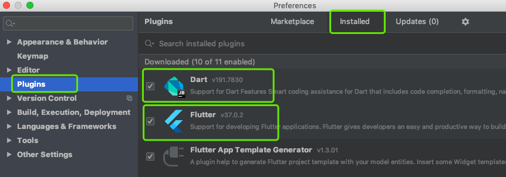
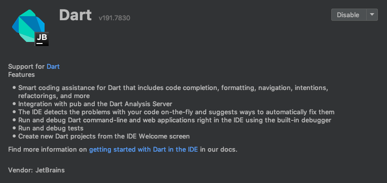
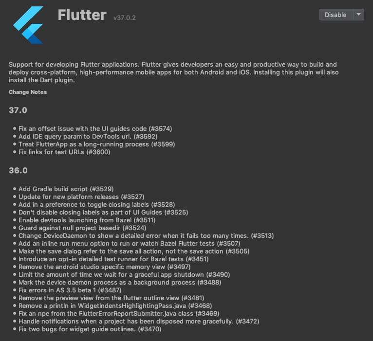
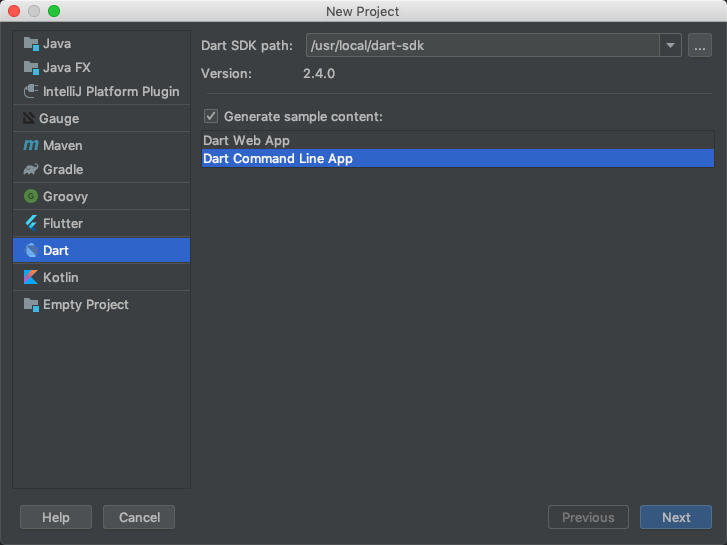
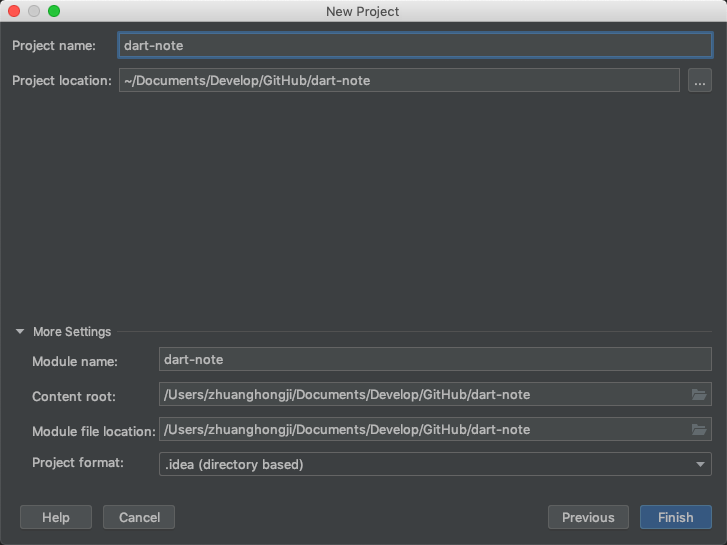
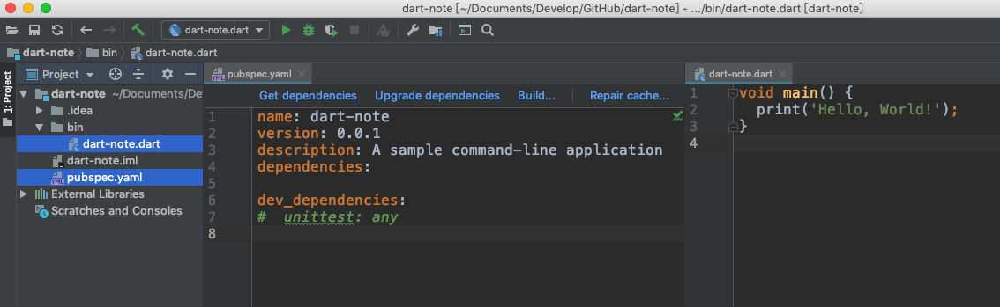

# Dart 笔记：A tour of the Dart language

> 序言：事实上，在 2018 年的时候就练习过一段时间 Flutter，转眼间现在已经是 2019 年下半年，而且 Flutter 的热度在这期间一直在蹭蹭蹭的往上涨。加上目前自己对 TypeScript 和 React Native 的熟练程度已经能满足大多数场景下的开发，所以想将主要精力往 Flutter 上倾斜一点。自然而然就有了 "Dart 笔记" 这一系列文章，以系统的学习 Dart 并记录这一过程。

## 搭建环境

之前尝试了使用 VSCode 写 Flutter，发现并没有像写 React Native 那么趁手，所以切换到了 IntelliJ IEAD 社区版。从此以后，我开发相关的主要工具变成了酱紫：
* Android Studio: 开发 Android 应用。
* IntelliJ IDEA (Community Edition): 开发 Flutter 跨平台应用。
* VSCode: 开发 React 和 React Native 应用。

那么，我们怎么在 Mac 上基于 IntelliJ IDEA 来搭建 Dart 学习环境呢？

**安装插件**

假设你现在已经安装好了 IDEA：
* 点击左上角的 "IntelliJ IEAD -> Preferences"。
* 然后选择 "Plugins"，点击 "Marketplace" 标签。
* 搜索并安装 "Dart" 和 "Flutter" 插件。

因为我已经安装好了这两个插件，所以在 "Installed" 标签下也能看到相关信心，如下图：



如果我们点击这两个插件的标题，便可打开对应的插件信息详情页面，比如：






**创建 Dart 项目**

安装好这两款插件后，我们就可以开始创建 Dart 项目了。

点击左上角的 "File -> New -> New Project" 后，可以看到下图：



然后点击 "Next"，输入项目的名称 "dart-note"，此时看到的页面大概是这样的：



然后，点击 "Finish" 即可完成创建，创建成功后：



这时我们主要是得到两个文件：
* `pubspec.yaml`: Dart 项目的配置文件，类似 React Native 中的 `package.json`。
* `dart-note.dart`: Dart 代码文件，默认有一个无参数的 `main()` 方法。

点击工具栏的 "播放/执行" 按钮，我们可以在控制台中看到以下输出信息：

```
/usr/local/dart-sdk/bin/dart --enable-asserts --enable-vm-service:52895 /Users/zhuanghongji/Documents/Develop/GitHub/dart-note/bin/dart-note.dart
Observatory listening on http://127.0.0.1:52895/L9q5mhMLuI8=/

Hello, World!

Process finished with exit code 0
```

`Hello, World!` 这行不用说了，我们来看下第一行：

```shell
/usr/local/dart-sdk/bin/dart --enable-asserts --enable-vm-service:52895 /Users/zhuanghongji/Documents/Develop/GitHub/dart-note/bin/dart-note.dart
```

这行输出日志是说：
* 执行 `/usr/local/dart-sdk/bin/` 目录下的 `dart` 命令
* 执行参数有 `--enable-asserts` 和 `--enable-vm-service:52895`
* 目标文件路径是 `/Users/zhuanghongji/Documents/Develop/GitHub/dart-note/bin/dart-note.dart`.

不信的话我们可以手动来执行以下，打开底部的 Terminal 标签：

```shell
zhuanghongji-mbp:dart-note zhuanghongji$ dart --version
Dart VM version: 2.4.0 (Wed Jun 19 11:53:45 2019 +0200) on "macos_x64"
zhuanghongji-mbp:dart-note zhuanghongji$ dart ./bin/dart-note.dart 
Hello, World!
zhuanghongji-mbp:dart-note zhuanghongji$ 
```

在上面命令中，我们先来通过查看 `dart --version` 查看 dart 命令是否已经配置好，然后执行 `dart ./bin/dart-note.dart` 来编译并执行 `dart-note.dart` 文件，再然后就可以看到熟悉的 `Hello, World!` 了。

哈，现在相信我了吧。


**注意事项**

事实上，搭建 Dart 学习环境可能并没有这么轻松。因为在上述步骤中，我有意忽略了 "安装 Dart SDK" 这一步骤。按道理来说，安装 Dart SDK 的优雅姿势是这样的：

```shell
# 安装
$ brew tap dart-lang/dart
$ brew install dart            // 安装稳定版
$ brew install dart --devel    // 安装dev版
```

然而我这边一直停留在 "Downloading..." 这一步骤直至报错，而且 Fang Qiang 也解决不了这个问题。希望你不会有此困境，哈哈哈。那如果遇到了呢？车到山前必有路：
* 点击报错信息中的链接直接下载 Dart SDK
* 然后将下载好的 `.zip` 文件解压到某个目录
* 接着配置 Dart 相关的路径
* 执行 `dart --version` 命令验证是否配置成功。

> 正因为我遇到了这个问题，所以在上文创建 Dart 项目时你会看到 Dart SDK 路径配置是 `/usr/local/dart-sdk`。

看到这里你可能会想我现在用的是 Windows 电脑怎么办，或者你还不确切知道怎么解决 Dart SDK 下载失败的问题。没关系，我在网络上看到了一篇文章，[点此查看](https://blog.csdn.net/weixin_41000111/article/details/82056210)。

看完这篇文章还不知道怎么搭建 Dart 学习环境的话，请拨打 10086 找我的朋友进行咨询。毕竟，我每个月都给它钱 ...

## 踏上 Dart 语言学习的征途 

搭建好了 Dart 学习环境后，开始踏上 Dart 语言学习的征途。

### 一个基本的 Dart 程序

下面的代码片段使用到了一些 Dart 最基本的特性：

```dart
// 定义一个函数
printInteger(int aNumber) {
  print('The number is $aNumber.'); 
}

// Dart 代码开始执行的地方
main() {
  var number = 42;       // 声明并初始化一个变量
  printInteger(number);  // 调用一个函数
}
```

执行后，可以看到控制台输出：

```dart
The number is 42.
```

可以看到，上面的代码片段看起来跟 Java 差不多，不同在于：
1. 作为程序执行入口的 `main()` 方法可以没有参数，而且声明该方法时并没有 `private` `public` 等范围限定符，也不要加个 `void` 来说明该方法没有返回值。
2. 声明方法 (不管是特殊的 `main()` 方法还是其它普通方法) 时都不一定要声明在类中，可以像 JavaScript 一样声明顶层函数。
3. 变量的声明可以不指明其类型。
4. ...

解析上面提到的不同之处：
1. 在 Dart 中，方法的限定范围是通过下划线 `_` 的指定的，比如说 `_printInteger()` 和 `_number` 表示该方法或变量是私有的，在外部是不能访问到的。而 `printInteger()` 和 `number`表示该方法或变量是公开的，外部是可以访问的。另外，Dart 中的每个函数都有返回值，没有显式声明的话表示该函数的返回值为 `null`。
2. Dart 支持顶级 (top-level) 函数，可以独立于类进行而存在，变量也是如此。
3. Dart 支持类型推导，在声明是可以不显式指定其类型，这时候编译器会对其进行类型推导。比如上面代码片段中的 `number` 会被推导成 `int` 类型。
4. 呃.. 都省略了还让我怎么解析...


### 变量

在 Dart 中，变量的声明主要有以下几种形式：

```dart 
var name = 'Bob';       // 1
String name = 'Bob';    // 2
dynamic name = 'Bob';   // 3
```

1. 声明一个变量并进行初始化，该变量名为 `name` 并且存储了一个索引，该索引指向一个值为 `Bob` 的 `String` 对象。同时，该变量会被推导出其类型为 `String`，不可以将其指向其它类型的值。比如说，当我们想通过 `name = 123;` 来对其进行赋值时，编辑器会提示错误： `A value of type 'int' can't be assigned to a variable of type 'String'`。
2. 跟方式 1 相同，但明确指明了变量的类型。
3. 声明了一个不受单一类型限制的变量，也就是说，我们我们可以对该变量赋任何类型的值，编译时不会报错，运行时如果没有发生异常的话也是不会报错的。比如说：

```dart
dynamic name = 'Bob'; 
name = 123; 
print(name - 123 == 0);   // true
```


#### 默认值

没有进行初始化的变量默认值都是 `null`，即使是显示声明了数值类型也是这样。因为在 Dart 中一切皆对象，数值也不例外。

```dart 
int lineCount;
print(lineCount == null);   // true
```

#### final 和 const 

如果你从不想修改变量的值，可以使用 `final` 和 `const` 来代替 `var` 来修饰变量：
* `final`: 表示该变量只可以被赋值一次。
* `const`: 表示该变量的值是一个编译时的恒定值，同时也意味着是 `final` 的。

看上去好像功能一样，其实不然，看下面代码：

```dart
var a = 'Hello';

final b = a;    // 不会报错
const c = a;    // Error: Not a constant expression.
```

也就是说，实例变量可以是 `final` 但不可以是 `const` 的，因为声明为 `const` 的变量的值是需要在编译器就能确定的，显然上面 `const c = a;` 中的 `a` 的值是运行时才能确定的。

**`final`**

`final` 修饰的变量必须在构造函数体执行之前初始化，比如：
* 在声明变量的同时就初始化其值；
* 通过构造函数参数进行初始化；
* 在构造函数的 "初始化列表" 中初始化。


举个栗子：

```dart
// 声明变量并初始化值
final name = 'Bob';
final String nickname = 'Boddy';

// 此时如果尝试修改 name 变量的值，会提示：The name 'name' is already defined.
name = 'Alice';
```

**`const`**

使用 `const` 关键字意味着你预期的一个编译时常量，在声明赋值时设置一个编译时能确定的值即可，比如数字、字符串或能直接计算出来的一个值。另外，如果想在 class 级别声明常量 (const variable)，需要使用 `static const` 进行修饰，否则编辑器会提示错误。

举个栗子：

```dart
const bar = 1000000;
const double atm = 1.01325 * bar;    // 编译时能计算出来的值

class Foo {
  static const a = 'aaaa';

  // Error: Only static fields can be declared as const.
  // Try using 'final' instead of 'const', or adding the keyword 'static'.
  const b = 'aaaa';
}
```

实际应用中，`const` 除了可以用来声明常量外，还可以用来创建常量值：

```dart
var foo = const [];
final bar = const [];
const baz = [];         // 等同于 `const [];`

void main() {
  foo = [1, 2, 3];
  print(foo);           // [1, 2, 3]

  baz = [42];           // Error: constant variable can't be assigned a value.
}
```