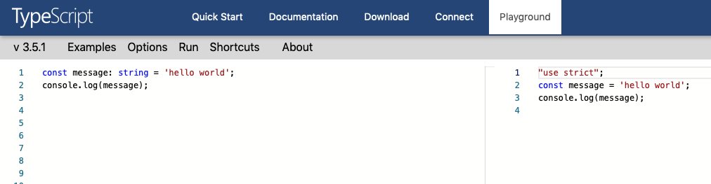
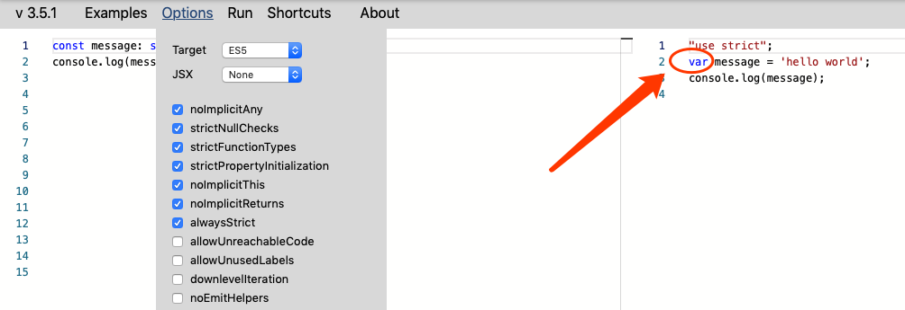
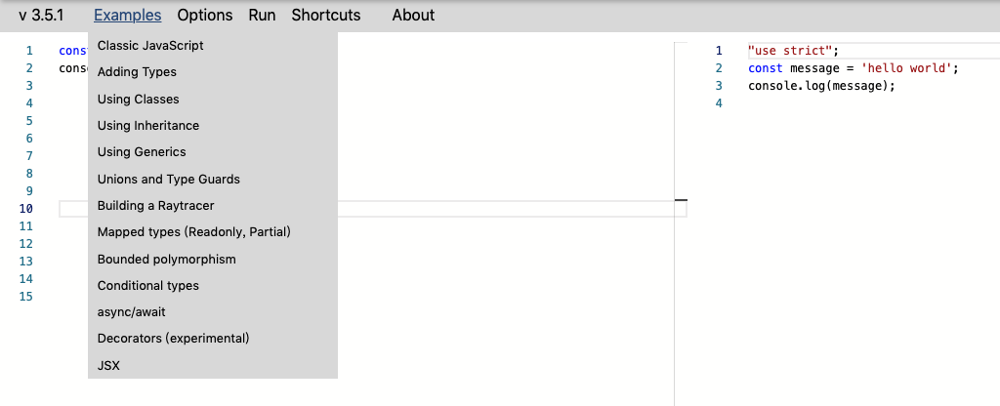
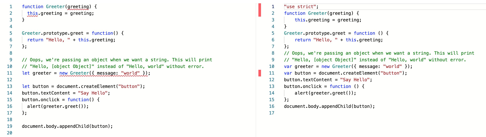
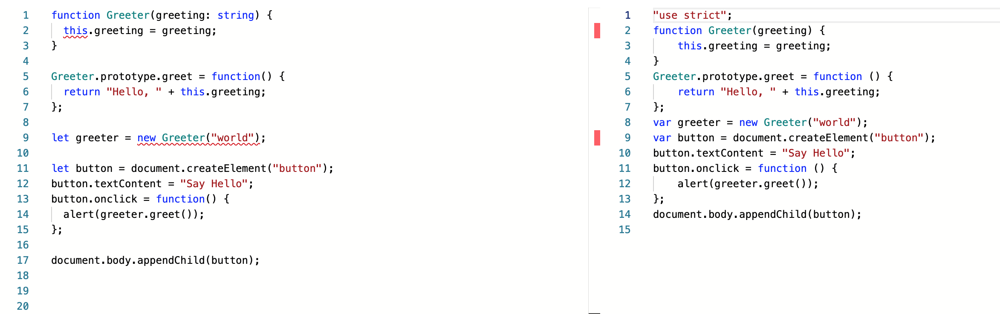
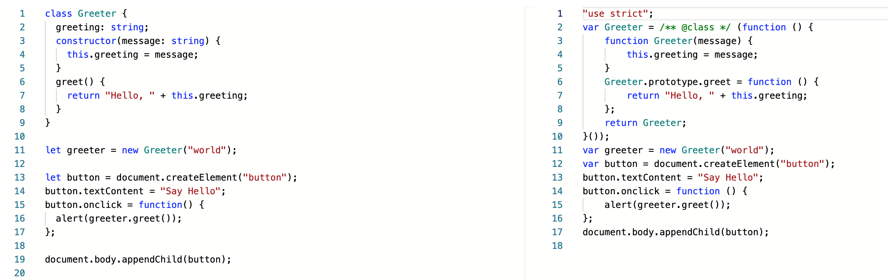
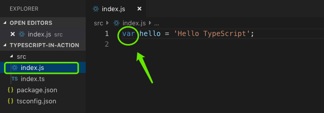
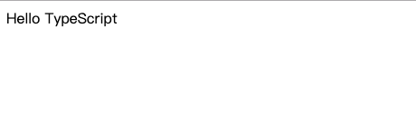
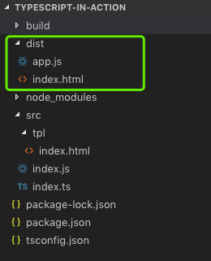
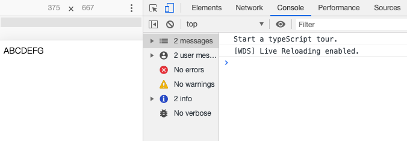

# 搭建 TypeScript 的学习开发环境

俗话说，磨刀不误砍柴工。学习 TypeScript 也是这样，搭建一个好的开发环境可以帮助我们更加高效的学习 TypeScript，并进行相应语法等练习。

去年我刚开始学习 TypeScript 的姿势是这样的：
* 编写 index.ts 文件。
* 通过 Node 执行该文件，然后在控制台的输出日志中看下刚才写的代码逻辑正确与否。

直到今年才发现，哎哟，原来还有这种姿势。

> 废话三行：
> * 本文主要分为 Playground 和 VSCode 两个部分。  
> * 因为贴了些代码，篇幅可能显得有点冗余。  
> * 仔细想想，兄台多看下又何妨。 
> :kissing_heart:

## 概述

TypeScript (后续简称 TS) 是微软开发并维护的一门开源编程语言，是 JavaScript (后续简称 JS) 一个严格语法的超集，核心区别就是 TS 中增加了可选的静态类型。

下面是 TS 版本发布的几个时间节点：
* 2012 年 10 月：首次公开，版本为 0.8。
* 2013 年 06 月：发布 0.9 版本，增加了泛型的支持。
* 2014 年 04 月：在微软的 Build 开发者大会上发布 1.0 版本。
* 2014 年 07 月：推出新的 TS 编译器，性能提升 5 倍，并将源代码移至 GitHub。
* 2016 年 09 月：发布了 2.0 版本，此后程序员可以选择性地防止变量被赋值 `null`。
* 2018 年 07 月：发布了 3.0 版本，增加了项目引用的新概念。
* 2019 年 05 月：发布了 3.5 版本，增量构建更块，类型检查更加智能。

下面是学习 TS 的一些途径：
* 官方文档：[https://www.typescriptlang.org/docs/home.html](https://www.typescriptlang.org/docs/home.html)
* 中文翻译文档：[https://www.tslang.cn/docs/home.html](https://www.tslang.cn/docs/home.html)
* 极客时间的视频课程：[TypeScript开发实战](https://time.geekbang.org/course/intro/211)


## 搭建开发环境 

### Playground

官网提供了一个 Playground 环境，如下图：



当我们在左边编辑器中编写 TS 代码时，右边会实时编译出对应目标版本的 JS 代码。此时点击 `Run` 的话，可以看到控制台输出 `hello world`。

在上图中，默认编译的目标 JS 版本是 ES6，如果我们想编译成其它版本怎么办？

点击 `Options` 并选择对应的 `Target`，比如说我们想编译成 ES5 ：



可以看到右边实时编译出来的代码，`message` 变量的声明修饰符由 `const` 变成了 `var`。`Options` 菜单还支持一些其它的配置，比如通过勾选或取消勾选 `strictNullChecks` 来配置是否需要 "严格的 `null` 检查"，这也就是我们前面在 TS 版本发布节点中提到的：程序员可以选择性地防止变量被赋值 `null`。

默认情况下，我们在 Playground 中看到的 TS 示例是比较简单的。在点击 `Expamles` 后，我们可以看到官方提供的其它复杂点的示例：



下面是一个一个贴出来的源代码，读者可以细看下期中的区别，以进一步了解 TS 和 ES5：

**Classic JavaScript**




**Adding Types**

 


**Using Classes**




**Using Inheritance**

```ts
class Animal {
  constructor(public name: string) {}
  move(distanceInMeters: number = 0) {
    console.log(`${this.name} moved ${distanceInMeters}m.`);
  }
}

class Snake extends Animal {
  constructor(name: string) {
    super(name);
  }
  move(distanceInMeters = 5) {
    console.log("Slithering...");
    super.move(distanceInMeters);
  }
}

class Horse extends Animal {
  constructor(name: string) {
    super(name);
  }
  move(distanceInMeters = 45) {
    console.log("Galloping...");
    super.move(distanceInMeters);
  }
}

let sam = new Snake("Sammy the Python");
let tom: Animal = new Horse("Tommy the Palomino");

sam.move();
tom.move(34);
```

```js
"use strict";
var __extends = (this && this.__extends) || (function () {
    var extendStatics = function (d, b) {
        extendStatics = Object.setPrototypeOf ||
            ({ __proto__: [] } instanceof Array && function (d, b) { d.__proto__ = b; }) ||
            function (d, b) { for (var p in b) if (b.hasOwnProperty(p)) d[p] = b[p]; };
        return extendStatics(d, b);
    };
    return function (d, b) {
        extendStatics(d, b);
        function __() { this.constructor = d; }
        d.prototype = b === null ? Object.create(b) : (__.prototype = b.prototype, new __());
    };
})();
var Animal = /** @class */ (function () {
    function Animal(name) {
        this.name = name;
    }
    Animal.prototype.move = function (distanceInMeters) {
        if (distanceInMeters === void 0) { distanceInMeters = 0; }
        console.log(this.name + " moved " + distanceInMeters + "m.");
    };
    return Animal;
}());
var Snake = /** @class */ (function (_super) {
    __extends(Snake, _super);
    function Snake(name) {
        return _super.call(this, name) || this;
    }
    Snake.prototype.move = function (distanceInMeters) {
        if (distanceInMeters === void 0) { distanceInMeters = 5; }
        console.log("Slithering...");
        _super.prototype.move.call(this, distanceInMeters);
    };
    return Snake;
}(Animal));
var Horse = /** @class */ (function (_super) {
    __extends(Horse, _super);
    function Horse(name) {
        return _super.call(this, name) || this;
    }
    Horse.prototype.move = function (distanceInMeters) {
        if (distanceInMeters === void 0) { distanceInMeters = 45; }
        console.log("Galloping...");
        _super.prototype.move.call(this, distanceInMeters);
    };
    return Horse;
}(Animal));
var sam = new Snake("Sammy the Python");
var tom = new Horse("Tommy the Palomino");
sam.move();
tom.move(34);
```

**Using Generics**

```ts
class Greeter<T> {
  greeting: T;
  constructor(message: T) {
    this.greeting = message;
  }
  greet() {
    return this.greeting;
  }
}

let greeter = new Greeter<string>("Hello, world");

let button = document.createElement("button");
button.textContent = "Say Hello";
button.onclick = function() {
  alert(greeter.greet());
};

document.body.appendChild(button);
```

```js
"use strict";
var Greeter = /** @class */ (function () {
    function Greeter(message) {
        this.greeting = message;
    }
    Greeter.prototype.greet = function () {
        return this.greeting;
    };
    return Greeter;
}());
var greeter = new Greeter("Hello, world");
var button = document.createElement("button");
button.textContent = "Say Hello";
button.onclick = function () {
    alert(greeter.greet());
};
document.body.appendChild(button);
```


**Unions and Type Guards**

```ts
type NameOrNameArray = string | string[];

function createName(name: NameOrNameArray) {
  if (typeof name === "string") {
    return name;
  } else {
    return name.join(" ");
  }
}

var greetingMessage = `Greetings, ${createName(["Sam", "Smith"])}`;
alert(greetingMessage);
```

```js
"use strict";
function createName(name) {
    if (typeof name === "string") {
        return name;
    }
    else {
        return name.join(" ");
    }
}
var greetingMessage = "Greetings, " + createName(["Sam", "Smith"]);
alert(greetingMessage);
```


**Build a Raytracer**

```ts
class Vector {
  constructor(public x: number, public y: number, public z: number) {}

  static times(k: number, v: Vector) {
    return new Vector(k * v.x, k * v.y, k * v.z);
  }

  static minus(v1: Vector, v2: Vector) {
    return new Vector(v1.x - v2.x, v1.y - v2.y, v1.z - v2.z);
  }

  static plus(v1: Vector, v2: Vector) {
    return new Vector(v1.x + v2.x, v1.y + v2.y, v1.z + v2.z);
  }

  static dot(v1: Vector, v2: Vector) {
    return v1.x * v2.x + v1.y * v2.y + v1.z * v2.z;
  }

  static mag(v: Vector) {
    return Math.sqrt(v.x * v.x + v.y * v.y + v.z * v.z);
  }

  static norm(v: Vector) {
    let mag = Vector.mag(v);
    let div = mag === 0 ? Infinity : 1.0 / mag;
    return Vector.times(div, v);
  }

  static cross(v1: Vector, v2: Vector) {
    return new Vector(
      v1.y * v2.z - v1.z * v2.y,
      v1.z * v2.x - v1.x * v2.z,
      v1.x * v2.y - v1.y * v2.x,
    );
  }
}

class Color {
  constructor(public r: number, public g: number, public b: number) {}

  static scale(k: number, v: Color) {
    return new Color(k * v.r, k * v.g, k * v.b);
  }

  static plus(v1: Color, v2: Color) {
    return new Color(v1.r + v2.r, v1.g + v2.g, v1.b + v2.b);
  }

  static times(v1: Color, v2: Color) {
    return new Color(v1.r * v2.r, v1.g * v2.g, v1.b * v2.b);
  }

  static white = new Color(1.0, 1.0, 1.0);
  static grey = new Color(0.5, 0.5, 0.5);
  static black = new Color(0.0, 0.0, 0.0);
  static background = Color.black;
  static defaultColor = Color.black;

  static toDrawingColor(c: Color) {
    let legalize = d => (d > 1 ? 1 : d);
    return {
      r: Math.floor(legalize(c.r) * 255),
      g: Math.floor(legalize(c.g) * 255),
      b: Math.floor(legalize(c.b) * 255),
    };
  }
}

class Camera {
  forward: Vector;
  right: Vector;
  up: Vector;

  constructor(public pos: Vector, lookAt: Vector) {
    let down = new Vector(0.0, -1.0, 0.0);
    this.forward = Vector.norm(Vector.minus(lookAt, this.pos));
    this.right = Vector.times(
      1.5,
      Vector.norm(Vector.cross(this.forward, down)),
    );
    this.up = Vector.times(
      1.5,
      Vector.norm(Vector.cross(this.forward, this.right)),
    );
  }
}

interface Ray {
  start: Vector;
  dir: Vector;
}

interface Intersection {
  thing: Thing;
  ray: Ray;
  dist: number;
}

interface Surface {
  diffuse: (pos: Vector) => Color;
  specular: (pos: Vector) => Color;
  reflect: (pos: Vector) => number;
  roughness: number;
}

interface Thing {
  intersect: (ray: Ray) => Intersection;
  normal: (pos: Vector) => Vector;
  surface: Surface;
}

interface Light {
  pos: Vector;
  color: Color;
}

interface Scene {
  things: Thing[];
  lights: Light[];
  camera: Camera;
}

class Sphere implements Thing {
  radius2: number;

  constructor(public center: Vector, radius: number, public surface: Surface) {
    this.radius2 = radius * radius;
  }

  normal(pos: Vector): Vector {
    return Vector.norm(Vector.minus(pos, this.center));
  }

  intersect(ray: Ray) {
    let eo = Vector.minus(this.center, ray.start);
    let v = Vector.dot(eo, ray.dir);
    let dist = 0;
    if (v >= 0) {
      let disc = this.radius2 - (Vector.dot(eo, eo) - v * v);
      if (disc >= 0) {
        dist = v - Math.sqrt(disc);
      }
    }
    if (dist === 0) {
      return null;
    } else {
      return { thing: this, ray: ray, dist: dist };
    }
  }
}

class Plane implements Thing {
  normal: (pos: Vector) => Vector;
  intersect: (ray: Ray) => Intersection;

  constructor(norm: Vector, offset: number, public surface: Surface) {
    this.normal = function(pos: Vector) {
      return norm;
    };
    this.intersect = function(ray: Ray): Intersection {
      let denom = Vector.dot(norm, ray.dir);

      if (denom > 0) {
        return null;
      } else {
        let dist = (Vector.dot(norm, ray.start) + offset) / -denom;
        return { thing: this, ray: ray, dist: dist };
      }
    };
  }
}

namespace Surfaces {
  export let shiny: Surface = {
    diffuse: function(pos) {
      return Color.white;
    },
    specular: function(pos) {
      return Color.grey;
    },
    reflect: function(pos) {
      return 0.7;
    },
    roughness: 250,
  };

  export let checkerboard: Surface = {
    diffuse: function(pos) {
      if ((Math.floor(pos.z) + Math.floor(pos.x)) % 2 !== 0) {
        return Color.white;
      } else {
        return Color.black;
      }
    },
    specular: function(pos) {
      return Color.white;
    },
    reflect: function(pos) {
      if ((Math.floor(pos.z) + Math.floor(pos.x)) % 2 !== 0) {
        return 0.1;
      } else {
        return 0.7;
      }
    },
    roughness: 150,
  };
}

class RayTracer {
  private maxDepth = 5;

  private intersections(ray: Ray, scene: Scene) {
    let closest = +Infinity;
    let closestInter: Intersection = undefined;
    for (let i in scene.things) {
      let inter = scene.things[i].intersect(ray);
      if (inter != null && inter.dist < closest) {
        closestInter = inter;
        closest = inter.dist;
      }
    }
    return closestInter;
  }

  private testRay(ray: Ray, scene: Scene) {
    let isect = this.intersections(ray, scene);
    if (isect != null) {
      return isect.dist;
    } else {
      return undefined;
    }
  }

  private traceRay(ray: Ray, scene: Scene, depth: number): Color {
    let isect = this.intersections(ray, scene);
    if (isect === undefined) {
      return Color.background;
    } else {
      return this.shade(isect, scene, depth);
    }
  }

  private shade(isect: Intersection, scene: Scene, depth: number) {
    let d = isect.ray.dir;
    let pos = Vector.plus(Vector.times(isect.dist, d), isect.ray.start);
    let normal = isect.thing.normal(pos);
    let reflectDir = Vector.minus(
      d,
      Vector.times(2, Vector.times(Vector.dot(normal, d), normal)),
    );
    let naturalColor = Color.plus(
      Color.background,
      this.getNaturalColor(isect.thing, pos, normal, reflectDir, scene),
    );
    let reflectedColor =
      depth >= this.maxDepth
        ? Color.grey
        : this.getReflectionColor(
            isect.thing,
            pos,
            normal,
            reflectDir,
            scene,
            depth,
          );
    return Color.plus(naturalColor, reflectedColor);
  }

  private getReflectionColor(
    thing: Thing,
    pos: Vector,
    normal: Vector,
    rd: Vector,
    scene: Scene,
    depth: number,
  ) {
    return Color.scale(
      thing.surface.reflect(pos),
      this.traceRay({ start: pos, dir: rd }, scene, depth + 1),
    );
  }

  private getNaturalColor(
    thing: Thing,
    pos: Vector,
    norm: Vector,
    rd: Vector,
    scene: Scene,
  ) {
    let addLight = (col, light) => {
      let ldis = Vector.minus(light.pos, pos);
      let livec = Vector.norm(ldis);
      let neatIsect = this.testRay({ start: pos, dir: livec }, scene);
      let isInShadow =
        neatIsect === undefined ? false : neatIsect <= Vector.mag(ldis);
      if (isInShadow) {
        return col;
      } else {
        let illum = Vector.dot(livec, norm);
        let lcolor =
          illum > 0 ? Color.scale(illum, light.color) : Color.defaultColor;
        let specular = Vector.dot(livec, Vector.norm(rd));
        let scolor =
          specular > 0
            ? Color.scale(
                Math.pow(specular, thing.surface.roughness),
                light.color,
              )
            : Color.defaultColor;
        return Color.plus(
          col,
          Color.plus(
            Color.times(thing.surface.diffuse(pos), lcolor),
            Color.times(thing.surface.specular(pos), scolor),
          ),
        );
      }
    };
    return scene.lights.reduce(addLight, Color.defaultColor);
  }

  render(scene, ctx, screenWidth, screenHeight) {
    let getPoint = (x, y, camera) => {
      let recenterX = x => (x - screenWidth / 2.0) / 2.0 / screenWidth;
      let recenterY = y => -(y - screenHeight / 2.0) / 2.0 / screenHeight;
      return Vector.norm(
        Vector.plus(
          camera.forward,
          Vector.plus(
            Vector.times(recenterX(x), camera.right),
            Vector.times(recenterY(y), camera.up),
          ),
        ),
      );
    };
    for (let y = 0; y < screenHeight; y++) {
      for (let x = 0; x < screenWidth; x++) {
        let color = this.traceRay(
          { start: scene.camera.pos, dir: getPoint(x, y, scene.camera) },
          scene,
          0,
        );
        let c = Color.toDrawingColor(color);
        ctx.fillStyle =
          "rgb(" + String(c.r) + ", " + String(c.g) + ", " + String(c.b) + ")";
        ctx.fillRect(x, y, x + 1, y + 1);
      }
    }
  }
}

function defaultScene(): Scene {
  return {
    things: [
      new Plane(new Vector(0.0, 1.0, 0.0), 0.0, Surfaces.checkerboard),
      new Sphere(new Vector(0.0, 1.0, -0.25), 1.0, Surfaces.shiny),
      new Sphere(new Vector(-1.0, 0.5, 1.5), 0.5, Surfaces.shiny),
    ],
    lights: [
      { pos: new Vector(-2.0, 2.5, 0.0), color: new Color(0.49, 0.07, 0.07) },
      { pos: new Vector(1.5, 2.5, 1.5), color: new Color(0.07, 0.07, 0.49) },
      { pos: new Vector(1.5, 2.5, -1.5), color: new Color(0.07, 0.49, 0.071) },
      { pos: new Vector(0.0, 3.5, 0.0), color: new Color(0.21, 0.21, 0.35) },
    ],
    camera: new Camera(new Vector(3.0, 2.0, 4.0), new Vector(-1.0, 0.5, 0.0)),
  };
}

function exec() {
  let canv = document.createElement("canvas");
  canv.width = 256;
  canv.height = 256;
  document.body.appendChild(canv);
  let ctx = canv.getContext("2d");
  let rayTracer = new RayTracer();
  return rayTracer.render(defaultScene(), ctx, 256, 256);
}

exec();
```

```js
"use strict";
var Vector = /** @class */ (function () {
    function Vector(x, y, z) {
        this.x = x;
        this.y = y;
        this.z = z;
    }
    Vector.times = function (k, v) {
        return new Vector(k * v.x, k * v.y, k * v.z);
    };
    Vector.minus = function (v1, v2) {
        return new Vector(v1.x - v2.x, v1.y - v2.y, v1.z - v2.z);
    };
    Vector.plus = function (v1, v2) {
        return new Vector(v1.x + v2.x, v1.y + v2.y, v1.z + v2.z);
    };
    Vector.dot = function (v1, v2) {
        return v1.x * v2.x + v1.y * v2.y + v1.z * v2.z;
    };
    Vector.mag = function (v) {
        return Math.sqrt(v.x * v.x + v.y * v.y + v.z * v.z);
    };
    Vector.norm = function (v) {
        var mag = Vector.mag(v);
        var div = mag === 0 ? Infinity : 1.0 / mag;
        return Vector.times(div, v);
    };
    Vector.cross = function (v1, v2) {
        return new Vector(v1.y * v2.z - v1.z * v2.y, v1.z * v2.x - v1.x * v2.z, v1.x * v2.y - v1.y * v2.x);
    };
    return Vector;
}());
var Color = /** @class */ (function () {
    function Color(r, g, b) {
        this.r = r;
        this.g = g;
        this.b = b;
    }
    Color.scale = function (k, v) {
        return new Color(k * v.r, k * v.g, k * v.b);
    };
    Color.plus = function (v1, v2) {
        return new Color(v1.r + v2.r, v1.g + v2.g, v1.b + v2.b);
    };
    Color.times = function (v1, v2) {
        return new Color(v1.r * v2.r, v1.g * v2.g, v1.b * v2.b);
    };
    Color.toDrawingColor = function (c) {
        var legalize = function (d) { return (d > 1 ? 1 : d); };
        return {
            r: Math.floor(legalize(c.r) * 255),
            g: Math.floor(legalize(c.g) * 255),
            b: Math.floor(legalize(c.b) * 255),
        };
    };
    Color.white = new Color(1.0, 1.0, 1.0);
    Color.grey = new Color(0.5, 0.5, 0.5);
    Color.black = new Color(0.0, 0.0, 0.0);
    Color.background = Color.black;
    Color.defaultColor = Color.black;
    return Color;
}());
var Camera = /** @class */ (function () {
    function Camera(pos, lookAt) {
        this.pos = pos;
        var down = new Vector(0.0, -1.0, 0.0);
        this.forward = Vector.norm(Vector.minus(lookAt, this.pos));
        this.right = Vector.times(1.5, Vector.norm(Vector.cross(this.forward, down)));
        this.up = Vector.times(1.5, Vector.norm(Vector.cross(this.forward, this.right)));
    }
    return Camera;
}());
var Sphere = /** @class */ (function () {
    function Sphere(center, radius, surface) {
        this.center = center;
        this.surface = surface;
        this.radius2 = radius * radius;
    }
    Sphere.prototype.normal = function (pos) {
        return Vector.norm(Vector.minus(pos, this.center));
    };
    Sphere.prototype.intersect = function (ray) {
        var eo = Vector.minus(this.center, ray.start);
        var v = Vector.dot(eo, ray.dir);
        var dist = 0;
        if (v >= 0) {
            var disc = this.radius2 - (Vector.dot(eo, eo) - v * v);
            if (disc >= 0) {
                dist = v - Math.sqrt(disc);
            }
        }
        if (dist === 0) {
            return null;
        }
        else {
            return { thing: this, ray: ray, dist: dist };
        }
    };
    return Sphere;
}());
var Plane = /** @class */ (function () {
    function Plane(norm, offset, surface) {
        this.surface = surface;
        this.normal = function (pos) {
            return norm;
        };
        this.intersect = function (ray) {
            var denom = Vector.dot(norm, ray.dir);
            if (denom > 0) {
                return null;
            }
            else {
                var dist = (Vector.dot(norm, ray.start) + offset) / -denom;
                return { thing: this, ray: ray, dist: dist };
            }
        };
    }
    return Plane;
}());
var Surfaces;
(function (Surfaces) {
    Surfaces.shiny = {
        diffuse: function (pos) {
            return Color.white;
        },
        specular: function (pos) {
            return Color.grey;
        },
        reflect: function (pos) {
            return 0.7;
        },
        roughness: 250,
    };
    Surfaces.checkerboard = {
        diffuse: function (pos) {
            if ((Math.floor(pos.z) + Math.floor(pos.x)) % 2 !== 0) {
                return Color.white;
            }
            else {
                return Color.black;
            }
        },
        specular: function (pos) {
            return Color.white;
        },
        reflect: function (pos) {
            if ((Math.floor(pos.z) + Math.floor(pos.x)) % 2 !== 0) {
                return 0.1;
            }
            else {
                return 0.7;
            }
        },
        roughness: 150,
    };
})(Surfaces || (Surfaces = {}));
var RayTracer = /** @class */ (function () {
    function RayTracer() {
        this.maxDepth = 5;
    }
    RayTracer.prototype.intersections = function (ray, scene) {
        var closest = +Infinity;
        var closestInter = undefined;
        for (var i in scene.things) {
            var inter = scene.things[i].intersect(ray);
            if (inter != null && inter.dist < closest) {
                closestInter = inter;
                closest = inter.dist;
            }
        }
        return closestInter;
    };
    RayTracer.prototype.testRay = function (ray, scene) {
        var isect = this.intersections(ray, scene);
        if (isect != null) {
            return isect.dist;
        }
        else {
            return undefined;
        }
    };
    RayTracer.prototype.traceRay = function (ray, scene, depth) {
        var isect = this.intersections(ray, scene);
        if (isect === undefined) {
            return Color.background;
        }
        else {
            return this.shade(isect, scene, depth);
        }
    };
    RayTracer.prototype.shade = function (isect, scene, depth) {
        var d = isect.ray.dir;
        var pos = Vector.plus(Vector.times(isect.dist, d), isect.ray.start);
        var normal = isect.thing.normal(pos);
        var reflectDir = Vector.minus(d, Vector.times(2, Vector.times(Vector.dot(normal, d), normal)));
        var naturalColor = Color.plus(Color.background, this.getNaturalColor(isect.thing, pos, normal, reflectDir, scene));
        var reflectedColor = depth >= this.maxDepth
            ? Color.grey
            : this.getReflectionColor(isect.thing, pos, normal, reflectDir, scene, depth);
        return Color.plus(naturalColor, reflectedColor);
    };
    RayTracer.prototype.getReflectionColor = function (thing, pos, normal, rd, scene, depth) {
        return Color.scale(thing.surface.reflect(pos), this.traceRay({ start: pos, dir: rd }, scene, depth + 1));
    };
    RayTracer.prototype.getNaturalColor = function (thing, pos, norm, rd, scene) {
        var _this = this;
        var addLight = function (col, light) {
            var ldis = Vector.minus(light.pos, pos);
            var livec = Vector.norm(ldis);
            var neatIsect = _this.testRay({ start: pos, dir: livec }, scene);
            var isInShadow = neatIsect === undefined ? false : neatIsect <= Vector.mag(ldis);
            if (isInShadow) {
                return col;
            }
            else {
                var illum = Vector.dot(livec, norm);
                var lcolor = illum > 0 ? Color.scale(illum, light.color) : Color.defaultColor;
                var specular = Vector.dot(livec, Vector.norm(rd));
                var scolor = specular > 0
                    ? Color.scale(Math.pow(specular, thing.surface.roughness), light.color)
                    : Color.defaultColor;
                return Color.plus(col, Color.plus(Color.times(thing.surface.diffuse(pos), lcolor), Color.times(thing.surface.specular(pos), scolor)));
            }
        };
        return scene.lights.reduce(addLight, Color.defaultColor);
    };
    RayTracer.prototype.render = function (scene, ctx, screenWidth, screenHeight) {
        var getPoint = function (x, y, camera) {
            var recenterX = function (x) { return (x - screenWidth / 2.0) / 2.0 / screenWidth; };
            var recenterY = function (y) { return -(y - screenHeight / 2.0) / 2.0 / screenHeight; };
            return Vector.norm(Vector.plus(camera.forward, Vector.plus(Vector.times(recenterX(x), camera.right), Vector.times(recenterY(y), camera.up))));
        };
        for (var y = 0; y < screenHeight; y++) {
            for (var x = 0; x < screenWidth; x++) {
                var color = this.traceRay({ start: scene.camera.pos, dir: getPoint(x, y, scene.camera) }, scene, 0);
                var c = Color.toDrawingColor(color);
                ctx.fillStyle =
                    "rgb(" + String(c.r) + ", " + String(c.g) + ", " + String(c.b) + ")";
                ctx.fillRect(x, y, x + 1, y + 1);
            }
        }
    };
    return RayTracer;
}());
function defaultScene() {
    return {
        things: [
            new Plane(new Vector(0.0, 1.0, 0.0), 0.0, Surfaces.checkerboard),
            new Sphere(new Vector(0.0, 1.0, -0.25), 1.0, Surfaces.shiny),
            new Sphere(new Vector(-1.0, 0.5, 1.5), 0.5, Surfaces.shiny),
        ],
        lights: [
            { pos: new Vector(-2.0, 2.5, 0.0), color: new Color(0.49, 0.07, 0.07) },
            { pos: new Vector(1.5, 2.5, 1.5), color: new Color(0.07, 0.07, 0.49) },
            { pos: new Vector(1.5, 2.5, -1.5), color: new Color(0.07, 0.49, 0.071) },
            { pos: new Vector(0.0, 3.5, 0.0), color: new Color(0.21, 0.21, 0.35) },
        ],
        camera: new Camera(new Vector(3.0, 2.0, 4.0), new Vector(-1.0, 0.5, 0.0)),
    };
}
function exec() {
    var canv = document.createElement("canvas");
    canv.width = 256;
    canv.height = 256;
    document.body.appendChild(canv);
    var ctx = canv.getContext("2d");
    var rayTracer = new RayTracer();
    return rayTracer.render(defaultScene(), ctx, 256, 256);
}
exec();
```


**Mapped types (Readonly, Partial)**

```ts
interface State {
  text: string;
  counter: number;
}

const state: Readonly<State> = {
  text: "hello world",
  counter: 42,
};

state.text = "update"; // Expected error: state is readonly

const stateUpdate1: Partial<State> = {
  counter: 70,
};

const stateUpdate2: Partial<State> = {
  text: "update",
  flag: true, // Expected error: no `flag` in State
};
```

```js
"use strict";
var state = {
    text: "hello world",
    counter: 42,
};
state.text = "update"; // Expected error: state is readonly
var stateUpdate1 = {
    counter: 70,
};
var stateUpdate2 = {
    text: "update",
    flag: true,
};
```


**Bounded polymorphism**

```ts
function logFoo<T extends { foo: string }>(obj: T): T {
  console.log(obj.foo);
  return obj;
}

logFoo({ foo: "foo", bar: "bar" }).bar;

logFoo({ bar: "bar" }); // Expected error
```

```js
"use strict";
function logFoo(obj) {
    console.log(obj.foo);
    return obj;
}
logFoo({ foo: "foo", bar: "bar" }).bar;
logFoo({ bar: "bar" }); // Expected error
```


**Conditional types**

```ts
// TypeScript ^2.8

type TypeName<T> = T extends string
  ? "string"
  : T extends number
    ? "number"
    : T extends boolean
      ? "boolean"
      : T extends undefined
        ? "undefined"
        : T extends Function ? "function" : "object";

type T0 = TypeName<string>; // "string"
type T1 = TypeName<"a">; // "string"
type T2 = TypeName<true>; // "boolean"
type T3 = TypeName<() => void>; // "function"
type T4 = TypeName<string[]>; // "object"
```

```js
"use strict";
// TypeScript ^2.8
```


**async/await**

```ts
// Target: ES2015^

async function delay(ms: number): Promise<void> {
  return new Promise<void>(resolve => {
    setTimeout(resolve, ms);
  });
}

async function main() {
  const ms = 1000;
  console.log(`Waiting for ${ms}ms...`);
  await delay(ms);
  console.log("Done!");
}

main();
```

```js
"use strict";
// Target: ES2015^
var __awaiter = (this && this.__awaiter) || function (thisArg, _arguments, P, generator) {
    return new (P || (P = Promise))(function (resolve, reject) {
        function fulfilled(value) { try { step(generator.next(value)); } catch (e) { reject(e); } }
        function rejected(value) { try { step(generator["throw"](value)); } catch (e) { reject(e); } }
        function step(result) { result.done ? resolve(result.value) : new P(function (resolve) { resolve(result.value); }).then(fulfilled, rejected); }
        step((generator = generator.apply(thisArg, _arguments || [])).next());
    });
};
var __generator = (this && this.__generator) || function (thisArg, body) {
    var _ = { label: 0, sent: function() { if (t[0] & 1) throw t[1]; return t[1]; }, trys: [], ops: [] }, f, y, t, g;
    return g = { next: verb(0), "throw": verb(1), "return": verb(2) }, typeof Symbol === "function" && (g[Symbol.iterator] = function() { return this; }), g;
    function verb(n) { return function (v) { return step([n, v]); }; }
    function step(op) {
        if (f) throw new TypeError("Generator is already executing.");
        while (_) try {
            if (f = 1, y && (t = op[0] & 2 ? y["return"] : op[0] ? y["throw"] || ((t = y["return"]) && t.call(y), 0) : y.next) && !(t = t.call(y, op[1])).done) return t;
            if (y = 0, t) op = [op[0] & 2, t.value];
            switch (op[0]) {
                case 0: case 1: t = op; break;
                case 4: _.label++; return { value: op[1], done: false };
                case 5: _.label++; y = op[1]; op = [0]; continue;
                case 7: op = _.ops.pop(); _.trys.pop(); continue;
                default:
                    if (!(t = _.trys, t = t.length > 0 && t[t.length - 1]) && (op[0] === 6 || op[0] === 2)) { _ = 0; continue; }
                    if (op[0] === 3 && (!t || (op[1] > t[0] && op[1] < t[3]))) { _.label = op[1]; break; }
                    if (op[0] === 6 && _.label < t[1]) { _.label = t[1]; t = op; break; }
                    if (t && _.label < t[2]) { _.label = t[2]; _.ops.push(op); break; }
                    if (t[2]) _.ops.pop();
                    _.trys.pop(); continue;
            }
            op = body.call(thisArg, _);
        } catch (e) { op = [6, e]; y = 0; } finally { f = t = 0; }
        if (op[0] & 5) throw op[1]; return { value: op[0] ? op[1] : void 0, done: true };
    }
};
function delay(ms) {
    return __awaiter(this, void 0, void 0, function () {
        return __generator(this, function (_a) {
            return [2 /*return*/, new Promise(function (resolve) {
                    setTimeout(resolve, ms);
                })];
        });
    });
}
function main() {
    return __awaiter(this, void 0, void 0, function () {
        var ms;
        return __generator(this, function (_a) {
            switch (_a.label) {
                case 0:
                    ms = 1000;
                    console.log("Waiting for " + ms + "ms...");
                    return [4 /*yield*/, delay(ms)];
                case 1:
                    _a.sent();
                    console.log("Done!");
                    return [2 /*return*/];
            }
        });
    });
}
main();
```


**Decorators (experimental)**

```ts
// Requires `experimentalDecorators` enabled

// http://www.typescriptlang.org/docs/handbook/decorators.html

@sealed
class Greeter {
  greeting: string;
  constructor(message: string) {
    this.greeting = message;
  }
  greet() {
    return "Hello, " + this.greeting;
  }
}

function sealed(constructor: Function) {
  Object.seal(constructor);
  Object.seal(constructor.prototype);
}
```

```js
"use strict";
// Requires `experimentalDecorators` enabled
var __decorate = (this && this.__decorate) || function (decorators, target, key, desc) {
    var c = arguments.length, r = c < 3 ? target : desc === null ? desc = Object.getOwnPropertyDescriptor(target, key) : desc, d;
    if (typeof Reflect === "object" && typeof Reflect.decorate === "function") r = Reflect.decorate(decorators, target, key, desc);
    else for (var i = decorators.length - 1; i >= 0; i--) if (d = decorators[i]) r = (c < 3 ? d(r) : c > 3 ? d(target, key, r) : d(target, key)) || r;
    return c > 3 && r && Object.defineProperty(target, key, r), r;
};
// http://www.typescriptlang.org/docs/handbook/decorators.html
let Greeter = class Greeter {
    constructor(message) {
        this.greeting = message;
    }
    greet() {
        return "Hello, " + this.greeting;
    }
};
Greeter = __decorate([
    sealed
], Greeter);
function sealed(constructor) {
    Object.seal(constructor);
    Object.seal(constructor.prototype);
}
```


**JSX**

```ts
// set JSX to "React" or "Preserve"

// fake bindings
declare namespace React {
  function createElement(): any;
}

declare function View(props: { text: string }): any;

const dom = <View text="hello world" />;
```

```js
"use strict";
// set JSX to "React" or "Preserve"
var dom = text;
"hello world" /  > ;
```


### VSCode

假设你现在已经安装好了 VSCode 和 NodeJS。

#### 初始化一个项目

打开 VSCode 并创建一个 `typescript in action` 目录，然后在 `TERMINAL` 中执行下面的命令创建一个 npm 项目：

```shell 
# 通过 -y 忽略所有的提问，默认都选 yes
$ npm init -y
```

```shell
zhuanghongji-mbp:typescript-in-action zhuanghongji$ npm init -y
Wrote to /Users/zhuanghongji/Documents/Develop/GitHub/typescript-in-action/package.json:

{
  "name": "typescript-in-action",
  "version": "1.0.0",
  "description": "",
  "main": "index.js",
  "scripts": {
    "test": "echo \"Error: no test specified\" && exit 1"
  },
  "keywords": [],
  "author": "",
  "license": "ISC"
}
```

接着，通过 `npm i typescript -g` 命令全局安装 TS，这样我们就可以在任何地方使用 TS 的编译器 (即 `tsc`)：

```shell
zhuanghongji-mbp:typescript-in-action zhuanghongji$ npm i typescript -g
/usr/local/bin/tsc -> /usr/local/lib/node_modules/typescript/bin/tsc
/usr/local/bin/tsserver -> /usr/local/lib/node_modules/typescript/bin/tsserver
+ typescript@3.5.3
updated 1 package in 1.923s
```

安装好后，我们就可以使用 `tsc` 命令了，比如查看版本、查看帮助信息：

```shell
zhuanghongji-mbp:typescript-in-action zhuanghongji$ tsc --version
Version 3.5.3

zhuanghongji-mbp:typescript-in-action zhuanghongji$ tsc -h
Version 3.5.3
Syntax:   tsc [options] [file...]

Examples: tsc hello.ts
          tsc --outFile file.js file.ts
          tsc @args.txt
          tsc --build tsconfig.json

Options:
 -h, --help                                         Print this message.
 -w, --watch                                        Watch input files.
 --pretty                                           Stylize errors and messages using color and context (experimental).
 --all                                              Show all compiler options.
 -v, --version                                      Print the compiler's version.
 --init                                             Initializes a TypeScript project and creates a tsconfig.json file.
 -p FILE OR DIRECTORY, --project FILE OR DIRECTORY  Compile the project given the path to its configuration file, or to a folder with a 'tsconfig.json'.
 -b, --build                                        Build one or more projects and their dependencies, if out of date
 -t VERSION, --target VERSION                       Specify ECMAScript target version: 'ES3' (default), 'ES5', 'ES2015', 'ES2016', 'ES2017', 'ES2018', 'ES2019' or 'ESNEXT'.
 -m KIND, --module KIND                             Specify module code generation: 'none', 'commonjs', 'amd', 'system', 'umd', 'es2015', or 'ESNext'.
 --lib                                              Specify library files to be included in the compilation.
                                                      'es5' 'es6' 'es2015' 'es7' 'es2016' 'es2017' 'es2018' 'es2019' 'es2020' 'esnext' 'dom' 'dom.iterable' 'webworker' 'webworker.importscripts' 'scripthost' 'es2015.core' 'es2015.collection' 'es2015.generator' 'es2015.iterable' 'es2015.promise' 'es2015.proxy' 'es2015.reflect' 'es2015.symbol' 'es2015.symbol.wellknown' 'es2016.array.include' 'es2017.object' 'es2017.sharedmemory' 'es2017.string' 'es2017.intl' 'es2017.typedarrays' 'es2018.asynciterable' 'es2018.intl' 'es2018.promise' 'es2018.regexp' 'es2019.array' 'es2019.object' 'es2019.string' 'es2019.symbol' 'es2020.string' 'es2020.symbol.wellknown' 'esnext.array' 'esnext.symbol' 'esnext.asynciterable' 'esnext.intl' 'esnext.bigint' 
 --allowJs                                          Allow javascript files to be compiled.
 --jsx KIND                                         Specify JSX code generation: 'preserve', 'react-native', or 'react'.
 -d, --declaration                                  Generates corresponding '.d.ts' file.
 --declarationMap                                   Generates a sourcemap for each corresponding '.d.ts' file.
 --sourceMap                                        Generates corresponding '.map' file.
 --outFile FILE                                     Concatenate and emit output to single file.
 --outDir DIRECTORY                                 Redirect output structure to the directory.
 --removeComments                                   Do not emit comments to output.
 --noEmit                                           Do not emit outputs.
 --strict                                           Enable all strict type-checking options.
 --noImplicitAny                                    Raise error on expressions and declarations with an implied 'any' type.
 --strictNullChecks                                 Enable strict null checks.
 --strictFunctionTypes                              Enable strict checking of function types.
 --strictBindCallApply                              Enable strict 'bind', 'call', and 'apply' methods on functions.
 --strictPropertyInitialization                     Enable strict checking of property initialization in classes.
 --noImplicitThis                                   Raise error on 'this' expressions with an implied 'any' type.
 --alwaysStrict                                     Parse in strict mode and emit "use strict" for each source file.
 --noUnusedLocals                                   Report errors on unused locals.
 --noUnusedParameters                               Report errors on unused parameters.
 --noImplicitReturns                                Report error when not all code paths in function return a value.
 --noFallthroughCasesInSwitch                       Report errors for fallthrough cases in switch statement.
 --types                                            Type declaration files to be included in compilation.
 --esModuleInterop                                  Enables emit interoperability between CommonJS and ES Modules via creation of namespace objects for all imports. Implies 'allowSyntheticDefaultImports'.
 @<file>                                            Insert command line options and files from a file.
```

可以看到，`tsc` 命令支持 `--noImplicitAny`、`--strictNullChecks` 和 `--strictFunctionTypes` 等配置项，这里和我们在 Playground 中看到的 `Options` 是类似的，但是 `tsc` 中的配置项和对应说明更加丰富一些。

值得欣慰的是，这些配置项可以通过配置文件进行指定，而不用每次都通过命令进行指定。那怎么创建配置文件呢？执行 `tsc --init` 命令：

```shell
zhuanghongji-mbp:typescript-in-action zhuanghongji$ tsc --init
message TS6071: Successfully created a tsconfig.json file.
```

类似 `npm init` 命令会生成一个 `package.json` 文件，`tsc --init` 命令也会生成一个 json 文件，该文件名为 `tsconfig.json` 且内容如下：

```json
{
  "compilerOptions": {
    /* Basic Options */
    // "incremental": true,                   /* Enable incremental compilation */
    "target": "es5",                          /* Specify ECMAScript target version: 'ES3' (default), 'ES5', 'ES2015', 'ES2016', 'ES2017', 'ES2018', 'ES2019' or 'ESNEXT'. */
    "module": "commonjs",                     /* Specify module code generation: 'none', 'commonjs', 'amd', 'system', 'umd', 'es2015', or 'ESNext'. */
    // "lib": [],                             /* Specify library files to be included in the compilation. */
    // "allowJs": true,                       /* Allow javascript files to be compiled. */
    // "checkJs": true,                       /* Report errors in .js files. */
    // "jsx": "preserve",                     /* Specify JSX code generation: 'preserve', 'react-native', or 'react'. */
    // "declaration": true,                   /* Generates corresponding '.d.ts' file. */
    // "declarationMap": true,                /* Generates a sourcemap for each corresponding '.d.ts' file. */
    // "sourceMap": true,                     /* Generates corresponding '.map' file. */
    // "outFile": "./",                       /* Concatenate and emit output to single file. */
    // "outDir": "./",                        /* Redirect output structure to the directory. */
    // "rootDir": "./",                       /* Specify the root directory of input files. Use to control the output directory structure with --outDir. */
    // "composite": true,                     /* Enable project compilation */
    // "tsBuildInfoFile": "./",               /* Specify file to store incremental compilation information */
    // "removeComments": true,                /* Do not emit comments to output. */
    // "noEmit": true,                        /* Do not emit outputs. */
    // "importHelpers": true,                 /* Import emit helpers from 'tslib'. */
    // "downlevelIteration": true,            /* Provide full support for iterables in 'for-of', spread, and destructuring when targeting 'ES5' or 'ES3'. */
    // "isolatedModules": true,               /* Transpile each file as a separate module (similar to 'ts.transpileModule'). */

    /* Strict Type-Checking Options */
    "strict": true,                           /* Enable all strict type-checking options. */
    // "noImplicitAny": true,                 /* Raise error on expressions and declarations with an implied 'any' type. */
    // "strictNullChecks": true,              /* Enable strict null checks. */
    // "strictFunctionTypes": true,           /* Enable strict checking of function types. */
    // "strictBindCallApply": true,           /* Enable strict 'bind', 'call', and 'apply' methods on functions. */
    // "strictPropertyInitialization": true,  /* Enable strict checking of property initialization in classes. */
    // "noImplicitThis": true,                /* Raise error on 'this' expressions with an implied 'any' type. */
    // "alwaysStrict": true,                  /* Parse in strict mode and emit "use strict" for each source file. */

    /* Additional Checks */
    // "noUnusedLocals": true,                /* Report errors on unused locals. */
    // "noUnusedParameters": true,            /* Report errors on unused parameters. */
    // "noImplicitReturns": true,             /* Report error when not all code paths in function return a value. */
    // "noFallthroughCasesInSwitch": true,    /* Report errors for fallthrough cases in switch statement. */

    /* Module Resolution Options */
    // "moduleResolution": "node",            /* Specify module resolution strategy: 'node' (Node.js) or 'classic' (TypeScript pre-1.6). */
    // "baseUrl": "./",                       /* Base directory to resolve non-absolute module names. */
    // "paths": {},                           /* A series of entries which re-map imports to lookup locations relative to the 'baseUrl'. */
    // "rootDirs": [],                        /* List of root folders whose combined content represents the structure of the project at runtime. */
    // "typeRoots": [],                       /* List of folders to include type definitions from. */
    // "types": [],                           /* Type declaration files to be included in compilation. */
    // "allowSyntheticDefaultImports": true,  /* Allow default imports from modules with no default export. This does not affect code emit, just typechecking. */
    "esModuleInterop": true                   /* Enables emit interoperability between CommonJS and ES Modules via creation of namespace objects for all imports. Implies 'allowSyntheticDefaultImports'. */
    // "preserveSymlinks": true,              /* Do not resolve the real path of symlinks. */
    // "allowUmdGlobalAccess": true,          /* Allow accessing UMD globals from modules. */

    /* Source Map Options */
    // "sourceRoot": "",                      /* Specify the location where debugger should locate TypeScript files instead of source locations. */
    // "mapRoot": "",                         /* Specify the location where debugger should locate map files instead of generated locations. */
    // "inlineSourceMap": true,               /* Emit a single file with source maps instead of having a separate file. */
    // "inlineSources": true,                 /* Emit the source alongside the sourcemaps within a single file; requires '--inlineSourceMap' or '--sourceMap' to be set. */

    /* Experimental Options */
    // "experimentalDecorators": true,        /* Enables experimental support for ES7 decorators. */
    // "emitDecoratorMetadata": true,         /* Enables experimental support for emitting type metadata for decorators. */
  }
}
```

接着，我们创建一个 `src` 目录并在该目录下创建一个 `index.ts` 文件，并编写以下代码：

```ts
const hello: string = 'Hello TypeScript'
```

然后再在 TERMINAL 中执行下面的命令编译该文件：

```shell
$ tsc ./src/index.ts
```

此时，你在 `index.ts` 的同级目录中可以看到一个新生成的文件 `index.js`：



仔细看会发现，`index.js` 中已经没有了 TS 中的 `: string` 类型声明语法。同时，变量 `hello` 的声明修饰符由 `const` 变成了 `var`，这是因为我们在 `tsconfig.json` 中配置了 `target` 是 `es5`，如果 `target` 是 `es6` 的话，修饰符会继续保留为 `const`。


#### WebPack

每次都使用 `tsc` 命令好像有点麻烦？那我们来试试传说中的 WebPack。

> 本质上，webpack 是一个现代 JavaScript 应用程序的静态模块打包器(module bundler)。当 webpack 处理应用程序时，它会递归地构建一个依赖关系图(dependency graph)，其中包含应用程序需要的每个模块，然后将所有这些模块打包成一个或多个 bundle。  
> 
> * 英文文档：[https://webpack.js.org](https://webpack.js.org/)
> * 中文文档：[https://www.webpackjs.com](https://www.webpackjs.com/)

```shell
# 安装 WebPack 相关的三个包
$ npm i webpack webpack-cli webpack-dev-server -D
```

```shell
zhuanghongji-mbp:typescript-in-action zhuanghongji$ npm i webpack webpack-cli webpack-dev-server -D

> fsevents@1.2.9 install /Users/zhuanghongji/Documents/Develop/GitHub/typescript-in-action/node_modules/fsevents
> node install

node-pre-gyp WARN Using needle for node-pre-gyp https download 
[fsevents] Success: "/Users/zhuanghongji/Documents/Develop/GitHub/typescript-in-action/node_modules/fsevents/lib/binding/Release/node-v67-darwin-x64/fse.node" is installed via remote
npm notice created a lockfile as package-lock.json. You should commit this file.
npm WARN typescript-in-action@1.0.0 No description
npm WARN typescript-in-action@1.0.0 No repository field.

+ webpack-cli@3.3.6
+ webpack@4.36.1
+ webpack-dev-server@3.7.2
added 613 packages from 364 contributors and audited 8796 packages in 20.57s
found 0 vulnerabilities
```

然后创建一个 `build` 目录，用来存放 WebPack 的配置文件：
* `webpack.base.config.js`: 公共环境的配置。
* `webpack.dev.config.js`: 开发环境的配置。
* `webpack.pro.config.js`: 生产环境的配置。
* `webpack.config.js`: 所有配置文件的入口。

下面我们依次来看下这几个配置文件的具体代码，并作简单说明。

**webpack.base.config.js**

```js
const HtmlWebpackPlugin = require('html-webpack-plugin')

module.exports = {
  // 指定入口文件
  entry: './src/index.ts',
  // 指定输出文件，输出目录为默认的 `dist`
  output: {
    filename: 'app.js'
  },
  // 要处理文件的扩展名集合
  resolve: {
    extensions: ['.js', '.ts', '.tsx']
  },
  // 因为我们引入了新的 ts 和 tsx 文件，所以需要安装相应的 loader
  module: {
    rules: [
      {
        // 正则是以 .ts 或 .tsx 结尾的文件 
        test: /\.tsx?$/i,
        use: [{
          loader: 'ts-loader'
        }],
        exclude: /node_modules/
      }
    ]
  },
  // 通过 HtmlWebpackPlugin 插件来帮助我们通过模板生成网站的首页
  // 而且可以帮助将输出自动嵌入到新生成的模板文件中
  plugins: [
      new HtmlWebpackPlugin({
          template: './src/tpl/index.html'
      })
  ]
}
```

因为我们在该项目中使用了 `ts-loader` 和 `typescript`，所以需要通过 `npm i ts-loader typescript -D` 命令进行安装相关依赖：

```shell
zhuanghongji-mbp:typescript-in-action zhuanghongji$ npm i ts-loader typescript -D
npm WARN typescript-in-action@1.0.0 No description
npm WARN typescript-in-action@1.0.0 No repository field.

+ ts-loader@6.0.4
+ typescript@3.5.3
added 9 packages from 21 contributors and audited 8832 packages in 4.968s
found 0 vulnerabilities
```

类似地，我们也需要安装 `HtmlWebpackPlugin` 插件，安装命令和输出信息如下：

```shell
zhuanghongji-mbp:typescript-in-action zhuanghongji$ npm i html-webpack-plugin -D
npm WARN typescript-in-action@1.0.0 No description
npm WARN typescript-in-action@1.0.0 No repository field.

+ html-webpack-plugin@3.2.0
added 49 packages from 68 contributors and audited 8911 packages in 6.313s
found 0 vulnerabilities
```

安装好了 `HtmlWebpackPlugin` 插件后，我们来新建一个 `./src/tpl/index.html` 模板文件，其代码如下：

```html
<!DOCTYPE html>
<html lang="en">
<head>
  <meta charset="UTF-8">
  <meta name="viewport" content="width=device-width, initial-scale=1.0">
  <meta http-equiv="X-UA-Compatible" content="ie=edge">
  <title>TypeScript in Action</title>
</head>
<body>
  <div class="app"></div>
</body>
</html>
```

> 注：在 VSCode 中输入 `html:5` 然后点击 `Enter` 可快速生成 HTML 模板代码噢。


**webpack.dev.config.js** 

```js
module.exports = {
  // 开启 source map (这是官方推荐的一个配置)
  // * 其中 cheap 表示 source map 会忽略文件的列信息，因为我们在调试的时候列信息是没有用的
  // * 其中 module 表示会定位到我们的 TS 源码，而不是通过 loader 转义后的 JS 源码
  // * 而 eval-source-map 表示会将 source map 以 DataUrl 的形式打包到文件中。它的重编译速度很快，所以不用担心性能问题
  devtool: 'cheap-module-eval-source-map'
}
```

> 关于 `#cheap-module-eval-source-map` (参考自 [imooc](https://www.imooc.com/qadetail/262369))：
> * 大部分情况我们调试并不关心列信息，而且就算 sourcemap 没有列，有些浏览器引擎（例如 v8） 也会给出列信息，所以我们使用 cheap 模式可以大幅提高 souremap 生成的效率。
> * 使用 eval 方式可大幅提高持续构建效率，参考 webapck devtool 文档 下方速度对比表格，这对经常需要边改边调的前端开发而言，非常重要！
> * 使用 module 可支持 babel 这种预编译工具（在 webpack 里做为 loader 使用）。


**webpack.pro.config.js** 

```js
const { CleanWebpackPlugin } = require('clean-webpack-plugin')

module.exports = {
    plugins: [
        new CleanWebpackPlugin()
    ]
}
```

这里我们同样需要通过 `npm i clean-webpack-plugin -D` 来安装使用到的 `CleanWebpackPlugin` 插件，它的作用是帮助我们在成功构建后清空缓存和无用文件。

```shell
zhuanghongji-mbp:typescript-in-action zhuanghongji$ npm i clean-webpack-plugin -D
npm WARN typescript-in-action@1.0.0 No description
npm WARN typescript-in-action@1.0.0 No repository field.

+ clean-webpack-plugin@3.0.0
added 7 packages from 57 contributors in 14.851s
```

**webpack.config.js**

```js
const merge = require('webpack-merge')
const baseConfig = require('./webpack.base.config')
const devConfig = require('./webpack.dev.config')
const proConfig = require('./webpack.pro.config')

let config = process.NODE_ENV === 'development' ? devConfig : proConfig

module.exports = merge(baseConfig, config)
```

这里我们使用到了一个 webpack 的 `merge` 插件，可通过 `npm i webpack-merge -D` 命令进行安装，它的作用是将两个配置进行合并：

```shell
zhuanghongji-mbp:typescript-in-action zhuanghongji$ npm i webpack-merge -D
npm WARN typescript-in-action@1.0.0 No description
npm WARN typescript-in-action@1.0.0 No repository field.

+ webpack-merge@4.2.1
added 1 package from 1 contributor and audited 8968 packages in 6.011s
found 0 vulnerabilities
```

到这里，我们就完成了 WebPack 的配置了。


#### NPM 脚本

接下来我们来修改 npm 的脚本，打开 package.json 文件。

**修改入口：**

```json
{
  "main": "./src/index.js",
}
```

**编写启动开发环境的脚本：**

```json
{
  "scripts": {
    "start": "webpack-dev-server --mode=development --config ./build/webpack.config.js",
  }
}
```

* `--mode`：指定环境变量。这里是将当前的环境变量设置为 `development`，对应于 `webpack.config.js` 中的 `config` 三元运算符操作。
* `--config`： 指定配置文件。

执行 `npm start` 命令：

```shell
zhuanghongji-mbp:typescript-in-action zhuanghongji$ npm start

> typescript-in-action@1.0.0 start /Users/zhuanghongji/Documents/Develop/GitHub/typescript-in-action
> webpack-dev-server --mode=development --config ./build/webpack.config.js

ℹ ｢wds｣: Project is running at http://localhost:8080/
ℹ ｢wds｣: webpack output is served from /
ℹ ｢wds｣: Content not from webpack is served from /Users/zhuanghongji/Documents/Develop/GitHub/typescript-in-action
ℹ ｢wdm｣: Hash: 28242be924e8b2f7d40e
Version: webpack 4.36.1
Time: 1800ms
Built at: 07/21/2019 10:02:44 PM
     Asset       Size  Chunks             Chunk Names
    app.js    360 KiB    main  [emitted]  main
index.html  341 bytes          [emitted]  
Entrypoint main = app.js
[0] multi (webpack)-dev-server/client?http://localhost ./src/index.ts 40 bytes {main} [built]
[./node_modules/ansi-html/index.js] 4.16 KiB {main} [built]
[./node_modules/html-entities/index.js] 231 bytes {main} [built]
[./node_modules/loglevel/lib/loglevel.js] 7.68 KiB {main} [built]
[./node_modules/querystring-es3/index.js] 127 bytes {main} [built]
[./node_modules/webpack-dev-server/client/index.js?http://localhost] (webpack)-dev-server/client?http://localhost 4.29 KiB {main} [built]
[./node_modules/webpack-dev-server/client/overlay.js] (webpack)-dev-server/client/overlay.js 3.51 KiB {main} [built]
[./node_modules/webpack-dev-server/client/socket.js] (webpack)-dev-server/client/socket.js 1.53 KiB {main} [built]
[./node_modules/webpack-dev-server/client/utils/createSocketUrl.js] (webpack)-dev-server/client/utils/createSocketUrl.js 2.77 KiB {main} [built]
[./node_modules/webpack-dev-server/client/utils/log.js] (webpack)-dev-server/client/utils/log.js 964 bytes {main} [built]
[./node_modules/webpack-dev-server/client/utils/reloadApp.js] (webpack)-dev-server/client/utils/reloadApp.js 1.63 KiB {main} [built]
[./node_modules/webpack-dev-server/client/utils/sendMessage.js] (webpack)-dev-server/client/utils/sendMessage.js 402 bytes {main} [built]
[./node_modules/webpack-dev-server/node_modules/strip-ansi/index.js] (webpack)-dev-server/node_modules/strip-ansi/index.js 161 bytes {main} [built]
[./node_modules/webpack/hot sync ^\.\/log$] (webpack)/hot sync nonrecursive ^\.\/log$ 170 bytes {main} [built]
[./src/index.ts] 46 bytes {main} [built]
    + 18 hidden modules
Child html-webpack-plugin for "index.html":
     1 asset
    Entrypoint undefined = index.html
    [./node_modules/html-webpack-plugin/lib/loader.js!./src/tpl/index.html] 496 bytes {0} [built]
    [./node_modules/lodash/lodash.js] 528 KiB {0} [built]
    [./node_modules/webpack/buildin/global.js] (webpack)/buildin/global.js 472 bytes {0} [built]
    [./node_modules/webpack/buildin/module.js] (webpack)/buildin/module.js 497 bytes {0} [built]
ℹ ｢wdm｣: Compiled successfully.
```

在日志中可以看到，开发服务已经启动成功，这时候可以通过 `http://localhost:8080/` 打开服务中的页面了。

眨了下眼，哎哟该页面是完全空白的。如果我们不想看到空白的呢？我们来修改下 `index.ts` 文件：

```ts
const hello: string = 'Hello TypeScript'
document.querySelectorAll('.app')[0].innerHTML = hello;
```

这时候点击 `Command + S` 组合键进行 `index.ts` 文件的保存，然后你会发现控制台继续输出了以下内容：

```shell
ℹ ｢wdm｣: Compiling...
ℹ ｢wdm｣: Hash: 0b28e507bb9180d728cc
Version: webpack 4.36.1
Time: 230ms
Built at: 07/21/2019 10:19:03 PM
     Asset       Size  Chunks             Chunk Names
    app.js    360 KiB    main  [emitted]  main
index.html  341 bytes          [emitted]  
Entrypoint main = app.js
[./src/index.ts] 102 bytes {main} [built]
    + 32 hidden modules
Child html-webpack-plugin for "index.html":
     1 asset
    Entrypoint undefined = index.html
       4 modules
ℹ ｢wdm｣: Compiled successfully.
```

上面的输出内容是说 "嘿哥们，我们你保存 index.ts 文件后帮你做了重新编译的工作，不用谢啦"。

然后，回到刚才打开的 `http://localhost:8080/` 页面，你会发现页面自动进行了刷新并变成了酱紫：




**编写生产环境的脚本：**

```json
{
  "scripts": {
    "build": "webpack --mode=production --config ./build/webpack.config.js",
  }
}
```

这里使用的是 `webpack` 命令，但参数跟开发环境类似。也就是说，同样需要通过 `--mode` 及 `--config` 来指定环境变量和配置文件。

接下来我们来执行下这个脚本：

```shell
zhuanghongji-mbp:typescript-in-action zhuanghongji$ npm run build

> typescript-in-action@1.0.0 build /Users/zhuanghongji/Documents/Develop/GitHub/typescript-in-action
> webpack --mode=production --config ./build/webpack.config.js

Hash: a4d077c45abecf6df751
Version: webpack 4.36.1
Time: 1998ms
Built at: 07/21/2019 10:29:05 PM
     Asset        Size  Chunks             Chunk Names
    app.js  1010 bytes       0  [emitted]  main
index.html   341 bytes          [emitted]  
Entrypoint main = app.js
[0] ./src/index.ts 102 bytes {0} [built]
Child html-webpack-plugin for "index.html":
     1 asset
    Entrypoint undefined = index.html
    [0] ./node_modules/html-webpack-plugin/lib/loader.js!./src/tpl/index.html 496 bytes {0} [built]
    [2] (webpack)/buildin/global.js 472 bytes {0} [built]
    [3] (webpack)/buildin/module.js 497 bytes {0} [built]
        + 1 hidden module
```

这时候你会发现左侧文件树中多了一个 `dist` 目录：



`./dist/app.js`：

```js
!function(e){var t={};function r(n){if(t[n])return t[n].exports;var o=t[n]={i:n,l:!1,exports:{}};return e[n].call(o.exports,o,o.exports,r),o.l=!0,o.exports}r.m=e,r.c=t,r.d=function(e,t,n){r.o(e,t)||Object.defineProperty(e,t,{enumerable:!0,get:n})},r.r=function(e){"undefined"!=typeof Symbol&&Symbol.toStringTag&&Object.defineProperty(e,Symbol.toStringTag,{value:"Module"}),Object.defineProperty(e,"__esModule",{value:!0})},r.t=function(e,t){if(1&t&&(e=r(e)),8&t)return e;if(4&t&&"object"==typeof e&&e&&e.__esModule)return e;var n=Object.create(null);if(r.r(n),Object.defineProperty(n,"default",{enumerable:!0,value:e}),2&t&&"string"!=typeof e)for(var o in e)r.d(n,o,function(t){return e[t]}.bind(null,o));return n},r.n=function(e){var t=e&&e.__esModule?function(){return e.default}:function(){return e};return r.d(t,"a",t),t},r.o=function(e,t){return Object.prototype.hasOwnProperty.call(e,t)},r.p="",r(r.s=0)}([function(e,t,r){"use strict";document.querySelectorAll(".app")[0].innerHTML="Hello TypeScript"}]);
```

`./dist/index.html`

```html
<!DOCTYPE html>
<html lang="en">
<head>
  <meta charset="UTF-8">
  <meta name="viewport" content="width=device-width, initial-scale=1.0">
  <meta http-equiv="X-UA-Compatible" content="ie=edge">
  <title>TypeScript in Action</title>
</head>
<body>
  <div class="app"></div>
<script type="text/javascript" src="app.js"></script></body>
</html>
```

可以看到，构建好的 `app.js` 已经自动嵌入到了我们的 `index.html` 模板文件中，打开该 `index.html` 文件看到的内容就是生产环境的网页。


## 总结

到这里我们已经完成 TypeScript 学习环境的搭建。

此后我们学习 TS 的姿势是这样的：
* 执行开发环境的 `start` 脚本。
* 通过修改 `index.ts` 代码来编写官方文档中的示例代码，或自己想测试的一些语法代码。
* 最后点击 `Command + S`，在自动刷新页面后的页面或控制台中查看相应内容和日志来验证代码逻辑的正确性。
 
比如说我们在 `index.ts` 中：
* 增加 `document.querySelectorAll('.app')[0].innerHTML = 'ABCDEFG';` 这行代码。
* 增加 `document.querySelectorAll('.app')[0].innerHTML = 'ABCDEFG';` 这行代码。

即最终的代码变成了酱紫：
```ts
const hello: string = 'Hello TypeScript'
document.querySelectorAll('.app')[0].innerHTML = hello;
document.querySelectorAll('.app')[0].innerHTML = 'ABCDEFG';
console.log("Start a typeScript tour.")
```

点击保存，就可以看到自动刷新后的页面：




这姿势你学会了吗？哈哈 :wink: