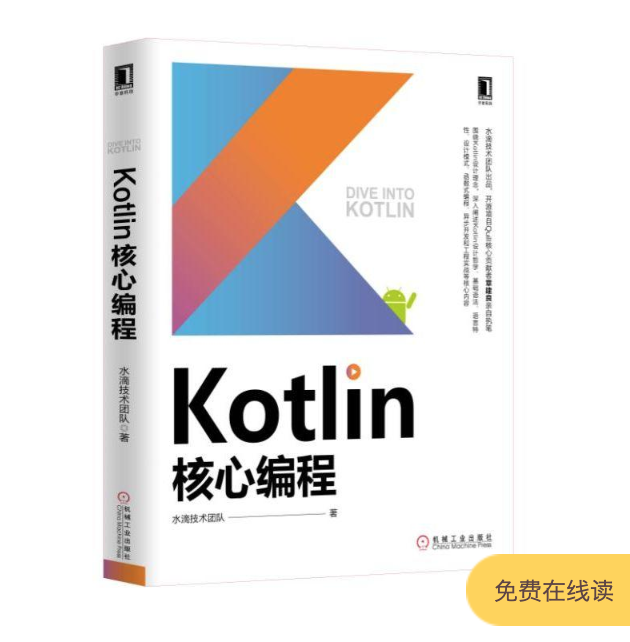
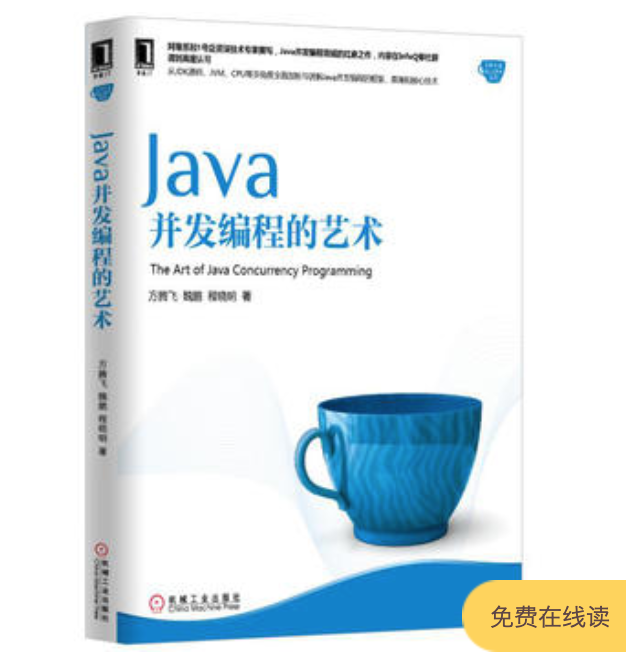
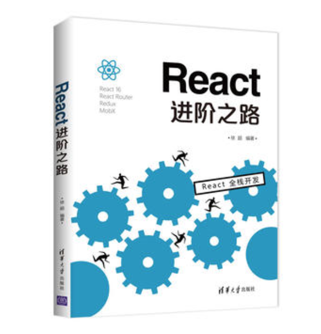

# 统计一下这些年买的部分技术书籍及其主要章节

 

**概述**

统计的目的是为了方便自己快速查找知识点，以形成更系统的学习体系。

 
 

**书籍列表**

* 数据结构与算法分析：Java 语言描述（第2版）
* Effective Java 中文版（原书第3版）
* Java 并发编程实战
* Kotlin 从零到精通 Android 开发
* Android 应用开发进阶
* RxJava 2.x 实战
* 音视频开发进阶指南：基于 Android 与 iOS 平台的实践
* 新时期的 Node.js 入门
* 深入浅出 Webpack
* App 后台开发运维和架构实践
* 深入理解 Android 自动化测试
* Kotlin 核心编程
* Java 并发编程的艺术
* 漫画算法：小灰的算法之旅
* FFmpeg 从入门到精通
* Android 全埋点解决方案
* Android 移动性能实战
* Android Gradle 权威指南
* JavaScript 忍者秘籍 第2版
* Git 高手之路
* Android 组件化架构
* React 进阶之路
* 深入探索 Android 热修复技术原理

 
 

**书籍目录**

数据结构与算法分析：Java 语言描述（第2版）
<table>
  <tr>
    <td>引论</td>
    <td>
      <ul>
        <li>数学知识复习</li>
        <li>递归简论</li>
        <li>实现泛型特性构件 pre-Java5</li>
        <li>利用 Java5 泛性实现泛型特性成分</li>
        <li>函数对象</li>
      </ul>
    </td>
  </tr>
  <tr>
    <td>算法分析</td>
    <td>
      <ul>
        <li>数学基础</li>
        <li>模型</li>
        <li>要分析的问题</li>
        <li>运行时间计算</li>
      </ul>
    </td>
  </tr>
  <tr>
    <td>表、栈和队列</td>
    <td>
      <ul>
        <li>抽象数据类型</li>
        <li>表 ADT</li>
        <li>JavaCollections API 中的表</li>
        <li>ArrayList 类的实现</li>
        <li>LinkedList 类的实现</li>
        <li>栈 ADT</li>
        <li>队列 ADT</li>
      </ul>
    </td>
  </tr>
  <tr>
    <td>树</td>
    <td>
      <ul>
        <li>预备知识</li>
        <li>二叉树</li>
        <li>查找树 ADT - 二叉查找树</li>
        <li>AVL 树</li>
        <li>伸展树</li>
        <li>树的遍历</li>
        <li>B 树</li>
        <li>标准库中的集合与映射</li>
      </ul>
    </td>
  </tr>
  <tr>
    <td>散列</td>
    <td>
      <ul>
        <li>一般想法</li>
        <li>散列函数</li>
        <li>分离链接法</li>
        <li>不用链表的散列表</li>
        <li>再散列</li>
        <li>标准库中的散列表</li>
        <li>可扩散列</li>
      </ul>
    </td>
  </tr>
  <tr>
    <td>优先队列（堆）</td>
    <td>
      <ul>
        <li>模型</li>
        <li>一些简单的实现</li>
        <li>二叉堆</li>
        <li>优先队列的应用</li>
        <li>d-堆</li>
        <li>左式堆</li>
        <li>斜堆</li>
        <li>二项队列</li>
        <li>标准库中的优先队列</li>
      </ul>
    </td>
  </tr>
  <tr>
    <td>排序</td>
    <td>
      <ul>
        <li>预备知识</li>
        <li>插入排序</li>
        <li>一些简单排序算法的下界</li>
        <li>希尔排序</li>
        <li>堆排序</li>
        <li>归并排序</li>
        <li>快速排序</li>
        <li>排序算法的一般下界</li>
        <li>桶式排序</li>
        <li>外部排序</li>
      </ul>
    </td>
  </tr>
  <tr>
    <td>不相交集类</td>
    <td>
      <ul>
        <li>等价关系</li>
        <li>动态等价性问题</li>
        <li>基本数据结构</li>
        <li>灵巧求并算法</li>
        <li>路径压缩</li>
        <li>路径压缩和按秩求并的最坏情形</li>
        <li>一个应用</li>
      </ul>
    </td>
  </tr>
  <tr>
    <td>图论算法</td>
    <td>
      <ul>
        <li>若干定义</li>
        <li>拓扑排序</li>
        <li>最短路径算法</li>
        <li>网络流问题</li>
        <li>最小生成树</li>
        <li>深度优先搜索的应用</li>
        <li>NP完全性介绍</li>
      </ul>
    </td>
  </tr>
  <tr>
    <td>算法设计技巧</td>
    <td>
      <ul>
        <li>贪婪算法</li>
        <li>分治算法</li>
        <li>动态规划</li>
        <li>随机化算法</li>
        <li>回溯算法</li>
      </ul>
    </td>
  </tr>
  <tr>
    <td>摊还分析</td>
    <td>
      <ul>
        <li>一个无关的智力问题</li>
        <li>二项队列</li>
        <li>斜堆</li>
        <li>斐波那契堆</li>
        <li>伸展树</li>
      </ul>
    </td>
  </tr>
  <tr>
    <td>高级数据结构及其实现</td>
    <td>
      <ul>
        <li>自顶向下伸展树</li>
        <li>红黑树</li>
        <li>确定性跳跃表</li>
        <li>AA 树</li>
        <li>treap 树</li>
        <li>kd 树</li>
        <li>配对堆</li>
      </ul>
    </td>
  </tr>
</table>

 

Effective Java 中文版（原书第3版）
<table>
  <tr>
    <td>引言</td>
    <td>
      <ul>
        <li>--</li>
      </ul>
    </td>
  </tr>
  <tr>
    <td>创建和销毁对象</td>
    <td>
      <ul>
        <li>用静态工厂方法代替构造器</li>
        <li>遇到多个构造器参数时要考虑使用构建器</li>
        <li>用私有构造器或者枚举类型强化 Singleton 属性</li>
        <li>通过私有构造器强化不可实例化的能力</li>
        <li>优先考虑依赖注入来引用资源</li>
        <li>避免创建不必要的对象</li>
        <li>消除过期的对象引用</li>
        <li>避免使用终结方法和清除方法</li>
        <li>try-with-resources 优先于 try-f?inally</li>
      </ul>
    </td>
  </tr>
  <tr>
    <td>对于所有对象都通用的方法</td>
    <td>
      <ul>
        <li>覆盖 equals 时请遵守通用约定</li>
        <li>覆盖 equals 时总要覆盖hashCode</li>
        <li>始终要覆盖 toString</li>
        <li>谨慎地覆盖 clone</li>
        <li>考虑实现 Comparable 接口</li>
      </ul>
    </td>
  </tr>
  <tr>
    <td>类和接口</td>
    <td>
      <ul>
        <li>使类和成员的可访问性最小化</li>
        <li>要在公有类而非公有域中使用访问方法</li>
        <li>使可变性最小化</li>
        <li>复合优先于继承</li>
        <li>要么设计继承并提供文档说明，要么禁止继承</li>
        <li>接口优于抽象类</li>
        <li>为后代设计接口</li>
        <li>接口只用于定义类型</li>
        <li>类层次优于标签类</li>
        <li>静态成员类优于非静态成员类</li>
        <li>限制源文件为单个顶级类</li>
      </ul>
    </td>
  </tr>
  <tr>
    <td>泛型</td>
    <td>
      <ul>
        <li>请不要使用原生态类型</li>
        <li>消除非受检的警告</li>
        <li>列表优于数组</li>
        <li>优先考虑泛型</li>
        <li>优先考虑泛型方法</li>
        <li>利用有限制通配符来提升API的灵活性</li>
        <li>谨慎并用泛型和可变参数</li>
        <li>优先考虑类型安全的异构容器</li>
      </ul>
    </td>
  </tr>
  <tr>
    <td>枚举和注解</td>
    <td>
      <ul>
        <li>用 enum 代替 int 常量</li>
        <li>用实例域代替序数</li>
        <li>用 EnumSet 代替位域</li>
        <li>用 EnumMap 代替序数索引</li>
        <li>用接口模拟可扩展的枚举</li>
        <li>注解优先于命名模式</li>
        <li>坚持使用 Override 注解</li>
        <li>用标记接口定义类型</li>
      </ul>
    </td>
  </tr>
  <tr>
    <td>Lambda 和 Stream</td>
    <td>
      <ul>
        <li>Lambda 优先于匿名类</li>
        <li>坚持使用标准的函数接口</li>
        <li>谨慎使用 Stream</li>
        <li>优先选择 Stream 中无副作用的函数</li>
        <li>Stream 要优先用 Collection 作为返回类型</li>
        <li>谨慎使用 Stream 并行</li>
      </ul>
    </td>
  </tr>
  <tr>
    <td>方法</td>
    <td>
      <ul>
        <li>检查参数的有效性</li>
        <li>必要时进行保护性拷贝</li>
        <li>谨慎设计方法签名</li>
        <li>慎用重载</li>
        <li>慎用可变参数</li>
        <li>返回零长度的数组或者集合，而不是 null</li>
        <li>谨慎返回 optinal</li>
        <li>为所有导出的 API 元素编写文档注释</li>
      </ul>
    </td>
  </tr>
  <tr>
    <td>通用编程</td>
    <td>
      <ul>
        <li>将局部变量的作用域最小化</li>
        <li>for-each 循环优先于传统的 for 循环</li>
        <li>了解和使用类库</li>
        <li>如果需要精确的答案，请避免使用 float 和 double</li>
        <li>基本类型优先于装箱基本类型</li>
        <li>如果其他类型更适合，则尽量避免使用字符串</li>
        <li>了解字符串连接的性能</li>
        <li>通过接口引用对象</li>
        <li>接口优先于反射机制</li>
        <li>谨慎地使用本地方法</li>
        <li>谨慎地进行优化</li>
        <li>遵守普遍接受的命名惯例</li>
      </ul>
    </td>
  </tr>
  <tr>
    <td>异常</td>
    <td>
      <ul>
        <li>只针对异常的情况才使用异常</li>
        <li>对可恢复的情况使用受检异常，对编程错误使用运行时异常</li>
        <li>避免不必要地使用受检异常</li>
        <li>优先使用标准的异常</li>
        <li>抛出与抽象对应的异常</li>
        <li>每个方法抛出的所有异常都要建立文档</li>
        <li>在细节消息中包含失败-捕获信息</li>
        <li>努力使失败保持原子性</li>
        <li>不要忽略异常</li>
      </ul>
    </td>
  </tr>
  <tr>
    <td>并发</td>
    <td>
      <ul>
        <li>同步访问共享的可变数据</li>
        <li>避免过度同步</li>
        <li>executor、task 和 stream 优先于线程</li>
        <li>并发工具优先于 wait 和 notify</li>
        <li>线程安全性的文档化</li>
        <li>慎用延迟初始化</li>
        <li>不要依赖于线程调度器</li>
      </ul>
    </td>
  </tr>
  <tr>
    <td>序列化</td>
    <td>
      <ul>
        <li>其他方法优先于 Java 序列化</li>
        <li>谨慎地实现 Serializable 接口</li>
        <li>考虑使用自定义的序列化形式</li>
        <li>保护性地编写 readObject 方法</li>
        <li>对于实例控制，枚举类型优先于 readResolve</li>
        <li>考虑用序列化代理代替序列化实例</li>
      </ul>
    </td>
  </tr>
</table>

 

Java并发编程实战
<table>
  <tr>
    <td>简介</td>
    <td>
      <ul>
        <li>并发简史 </li>
        <li>线程的优势 </li>
        <li>线程带来的风险</li>
        <li>线程无处不在</li>
      </ul>
    </td>
  </tr>
  <tr>
    <td>线程安全性 </td>
    <td>
      <ul>
        <li>什么是线程安全性</li>
        <li>原子性</li>
        <li>加锁机制</li>
        <li>用锁来保护状态</li>
        <li>活跃性与性能</li>
      </ul>
    </td>
  </tr>
  <tr>
    <td>对象的共享</td>
    <td>
      <ul>
        <li>可见性</li>
        <li>发布与逸出</li>
        <li>线程封闭</li>
        <li>不变性</li>
        <li>安全发布</li>
      </ul>
    </td>
  </tr>
  <tr>
    <td>对象的组合</td>
    <td>
      <ul>
        <li>设计线程安全的类</li>
        <li>实例封闭</li>
        <li>线程安全性的委托</li>
        <li>在现有的线程安全类中添加功能</li>
        <li>将同步策略文档化</li>
      </ul>
    </td>
  </tr>
  <tr>
    <td>基础构建模块</td>
    <td>
      <ul>
        <li>同步容器类</li>
        <li>并发容器</li>
        <li>阻塞队列和生产者-消费者模式</li>
        <li>阻塞方法与中断方法</li>
        <li>同步工具类</li>
        <li>构建高效且可伸缩的结果缓存</li>
      </ul>
    </td>
  </tr>
  <tr>
    <td>任务执行</td>
    <td>
      <ul>
        <li>在线程中执行任务</li>
        <li>Executor 框架</li>
        <li>找出可利用的并行性</li>
      </ul>
    </td>
  </tr>
  <tr>
    <td>取消与关闭</td>
    <td>
      <ul>
        <li></li>
      </ul>
    </td>
  </tr>
  <tr>
    <td>线程池的使用</td>
    <td>
      <ul>
        <li></li>
      </ul>
    </td>
  </tr>
  <tr>
    <td>图形用户界面应用程序</td>
    <td>
      <ul>
        <li></li>
      </ul>
    </td>
  </tr>
  <tr>
    <td>避免活跃性危险</td>
    <td>
      <ul>
        <li></li>
      </ul>
    </td>
  </tr>
  <tr>
    <td>性能与可伸缩性</td>
    <td>
      <ul>
        <li></li>
      </ul>
    </td>
  </tr>
  <tr>
    <td>并发程序的测试</td>
    <td>
      <ul>
        <li></li>
      </ul>
    </td>
  </tr>
  <tr>
    <td>显式锁</td>
    <td>
      <ul>
        <li></li>
      </ul>
    </td>
  </tr>
  <tr>
    <td>构建自定义的同步工具</td>
    <td>
      <ul>
        <li></li>
      </ul>
    </td>
  </tr>
  <tr>
    <td>原子变量与非阻塞同步机制</td>
    <td>
      <ul>
        <li></li>
      </ul>
    </td>
  </tr>
  <tr>
    <td>Java 内存模型</td>
    <td>
      <ul>
        <li></li>
      </ul>
    </td>
  </tr>
</table>

 

Kotlin 从零到精通 Android 开发
<table>
  <tr>
    <td>搭建 Kotlin 开发环境</td>
    <td>
      <ul>
        <li>Kotlin 与 Android 开发的关系</li>
        <li>Kotlin 开发工具</li>
        <li>SDK 安装与插件升级</li>
        <li>Kotlin 简单配置</li>
        <li>Kotlin 相关技术</li>
      </ul>
    </td>
  </tr>
  <tr>
    <td>数据类型</td>
    <td>
      <ul>
        <li>基本数据类型</li>
        <li>数组</li>
        <li>字符串</li>
        <li>容器</li>
      </ul>
    </td>
  </tr>
  <tr>
    <td>控制语句</td>
    <td>
      <ul>
        <li>条件分支</li>
        <li>循环处理</li>
        <li>空安全</li>
        <li>等式判断</li>
      </ul>
    </td>
  </tr>
  <tr>
    <td>函数运用</td>
    <td>
      <ul>
        <li>函数的基本用法</li>
        <li>输入参数的变化</li>
        <li>几种特殊函数</li>
        <li>增强系统函数</li>
      </ul>
    </td>
  </tr>
  <tr>
    <td>类和对象</td>
    <td>
      <ul>
        <li>类的构造</li>
        <li>类的成员</li>
        <li>类的继承</li>
        <li>几种特殊类</li>
      </ul>
    </td>
  </tr>
  <tr>
    <td>Kotlin 使用简单控件</td>
    <td>
      <ul>
        <li>使用按钮控件</li>
        <li>使用页面布局</li>
        <li>使用图文控件</li>
        <li>Activity 活动跳转</li>
        <li>实战项目：电商App的登录页面</li>
      </ul>
    </td>
  </tr>
  <tr>
    <td>Kotlin 操纵复杂控件</td>
    <td>
      <ul>
        <li>使用视图排列</li>
        <li>使用材质设计 MaterialDesign</li>
        <li>实现页面切换</li>
        <li>广播收发 Broadcast</li>
        <li>实战项目：电商 App 的商品频道</li>
      </ul>
    </td>
  </tr>
  <tr>
    <td>Kotlin 进行数据存储</td>
    <td>
      <ul>
        <li>使用共享参数 SharedPreferences</li>
        <li>使用数据库 SQLite</li>
        <li>文件 I/O 操作</li>
        <li>Application 全局变量</li>
        <li>实战项目：电商 App 的购物车</li>
      </ul>
    </td>
  </tr>
  <tr>
    <td>Kotlin 自定义控件</td>
    <td>
      <ul>
        <li>自定义普通视图</li>
        <li>自定义简单动画</li>
        <li>自定义通知栏</li>
        <li>Service 服务启停</li>
        <li>实战项目：电商 App 的生鲜团购</li>
      </ul>
    </td>
  </tr>
  <tr>
    <td>Kotlin 实现网络通信</td>
    <td>
      <ul>
        <li>多线程技术</li>
        <li>访问 HTTP 接口</li>
        <li>文件下载操作</li>
        <li>ContentProvider 内容提供</li>
        <li>实战项目：电商 App 的自动升级</li>
      </ul>
    </td>
  </tr>
</table>

 

Android 应用开发进阶
<table>
  <tr>
    <td>自定义控件</td>
    <td>
      <ul>
        <li>View 的绘制流程</li>
        <li>View 的触摸事件</li>
        <li>自定义控件常用方法总结</li>
        <li>自定义控件案例</li>
        <li>自定义控件性能优化</li>
      </ul>
    </td>
  </tr>
  <tr>
    <td>轮子</td>
    <td>
      <ul>
        <li>AppBrain 平台</li>
        <li>Butter Knife</li>
        <li>EventBus</li>
        <li>Dagger2</li>
        <li>OkHttp</li>
        <li>Retrofit</li>
        <li>Volley</li>
        <li>RxJava</li>
      </ul>
    </td>
  </tr>
  <tr>
    <td>Android 应用架构</td>
    <td>
      <ul>
        <li>todo-mvp</li>
        <li>todo-mvp-clean</li>
        <li>todo-mvp-dagger</li>
        <li>todo-mvp-rxjava</li>
        <li>todo-mvvm-databinding</li>
        <li>todo-mvvm-live</li>
      </ul>
    </td>
  </tr>
  <tr>
    <td>AndroidPlus 项目实战</td>
    <td>
      <ul>
        <li>需求分析</li>
        <li>产品设计</li>
        <li>Java 实现</li>
        <li>Kotlin 实现</li>
      </ul>
    </td>
  </tr>
  <tr>
    <td>开发实践</td>
    <td>
      <ul>
        <li>Android Studio 中的 Git 实践</li>
        <li>Android 屏幕适配</li>
        <li>Android 视频播放器</li>
        <li>声网直播实践</li>
      </ul>
    </td>
  </tr>
</table>

 

RxJava 2.x 实战
<table>
  <tr>
    <td>RxJava 简介</td>
    <td>
      <ul>
        <li>你需要了解的函数响应式编程</li>
        <li>RxJava 简介</li>
        <li>为何选择 RxJava</li>
        <li>RxJava 能做什么</li>
        <li>RxJava 2 的 Hello World</li>
      </ul>
    </td>
  </tr>
  <tr>
    <td>RxJava 基础知识</td>
    <td>
      <ul>
        <li>Observable</li>
        <li>Hot Observable 和 Cold Observable</li>
        <li>Flowable</li>
        <li>Single、Completable 和 Maybe</li>
        <li>Subject 和 Processor</li>
      </ul>
    </td>
  </tr>
  <tr>
    <td>创建操作符</td>
    <td>
      <ul>
        <li>create、just 和 from</li>
        <li>repeat</li>
        <li>defer、interval 和 timer</li>
      </ul>
    </td>
  </tr>
  <tr>
    <td>RxJava 的线程操作</td>
    <td>
      <ul>
        <li>调度器（Scheduler）种类</li>
        <li>RxJava 线程模型</li>
        <li>Scheduler 的测试</li>
      </ul>
    </td>
  </tr>
  <tr>
    <td>变换操作和过滤操作符</td>
    <td>
      <ul>
        <li>map 和 flatMap</li>
        <li>groupBy</li>
        <li>buffer 和 window</li>
        <li>first 和 last</li>
        <li>take 和 takeLast</li>
        <li>skip 和 skipLast</li>
        <li>elementAt 和 ignoreElements</li>
        <li>distinct 和 filter</li>
        <li>debounce</li>
      </ul>
    </td>
  </tr>
  <tr>
    <td>条件操作符和布尔操作符</td>
    <td>
      <ul>
        <li>all、contains 和 amb</li>
        <li>defaultIfEmpty</li>
        <li>sequenceEqual</li>
        <li>skipUtil 和 skipWhile</li>
        <li>takeUtil 和 takeWhile</li>
      </ul>
    </td>
  </tr>
  <tr>
    <td>合并操作符与连接操作符</td>
    <td>
      <ul>
        <li>merge 和 zip</li>
        <li>combineLatest 和 join</li>
        <li>startWith</li>
        <li>connect、push 和 refCount</li>
        <li>replay</li>
      </ul>
    </td>
  </tr>
  <tr>
    <td>RxJava 的背压</td>
    <td>
      <ul>
        <li>背压</li>
        <li>RxJava 2.x 的背压策略</li>
      </ul>
    </td>
  </tr>
  <tr>
    <td>Disposble 和 Transformer 的使用</td>
    <td>
      <ul>
        <li>Disposable</li>
        <li>RxLifecycle 和 AutoDispose</li>
        <li>Transformer 在 RxJava 中的使用</li>
      </ul>
    </td>
  </tr>
  <tr>
    <td>RxJava 的并行编程</td>
    <td>
      <ul>
        <li>RxJava 并行操作</li>
        <li>ParallelFlowable</li>
      </ul>
    </td>
  </tr>
  <tr>
    <td>RxBinding 的使用</td>
    <td>
      <ul>
        <li>RxBinding 简介</li>
        <li>RxBinding 使用场景</li>
        <li>RxBinding 结合 RxPermissions 的使用</li>
        <li>RxBinding 使用的注意点</li>
      </ul>
    </td>
  </tr>
  <tr>
    <td>RxAndroid 2.x 和 Retrofit 的使用</td>
    <td>
      <ul>
        <li>RxAndroid 2.x 简介</li>
        <li>Retrofit 简介</li>
        <li>Retrofit 与 RxJava 的完美配合</li>
      </ul>
    </td>
  </tr>
  <tr>
    <td>开发 EventBus</td>
    <td>
      <ul>
        <li>传统的 EventBus</li>
        <li>开发一个新的 EventBus（一）</li>
        <li>开发一个新的 EventBus（二）</li>
        <li>开发一个新的 EventBus（三）</li>
        <li>开发一个新的 EventBus（四）</li>
      </ul>
    </td>
  </tr>
  <tr>
    <td>使用 RxJava 封装 Httpclient</td>
    <td>
      <ul>
        <li>HttpClient 的介绍</li>
        <li>使用RxJava 进行重构</li>
        <li>实现一个简单的图片爬虫</li>
      </ul>
    </td>
  </tr>
  <tr>
    <td>Spring Boot 和 RxJava 2</td>
    <td>
      <ul>
        <li>模拟 Task 任务</li>
        <li>构建一个给爬虫使用的代理 IP 池</li>
      </ul>
    </td>
  </tr>
  <tr>
    <td>Java 8 的函数式编程</td>
    <td>
      <ul>
        <li>Java 8 的新变化</li>
        <li>函数</li>
        <li>Lambda 表达式</li>
        <li>Java 8 新增的 Stream</li>
        <li>函数的柯里化</li>
        <li>新的异步编程方式 CompletableFuture</li>
      </ul>
    </td>
  </tr>
  <tr>
    <td>Kotin 和 RxJava</td>
    <td>
      <ul>
        <li>Kotlin 简介</li>
        <li>使用 Kotlin 来封装图像框架</li>
      </ul>
    </td>
  </tr>
  <tr>
    <td>展望未来</td>
    <td>
      <ul>
        <li>期待已久的 Java 9</li>
        <li>其他的 Reactive Streams 项目</li>
      </ul>
    </td>
  </tr>
</table>

 

音视频开发进阶指南：基于Android与iOS平台的实践
<table>
  <tr>
    <td>音视频基础概念</td>
    <td>
      <ul>
        <li>声音的物理性质</li>
        <li>数字音频</li>
        <li>音频编码</li>
        <li>图像的物理现象</li>
        <li>图像的数值表示</li>
        <li>视频的编码方式</li>
      </ul>
    </td>
  </tr>
  <tr>
    <td>移动端环境搭建</td>
    <td>
      <ul>
        <li>在 iOS 上如何搭建一个基础项目</li>
        <li>在 Android 上如何搭建一个基础项目</li>
        <li>交叉编译的原理与实践</li>
      </ul>
    </td>
  </tr>
  <tr>
    <td>FFmpeg 的介绍与使用</td>
    <td>
      <ul>
        <li>FFmpeg 的编译与命令行工具的使用</li>
        <li>FFmpeg API 的介绍与使用</li>
        <li>FFmpeg 源码结构</li>
      </ul>
    </td>
  </tr>
  <tr>
    <td>移动平台下的音视频渲染</td>
    <td>
      <ul>
        <li>AudioUnit 介绍与实践</li>
        <li>Android 平台的音频渲染</li>
        <li>视频渲染</li>
      </ul>
    </td>
  </tr>
  <tr>
    <td>实现一款视频播放器</td>
    <td>
      <ul>
        <li>架构设计</li>
        <li>解码模块的实现</li>
        <li>音频播放模块的实现</li>
        <li>画面播放模块的实现</li>
        <li>AVSync 模块的实现</li>
        <li>中控系统串联起各个模块</li>
      </ul>
    </td>
  </tr>
  <tr>
    <td>音视频的采集与编码</td>
    <td>
      <ul>
        <li>音频的采集</li>
        <li>视频画面的采集</li>
        <li>音频的编码</li>
        <li>视频画面的编码</li>
      </ul>
    </td>
  </tr>
  <tr>
    <td>实现一款视频录制应用</td>
    <td>
      <ul>
        <li>视频录制的架构设计</li>
        <li>音频模块的实现</li>
        <li>音频编码模块的实现</li>
        <li>画面采集与编码模块的实现</li>
        <li>Mux 模块</li>
        <li>中控系统串联起各个模块</li>
      </ul>
    </td>
  </tr>
  <tr>
    <td>音频效果器的介绍与实践</td>
    <td>
      <ul>
        <li>数字音频基础</li>
        <li>数字音频处理：快速傅里叶变换</li>
        <li>基本乐理知识</li>
        <li>混音效果器</li>
        <li>效果器实现</li>
      </ul>
    </td>
  </tr>
  <tr>
    <td>视频效果器的介绍与实践</td>
    <td>
      <ul>
        <li>图像处理的基本原理</li>
        <li>图像处理进阶</li>
        <li>使用 FFmpeg 内部的视频滤镜</li>
        <li>使用 OpenGL ES 实现视频滤镜</li>
      </ul>
    </td>
  </tr>
  <tr>
    <td>专业的视频录制应用实践</td>
    <td>
      <ul>
        <li>视频硬件解码器的使用</li>
        <li>音频效果器的集成</li>
        <li>一套跨平台的视频效果器的设计与实现</li>
        <li>将特效处理库集成到视频录制项目中</li>
      </ul>
    </td>
  </tr>
  <tr>
    <td>直播应用的构建</td>
    <td>
      <ul>
        <li>直播场景分析</li>
        <li>拉流播放器的构建</li>
        <li>推流器的构建</li>
        <li>第三方云服务介绍</li>
        <li>礼物系统的实现</li>
        <li>聊天系统的实现</li>
      </ul>
    </td>
  </tr>
  <tr>
    <td>直播应用中的关键处理</td>
    <td>
      <ul>
        <li>直播应用的细节分析</li>
        <li>推流端的关键处理</li>
        <li>拉流端的关键处理</li>
      </ul>
    </td>
  </tr>
  <tr>
    <td>工欲善其事，必先利其器</td>
    <td>
      <ul>
        <li>Android 平台工具详解</li>
        <li>iOS 使用 Instruments 诊断应用</li>
      </ul>
    </td>
  </tr>
</table>

 

新时期的 Node.js 入门
<table>
  <tr>
    <td>基础知识</td>
    <td>
      <ul>
        <li>Node 是什么</li>
        <li>Node 的内部机制</li>
        <li>事件循环 (Event loop)</li>
      </ul>
    </td>
  </tr>
  <tr>
    <td>常用模块</td>
    <td>
      <ul>
        <li>Module</li>
        <li>Buffer</li>
        <li>File System</li>
        <li>HTTP 服务</li>
        <li>TCP 服务</li>
        <li>更安全的传输方式 —— SSL</li>
        <li>WebSocket</li>
        <li>Stream</li>
        <li>Events</li>
        <li>多进程服务</li>
        <li>Process 对象</li>
        <li>Timer</li>
      </ul>
    </td>
  </tr>
  <tr>
    <td>用 ES6 来书写 Node</td>
    <td>
      <ul>
        <li>新时代的 EMCAScript</li>
        <li>块级作用域</li>
        <li>数组</li>
        <li>函数</li>
        <li>Set 和 Map</li>
        <li>Iterator</li>
        <li>对象</li>
        <li>类</li>
        <li>类的继承</li>
        <li>ES6 的模块化标准</li>
        <li>使用 babel 来转换代码</li>
      </ul>
    </td>
  </tr>
  <tr>
    <td>书写异步代码</td>
    <td>
      <ul>
        <li>异步操作的返回值</li>
        <li>组织回调方法</li>
        <li>使用 Promise</li>
        <li>Generator，一种过渡方案</li>
        <li>回调的终点 —— async/await</li>
      </ul>
    </td>
  </tr>
  <tr>
    <td>使用 Koa2 构建 Web 站点</td>
    <td>
      <ul>
        <li>Node Web 框架的发展历程</li>
        <li>内容规划</li>
        <li>Koa 入门</li>
        <li>middleware</li>
        <li>常用服务的实现</li>
        <li>构建健壮的 Web 应用</li>
        <li>使用 Redis 进行持久化</li>
        <li>Koa 源码剖析</li>
        <li>网站部署</li>
      </ul>
    </td>
  </tr>
  <tr>
    <td>爬虫系统的开发</td>
    <td>
      <ul>
        <li>爬虫技术概述</li>
        <li>技术栈简介</li>
        <li>构建脚手架</li>
        <li>进行批量爬取</li>
        <li>爬虫架构的改进</li>
        <li>进程架构的改进</li>
        <li>反爬虫处理</li>
      </ul>
    </td>
  </tr>
  <tr>
    <td>测试与调试</td>
    <td>
      <ul>
        <li>单元测试</li>
        <li>测试现有代码</li>
        <li>更高维度的测试</li>
        <li>调试 Node 应用</li>
      </ul>
    </td>
  </tr>
  <tr>
    <td>Node 中的错误处理</td>
    <td>
      <ul>
        <li>Error 模块</li>
        <li>错误处理的几种方式</li>
        <li>被抛弃的 Domain</li>
        <li>ES6 中的错误处理</li>
        <li>Web 服务中的错误处理</li>
        <li>防御式编程与 Let it crash</li>
      </ul>
    </td>
  </tr>
</table>

 

深入浅出 Webpack
<table>
  <tr>
    <td>入门</td>
    <td>
      <ul>
        <li>前端的发展</li>
        <li>常见的构建工具及对比</li>
        <li>安装 Webpack</li>
        <li>使用 Loader</li>
        <li>使用 Plugin</li>
        <li>使用 DevServer</li>
        <li>核心概念</li>
      </ul>
    </td>
  </tr>
  <tr>
    <td>配置</td>
    <td>
      <ul>
        <li>Entry</li>
        <li>Output</li>
        <li>Module</li>
        <li>Resolve</li>
        <li>Plugin</li>
        <li>DevServer</li>
        <li>其他配置项</li>
        <li>整体配置结构</li>
        <li>多种配置类型</li>
      </ul>
    </td>
  </tr>
  <tr>
    <td>实战</td>
    <td>
      <ul>
        <li>使用 ES6 语言</li>
        <li>使用 TypeScript 语言</li>
        <li>使用 Flow 检查器</li>
        <li>使用 SCSS 语言</li>
        <li>使用 PostCSS</li>
        <li>使用 React 框架</li>
        <li>使用 Vue 框架</li>
        <li>使用 Angular2 框架</li>
        <li>为单页应用生成 HTML</li>
        <li>管理多个单页应用</li>
        <li>构建同构应用</li>
        <li>构建 Electron 应用</li>
        <li>构建 Npm模块</li>
        <li>构建离线应用</li>
        <li>搭配 Npm Script</li>
        <li>检查代码</li>
        <li>通过 Node.js API 启动 Webpack</li>
        <li>使用 Webpack Dev Middleware</li>
        <li>加载图片</li>
        <li>加载 SVG</li>
        <li>加载 Source Map</li>
        <li>实战总结</li>
      </ul>
    </td>
  </tr>
  <tr>
    <td>优化</td>
    <td>
      <ul>
        <li>缩小文件的搜索范围</li>
        <li>使用 DllPlugin</li>
        <li>使用 HappyPack</li>
        <li>使用 ParallelUglifyPlugin</li>
        <li>使用自动刷新</li>
        <li>开启模块热替换</li>
        <li>区分环境</li>
        <li>压缩代码</li>
        <li>CDN 加速</li>
        <li>使用 Tree Shaking</li>
        <li>提取公共代码</li>
        <li>分割代码以按需加载</li>
        <li>使用 Prepack</li>
        <li>开启 Scope Hoisting</li>
        <li>输出分析</li>
        <li>优化总结</li>
      </ul>
    </td>
  </tr>
  <tr>
    <td>原理</td>
    <td>
      <ul>
        <li>工作原理概括</li>
        <li>输出文件分析</li>
        <li>编写 Loader</li>
        <li>编写 Plugin</li>
        <li>调试 Webpack</li>
        <li>原理总结</li>
      </ul>
    </td>
  </tr>
</table>

 

App 后台开发运维和架构实践
<table>
  <tr>
    <td>App 后台入门</td>
    <td>
      <ul>
        <li>App 后台的功能</li>
        <li>App 后台架构</li>
        <li>App 和 App 后台的通信</li>
        <li>App 后台和 Web 后端的区别</li>
        <li>选择服务器</li>
        <li>选择编程语言</li>
        <li>快速入门新技术</li>
        <li>App 是怎样炼成的</li>
        <li>最适合 App 的开发模式——敏捷开发</li>
      </ul>
    </td>
  </tr>
  <tr>
    <td>App后台基础技术</td>
    <td>
      <ul>
        <li>从 App 业务逻辑中提炼API接口</li>
        <li>设计 API 的要点</li>
        <li>如何选择合适的数据库产品</li>
        <li>如何选择消息队列软件</li>
        <li>使用分布式服务实现业务的复用</li>
        <li>搜索技术入门</li>
        <li>定时任务</li>
      </ul>
    </td>
  </tr>
  <tr>
    <td>App后台核心技术</td>
    <td>
      <ul>
        <li>用户验证方案</li>
        <li>App 通信安全</li>
        <li>短信服务</li>
        <li>处理表情的一些技巧</li>
        <li>高效更新数据</li>
        <li>图片处理</li>
        <li>视频处理</li>
        <li>获取APK和IPA文件里的资源</li>
        <li>文件系统</li>
        <li>ELK 日志分析平台</li>
        <li>Docker 构建一致的开发环境</li>
      </ul>
    </td>
  </tr>
  <tr>
    <td>Linux —— App 后台应用最广泛的系统</td>
    <td>
      <ul>
        <li>基本的系统优化</li>
        <li>常用的命令</li>
        <li>故障案例分析</li>
      </ul>
    </td>
  </tr>
  <tr>
    <td>Nginx —— App 后台 HTTP 服务的利器</td>
    <td>
      <ul>
        <li>简介</li>
        <li>基本原理</li>
        <li>常用配置</li>
        <li>性能统计</li>
        <li>实现负载均衡的方案</li>
        <li>用 Nginx 处理业务逻辑</li>
      </ul>
    </td>
  </tr>
  <tr>
    <td>MySQL —— App 后台最常用的数据库</td>
    <td>
      <ul>
        <li>基本架构</li>
        <li>选择版本</li>
        <li>配置文件详解</li>
        <li>软件优化</li>
        <li>硬件优化</li>
        <li>架构优化</li>
        <li>SQL 慢查询分析</li>
        <li>云数据库简介</li>
        <li>灵活的存储结构</li>
        <li>故障排除案例</li>
      </ul>
    </td>
  </tr>
  <tr>
    <td>Redis —— App 后台高性能的缓存系统</td>
    <td>
      <ul>
        <li>Redis 简介</li>
        <li>Redis 的常用数据结构及应用场景</li>
        <li>内存优化</li>
        <li>集群</li>
        <li>持久化</li>
        <li>故障排除案例</li>
      </ul>
    </td>
  </tr>
  <tr>
    <td>MongoDB —— App 后台新兴的数据库</td>
    <td>
      <ul>
        <li>简介</li>
        <li>核心机制解析</li>
        <li>入门</li>
        <li>高可用集群</li>
        <li>LBS —— 地理位置查询</li>
        <li>MongoDB 3.0 版本的改进</li>
      </ul>
    </td>
  </tr>
  <tr>
    <td>App后台架构剖析</td>
    <td>
      <ul>
        <li>聊天 App 后台架构</li>
        <li>社交 App 后台架构</li>
        <li>LBS App 后台架构</li>
        <li>推送服务器后台架构</li>
        <li>获得更多 App 后台架构资料</li>
      </ul>
    </td>
  </tr>
  <tr>
    <td>App后台架构的演进</td>
    <td>
      <ul>
        <li>架构的核心要素</li>
        <li>架构选型的要点</li>
        <li>架构的演进</li>
        <li>架构的特点</li>
      </ul>
    </td>
  </tr>
</table>

 

深入理解 Android 自动化测试
<table>
  <tr>
    <td>Android 自动化测试基础</td>
    <td>
      <ul>
        <li>Android 自动化分析</li>
        <li>什么样的兵器称手</li>
        <li>如何耍好你手上的兵器</li>
        <li>你了解你的兵器吗</li>
        <li>如何改造你的兵器</li>
      </ul>
    </td>
  </tr>
  <tr>
    <td>稳定性测试利器 monkey 使用详解</td>
    <td>
      <ul>
        <li>monkey 概述</li>
        <li>第一个 Impossible Mission</li>
        <li>monkey 的基本使用</li>
        <li>monkey 的命令及其使用</li>
        <li>第二个 Impossible Mission</li>
        <li>monkey 脚本编写</li>
        <li>monkey 工具总结</li>
      </ul>
    </td>
  </tr>
  <tr>
    <td>monkey 之子monkeyrunner使用详解</td>
    <td>
      <ul>
        <li>monkeyrunner 概述</li>
        <li>monkeyrunner API 详解</li>
        <li>monkeyrunner 脚本编写</li>
        <li>第三个 Impossible Mission</li>
        <li>monkeyrunner 的录制回放</li>
        <li>monkeyrunner 工具总结</li>
      </ul>
    </td>
  </tr>
  <tr>
    <td>单元测试框架 Instrumentation 使用详解</td>
    <td>
      <ul>
        <li>Instrumentation 概述</li>
        <li>Instrumentation 基础</li>
        <li>第四个 Impossible Mission</li>
        <li>Instrumentation 的前世：单元测试基础框架 JUnit</li>
        <li>第五个 Impossible Mission</li>
        <li>Instrumentation 的今生：对Android 系统的高度控制</li>
        <li>Instrumentation 前世今生分析</li>
        <li>第六个 Impossible Mission</li>
        <li>Instrumentation 自动化脚本开发</li>
        <li>Instrumentation 工具总结</li>
      </ul>
    </td>
  </tr>
  <tr>
    <td>终极自动化框架 UIAutomator 使用详解</td>
    <td>
      <ul>
        <li>UIAutomator 概述</li>
        <li>第七个 Impossible Mission</li>
        <li>更清晰的控件捕获</li>
        <li>更直观的测试项目创建</li>
        <li>UIAutomator API 详解</li>
        <li>更简洁的脚本撰写</li>
        <li>更便捷地编译运行</li>
        <li>UIAutomator 工具总结</li>
      </ul>
    </td>
  </tr>
  <tr>
    <td>兼容性测试框架 CTS 使用详解</td>
    <td>
      <ul>
        <li>CTS 概述</li>
        <li>CTS 测试须知</li>
        <li>CTS 的命令及运行</li>
        <li>CTS 测试报告</li>
        <li>CTS Verif?ier</li>
        <li>CTS 注意事项</li>
        <li>CTS 工具总结</li>
      </ul>
    </td>
  </tr>
  <tr>
    <td>Android 自动化工具使用总结</td>
    <td>
      <ul>
        <li></li>
      </ul>
    </td>
  </tr>
  <tr>
    <td>monkey 原理分析</td>
    <td>
      <ul>
        <li>monkey 源码结构</li>
        <li>monkey 架构分析</li>
        <li>monkey 的原理总结</li>
      </ul>
    </td>
  </tr>
  <tr>
    <td>monkeyrunner 原理分析</td>
    <td>
      <ul>
        <li>monkeyrunner 源码结构</li>
        <li>monkeyrunner 架构分析</li>
        <li>monkeyrunner 的原理总结</li>
      </ul>
    </td>
  </tr>
  <tr>
    <td>Instrumentation 原理分析</td>
    <td>
      <ul>
        <li>Instrumentation 源码结构</li>
        <li>Instrumentation 架构分析</li>
        <li>Instrumentation 的原理总结</li>
      </ul>
    </td>
  </tr>
  <tr>
    <td>UIAutomator 原理分析</td>
    <td>
      <ul>
        <li>UIAutomator 源码结构</li>
        <li>UIAutomator 架构分析</li>
        <li>UIAutomator 的原理总结</li>
      </ul>
    </td>
  </tr>
  <tr>
    <td>CTS 原理分析</td>
    <td>
      <ul>
        <li>CTS 源码结构</li>
        <li>CTS 架构分析</li>
        <li>CTS 的原理总结</li>
      </ul>
    </td>
  </tr>
  <tr>
    <td>Android 自动化工具源码总结</td>
    <td>
      <ul>
        <li></li>
      </ul>
    </td>
  </tr>
  <tr>
    <td>从 monkey 到传参或录制工具开发</td>
    <td>
      <ul>
        <li>从 monkey 原理说开来</li>
        <li>monkey 传参小工具</li>
        <li>monkey 脚本录制工具开发</li>
        <li>monkey 工具总结</li>
      </ul>
    </td>
  </tr>
  <tr>
    <td>从 Instrumentation 到稳定自动化工具开发</td>
    <td>
      <ul>
        <li>为何要做二次封装</li>
        <li>如何做 Instrumentation 的二次封装</li>
        <li>二次封装改进项总结</li>
      </ul>
    </td>
  </tr>
  <tr>
    <td>从 UIAutomatorViewer 到 PC 端脚本录制工具开发</td>
    <td>
      <ul>
        <li>从 UIAutomatorViewer 原理说开来</li>
        <li>基于 UIAutomatorViewer 的 PC 端脚本录制工具</li>
        <li>UIAutomatorViewer 录制工具总结</li>
      </ul>
    </td>
  </tr>
  <tr>
    <td>从 CTS 到定制化单元测试</td>
    <td>
      <ul>
        <li>从 CTS 原理说开来</li>
        <li>用 CTS 运行定制单元测试脚本</li>
        <li>定制单元测试脚本总结</li>
      </ul>
    </td>
  </tr>
  <tr>
    <td>Android 自动化实践之路</td>
    <td>
      <ul>
        <li></li>
      </ul>
    </td>
  </tr>
  <tr>
    <td>关于工具的反思</td>
    <td>
      <ul>
        <li>关于录制/回放工具的幻想</li>
        <li>要门槛还是要适配</li>
        <li>什么样的自动化框架才是强大的框架</li>
        <li>将第七个馒头扔出窗外</li>
      </ul>
    </td>
  </tr>
  <tr>
    <td>关于测试的反思</td>
    <td>
      <ul>
        <li>自动化是一种短线投资吗</li>
        <li>难道自动化是为了替代黑盒测试</li>
        <li>衡量自动化效果的标准是Bug数吗</li>
      </ul>
    </td>
  </tr>
  <tr>
    <td>关于人的反思</td>
    <td>
      <ul>
        <li>测试脚本编写者态度问题</li>
        <li>什么人适合做自动化</li>
        <li>自动化与组织架构有没有关系</li>
      </ul>
    </td>
  </tr>
</table>

 

Kotlin 核心编程
<table>
  <tr>
    <td>认识 Kotlin</td>
    <td>
      <ul>
        <li>Java 的发展</li>
        <li>Scala 的百宝箱</li>
        <li>Kotlin — 改良的 Java</li>
      </ul>
    </td>
  </tr>
  <tr>
    <td>基础语法</td>
    <td>
      <ul>
        <li>不一样的类型声明</li>
        <li>val 和 var 的使用规则</li>
        <li>高阶函数和 Lambda</li>
        <li>面向表达式编程</li>
        <li>字符串的定义和操作</li>
      </ul>
    </td>
  </tr>
  <tr>
    <td>面向对象</td>
    <td>
      <ul>
        <li>类和构造方法</li>
        <li>不同的访问控制原则</li>
        <li>解决多继承问题</li>
        <li>真正的数据类</li>
        <li>从 static 到 object</li>
      </ul>
    </td>
  </tr>
  <tr>
    <td>代数数据类型和模式匹配</td>
    <td>
      <ul>
        <li>代数数据类型</li>
        <li>模式匹配</li>
        <li>增强 Kotlin 的模式匹配</li>
        <li>用代数数据类型来抽象业务</li>
      </ul>
    </td>
  </tr>
  <tr>
    <td>类型系统</td>
    <td>
      <ul>
        <li>null 引用：10 亿美元的错误</li>
        <li>可空类型</li>
        <li>比 Java 更面向对象的设计</li>
        <li>泛型：让类型更加安全</li>
        <li>泛型的背后：类型擦除</li>
        <li>打破泛型不变</li>
      </ul>
    </td>
  </tr>
</table>

 

Java 并发编程的艺术
<table>
  <tr>
    <td>并发编程的挑战</td>
    <td>
      <ul>
        <li>上下文切换</li>
        <li>死锁</li>
        <li>资源限制的挑战</li>
      </ul>
    </td>
  </tr>
  <tr>
    <td>Java 并发机制的底层实现原理</td>
    <td>
      <ul>
        <li>volatile 的应用</li>
        <li>synchronized 的实现原理与应用</li>
        <li>原子操作的实现原理</li>
      </ul>
    </td>
  </tr>
  <tr>
    <td>Java 内存模型</td>
    <td>
      <ul>
        <li>Java 内存模型的基础</li>
        <li>重排序</li>
        <li>顺序一致性</li>
        <li>volatile 的内存语义</li>
        <li>锁的内存语义</li>
        <li>final 域的内存语义</li>
        <li>happensbefore</li>
        <li>双重检查锁定与延迟初始化</li>
        <li>Java 内存模型综述</li>
      </ul>
    </td>
  </tr>
  <tr>
    <td>Java 并发编程基础</td>
    <td>
      <ul>
        <li>线程简介</li>
        <li>启动和终止线程</li>
        <li>线程间通信</li>
        <li>线程应用实例</li>
      </ul>
    </td>
  </tr>
  <tr>
    <td>Java 中的锁</td>
    <td>
      <ul>
        <li>Lock 接口</li>
        <li>队列同步器</li>
        <li>重入锁</li>
        <li>读写锁</li>
        <li>LockSupport 工具</li>
        <li>Condition 接口</li>
      </ul>
    </td>
  </tr>
  <tr>
    <td>Java 并发容器和框架</td>
    <td>
      <ul>
        <li>ConcurrentHashMap 的实现原理与使用</li>
        <li>ConcurrentLinkedQueue</li>
        <li>Java 中的阻塞队列</li>
        <li>Fork/Join 框架</li>
      </ul>
    </td>
  </tr>
  <tr>
    <td>Java 中的 13 个原子操作类</td>
    <td>
      <ul>
        <li>原子更新基本类型类</li>
        <li>原子更新数组</li>
        <li>原子更新引用类型</li>
        <li>原子更新字段类</li>
      </ul>
    </td>
  </tr>
  <tr>
    <td>Java 中的并发工具类</td>
    <td>
      <ul>
        <li>等待多线程完成的 CountDownLatch</li>
        <li>同步屏障 CyclicBarrier</li>
        <li>控制并发线程数的 Semaphore</li>
        <li>线程间交换数据的 Exchanger</li>
      </ul>
    </td>
  </tr>
  <tr>
    <td>Java 中的线程池</td>
    <td>
      <ul>
        <li>线程池的实现原理</li>
        <li>线程池的使用</li>
      </ul>
    </td>
  </tr>
  <tr>
    <td>Executor 框架</td>
    <td>
      <ul>
        <li>Executor 框架简介</li>
        <li>ThreadPoolExecutor 详解</li>
        <li>ScheduledThreadPoolExecutor 详解</li>
        <li>FutureTask 详解</li>
      </ul>
    </td>
  </tr>
  <tr>
    <td>Java 并发编程实践</td>
    <td>
      <ul>
        <li>生产者和消费者模式</li>
        <li>线上问题定位</li>
        <li>性能测试</li>
        <li>异步任务池</li>
      </ul>
    </td>
  </tr>
</table>

 

漫画算法：小灰的算法之旅
<table>
  <tr>
    <td>算法概述</td>
    <td>
      <ul>
        <li>算法和数据结构</li>
        <li>时间复杂度</li>
        <li>空间复杂度</li>
      </ul>
    </td>
  </tr>
  <tr>
    <td>数据结构基础</td>
    <td>
      <ul>
        <li>什么是数组</li>
        <li>什么是链表</li>
        <li>栈和队列</li>
        <li>神奇的散列表</li>
      </ul>
    </td>
  </tr>
  <tr>
    <td>树</td>
    <td>
      <ul>
        <li>树和二叉树</li>
        <li>二叉树的遍历</li>
        <li>什么是二叉堆</li>
        <li>什么是优先队列</li>
      </ul>
    </td>
  </tr>
  <tr>
    <td>排序算法</td>
    <td>
      <ul>
        <li>引言</li>
        <li>什么是冒泡排序</li>
        <li>什么是快速排序</li>
        <li>什么是堆排序</li>
        <li>计数排序和桶排序</li>
      </ul>
    </td>
  </tr>
  <tr>
    <td>面试中的算法</td>
    <td>
      <ul>
        <li>踌躇满志的小灰</li>
        <li>如何判断链表有环</li>
        <li>最小栈的实现</li>
        <li>如何求出最大公约数</li>
        <li>如何判断一个数是否为2的整数次幂</li>
        <li>无序数组排序后的最大相邻差</li>
        <li>如何用栈实现队列</li>
        <li>寻找全排列的下一个数</li>
        <li>删去k个数字后的最小值</li>
        <li>如何实现大整数相加</li>
        <li>如何求解金矿问题</li>
        <li>寻找缺失的整数</li>
      </ul>
    </td>
  </tr>
  <tr>
    <td>算法的实际应用</td>
    <td>
      <ul>
        <li>小灰上班的第1天</li>
        <li>Bitmap 的巧用</li>
        <li>LRU 算法的应用</li>
        <li>什么是 A 星寻路算法</li>
        <li>如何实现红包算法</li>
        <li>算法之路无止境</li>
      </ul>
    </td>
  </tr>
</table>

 

FFmpeg 从入门到精通
<table>
  <tr>
    <td>FFmpeg 简介</td>
    <td>
      <ul>
        <li>FFmpeg 的定义</li>
        <li>FFmpeg 的历史</li>
        <li>FFmpeg 的基本组成</li>
        <li>FFmpeg 的编解码工具ffmpeg</li>
        <li>FFmpeg 的播放器ffplay</li>
        <li>FFmpeg 的多媒体分析器ffprobe</li>
        <li>FFmpeg 编译</li>
        <li>FFmpeg 编码支持与定制</li>
      </ul>
    </td>
  </tr>
  <tr>
    <td>FFmpeg 工具使用基础</td>
    <td>
      <ul>
        <li>ffmpeg 常用命令</li>
        <li>ffprobe 常用命令</li>
        <li>ffplay 常用命令</li>
      </ul>
    </td>
  </tr>
  <tr>
    <td>FFmpeg 转封装</td>
    <td>
      <ul>
        <li>音视频文件转 MP4 格式</li>
        <li>视频文件转 FLV</li>
        <li>视频文件转 M3U8</li>
        <li>视频文件切片</li>
        <li>音视频文件音视频流抽取</li>
        <li>系统资源使用情况</li>
      </ul>
    </td>
  </tr>
  <tr>
    <td>FFmpeg 转码</td>
    <td>
      <ul>
        <li>FFmpeg 软编码 H.264 与 H.265</li>
        <li>FFmpeg 硬编解码</li>
        <li>FFmpeg 输出 MP3</li>
        <li>FFmpeg 输出 AAC</li>
        <li>系统资源使用情况</li>
      </ul>
    </td>
  </tr>
  <tr>
    <td>FFmpeg 流媒体</td>
    <td>
      <ul>
        <li>FFmpeg 发布与录制RTMP流</li>
        <li>FFmpeg 录制RTSP流</li>
        <li>FFmpeg 录制HTTP流</li>
        <li>FFmpeg 录制和发布UDP / TCP流</li>
        <li>FFmpeg 推多路流</li>
        <li>FFmpeg 生成HDS流</li>
        <li>FFmpeg 生成DASH流</li>
      </ul>
    </td>
  </tr>
  <tr>
    <td>FFmpeg 滤镜使用</td>
    <td>
      <ul>
        <li>FFmpeg 滤镜Filter描述格式</li>
        <li>FFmpeg 为视频加水印</li>
        <li>FFmpeg 生成画中画</li>
        <li>FFmpeg 视频多宫格处理</li>
        <li>FFmpeg 音频流滤镜操作</li>
        <li>FFmpeg 音频音量探测</li>
        <li>FFmpeg 为视频加字幕</li>
        <li>FFmpeg 视频抠图合并</li>
        <li>FFmpeg 3D 视频处理</li>
        <li>FFmpeg 定时视频截图</li>
        <li>FFmpeg 生成测试元数据</li>
        <li>FFmpeg 对音视频倍速处理</li>
      </ul>
    </td>
  </tr>
  <tr>
    <td>FFmpeg 采集设备</td>
    <td>
      <ul>
        <li>FFmpeg 中 Linux 设备操作</li>
        <li>FFmpeg 中 OS X 设备操作</li>
        <li>FFmpeg 中 Windows 设备操作</li>
      </ul>
    </td>
  </tr>
  <tr>
    <td>FFmpeg 接口 libavformat 的使用</td>
    <td>
      <ul>
        <li>音视频流封装</li>
        <li>音视频文件解封装</li>
        <li>音视频文件转封装</li>
        <li>视频截取</li>
        <li>avio 内存数据操作</li>
      </ul>
    </td>
  </tr>
  <tr>
    <td>FFmpeg 接口 libavcodec 的使用</td>
    <td>
      <ul>
        <li>FFmpeg 旧接口的使用</li>
        <li>FFmpeg 新接口的使用</li>
      </ul>
    </td>
  </tr>
  <tr>
    <td>FFmpeg 接口 libavfilter 的使用</td>
    <td>
      <ul>
        <li>filtergraph 和 filter 简述</li>
        <li>FFmpeg 中预留的滤镜</li>
        <li>avfilter 流程图</li>
        <li>使用滤镜加 LOGO 操作</li>
      </ul>
    </td>
  </tr>
</table>

 

Android 全埋点解决方案
<table>
  <tr>
    <td>全埋点概述</td>
    <td>
      <ul>
        <li>Android View 类型</li>
        <li>View 绑定 listener 方式</li>
      </ul>
    </td>
  </tr>
  <tr>
    <td>$AppViewScreen 全埋点</td>
    <td>
      <ul>
        <li>关键技术 Application.ActivityLifecycleCallbacks</li>
        <li>原理概述</li>
        <li>案例</li>
        <li>完善方案</li>
        <li>扩展采集能力</li>
      </ul>
    </td>
  </tr>
  <tr>
    <td>$AppStart、$AppEnd 全埋点方案</td>
    <td>
      <ul>
        <li>原理概述</li>
        <li>案例</li>
        <li>缺点</li>
      </ul>
    </td>
  </tr>
  <tr>
    <td>$AppClick 全埋点方案1：代理 View.OnClickListener</td>
    <td>
      <ul>
        <li>关键技术</li>
        <li>原理概述</li>
        <li>案例</li>
        <li>引入 DecorView</li>
        <li>引入 ViewTreeObserver.OnGlobalLayoutListener</li>
        <li>扩展采集能力</li>
        <li>缺点</li>
      </ul>
    </td>
  </tr>
  <tr>
    <td>$AppClick 全埋点方案2：代理 Window.Callback</td>
    <td>
      <ul>
        <li>关键技术</li>
        <li>原理概述</li>
        <li>案例</li>
        <li>扩展采集能力</li>
        <li>缺点</li>
      </ul>
    </td>
  </tr>
  <tr>
    <td>$AppClick 全埋点方案3：代理 View.AccessibilityDelegate</td>
    <td>
      <ul>
        <li>关键技术</li>
        <li>原理概述</li>
        <li>案例</li>
        <li>扩展采集能力</li>
        <li>缺点</li>
      </ul>
    </td>
  </tr>
  <tr>
    <td>$AppClick 全埋点方案4：透明层</td>
    <td>
      <ul>
        <li>原理概述</li>
        <li>案例</li>
        <li>扩展采集能力</li>
        <li>缺点</li>
      </ul>
    </td>
  </tr>
  <tr>
    <td>$AppClick 全埋点方案5: AspectJ</td>
    <td>
      <ul>
        <li>关键技术</li>
        <li>原理概述</li>
        <li>案例</li>
        <li>完善方案</li>
        <li>扩展采集能力</li>
        <li>缺点</li>
      </ul>
    </td>
  </tr>
  <tr>
    <td>$AppClick 全埋点方案6：ASM</td>
    <td>
      <ul>
        <li>关键技术</li>
        <li>原理概述</li>
        <li>案例</li>
        <li>完善</li>
        <li>扩展采集能力</li>
        <li>缺点</li>
      </ul>
    </td>
  </tr>
  <tr>
    <td>$AppClick 全埋点方案7：Javassist</td>
    <td>
      <ul>
        <li>关键技术</li>
        <li>原理概述</li>
        <li>案例</li>
        <li>扩展采集能力</li>
      </ul>
    </td>
  </tr>
  <tr>
    <td>$AppClick 全埋点方案8： AST</td>
    <td>
      <ul>
        <li>关键技术</li>
        <li>原理概述</li>
        <li>案例</li>
        <li>完善方案</li>
        <li>扩展采集能力</li>
        <li>缺点</li>
      </ul>
    </td>
  </tr>
</table>

 

Android 移动性能实战
<table>
  <tr>
    <td>最容易被忽略的性能洼地</td>
    <td>
      <ul>
        <li>原理</li>
        <li>工具集</li>
        <li>案例...</li>
        <li>专项标准：磁盘</li>
      </ul>
    </td>
  </tr>
  <tr>
    <td>内存：性能优化的终结者</td>
    <td>
      <ul>
        <li>原理</li>
        <li>工具集</li>
        <li>案例...</li>
        <li>专项标准：内存</li>
      </ul>
    </td>
  </tr>
  <tr>
    <td>网络：性能优化中的不可控因素</td>
    <td>
      <ul>
        <li>原理</li>
        <li>工具集</li>
        <li>案例...</li>
        <li>专项标准：网络</li>
      </ul>
    </td>
  </tr>
  <tr>
    <td>电池：它只是结果不是原因</td>
    <td>
      <ul>
        <li>原理</li>
        <li>工具集</li>
        <li>案例...</li>
        <li>专项标准：电池</li>
      </ul>
    </td>
  </tr>
  <tr>
    <td>原理与工具集</td>
    <td>
      <ul>
        <li>原理</li>
        <li>工具集</li>
      </ul>
    </td>
  </tr>
  <tr>
    <td>流畅度：没有最流畅，只有更流畅</td>
    <td>
      <ul>
        <li>案例...</li>
        <li>专项标准：流畅度</li>
      </ul>
    </td>
  </tr>
  <tr>
    <td>响应时延：别让用户等待</td>
    <td>
      <ul>
        <li>案例...</li>
        <li>专项标准：响应时延</li>
      </ul>
    </td>
  </tr>
  <tr>
    <td>还应该知道的一些事儿</td>
    <td>
      <ul>
        <li>UI 自动化测试</li>
        <li>专项竞品测试攻略</li>
        <li>未来的未来</li>
      </ul>
    </td>
  </tr>
</table>

 

Android Gradle 权威指南
<table>
  <tr>
    <td>Gradle 入门</td>
    <td>
      <ul>
        <li>配置 Gradle 环境</li>
        <li>Gradle 版 Hello World</li>
        <li>Gradle Wrapper</li>
        <li>Gradle 日志</li>
        <li>Gradle 命令行</li>
      </ul>
    </td>
  </tr>
  <tr>
    <td>Groovy 基础</td>
    <td>
      <ul>
        <li>字符串</li>
        <li>集合</li>
        <li>方法</li>
        <li>JavaBean</li>
        <li>闭包</li>
        <li>DSL</li>
      </ul>
    </td>
  </tr>
  <tr>
    <td>Gradle 构建脚本基础</td>
    <td>
      <ul>
        <li>Settings 文件</li>
        <li>Build 文件</li>
        <li>Projects 以及 tasks</li>
        <li>创建一个任务</li>
        <li>任务依赖</li>
        <li>任务间通过 API 控制、交互</li>
        <li>自定义属性</li>
        <li>脚本即代码，代码也是脚本</li>
      </ul>
    </td>
  </tr>
  <tr>
    <td>Gradle 任务</td>
    <td>
      <ul>
        <li>多种方式创建任务</li>
        <li>多种方式访问任务</li>
        <li>任务分组和描述</li>
        <li>操作符</li>
        <li>任务的执行分析</li>
        <li>任务排序</li>
        <li>任务的启用和禁用</li>
        <li>任务的 onlyIf 断言</li>
        <li>任务规则</li>
      </ul>
    </td>
  </tr>
  <tr>
    <td>Gradle 插件</td>
    <td>
      <ul>
        <li>插件的作用</li>
        <li>如何应用一个插件</li>
        <li>自定义插件</li>
      </ul>
    </td>
  </tr>
  <tr>
    <td>Java Gradle 插件</td>
    <td>
      <ul>
        <li>如何应用</li>
        <li>Java 插件约定的项目结构</li>
        <li>如何配置第三方依赖</li>
        <li>如何构建一个 Java 项目</li>
        <li>源码集合 (SourceSet) 概念</li>
        <li>Java插件添加的任务</li>
        <li>Java插件添加的属性</li>
        <li>多项目构建</li>
        <li>如何发布构件</li>
        <li>生成 Idea 和 Eclipse 配置</li>
      </ul>
    </td>
  </tr>
  <tr>
    <td>Android Gradle 插件</td>
    <td>
      <ul>
        <li>Android Gradle 插件简介</li>
        <li>Android Gradle 插件分类</li>
        <li>应用 Android Gradle 插件</li>
        <li>Android Gradle 工程示例</li>
        <li>Android Gradle 任务</li>
        <li>从 Eclipse 迁移到 Android Gradle 工程</li>
      </ul>
    </td>
  </tr>
  <tr>
    <td>自定义 Android Gradle 工程</td>
    <td>
      <ul>
        <li>defaultConfig 默认配置</li>
        <li>配置签名信息</li>
        <li>构建的应用类型</li>
        <li>使用混淆</li>
        <li>启用 zipalign 优化</li>
      </ul>
    </td>
  </tr>
  <tr>
    <td>Android Gradle 高级自定义</td>
    <td>
      <ul>
        <li>使用共享库</li>
        <li>批量修改生成的apk文件名</li>
        <li>动态生成版本信息</li>
        <li>隐藏签名文件信息</li>
        <li>动态配置 AndroidManifest 文件</li>
        <li>自定义你的 BuildConfig</li>
        <li>动态添加自定义的资源</li>
        <li>Java 编译选项</li>
        <li>adb 操作选项配置</li>
        <li>DEX 选项配置</li>
        <li>突破 65535 方法限制</li>
        <li>自动清理未使用的资源</li>
      </ul>
    </td>
  </tr>
  <tr>
    <td>Android Gradle 多项目构建</td>
    <td>
      <ul>
        <li>Android 项目区别</li>
        <li>Android 多项目设置</li>
        <li>库项目引用和配置</li>
        <li>库项目单独发布</li>
      </ul>
    </td>
  </tr>
  <tr>
    <td>Android Gradle 多渠道构建</td>
    <td>
      <ul>
        <li>多渠道构建的基本原理</li>
        <li>Flurry 多渠道和友盟多渠道构建</li>
        <li>多渠道构建定制</li>
        <li>提高多渠道构建的效率</li>
      </ul>
    </td>
  </tr>
  <tr>
    <td>Android Gradle 测试</td>
    <td>
      <ul>
        <li>基本概念</li>
        <li>本地单元测试</li>
        <li>Instrument 测试</li>
        <li>测试选项配置</li>
        <li>代码覆盖率</li>
        <li>Lint 支持</li>
      </ul>
    </td>
  </tr>
  <tr>
    <td>Android Gradle NDK 支持</td>
    <td>
      <ul>
        <li>环境配置</li>
        <li>编译 C/C 源代码</li>
        <li>多平台编译</li>
        <li>使用第三方的 so 库</li>
        <li>使用 NDK 提供的库</li>
        <li>C 库支持</li>
      </ul>
    </td>
  </tr>
  <tr>
    <td>Android Gradle 持续集成</td>
    <td>
      <ul>
        <li>什么是持续集成</li>
        <li>持续集成的价值</li>
        <li>Android Gradle 持续集成</li>
        <li>怎样更好地做持续集成</li>
        <li>人才是关键</li>
      </ul>
    </td>
  </tr>
</table>

 

JavaScript 忍者秘籍 第2版
<table>
  <tr>
    <td>无处不在的 JavaScript</td>
    <td>
      <ul>
        <li>"理解" JavaScript 语言</li>
        <li>理解浏览器</li>
        <li>使用当前的最佳实践</li>
        <li>提高跨平台开发能力</li>
      </ul>
    </td>
  </tr>
  <tr>
    <td>运行时的页面构建过程</td>
    <td>
      <ul>
        <li>生命周期概览</li>
        <li>页面构建阶段</li>
        <li>事件处理</li>
      </ul>
    </td>
  </tr>
  <tr>
    <td>新手的第一堂函数课：定义与参数</td>
    <td>
      <ul>
        <li>函数式的不同点到底是什么</li>
        <li>函数作为对象的乐趣</li>
        <li>函数定义</li>
        <li>函数的实参和形参</li>
      </ul>
    </td>
  </tr>
  <tr>
    <td>函数进阶：理解函数</td>
    <td>
      <ul>
        <li>使用隐式函数参数</li>
        <li>函数调用</li>
        <li>解决函数上下文的问题</li>
      </ul>
    </td>
  </tr>
  <tr>
    <td>精通函数：闭包和作用域</td>
    <td>
      <ul>
        <li>理解闭包</li>
        <li>使用闭包</li>
        <li>通过执行上下文来跟踪代码</li>
        <li>使用词法环境跟踪变量的作用域</li>
        <li>理解 JavaScript 的变量类型</li>
        <li>研究闭包的工作原理</li>
      </ul>
    </td>
  </tr>
  <tr>
    <td>未来的函数：生成器和 Promise</td>
    <td>
      <ul>
        <li>使用生成器和 Promise 编写优雅的异步代码</li>
        <li>使用生成器函数</li>
        <li>使用 Promise</li>
        <li>把生成器和 Promise 相结合</li>
      </ul>
    </td>
  </tr>
  <tr>
    <td>面向对象与原型</td>
    <td>
      <ul>
        <li>理解原型</li>
        <li>对象构造器与原型</li>
        <li>实现继承</li>
        <li>在 ES6 使用 JavaScript 的 class</li>
      </ul>
    </td>
  </tr>
  <tr>
    <td>控制对象的访问</td>
    <td>
      <ul>
        <li>使用 getter 与 setter 控制属性访问</li>
        <li>使用代理控制访问</li>
      </ul>
    </td>
  </tr>
  <tr>
    <td>处理集合</td>
    <td>
      <ul>
        <li>数组</li>
        <li>Map</li>
        <li>Set</li>
      </ul>
    </td>
  </tr>
  <tr>
    <td>正则表达式</td>
    <td>
      <ul>
        <li>为什么需要正则表达式</li>
        <li>正则表达式进阶</li>
        <li>编译正则表达式</li>
        <li>捕获匹配的片段</li>
        <li>利用函数进行替换</li>
        <li>使用正则表达式解决常见的问题</li>
      </ul>
    </td>
  </tr>
  <tr>
    <td>代码模块化</td>
    <td>
      <ul>
        <li>在 JavaScript ES6 之前的版本中模块化代码</li>
        <li>ES6 模块</li>
      </ul>
    </td>
  </tr>
  <tr>
    <td>DOM 操作</td>
    <td>
      <ul>
        <li>向 DOM中注入HTML</li>
        <li>DOM的特性和属性</li>
        <li>令人头疼的样式特性</li>
        <li>避免布局抖动</li>
      </ul>
    </td>
  </tr>
  <tr>
    <td>历久弥新的事件</td>
    <td>
      <ul>
        <li>深入事件循环</li>
        <li>玩转计时器：延迟执行和间隔执行</li>
        <li>处理事件</li>
      </ul>
    </td>
  </tr>
  <tr>
    <td>跨浏览器开发</td>
    <td>
      <ul>
        <li>跨浏览器注意事项</li>
        <li>五大开发问题</li>
        <li>实现策略</li>
        <li>减少假设</li>
      </ul>
    </td>
  </tr>
</table>

 

Git 高手之路
<table>
  <tr>
    <td>Git 应用入门</td>
    <td>
      <ul>
        <li>版本控制与 Git</li>
        <li>Git 简易示例</li>
      </ul>
    </td>
  </tr>
  <tr>
    <td>项目历史管理</td>
    <td>
      <ul>
        <li>有向无环图</li>
        <li>修订内部查询</li>
        <li>修订区间查询</li>
        <li>历史记录查询</li>
        <li>单个文件历史记录</li>
        <li>使用 git bisect 命令查找 bug</li>
        <li>日志的查询和格式化输出</li>
      </ul>
    </td>
  </tr>
  <tr>
    <td>使用 Git 进行程序开发</td>
    <td>
      <ul>
        <li>新建提交</li>
        <li>使用分支</li>
      </ul>
    </td>
  </tr>
  <tr>
    <td>工作区管理</td>
    <td>
      <ul>
        <li>忽略文件</li>
        <li>文件属性</li>
        <li>使用 reset 命令修复错误</li>
        <li>隐藏暂存变更</li>
        <li>管理工作区和暂存区</li>
        <li>多工作目录</li>
      </ul>
    </td>
  </tr>
  <tr>
    <td>Git 协作开发</td>
    <td>
      <ul>
        <li>协作工作流</li>
        <li>远程版本库管理</li>
        <li>传输协议</li>
        <li>发布变更到上游</li>
        <li>信任链</li>
      </ul>
    </td>
  </tr>
  <tr>
    <td>分支应用进阶</td>
    <td>
      <ul>
        <li>分支的类型和用途</li>
        <li>分支工作流和发布工程</li>
        <li>远程版本库上分支间的交互</li>
      </ul>
    </td>
  </tr>
  <tr>
    <td>集成变更</td>
    <td>
      <ul>
        <li>集成变更的方法</li>
        <li>解决合并冲突</li>
      </ul>
    </td>
  </tr>
  <tr>
    <td>历史记录管理</td>
    <td>
      <ul>
        <li>Git 内部机制简介</li>
        <li>重写修订历史</li>
        <li>历史记录的非重写式编辑</li>
      </ul>
    </td>
  </tr>
  <tr>
    <td>子项目管理—构建活动框架</td>
    <td>
      <ul>
        <li>管理库和框架的依赖</li>
        <li>大型 Git 版本库管理</li>
      </ul>
    </td>
  </tr>
  <tr>
    <td>Git 的定制和扩展</td>
    <td>
      <ul>
        <li>Git 与命令行</li>
        <li>图形化接口</li>
        <li>配置 Git</li>
        <li>Git 自动化钩子</li>
        <li>Git 扩展</li>
      </ul>
    </td>
  </tr>
  <tr>
    <td>Git 日常管理</td>
    <td>
      <ul>
        <li>版本库维护</li>
        <li>数据恢复和故障诊断</li>
        <li>Git 服务端配置</li>
        <li>改进开发工作流</li>
      </ul>
    </td>
  </tr>
  <tr>
    <td>Git 最佳实践</td>
    <td>
      <ul>
        <li>启动项目</li>
        <li>推进项目</li>
        <li>集成变更</li>
        <li>其他注意事项</li>
      </ul>
    </td>
  </tr>
</table>

 

Android 组件化架构
<table>
  <tr>
    <td>组件化基础</td>
    <td>
      <ul>
        <li>你知道组件化吗</li>
        <li>基础组件化架构介绍</li>
        <li>重新认识 AndroidManifest</li>
      </ul>
    </td>
  </tr>
  <tr>
    <td>组件化编程</td>
    <td>
      <ul>
        <li>本地广播</li>
        <li>组件间通信机制</li>
        <li>组件间跳转</li>
        <li>动态创建</li>
        <li>数据存储</li>
        <li>权限管理</li>
        <li>静态常量</li>
        <li>资源冲突</li>
        <li>组件化混淆</li>
        <li>多渠道模块</li>
      </ul>
    </td>
  </tr>
  <tr>
    <td>组件化优化</td>
    <td>
      <ul>
        <li>Gradle 优化</li>
        <li>Git 组件化部署</li>
      </ul>
    </td>
  </tr>
  <tr>
    <td>组件化编译</td>
    <td>
      <ul>
        <li>Gradle 编译</li>
        <li>极速增量编译</li>
      </ul>
    </td>
  </tr>
  <tr>
    <td>组件化分发</td>
    <td>
      <ul>
        <li>Activity 分发</li>
        <li>Fragment 分发</li>
        <li>View 分发</li>
        <li>依赖倒置</li>
        <li>组件化列表配置</li>
        <li>加载优化</li>
        <li>层级限制</li>
        <li>多模板设计</li>
      </ul>
    </td>
  </tr>
  <tr>
    <td>组件化流通</td>
    <td>
      <ul>
        <li>内部流通</li>
        <li>组件化 SDK</li>
        <li>JCenter 共享</li>
      </ul>
    </td>
  </tr>
  <tr>
    <td>架构模板</td>
    <td>
      <ul>
        <li>组件化模板</li>
        <li>注解检测</li>
      </ul>
    </td>
  </tr>
  <tr>
    <td>架构演化</td>
    <td>
      <ul>
        <li>基础架构</li>
        <li>基础组件化</li>
        <li>模块化</li>
        <li>多模板化</li>
        <li>插件化</li>
        <li>进程化</li>
      </ul>
    </td>
  </tr>
</table>

 

React 进阶之路
<table>
  <tr>
    <td>初识 React</td>
    <td>
      <ul>
        <li>React 简介</li>
        <li>ES 6 语法简介 </li>
        <li>开发环境及工具介绍</li>
      </ul>
    </td>
  </tr>
  <tr>
    <td>React 基础</td>
    <td>
      <ul>
        <li>JSX</li>
        <li>组件</li>
        <li>组件的生命周期</li>
        <li>列表和 Keys</li>
        <li>事件处理</li>
        <li>表单</li>
      </ul>
    </td>
  </tr>
  <tr>
    <td>React 16 新特性</td>
    <td>
      <ul>
        <li>render 新的返回类型</li>
        <li>错误处理</li>
        <li>Portals</li>
        <li>自定义 DOM 属性</li>
      </ul>
    </td>
  </tr>
  <tr>
    <td>深入理解组件</td>
    <td>
      <ul>
        <li>组件 state</li>
        <li>组件与服务器通信</li>
        <li>组件通信</li>
        <li>特殊的 ref</li>
      </ul>
    </td>
  </tr>
  <tr>
    <td>虚拟 DOM 和性能优化</td>
    <td>
      <ul>
        <li>虚拟 DOM</li>
        <li>Diff 算法</li>
        <li>性能优化</li>
        <li>性能检测工具</li>
      </ul>
    </td>
  </tr>
  <tr>
    <td>高阶组件</td>
    <td>
      <ul>
        <li>基本概念</li>
        <li>使用场景</li>
        <li>参数传递</li>
        <li>继承方式实现高阶组件</li>
        <li>注意事项</li>
      </ul>
    </td>
  </tr>
  <tr>
    <td>路由：用 ReactRouter 开发单页面应用</td>
    <td>
      <ul>
        <li>基本用法</li>
        <li>项目实战</li>
        <li>代码分片</li>
      </ul>
    </td>
  </tr>
  <tr>
    <td>Redux：可预测的状态管理机</td>
    <td>
      <ul>
        <li>简介</li>
        <li>主要组成</li>
        <li>在 React 中使用 Redux</li>
        <li>中间件与异步操作</li>
      </ul>
    </td>
  </tr>
  <tr>
    <td>Redux 项目实战</td>
    <td>
      <ul>
        <li>组织项目结构</li>
        <li>设计 state</li>
        <li>设计模块</li>
        <li>连接 Redux</li>
        <li>Redux 调试工具</li>
        <li>性能优化</li>
      </ul>
    </td>
  </tr>
  <tr>
    <td>MobX：简单可扩展的状态管理解决方案</td>
    <td>
      <ul>
        <li>简介</li>
        <li>主要组成</li>
        <li>MobX 响应的常见误区</li>
        <li>在 React 中使用 MobX</li>
      </ul>
    </td>
  </tr>
  <tr>
    <td>MobX 项目实战</td>
    <td>
      <ul>
        <li>组织项目结构</li>
        <li>设计 store</li>
        <li>视图层重构</li>
        <li>MobX 调试工具</li>
        <li>优化建议</li>
        <li>Redux 与 MobX 比较</li>
      </ul>
    </td>
  </tr>
</table>

 

深入探索Android热修复技术原理
<table>
  <tr>
    <td>热修复技术介绍</td>
    <td>
      <ul>
        <li>什么是热修复</li>
        <li>基本概念</li>
        <li>技术积淀</li>
        <li>技术概览</li>
      </ul>
    </td>
  </tr>
  <tr>
    <td>热替换代码修复</td>
    <td>
      <ul>
        <li>底层热替换原理</li>
        <li>突破底层差异的方法</li>
        <li>编译期与语言特性的影响</li>
      </ul>
    </td>
  </tr>
  <tr>
    <td>冷启动代码修复</td>
    <td>
      <ul>
        <li>冷启动类加载原理</li>
        <li>多态对冷启动类加载的影响</li>
        <li>Dalvik 下完整 dex 方案的新探索</li>
        <li>入口类与初始化时机的选择</li>
      </ul>
    </td>
  </tr>
  <tr>
    <td>资源热修复技术</td>
    <td>
      <ul>
        <li>普遍的实现方式</li>
        <li>资源文件的格式</li>
        <li>运行时资源的解析</li>
        <li>另辟蹊径的资源修复方案</li>
        <li>更优雅地替换 AssetManager</li>
        <li>一个意料之外的资源问题</li>
      </ul>
    </td>
  </tr>
  <tr>
    <td>so 库热修复技术</td>
    <td>
      <ul>
        <li>so 库加载原理</li>
        <li>so 库热部署实时生效的可行性分析</li>
        <li>so 库冷部署重启生效实现方案</li>
        <li>如何正确复制补丁so 库</li>
      </ul>
    </td>
  </tr>
  <tr>
    <td>其他优秀的热修复方案</td>
    <td>
      <ul>
        <li>Dexposed 浅析</li>
        <li>AndFix 探索历程</li>
        <li>Amigo 核心解读</li>
        <li>腾讯系热修复方案简介</li>
      </ul>
    </td>
  </tr>
  <tr>
    <td>热修复技术的未来展望</td>
    <td>
      <ul>
        <li>热修复的专业性</li>
        <li>对Android 生态的影响</li>
        <li>Android 与 iOS 热修复的不同</li>
        <li>未来，无限可能</li>
      </ul>
    </td>
  </tr>
</table>

 
 

**书籍封面**

<table>
  <tr>
    <td></td>
    <td></td>
    <td></td>
    <td></td>
  </tr>
  <tr>
    <td></td>
    <td></td>
    <td></td>
    <td></td>
  </tr>
  <tr>
    <td></td>
    <td></td>
    <td></td>
    <td></td>
  </tr>
  <tr>
    <td></td>
    <td></td>
    <td></td>
    <td></td>
  </tr>
  <tr>
    <td></td>
    <td></td>
    <td></td>
    <td></td>
  </tr>
  <tr>
    <td></td>
    <td></td>
    <td></td>
    <td></td>
  </tr>
</table>

 
 