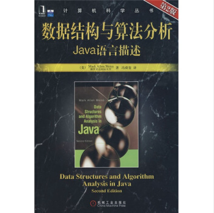

# 统计一下这些年买的部分技术书籍及其主要章节

 

**概述**

统计的目的是为了方便自己快速查找知识点，以形成更系统的学习体系。

 
 

**书籍列表**

数据结构与算法分析：Java语言描述（第2版）
<table>
  <tr>
    <td>引论</td>
    <td>
      <ul>
        <li>数学知识复习</li>
        <li>递归简论</li>
        <li>实现泛型特性构件pre-Java5</li>
        <li>利用Java5泛性实现泛型特性成分</li>
        <li>函数对象</li>
      </ul>
    </td>
  </tr>
  <tr>
    <td>算法分析</td>
    <td>
      <ul>
        <li>数学基础</li>
        <li>模型</li>
        <li>要分析的问题</li>
        <li>运行时间计算</li>
      </ul>
    </td>
  </tr>
  <tr>
    <td>表、栈和队列</td>
    <td>
      <ul>
        <li>抽象数据类型</li>
        <li>表 ADT</li>
        <li>JavaCollections API 中的表</li>
        <li>ArrayList 类的实现</li>
        <li>LinkedList 类的实现</li>
        <li>栈 ADT</li>
        <li>队列 ADT</li>
      </ul>
    </td>
  </tr>
  <tr>
    <td>树</td>
    <td>
      <ul>
        <li>预备知识</li>
        <li>二叉树</li>
        <li>查找树 ADT - 二叉查找树</li>
        <li>AVL 树</li>
        <li>伸展树</li>
        <li>树的遍历</li>
        <li>B 树</li>
        <li>标准库中的集合与映射</li>
      </ul>
    </td>
  </tr>
  <tr>
    <td>散列</td>
    <td>
      <ul>
        <li>一般想法</li>
        <li>散列函数</li>
        <li>分离链接法</li>
        <li>不用链表的散列表</li>
        <li>再散列</li>
        <li>标准库中的散列表</li>
        <li>可扩散列</li>
      </ul>
    </td>
  </tr>
  <tr>
    <td>优先队列（堆）</td>
    <td>
      <ul>
        <li>模型</li>
        <li>一些简单的实现</li>
        <li>二叉堆</li>
        <li>优先队列的应用</li>
        <li>d-堆</li>
        <li>左式堆</li>
        <li>斜堆</li>
        <li>二项队列</li>
        <li>标准库中的优先队列</li>
      </ul>
    </td>
  </tr>
  <tr>
    <td>排序</td>
    <td>
      <ul>
        <li>预备知识</li>
        <li>插入排序</li>
        <li>一些简单排序算法的下界</li>
        <li>希尔排序</li>
        <li>堆排序</li>
        <li>归并排序</li>
        <li>快速排序</li>
        <li>排序算法的一般下界</li>
        <li>桶式排序</li>
        <li>外部排序</li>
      </ul>
    </td>
  </tr>
  <tr>
    <td>不相交集类</td>
    <td>
      <ul>
        <li>等价关系</li>
        <li>动态等价性问题</li>
        <li>基本数据结构</li>
        <li>灵巧求并算法</li>
        <li>路径压缩</li>
        <li>路径压缩和按秩求并的最坏情形</li>
        <li>一个应用</li>
      </ul>
    </td>
  </tr>
  <tr>
    <td>图论算法</td>
    <td>
      <ul>
        <li>若干定义</li>
        <li>拓扑排序</li>
        <li>最短路径算法</li>
        <li>网络流问题</li>
        <li>最小生成树</li>
        <li>深度优先搜索的应用</li>
        <li>NP完全性介绍</li>
      </ul>
    </td>
  </tr>
  <tr>
    <td>算法设计技巧</td>
    <td>
      <ul>
        <li>贪婪算法</li>
        <li>分治算法</li>
        <li>动态规划</li>
        <li>随机化算法</li>
        <li>回溯算法</li>
      </ul>
    </td>
  </tr>
  <tr>
    <td>摊还分析</td>
    <td>
      <ul>
        <li>一个无关的智力问题</li>
        <li>二项队列</li>
        <li>斜堆</li>
        <li>斐波那契堆</li>
        <li>伸展树</li>
      </ul>
    </td>
  </tr>
  <tr>
    <td>高级数据结构及其实现</td>
    <td>
      <ul>
        <li>自顶向下伸展树</li>
        <li>红黑树</li>
        <li>确定性跳跃表</li>
        <li>AA树</li>
        <li>treap树</li>
        <li>kd树</li>
        <li>配对堆</li>
      </ul>
    </td>
  </tr>
</table>

 

Effective Java中文版（原书第3版）
<table>
  <tr>
    <td>引言</td>
    <td>
      <ul>
        <li>--</li>
      </ul>
    </td>
  </tr>
  <tr>
    <td>创建和销毁对象</td>
    <td>
      <ul>
        <li>用静态工厂方法代替构造器</li>
        <li>遇到多个构造器参数时要考虑使用构建器</li>
        <li>用私有构造器或者枚举类型强化Singleton属性</li>
        <li>通过私有构造器强化不可实例化的能力</li>
        <li>优先考虑依赖注入来引用资源</li>
        <li>避免创建不必要的对象</li>
        <li>消除过期的对象引用</li>
        <li>避免使用终结方法和清除方法</li>
        <li>try-with-resources优先于try-f?inally</li>
      </ul>
    </td>
  </tr>
  <tr>
    <td>对于所有对象都通用的方法</td>
    <td>
      <ul>
        <li>覆盖equals时请遵守通用约定</li>
        <li>覆盖equals时总要覆盖hashCode</li>
        <li>始终要覆盖toString</li>
        <li>谨慎地覆盖clone</li>
        <li>考虑实现Comparable接口</li>
      </ul>
    </td>
  </tr>
  <tr>
    <td>类和接口</td>
    <td>
      <ul>
        <li>使类和成员的可访问性最小化</li>
        <li>要在公有类而非公有域中使用访问方法</li>
        <li>使可变性最小化</li>
        <li>复合优先于继承</li>
        <li>要么设计继承并提供文档说明，要么禁止继承</li>
        <li>接口优于抽象类</li>
        <li>为后代设计接口</li>
        <li>接口只用于定义类型</li>
        <li>类层次优于标签类</li>
        <li>静态成员类优于非静态成员类</li>
        <li>限制源文件为单个顶级类</li>
      </ul>
    </td>
  </tr>
  <tr>
    <td>泛型</td>
    <td>
      <ul>
        <li>请不要使用原生态类型</li>
        <li>消除非受检的警告</li>
        <li>列表优于数组</li>
        <li>优先考虑泛型</li>
        <li>优先考虑泛型方法</li>
        <li>利用有限制通配符来提升API的灵活性</li>
        <li>谨慎并用泛型和可变参数</li>
        <li>优先考虑类型安全的异构容器</li>
      </ul>
    </td>
  </tr>
  <tr>
    <td>枚举和注解</td>
    <td>
      <ul>
        <li>用enum代替int常量</li>
        <li>用实例域代替序数</li>
        <li>用EnumSet代替位域</li>
        <li>用EnumMap代替序数索引</li>
        <li>用接口模拟可扩展的枚举</li>
        <li>注解优先于命名模式</li>
        <li>坚持使用Override注解</li>
        <li>用标记接口定义类型</li>
      </ul>
    </td>
  </tr>
  <tr>
    <td>Lambda和Stream</td>
    <td>
      <ul>
        <li>Lambda优先于匿名类</li>
        <li>坚持使用标准的函数接口</li>
        <li>谨慎使用Stream</li>
        <li>优先选择Stream中无副作用的函数</li>
        <li>Stream要优先用Collection作为返回类型</li>
        <li>谨慎使用Stream并行</li>
      </ul>
    </td>
  </tr>
  <tr>
    <td>方法</td>
    <td>
      <ul>
        <li>检查参数的有效性</li>
        <li>必要时进行保护性拷贝</li>
        <li>谨慎设计方法签名</li>
        <li>慎用重载</li>
        <li>慎用可变参数</li>
        <li>返回零长度的数组或者集合，而不是null</li>
        <li>谨慎返回optinal</li>
        <li>为所有导出的API元素编写文档注释</li>
      </ul>
    </td>
  </tr>
  <tr>
    <td>通用编程</td>
    <td>
      <ul>
        <li>将局部变量的作用域最小化</li>
        <li>for-each循环优先于传统的for循环</li>
        <li>了解和使用类库</li>
        <li>如果需要精确的答案，请避免使用float和double</li>
        <li>基本类型优先于装箱基本类型</li>
        <li>如果其他类型更适合，则尽量避免使用字符串</li>
        <li>了解字符串连接的性能</li>
        <li>通过接口引用对象</li>
        <li>接口优先于反射机制</li>
        <li>谨慎地使用本地方法</li>
        <li>谨慎地进行优化</li>
        <li>遵守普遍接受的命名惯例</li>
      </ul>
    </td>
  </tr>
  <tr>
    <td>异常</td>
    <td>
      <ul>
        <li>只针对异常的情况才使用异常</li>
        <li>对可恢复的情况使用受检异常，对编程错误使用运行时异常</li>
        <li>避免不必要地使用受检异常</li>
        <li>优先使用标准的异常</li>
        <li>抛出与抽象对应的异常</li>
        <li>每个方法抛出的所有异常都要建立文档</li>
        <li>在细节消息中包含失败-捕获信息</li>
        <li>努力使失败保持原子性</li>
        <li>不要忽略异常</li>
      </ul>
    </td>
  </tr>
  <tr>
    <td>并发</td>
    <td>
      <ul>
        <li>同步访问共享的可变数据</li>
        <li>避免过度同步</li>
        <li>executor、task和stream优先于线程</li>
        <li>并发工具优先于wait和notify</li>
        <li>线程安全性的文档化</li>
        <li>慎用延迟初始化</li>
        <li>不要依赖于线程调度器</li>
      </ul>
    </td>
  </tr>
  <tr>
    <td>序列化</td>
    <td>
      <ul>
        <li>其他方法优先于Java序列化</li>
        <li>谨慎地实现Serializable接口</li>
        <li>考虑使用自定义的序列化形式</li>
        <li>保护性地编写readObject方法</li>
        <li>对于实例控制，枚举类型优先于readResolve</li>
        <li>考虑用序列化代理代替序列化实例</li>
      </ul>
    </td>
  </tr>
</table>

 

Java并发编程实战
<table>
  <tr>
    <td></td>
    <td>
      <ul>
        <li></li>
        <li></li>
        <li></li>
        <li></li>
        <li></li>
      </ul>
    </td>
  </tr>
  <tr>
    <td></td>
    <td>
      <ul>
        <li></li>
        <li></li>
        <li></li>
        <li></li>
        <li></li>
      </ul>
    </td>
  </tr>
</table>

第1章　简介 
1.1　并发简史 
1.2　线程的优势 
1.2.1　发挥多处理器的强大能力 
1.2.2　建模的简单性 
1.2.3　异步事件的简化处理 
1.2.4　响应更灵敏的用户界面 
1.3　线程带来的风险 
1.3.1　安全性问题 
1.3.2　活跃性问题 
1.3.3　性能问题 
1.4　线程无处不在 
第一部分　基础知识 
第2章　线程安全性 
2.1　什么是线程安全性 
2.2　原子性 
2.2.1　竞态条件 
2.2.2　示例：延迟初始化中的竞态条件 
2.2.3　复合操作 
2.3　加锁机制 
2.3.1　内置锁 
2.3.2　重入 
2.4　用锁来保护状态 
2.5　活跃性与性能 
第3章　对象的共享 
3.1　可见性 
3.1.1　失效数据 
3.1.2　非原子的64位操作 
3.1.3　加锁与可见性 
3.1.4　Volatile变量 
3.2　发布与逸出 
3.3　线程封闭 
3.3.1　Ad-hoc线程封闭 
3.3.2　栈封闭 
3.3.3　ThreadLocal类 
3.4　不变性 
3.4.1　Final域 
3.4.2　示例：使用Volatile类型来发布不可变对象 
3.5　安全发布 
3.5.1　不正确的发布：正确的对象被破坏 
3.5.2 　不可变对象与初始化安全性 
3.5.3　安全发布的常用模式 
3.5.4　事实不可变对象 
3.5.5　可变对象 
3.5.6　安全地共享对象 
第4章　对象的组合 
4.1　设计线程安全的类 
4.1.1　收集同步需求 
4.1.2　依赖状态的操作 
4.1.3　状态的所有权 
4.2　实例封闭 
4.2.1　Java监视器模式 
4.2.2　示例：车辆追踪 
4.3　线程安全性的委托 
4.3.1　示例：基于委托的车辆追踪器 
4.3.2　独立的状态变量 
4.3.3　当委托失效时 
4.3.4　发布底层的状态变量 
4.3.5　示例：发布状态的车辆追踪器 
4.4　在现有的线程安全类中添加功能 
4.4.1　客户端加锁机制 
4.4.2　组合 
4.5　将同步策略文档化 
第5章　基础构建模块 
5.1　同步容器类 
5.1.1　同步容器类的问题 
5.1.2　迭代器与Concurrent-ModificationException 
5.1.3　隐藏迭代器 
5.2　并发容器 
5.2.1　ConcurrentHashMap 
5.2.2　额外的原子Map操作 
5.2.3　CopyOnWriteArrayList 
5.3　阻塞队列和生产者-消费者模式 
5.3.1　示例：桌面搜索 
5.3.2　串行线程封闭 
5.3.3　双端队列与工作密取 
5.4　阻塞方法与中断方法 
5.5　同步工具类 
5.5.1　闭锁 
5.5.2　FutureTask 
5.5.3　信号量 
5.5.4　栅栏 
5.6　构建高效且可伸缩的结果缓存 
第二部分　结构化并发应用程序 
第6章　任务执行 
6.1　在线程中执行任务 
6.1.1　串行地执行任务 
6.1.2　显式地为任务创建线程 
6.1.3　无限制创建线程的不足 
6.2　Executor框架 
6.2.1　示例：基于Executor的Web服务器 
6.2.2　执行策略 
6.2.3　线程池 
6.2.4　Executor的生命周期 
6.2.5　延迟任务与周期任务 
6.3　找出可利用的并行性 
6.3.1　示例：串行的页面渲染器 
6.3.2　携带结果的任务Callable与Future 
6.3.3　示例：使用Future实现页面渲染器 
6.3.4　在异构任务并行化中存在的局限 
6.3.5　CompletionService:Executor与BlockingQueue 
6.3.6　示例：使用CompletionService实现页面渲染器 
6.3.7　为任务设置时限 
6.3.8　示例：旅行预定门户网站 
第7章　取消与关闭 
第8章　线程池的使用 
第9章　图形用户界面应用程序 
第三部分　活跃性、性能与测试 
第10章　避免活跃性危险 
第11章　性能与可伸缩性 
第12章　并发程序的测试 
第四部分　高级主题 
第13章　显式锁 
第14章　构建自定义的同步工具 
第15章　原子变量与非阻塞同步机制 
第16章　Java内存模型 

 

Kotlin从零到精通Android开发
<table>
  <tr>
    <td></td>
    <td>
      <ul>
        <li></li>
        <li></li>
        <li></li>
        <li></li>
        <li></li>
      </ul>
    </td>
  </tr>
  <tr>
    <td></td>
    <td>
      <ul>
        <li></li>
        <li></li>
        <li></li>
        <li></li>
        <li></li>
      </ul>
    </td>
  </tr>
</table>

第1章 搭建Kotlin开发环境 1

1.1 Kotlin与Android开发的关系 1

1.1.1 Kotlin语言简介 1

1.1.2 Android Studio的官方开发语言 2

1.2 Kotlin开发工具 2

1.2.1 安装Android Studio 2

1.2.2 启动Android Studio 4

1.2.3 创建Kotlin工程 5

1.2.4 新建Kotlin文件 8

1.3 SDK安装与插件升级 10

1.3.1 安装最新版SDK 10

1.3.2 升级Gradle插件 11

1.3.3 升级Kotlin插件 12

1.4 Kotlin简单配置 14

1.4.1 调整Kotlin编译配置 14

1.4.2 修改编译配置文件 15

1.4.3 Java代码转Kotlin代码 16

1.5 Kotlin相关技术 18

1.5.1 Kotlin代码与Java代码PK 18

1.5.2 Anko库 21

1.5.3 Lambda表达式 22

1.6 小结 23

第2章 数据类型 24

2.1 基本数据类型 24

2.1.1 基本类型的变量声明 24

2.1.2 简单变量之间的转换 25

2.2 数组 26

2.2.1 数组变量的声明 27

2.2.2 数组元素的操作 28

2.3 字符串 29

2.3.1 字符串与基本类型的转换 29

2.3.2 字符串的常用方法 29

2.3.3 字符串模板及其拼接 30

2.4 容器 31

2.4.1 容器的基本操作 31

2.4.2 集合Set/MutableSet 32

2.4.3 队列List/MutableList 34

2.4.4 映射Map/MutableMap 36

2.5 小结 38

第3章 控制语句 39

3.1 条件分支 39

3.1.1 简单分支 39

3.1.2 多路分支 40

3.1.3 类型判断 42

3.2 循环处理 43

3.2.1 遍历循环 44

3.2.2 条件循环 45

3.2.3 跳出多重循环 46

3.3 空安全 48

3.3.1 字符串的有效性判断 48

3.3.2 声明可空变量 49

3.3.3 校验空值的运算符 50

3.4 等式判断 52

3.4.1 结构相等 52

3.4.2 引用相等 53

3.4.3 s和in 55

3.5 小结 57

第4章 函数运用 58

4.1 函数的基本用法 58

4.1.1 与Java声明方式的区别 58

4.1.2 输入参数的格式 59

4.1.3 输出参数的格式 60

4.2 输入参数的变化 62

4.2.1 默认参数 62

4.2.2 命名参数 63

4.2.3 可变参数 64

4.3 几种特殊函数 66

4.3.1 泛型函数 66

4.3.2 内联函数 67

4.3.3 简化函数 68

4.3.4 尾递归函数 69

4.3.5 高阶函数 69

4.4 增强系统函数 71

4.4.1 扩展函数 71

4.4.2 扩展高阶函数 72

4.4.3 日期时间函数 73

4.4.4 单例对象 75

4.5 小结 77

第5章 类和对象 78

5.1 类的构造 78

5.1.1 类的简单定义 78

5.1.2 类的构造函数 79

5.1.3 带默认参数的构造函数 81

5.2 类的成员 83

5.2.1 成员属性 83

5.2.2 成员方法 86

5.2.3 伴生对象 87

5.2.4 静态属性 88

5.3 类的继承 89

5.3.1 开放性修饰符 89

5.3.2 普通类继承 91

5.3.3 抽象类 93

5.3.4 接口 94

5.3.5 接口代理 96

5.4 几种特殊类 99

5.4.1 嵌套类 100

5.4.2 内部类 100

5.4.3 枚举类 101

5.4.4 密封类 103

5.4.5 数据类 104

5.4.6 模板类 105

5.5 小结 107

第6章 Kotlin使用简单控件 108

6.1 使用按钮控件 108

6.1.1 按钮Button 108

6.1.2 复选框CheckBox 111

6.1.3 单选按钮RadioButton 112

6.2 使用页面布局 114

6.2.1 线性布局LinearLayout 114

6.2.2 相对布局RelativeLayout 118

6.2.3 约束布局ConstraintLayout 119

6.3 使用图文控件 124

6.3.1 文本视图TextView 124

6.3.2 图像视图ImageView 127

6.3.3 文本编辑框EditText 128

6.4 Activity活动跳转 130

6.4.1 传送配对字段数据 130

6.4.2 传送序列化数据 132

6.4.3 跳转时指定启动模式 134

6.4.4 处理返回数据 137

6.5 实战项目：电商App的登录页面 138

6.5.1 需求描述 138

6.5.2 开始热身：提醒对话框AlertDialog 139

6.5.3 控件设计 141

6.5.4 关键代码 141

6.6 小结 144

第7章 Kotlin操纵复杂控件 145

7.1 使用视图排列 145

7.1.1 下拉框Spinner 145

7.1.2 列表视图ListView 149

7.1.3 网格视图GridView 154

7.1.4 循环视图RecyclerView 156

7.2 使用材质设计MaterialDesign 165

7.2.1 协调布局CoordinatorLayout 165

7.2.2 工具栏Toolbar 167

7.2.3 应用栏布局AppBarLayout 169

7.2.4 可折叠工具栏布局CollapsingToolbarLayout 173

7.2.5 仿支付宝首页的头部伸缩特效 177

7.3 实现页面切换 181

7.3.1 翻页视图ViewPager 182

7.3.2 碎片Fragment 184

7.3.3 标签布局TabLayout 187

7.4 广播收发Broadcast 190

7.4.1 收发临时广播 191

7.4.2 接收系统广播 194

7.5 实战项目：电商App的商品频道 196

7.5.1 需求描述 196

7.5.2 开始热身：下拉刷新布局SwipeRefreshLayout 197

7.5.3 控件设计 201

7.5.4 关键代码 201

7.6 小结 203

第8章 Kotlin进行数据存储 205

8.1 使用共享参数SharedPreferences 205

8.1.1 共享参数读写模板Preference 205

8.1.2 属性代理等黑科技 208

8.1.3 实现记住密码功能 210

8.2 使用数据库SQLite 211

8.2.1 数据库帮助器SQLiteOpenHelper 211

8.2.2 更安全的ManagedSQLiteOpenHelper 213

8.2.3 优化记住密码功能 220

8.3 文件I/O操作 222

8.3.1 文件保存空间 222

8.3.2 读写文本文件 224

8.3.3 读写图片文件 225

8.3.4 遍历文件目录 227

8.4 Application全局变量 228

8.4.1 Application单例化 228

8.4.2 利用Application实现全局变量 231

8.5 实战项目：电商App的购物车 232

8.5.1 需求描述 232

8.5.2 开始热身：选项菜单OptionsMenu 233

8.5.3 控件设计 235

8.5.4 关键代码 236

8.6 小结 240

第9章 Kotlin自定义控件 242

9.1 自定义普通视图 242

9.1.1 构造对象 242

9.1.2 测量尺寸 245

9.1.3 绘制部件 249

9.2 自定义简单动画 252

9.2.1 任务Runnable 252

9.2.2 进度条ProgressBar 255

9.2.3 自定义文本进度条 257

9.2.4 实现进度条动画 258

9.3 自定义通知栏 259

9.3.1 通知推送Notification 260

9.3.2 大视图通知 262

9.3.3 三种特殊的通知类型 265

9.3.4 远程视图RemoteViews 269

9.3.5 自定义折叠式通知 272

9.4 Service服务启停 274

9.4.1 普通方式启动服务 274

9.4.2 绑定方式启动服务 277

9.4.3 推送服务到前台 279

9.5 实战项目：电商App的生鲜团购 283

9.5.1 需求描述 283

9.5.2 开始热身：震动器Vibrator 284

9.5.3 控件设计 287

9.5.4 关键代码 287

9.6 小结 289

第10章 Kotlin实现网络通信 291

10.1 多线程技术 291

10.1.1 大线程Thread与消息传递 291

10.1.2 进度对话框ProgressDialog 295

10.1.3 异步任务doAsync和doAsyncResult 297

10.2 访问HTTP接口 300

10.2.1 移动数据格式JSON 301

10.2.2 JSON串转数据类 303

10.2.3 HTTP接口调用 304

10.2.4 HTTP图片获取 306

10.3 文件下载操作 308

10.3.1 下载管理器DownloadManager 308

10.3.2 自定义文本进度圈 313

10.3.3 在页面上动态显示下载进度 316

10.4 ContentProvider内容提供 319

10.4.1 内容提供器ContentProvider 319

10.4.2 内容解析器ContentResolver 322

10.4.3 内容观察器ContentObserver 325

10.5 实战项目：电商App的自动升级 329

10.5.1 需求描述 329

10.5.2 开始热身：可变字符串SpannableString 330

10.5.3 控件设计 333

10.5.4 关键代码 334

10.6 小结 337

 

Android应用开发进阶
<table>
  <tr>
    <td></td>
    <td>
      <ul>
        <li></li>
        <li></li>
        <li></li>
        <li></li>
        <li></li>
      </ul>
    </td>
  </tr>
  <tr>
    <td></td>
    <td>
      <ul>
        <li></li>
        <li></li>
        <li></li>
        <li></li>
        <li></li>
      </ul>
    </td>
  </tr>
</table>

第1章　自定义控件

1.1　View的绘制流程

1.1.1　View和ViewGroup

1.1.2　View的绘制流程

1.1.3　ViewGroup的绘制流程

1.1.4　View绘制流程深入解析

1.2　View的触摸事件

1.2.1 触摸事件的类型

1.2.2　触摸事件的传递过程

1.2.3　事件传递细节

1.3　自定义控件常用方法总结

1.3.1　绘制流程相关

1.3.2　事件处理相关

1.3.3　其他

1.4　自定义控件案例

1.4.1　柱状图

1.4.2　折线图

1.4.3　曲线图

1.4.4　渐变圆弧进度条

1.4.5　卡片滑动切换

1.4.6　ViewPager圆形指示器

1.5　自定义控件性能优化

第2章　轮子

2.1　AppBrain平台

2.2　Butter Knife

2.2.1　编译时注解

2.2.2　Element

2.2.3　编译时注解案例

2.2.4　Butter Knife源码分析

2.2.5　Butter Knife Zelezny插件的实现

2.3　EventBus

2.3.1　EventBus的使用

2.3.2　EventBus源码分析

2.3.3　EventBus 3.0索引加速

2.4　Dagger2

2.4.1　Dagger2的使用

2.4.2　Dagger2源码分析

2.4.3　Dagger2进阶

2.4.4　Component之间的关系

2.4.5　Dagger.Android

2.5　OkHttp

2.5.1　OkHttp的使用

2.5.2　OkHttp源码分析

2.6　Retrofit

2.6.1　Retrofit的使用

2.6.2　Retrofit源码分析

2.7　Volley

2.7.1　Volley的工作流程

2.7.2　Volley的使用

2.7.3　Volley的封装

2.7.4　Volley源码分析

2.8　RxJava

2.8.1　RxJava的使用

2.8.2　RxJava的源码分析

第3章　Android应用架构

3.1　todo-mvp

3.1.1　MVP

3.1.2　todo-mvp的实现

3.2　todo-mvp-clean

3.2.1　Clean架构

3.2.2　Clean架构的Android实现

3.2.3　todo-mvp-clean的实现

3.3　todo-mvp-dagger

3.3.1　AppComponent

3.3.2　依赖注入

3.4　todo-mvp-rxjava

3.5　todo-mvvm-databinding

3.5.1　MVVM

3.5.2　Data Binding Library

3.5.3　todo-mvvm-databinding的实现

3.6　todo-mvvm-live

3.6.1　Architecture Components

3.6.2　todo-mvvm-live的实现

第4章　AndroidPlus项目实战

4.1　需求分析

4.2　产品设计

4.2.1　Material Design

4.2.2　思维导图

4.2.3　架构设计

4.3　Java实现

4.3.1　项目准备

4.3.2　Dagger集成

4.3.3　欢迎界面

4.3.4　登录注册

4.3.5　主界面

4.3.6　首页

4.3.7　问题详情

4.3.8　回答详情

4.3.9　评论

4.3.10　分享文章

4.3.11　文章

4.3.12　个人中心

4.3.13　用户详情

4.3.14　异常上报、运营统计和应用升级

4.3.15　代码混淆

4.4　Kotlin实现

第5章　开发实践

5.1　Android Studio中的Git实践

5.1.1　创建远程仓库

5.1.2　.gitignore

5.1.3　提交和推送

5.1.4　分支

5.1.5　获取（Fetch）

5.1.6　拉取（Pull）

5.1.7　衍合（Rebase）

5.1.8　Git Flow

5.1.9　分支合并

5.1.10　移动HEAD

5.1.11　贮藏（Stash）

5.1.12　重置（Reset）

5.1.13　遴选（Cherry Pick）

5.2　Android屏幕适配

5.2.1　屏幕相关概念

5.2.2　图片适配

5.2.3　dimen

5.2.4　weight

5.2.5　百分比布局

5.2.6　ConstraintLayout

5.2.7　平板适配

5.2.8　RTL布局

5.3　Android视频播放器

5.3.1　ijkPlayer

5.3.2　Vitamio

5.3.3　PLDroidPlayer

5.3.4　测试开发

5.4　声网直播实践

5.4.1　频道列表

5.4.2　视频群聊

 

RxJava 2.x 实战
<table>
  <tr>
    <td></td>
    <td>
      <ul>
        <li></li>
        <li></li>
        <li></li>
        <li></li>
        <li></li>
      </ul>
    </td>
  </tr>
  <tr>
    <td></td>
    <td>
      <ul>
        <li></li>
        <li></li>
        <li></li>
        <li></li>
        <li></li>
      </ul>
    </td>
  </tr>
</table>

第1 章 RxJava 简介 1
1.1 你需要了解的函数响应式编程 1
1.2 RxJava 简介 4
1.3 为何选择RxJava 6
1.4 RxJava 能做什么 10
1.5 RxJava 2 的Hello World 11
1.6 小结 12
第2 章 RxJava 基础知识 . 13
2.1 Observable 13
2.2 Hot Observable 和Cold Observable 20
2.3 Flowable . 33
2.4 Single、Completable 和Maybe . 34
2.5 Subject 和Processor . 48
2.6 小结 63
第3 章 创建操作符 64
3.1 create、just 和from . 65
3.2 repeat 72
3.3 defer、interval 和timer 75
3.4 小结 80
第4 章 RxJava 的线程操作 . 81
4.1 调度器（Scheduler）种类 81
4.2 RxJava 线程模型 83
VI ∣ RxJava 2.x 实战
4.3 Scheduler 的测试 . 99
4.4 小结 106
第5 章 变换操作和过滤操作符 107
5.1 map 和flatMap . 108
5.2 groupBy 112
5.3 buffer 和window 114
5.4 first 和last 121
5.5 take 和takeLast 125
5.6 skip 和skipLast 131
5.7 elementAt 和ignoreElements . 135
5.8 distinct 和filter . 139
5.9 debounce . 142
5.10 小结 144
第6 章 条件操作符和布尔操作符 145
6.1 all、contains 和amb 146
6.2 defaultIfEmpty 150
6.3 sequenceEqual 152
6.4 skipUtil 和skipWhile . 154
6.5 takeUtil 和takeWhile . 156
6.6 小结 159
第7 章 合并操作符与连接操作符 160
7.1 merge 和zip . 161
7.2 combineLatest 和join . 167
7.3 startWith 171
7.4 connect、push 和refCount 174
7.5 replay 180
7.6 小结 183
第8 章 RxJava 的背压 184
8.1 背压 184
8.2 RxJava 2.x 的背压策略 188
8.3 小结 193
第9 章 Disposble 和Transformer 的使用 194
9.1 Disposable 194
9.2 RxLifecycle 和AutoDispose 196
9.3 Transformer 在RxJava 中的使用 198
9.4 小结 213
第10 章 RxJava 的并行编程 . 214
10.1 RxJava 并行操作 214
10.2 ParallelFlowable . 221
10.3 小结 225
第11 章 RxBinding 的使用 226
11.1 RxBinding 简介 226
11.2 RxBinding 使用场景 229
11.3 RxBinding 结合RxPermissions 的使用 243
11.4 RxBinding 使用的注意点 249
11.5 小结 251
第12 章 RxAndroid 2.x 和Retrofit 的使用 . 252
12.1 RxAndroid 2.x 简介 . 252
12.2 Retrofit 简介 . 257
12.3 Retrofit 与RxJava 的完美配合 . 258
12.4 小结 272
第13 章 开发EventBus 274
13.1 传统的EventBus 274
13.2 开发一个新的EventBus（一） 276
13.3 开发一个新的EventBus（二） 285
13.4 开发一个新的EventBus（三） 287
13.5 开发一个新的EventBus（四） 294
13.6 小结 302
第14 章 使用RxJava 封装Httpclient 4.5 303
14.1 HttpClient 的介绍 303
14.2 使用RxJava 进行重构 . 309
14.3 实现一个简单的图片爬虫 317
14.4 小结 323
第15 章 Spring Boot 和RxJava 2 . 325
15.1 模拟Task 任务 . 325
15.2 构建一个给爬虫使用的代理IP 池 . 335
15.3 小结 347
第16 章 Java 8 的函数式编程 348
16.1 Java 8 的新变化 .348
16.2 函数 349
16.3 Lambda 表达式 352
16.4 Java 8 新增的Stream .355
16.5 函数的柯里化 364
16.6 新的异步编程方式CompletableFuture .367
16.7 小结 388
第17 章 Kotin 和RxJava 389
17.1 Kotlin 简介 .389
17.2 使用Kotlin 来封装图像框架 393
17.3 小结 405
第18 章 展望未来 406
18.1 期待已久的Java 9 406
18.2 其他的Reactive Streams 项目 . 408
18.3 小结 410
附录A RxJava 常用的操作符列表 411
附录B .RxJava 中常用的library 416

 

音视频开发进阶指南：基于Android与iOS平台的实践
<table>
  <tr>
    <td></td>
    <td>
      <ul>
        <li></li>
        <li></li>
        <li></li>
        <li></li>
        <li></li>
      </ul>
    </td>
  </tr>
  <tr>
    <td></td>
    <td>
      <ul>
        <li></li>
        <li></li>
        <li></li>
        <li></li>
        <li></li>
      </ul>
    </td>
  </tr>
</table>

第1章　音视频基础概念
1.1　声音的物理性质
1.2　数字音频
1.3　音频编码
1.4　图像的物理现象
1.5　图像的数值表示
1.6　视频的编码方式
1.7　本章小结
第2章　移动端环境搭建
2.1　在iOS上如何搭建一个基础项目
2.2　在Android上如何搭建一个基础项目
2.3　交叉编译的原理与实践
2.4　本章小结
第3章　FFmpeg的介绍与使用
3.1　FFmpeg的编译与命令行工具的使用
3.2　FFmpeg API的介绍与使用
3.3　FFmpeg源码结构
3.4　本章小结
第4章　移动平台下的音视频渲染
4.1　AudioUnit介绍与实践
4.2　Android平台的音频渲染
4.3　视频渲染
4.4　本章小结
第5章　实现一款视频播放器
5.1　架构设计
5.2　解码模块的实现
5.3　音频播放模块的实现
5.4　画面播放模块的实现
5.5　AVSync模块的实现
5.6　中控系统串联起各个模块
5.7　本章小结
第6章　音视频的采集与编码
6.1　音频的采集
6.2　视频画面的采集
6.3　音频的编码
6.4　视频画面的编码
6.5　本章小结
第7章　实现一款视频录制应用
7.1　视频录制的架构设计
7.2　音频模块的实现
7.3　音频编码模块的实现
7.4　画面采集与编码模块的实现
7.5　Mux模块
7.6　中控系统串联起各个模块
7.7　本章小结
第8章　音频效果器的介绍与实践
8.1　数字音频基础
8.2　数字音频处理：快速傅里叶变换
8.3　基本乐理知识
8.4　混音效果器
8.5　效果器实现
8.6　本章小结
第9章　视频效果器的介绍与实践
9.1　图像处理的基本原理
9.2　图像处理进阶
9.3　使用FFmpeg内部的视频滤镜
9.4　使用OpenGL ES实现视频滤镜
9.5　本章小结
第10章　专业的视频录制应用实践
10.1　视频硬件解码器的使用
10.2　音频效果器的集成
10.3　一套跨平台的视频效果器的设计与实现
10.4　将特效处理库集成到视频录制项目中
10.5　本章小结
第11章　直播应用的构建
11.1　直播场景分析
11.2　拉流播放器的构建
11.3　推流器的构建
11.4　第三方云服务介绍
11.5　礼物系统的实现
11.6　聊天系统的实现
11.7　本章小结
第12章　直播应用中的关键处理
12.1　直播应用的细节分析
12.2　推流端的关键处理
12.3　拉流端的关键处理
12.4　本章小结
第13章　工欲善其事，必先利其器
13.1　Android平台工具详解
13.2　iOS使用Instruments诊断应用
13.3　本章小结

 

新时期的Node.js入门
<table>
  <tr>
    <td></td>
    <td>
      <ul>
        <li></li>
        <li></li>
        <li></li>
        <li></li>
        <li></li>
      </ul>
    </td>
  </tr>
  <tr>
    <td></td>
    <td>
      <ul>
        <li></li>
        <li></li>
        <li></li>
        <li></li>
        <li></li>
      </ul>
    </td>
  </tr>
</table>

第1章　基础知识
1.1　Node是什么
1.2　Node的内部机制
1.3　事件循环(Event loop)
1.4　总结
1.5　参考资源
第2章　常用模块
2.1　Module
2.2　Buffer
2.3　File System
2.4　HTTP服务
2.5　TCP服务
2.6　更安全的传输方式——SSL
2.7　WebSocket
2.8　Stream
2.9　Events
2.10　多进程服务
2.11　Process对象
2.12　Timer
2.13　小结
2.14　引用资源
第3章　用ES6来书写Node
3.1　新时代的EMCAScript
3.2　块级作用域
3.3　数组
3.4　函数
3.5　Set和Map
3.6　Iterator
3.7　对象
3.8　类
3.9　类的继承
3.10　ES6的模块化标准
3.11　使用babel来转换代码
3.12　小结
3.13　引用资源
第4章　书写异步代码
4.1　异步操作的返回值
4.2　组织回调方法
4.3　使用Promise
4.4　Generator，一种过渡方案
4.5　回调的终点——async/await
4.6　总结
4.7　引用资源
第5章　使用Koa2构建Web站点
5.1　Node Web框架的发展历程
5.2　内容规划
5.3　Koa入门
5.4　middleware
5.5　常用服务的实现
5.6　构建健壮的Web应用
5.7　使用Redis进行持久化
5.8　Koa源码剖析
5.9　网站部署
5.10　总结
5.11　引用资源
第6章　爬虫系统的开发
6.1　爬虫技术概述
6.2　技术栈简介
6.3　构建脚手架
6.4　进行批量爬取
6.5　爬虫架构的改进
6.6　进程架构的改进
6.7　反爬虫处理
6.8　总结
6.9　引用资源
第7章　测试与调试
7.1　单元测试
7.2　测试现有代码
7.3　更高维度的测试
7.4　调试Node应用
7.5　总结
7.6　引用资源
第8章　Node中的错误处理
8.1　Error模块
8.2　错误处理的几种方式
8.3　被抛弃的Domain
8.4　ES6中的错误处理
8.5　Web服务中的错误处理
8.6　防御式编程与Let it crash
8.7　总结
8.8　引用资源

 

深入浅出Webpack
<table>
  <tr>
    <td></td>
    <td>
      <ul>
        <li></li>
        <li></li>
        <li></li>
        <li></li>
        <li></li>
      </ul>
    </td>
  </tr>
  <tr>
    <td></td>
    <td>
      <ul>
        <li></li>
        <li></li>
        <li></li>
        <li></li>
        <li></li>
      </ul>
    </td>
  </tr>
</table>

第1章　入门
1.1　前端的发展
1.2　常见的构建工具及对比
1.3　安装Webpack
1.4　使用Loader
1.5　使用Plugin
1.6　使用DevServer
1.7　核心概念
第2章　配置
2.1　Entry
2.2　Output
2.3　Module
2.4　Resolve
2.5　Plugin
2.6　DevServer
2.7　其他配置项
2.8　整体配置结构
2.9　多种配置类型
2.10　总结
第3章　实战
3.1　使用ES6语言
3.2　使用TypeScript语言
3.3　使用Flow检查器
3.4　使用SCSS语言
3.5　使用PostCSS
3.6　使用React框架
3.7　使用Vue框架
3.8　使用Angular2框架
3.9　为单页应用生成HTML
3.10　管理多个单页应用
3.11　构建同构应用
3.12　构建Electron应用
3.13　构建Npm模块
3.14　构建离线应用
3.15　搭配Npm Script
3.16　检查代码
3.17　通过Node.js API启动Webpack
3.18　使用Webpack Dev Middleware
3.19　加载图片
3.20　加载SVG
3.21　加载Source Map
3.22　实战总结
第4章　优化
4.1　缩小文件的搜索范围
4.2　使用DllPlugin
4.3　使用HappyPack
4.4　使用ParallelUglifyPlugin
4.5　使用自动刷新
4.6　开启模块热替换
4.7　区分环境
4.8　压缩代码
4.9　CDN加速
4.10　使用Tree Shaking
4.11　提取公共代码
4.12　分割代码以按需加载
4.13　使用Prepack
4.14　开启Scope Hoisting
4.15　输出分析
4.16　优化总结
第5章　原理
5.1　工作原理概括
5.2　输出文件分析
5.3　编写Loader
5.4　编写Plugin
5.5　调试Webpack
5.6　原理总结

 

Axure RP8 实战手册 网站和APP原型制作案例精粹
<table>
  <tr>
    <td></td>
    <td>
      <ul>
        <li></li>
        <li></li>
        <li></li>
        <li></li>
        <li></li>
      </ul>
    </td>
  </tr>
  <tr>
    <td></td>
    <td>
      <ul>
        <li></li>
        <li></li>
        <li></li>
        <li></li>
        <li></li>
      </ul>
    </td>
  </tr>
</table>

基础操作篇 
第1章使用元件 / 9 
基础1 添加元件到画布 / 11 
基础2 添加元件名称 / 11 
基础3 设置元件位置/尺寸 / 11 
基础4 设置元件默认角度 / 11 
基础5 设置元件颜色与透明 / 11 
基础6 设置形状或图片圆角 / 12 
基础7 设置矩形仅显示部分边框 / 12 
基础8 设置线段/箭头/边框样式 / 12 
基础9 设置元件文字边距/行距 / 12 
基础10 设置元件默认隐藏 / 12 
基础11 设置文本框输入为密码 / 12 
基础12 设置打开选择文件窗口 / 13 
基础13 限制文本框输入字符位数 / 13 
基础14 设置文本框提示文字 / 13 
基础15 设置文本框回车触发事件 / 13 
基础16 设置鼠标移入元件时的提示 / 13 
基础17 设置矩形为其他形状 / 14 
基础18 设置自定义形状 / 14 
基础19 设置形状水平/垂直翻转 / 14 
基础20 设置列表框的内容 / 14 
基础21 设置元件默认选中/禁用 / 14 
基础22 设置单选按钮唯一选中 / 14 
基础23 设置元件不同状态的交互样式 / 15 
基础24 设置图片文本 / 15 
基础25 切割/裁剪图片 / 15 
基础26 嵌入多媒体文件/页面 / 15 
基础27 调整元件的层级 / 16 
基础28 组合/取消组合元件 / 16 
基础29 转换元件为图片 / 16 
基础30 载入元件库 / 16 
基础31 切换元件库 / 16 
第2章页面设置 / 17 
基础32 设置页面居中 / 18 
基础33 设置页面背景（图片/颜色） / 18 
基础34 设置页面颜色（草图/黑白） / 18 
第3章设置条件 / 19 
基础35 添加条件判断 / 20 
基础36 设置条件逻辑关系 / 20 
基础37 用例条件转换 / 20 
第4章使用变量/公式 / 21 
基础38 全局变量设置 / 22 
基础39 局部变量设置 / 22 
基础40 公式的格式及类型 / 22 
第5章功能设置 / 23 
基础41 设置形状并排显示细边框 / 24 
基础42 设置画布中的遮罩阴影 / 24 
基础43 显示/隐藏交互与说明编号 / 24 
基础44 显示/隐藏两侧的功能面板 / 24 
基础45 展开/收起/弹出/停靠/关闭功能面板 / 24 
基础46 关闭/恢复功能面板 / 24 
基础47 文件备份与恢复 / 25 
基础48 设置自适应视图 / 25 
第6章查看原型 / 26 
基础49 快速预览查看原型 / 27 
基础50 生成HTML 查看原型 / 27 
基础51 生成部分原型页面 / 27 
基础52 为原型添加标志 / 27 
基础53 发布原型到AxShare / 28 
基础54 重新生成当前页面 / 28 
基础55 移动设备设置 / 28 
基础56 Web 字体设置 / 29 
实战案例篇 
第7章元件案例 / 31 
案例1 文本框：带图标文字提示 / 33 
案例2 文本框：边框变色 / 34 
案例3 图片：变换样式的按钮（1） / 35 
案例4 图片：自定义复选框（1） / 36 
案例5 形状：变换样式的按钮（2） / 37 
案例6 形状：自定义复选框（2） / 38 
案例7 形状：唯一选中项 / 39 
案例8 形状：制作环形进度条 / 40 
案例9 文本标签：添加文本链接 / 42 
案例10 内联框架：嵌入百度地图 / 44 
案例11 动态面板：登录面板切换 / 46 
案例12 动态面板：自动图片切换 / 48 
案例13 动态面板：保持固定位置 / 51 
案例14 动态面板：拖动滑块解锁（1） / 52 
案例15 动态面板：元件样式联动 / 55 
案例16 中继器：制作商品列表 / 57 
案例17 中继器：商品列表排序 / 60 
案例18 形状：自定义复选框（3） / 62 
案例19 中继器：商品类型筛选 / / 64 
案例20 中继器：选择对比商品（1） / 66 
案例21 中继器：选择对比商品（2） / 70 
案例22 中继器：选择对比商品（3） / 72 
第8章变量案例 / 76 
案例23 全局变量：账号登录验证（1） / 77 
案例24 全局变量：打开微博详情（1） / 80 
案例25 局部变量：账号登录验证（2） / 83 
案例26 局部变量：增减商品数量（1） / 84 
案例27 局部变量：价格区间筛选 / 85 
第9章特别案例 / 88 
案例28 组合：弹出菜单效果 / 89 
案例29 组合：菜单整体变色 / 90 
案例30 遮罩：弹出登录界面 / 91 
案例31 推拉：制作抽屉菜单 / 92 
案例32 移动：横幅展开效果 / 94 
案例33 尺寸：改变元件尺寸（1） / 97 
案例34 翻转：图片翻转效果 / 99 
案例35 旋转：唱片旋转效果 / 100 
案例36 锚点：页面返回顶部 / 103 
第10 章函数案例 / 106 
案例37 元件函数：改变元件尺寸（2） / 107 
案例38 元件函数：增减商品数量（2） / 108 
案例39 元件函数：图片外框移动 / 109 
案例40 元件函数：拖动滑块解锁（2） / 111 
案例41 元件函数：商品图片切换 / 113 
案例42 页面函数：导航指针移动 / 116 
案例43 窗口函数：滚动吸附顶部 / 117 
案例44 窗口函数：返回顶部按钮 / 119 
案例45 指针函数：商品图片放大 / 121 
案例46 数字与指针函数：开关侧边菜单 / 125 
案例47 数学函数：随机数验证码 / 127 
案例48 数学函数：不同方向滑入 / 132 
案例49 字符串函数：模糊搜索列表 / 136 
案例50 字符串函数：手机号码验证（1） / 138 
案例51 字符串函数：手机号码验证（2） / 141 
案例52 字符串函数：复选数量统计 / 141 
案例53 字符串函数：打开微博详情（2） / 143 
案例54 字符串函数：音乐播放计时 / 145 
案例55 日期函数：获取系统时间 / 149 
案例56 中继器函数：首个商品推荐 / 152 
案例57 中继器函数：添加对比商品（4） / 156 
案例58 中继器函数：游戏列表翻页（1） / 157 
案例59 中继器函数：游戏列表翻页（2） / 160 
案例60 中继器函数：列表筛选结果 / 164 
第11章综合案例（Web） / 169 
案例61 面板状态切换与移动 / 170 
案例62 框架中镶嵌其他页面 / 172 
案例63 间隔与连续旋转特效 / 173 
案例64 锚点滚动与导航吸附 / 174 
案例65 唯一选中与样式切换 / 177 
案例66 页面内滚动条的实现 / 178 
案例67 用滚轮控制横向滚动 / 181 
案例68 剩余可输入文字提示 / 185 
案例69 进度条与数字的联动 / 188 
案例70 展开收起的推拉效果 / 189 
案例71 展开收起与移动效果 / 193 
案例72 图像旋转与镂空效果 / 193 
案例73 全选与取消全选效果 / 196 
案例74 带进度条的分页标签 / 199 
案例75 循环选中与尺寸改变 / 202 
案例76 二级菜单的内容切换 / 204 
案例77 循环内容走马灯效果 / 206 
案例78 页面安全键盘的实现 / 209 
案例79 省市列表的选择联动 / 211 
案例80 背景滑块与改变尺寸 / 213 
案例81 可调节时间的倒计时 / 215 
案例82 文本框中焦点的控制 / 217 
案例83 随机数数字自增效果 / 220 
案例84 文字输入的条件限制 / 221 
案例85 鼠标移入的缩放效果 / 222 
第12章综合案例（APP） / 227 
案例86 启动画面的翻页效果 / 227 
案例87 双方向拖动橱窗效果 / 229 
案例88 输入文字与退格效果 / 232 
案例89 中心点逐渐放大效果 / 233 
案例90 菜单的拖动排序效果 / 234 
案例91 半透明按钮悬浮效果 / 237 
案例92 导航菜单单击时移动 / 238 
案例93 展开与收起二级选项 / 241 
案例94 拖动切换与移动效果 / 242 
案例95 长按进度条前进效果 / 245 
案例96 滑块的水平拖动效果 / 248 
案例97 长按复选框切换样式 / 250 
案例98 选中复选框计数效果 / 251 
案例99 全选与取消全选效果 / 253 
案例100 侧边菜单的视差效果 / 254 
案例101 动态面板嵌套与切换 / 256 
案例102 标签移动与内容切换 / 260 
案例103 单击曲目时切换歌曲 / 262 
案例104 遮罩与放大弹出内容 / 264 
案例105 动态面板状态的联动 / 267 
案例106 循环移动的波浪效果 / 268 
案例107 二级菜单下滑与遮罩 / 270 
案例108 下拉刷新的多个状态 / 272 
案例109 字符串输入控制效果 / 276 
案例110 图标旋转与放大缩小 / 278 

 

App后台开发运维和架构实践
<table>
  <tr>
    <td></td>
    <td>
      <ul>
        <li></li>
        <li></li>
        <li></li>
        <li></li>
        <li></li>
      </ul>
    </td>
  </tr>
  <tr>
    <td></td>
    <td>
      <ul>
        <li></li>
        <li></li>
        <li></li>
        <li></li>
        <li></li>
      </ul>
    </td>
  </tr>
</table>

推荐序 十八般兵器入门.. 3

第1章　App后台入门

1.1　App后台的功能... 16

1.2　App后台架构... 17

1.3　App和App后台的通信... 19

1.4　App后台和Web后端的区别... 22

1.5　选择服务器... 23

1.6　选择编程语言... 24

1.7　快速入门新技术 1.7.1　思维模式 1.7.2　4种快速入门新技术的方法

1.8　App是怎样炼成的... 26

1.8.1　项目启动阶段 1.8.2　研发阶段 1.8.3　测试阶段 1.8.4　正式推出阶段

1.9　最适合App的开发模式——敏捷开发... 30

1.9.1　Sprint 计划会议 1.9.2　日常开发 1.9.3　每日例会 1.9.4　测试和修复Bug 1.9.5　评审会议 1.9.6　回顾会议 1.9.7　及时反馈 1.9.8　总结

第2章　App后台基础技术.. 35

2.1　从App业务逻辑中提炼API接口... 35

2.1.1　业务逻辑思维导图 2.1.2　功能—业务逻辑思维导图 2.1.3　基本功能模块关系 2.1.4　功能模块接口UML（设计出API） 2.1.5　编写在线API测试文档 2.1.6　设计稿标注API

2.2　设计API的要点... 46

2.3　如何选择合适的数据库产品... 50

2.3.1　Redis，MongoDB，MySQL读写数据的区别 2.3.2　Redis，MongoDB，MySQL查找数据的区别 2.3.3　Redis，MongoDB，MySQL适用场景

2.4　如何选择消息队列软件

2.4.1　为什么要用消息队列 2.4.2　消息队列的工作流程 2.4.3　常见的一些消息队列产品

2.5　使用分布式服务实现业务的复用

2.5.1　巨无霸系统的危害 2.5.2　远程服务的优点 2.5.3　远程服务的实现

2.6　搜索技术入门... 59

2.6.1　一个简单的搜索例子 2.6.2　搜索技术的基本原理 2.6.3　常见的开源搜索软件介绍

2.7　定时任务... 65

2.7.1　Linux定时任务Crontab 2.7.2　在后台轻松管理各种各样的定时任务

第3章　App后台核心技术.. 68

3.1　用户验证方案... 68

3.1.1　使用HTTPS协议 3.1.2　基本的用户登录方案

3.2　App通信安全... 72

3.2.1　URL签名 3.2.2　AES对称加密 3.2.3　更进一步的通信安全

3.3　短信服务... 78

3.3.1　App后台发送短信简介 3.3.2　选择短信平台 3.3.3 建立可靠的短信服务

3.4　处理表情的一些技巧... 80

3.4.1　表情在MySQL的存储 3.4.2　当文字中夹带表情的处理 3.4.3　Openfire中发送表情引起连接断开的问题

3.5　高效更新数据... 82

3.5.1　内容的推拉 3.5.2　数据增量更新策略

3.6　图片处理... 90

3.7　视频处理... 91

3.7.1　FFmpeg简介 3.7.2　后台调用FFmpeg的功能

3.8　获取APK和IPA文件里的资源... 94

3.8.1　Android的APK文件 3.8.2　iOS的IPA文件

3.9　文件系统... 98

3.9.1　文件云存储服务 3.9.2　架设文件系统

3.10　ELK日志分析平台... 101

3.10.1　基本模块 3.10.2　日志分析流程

3.11　Docker构建一致的开发环境... 103

3.11.1　Docker原理 3.11.2　搭建一致的开发环境

第4章　Linux——App后台应用最广泛的系统.. 107

4.1　基本的系统优化... 107

4.1.1　开机自启动服务优化 4.1.2　增大文件描述符

4.2　常用的命令... 110

4.2.1　全面了解系统资源情况——top 4.2.2　显示进程状态——ps

4.2.3　查看网络相关信息——netstat 4.2.4　查看某个进程打开的所有文件——lsof

4.2.5　跟踪数据到达主机所经路由——traceroute 4.2.6　文件下载/上传工具——“ssh secure shell client”和“lrzsz”

4.2.7　查看程序的依赖库——LD_DEBUG 4.2.8　进程管理利器——superivisor

4.3　故障案例分析... 125

第5章　Nginx——App后台HTTP服务的利器.. 126

5.1　简介... 126

5.2　基本原理... 127

5.2.1　工作模型 5.2.2　进程解析

5.3　常用配置... 129

5.3.1　Nginx的全局配置 5.3.2　event配置 5.3.3　http配置 5.3.4　负载均衡配置 5.3.5　server虚拟主机配置

5.3.6　location配置 5.3.7　HTTPS的配置 5.3.8　下载App的配置 5.3.9　生产环境中修改配置的良好习惯

5.4　性能统计... 136

5.5　实现负载均衡的方案... 137

5.6　用Nginx处理业务逻辑... 139

第6章　MySQL——App后台最常用的数据库.. 140

6.1　基本架构... 140

6.2　选择版本... 141

6.3　配置文件详解... 142

6.4　软件优化... 144

6.4.1　正确使用MyISAM和InnoDB存储引擎 6.4.2　正确使用索引

6.4.3　避免使用select * 6.4.4　字段尽可能地设置为NOT NULL

6.5　硬件优化... 147

6.5.1　增加物理内存 6.5.2　增加应用缓存

6.5.3　用固态硬盘代替机械硬盘 6.5.4　SSD硬盘+SATA硬盘混合存储方案

6.6　架构优化... 149

6.6.1　分表 6.6.2　读写分离 6.6.3　分库

6.7　SQL慢查询分析... 156

6.8　云数据库简介... 157

6.9　灵活的存储结构... 158

6.10　故障排除案例... 159

第7章　Redis——App后台高性能的缓存系统.. 160

7.1　Redis简介... 160

7.2　Redis的常用数据结构及应用场景... 161

7.2.1　string——存储简单的数据 7.2.2　hash——存储对象的数据

7.2.3　list——模拟队列操作 7.2.4　set——无序且不重复的元素集合

7.2.5　sorted set——有序且不重复的元素集合... 168

7.3　内存优化... 170

7.3.1　监控内存使用的状况 7.3.2　优化存储结构

7.3.3　限制使用的最大内存 7.3.4　设置过期时间

7.4　集群... 174

7.4.1　客户端分片 7.4.2　Twemproxy 7.4.3　Codis 7.4.4　Redis 3.0集群 7.4.5　云服务器上的集群服务

7.5　持久化

7.5.1　RDB 7.5.2　AOF

7.6　故障排除案例... 184

第8章　MongoDB——App后台新兴的数据库.. 185

8.1　简介... 185

8.2　核心机制解析... 186

8.2.1　MMAP（内存文件映射） 8.2.2　Journal日志

8.3　入门... 187

8.3.1　基本操作 8.3.2　数组操作 8.3.3　实例演示MySQL和MongoDB设计数据库的区别

8.4　高可用集群... 195

8.4.1　主从 8.4.2　副本集 8.4.3　分片

8.5　LBS——地理位置查询... 200

8.6　MongoDB 3.0版本的改进... 205

8.6.1　灵活的存储架构 8.6.2　性能提升7~10倍 8.6.3　存储空间最多减少80% 8.6.4　运维成本最多降低95%

第9章　App后台架构剖析.. 208

9.1　聊天App后台架构... 208

9.1.1　移动互联网的网络特性 9.1.2　协议 9.1.3　整体架构

9.2　社交App后台架构... 221

9.2.1　基本表结构 9.2.2　推拉模式 9.2.3　数据库架构的演进 9.2.4　缓存架构的演进

9.3　LBS App后台架构... 234

9.3.1　地理坐标详解 9.3.2　查找附近的人 9.3.3　基于MongoDB的LBS后台架构演进

9.4　推送服务器后台架构... 242

9.4.1　Android推送 9.4.2　iOS推送

9.5　获得更多App后台架构资料... 252

第10章　App后台架构的演进.. 255

10.1　架构的核心要素... 255

10.1.1　高性能 10.1.2　高可用 10.1.3　可伸缩 10.1.4　可扩展 10.1.5　安全性

10.2　架构选型的要点... 262

10.2.1　用成熟稳定的开源软件 10.2.2　尽可能使用云服务

10.3　架构的演进... 268

10.3.1　单机部署 10.3.2　分布式部署 10.3.3　服务化

10.4　架构的特点... 279

10.4.1　每个App的后台架构不会完全一样 10.4.2　架构的演进是由业务驱动的 10.4.3　架构不是为了炫耀技术

 

深入理解Android自动化测试
<table>
  <tr>
    <td></td>
    <td>
      <ul>
        <li></li>
        <li></li>
        <li></li>
        <li></li>
        <li></li>
      </ul>
    </td>
  </tr>
  <tr>
    <td></td>
    <td>
      <ul>
        <li></li>
        <li></li>
        <li></li>
        <li></li>
        <li></li>
      </ul>
    </td>
  </tr>
</table>

第一部分　基础篇
第1章　Android自动化测试基础 3
1.1　Android自动化分析 3
1.2　什么样的兵器*称手 4
1.3　如何耍好你手上的兵器 6
1.4　你了解你的兵器吗 8
1.5　如何改造你的兵器 9
第2章　稳定性测试利器monkey使用详解 10
2.1　monkey概述 10
2.2　第一个Impossible Mission 10
2.3　monkey的基本使用 11
2.4　monkey的命令及其使用 14
2.4.1　monkey的常规类命令 14
2.4.2　monkey的事件类命令 15
2.4.3　monkey的约束类命令 19
2.4.4　monkey的调试类命令 20
2.4.5　monkey命令小结 22
2.5　第二个Impossible Mission 23
2.6　monkey脚本编写 24
2.6.1　monkey API详解 24
2.6.2　monkey脚本编写 27
2.6.3　从getevent和input keyevent说起 33
2.7　monkey工具总结 37
第3章　monkey之子monkeyrunner使用详解 38
3.1　monkeyrunner概述 38
3.2　monkeyrunner API详解 38
3.2.1　monkeyrunner基本API：手势、输入和点击 44
3.2.2　monkeyrunner必备API：启动应用、等待 49
3.2.3　monkeyrunner强大API：键值事件 58
3.2.4　monkeyrunner与PC交互API：输入、选项列表框、警告框 61
3.2.5　monkeyrunner应用操作API：等待设备连接、安装/卸载应用 65
3.2.6　monkeyrunner设置控制API：重启、唤醒、获取设备属性 69
3.2.7　monkeyrunner基本图像处理API：截屏、图像保存 75
3.2.8　monkeyrunner必备图像处理API：图像截取、对比 78
3.2.9　monkeyrunner强大图像处理API：转换格式、获取像素元组/像素值 82
3.2.10　monkeyrunner超级API：广播、用例及命令 86
3.2.11　monkeyrunner帮助文档 91
3.3　monkeyrunner脚本编写 96
3.3.1　bugben示例脚本剖析 96
3.3.2　monkeyrunner脚本运行注意事项 98
3.4　第三个Impossible Mission 99
3.5　monkeyrunner的录制回放 99
3.5.1　等待功能Wait 100
3.5.2　按键功能Press a Button 102
3.5.3　输入功能Type Something 103
3.5.4　拖拽功能Fling 105
3.5.5　录制脚本导出功能Export Actions 107
3.5.6　录制bugben脚本示例 107
3.5.7　回放bugben脚本 110
3.6　monkeyrunner工具总结 112
第4章　单元测试框架Instrumentation使用详解 114
4.1　Instrumentation概述 114
4.2　Instrumentation基础 115
4.2.1　自动化测试基础 116
4.2.2　Android测试框架 117
4.3　第四个Impossible Mission 120
4.4　Instrumentation的前世：单元测试基础框架JUnit 124
4.5　第五个Impossible Mission 133
4.6　Instrumentation的今生：对Android系统的高度控制 138
4.7　Instrumentation前世今生分析 143
4.8　第六个Impossible Mission 149
4.9　Instrumentation自动化脚本开发 149
4.9.1　Instrumentation自动化条件 150
4.9.2　捕获*初项目控件 157
4.9.3　对*初项目的自动化测试 161
4.10　Instrumentation工具总结 167
第5章　终极自动化框架UIAutomator使用详解 171
5.1　UIAutomator概述 171
5.2　第七个Impossible Mission 173
5.3　更清晰的控件捕获 173
5.4　更直观的测试项目创建 175
5.5　UIAutomator API详解 177
5.5.1　与monkeyrunner对照之：给力的手势 178
5.5.2　与monkeyrunner对照之：输入、点击和长按 180
5.5.3　与monkeyrunner对照之：等待和截屏 182
5.5.4　与monkeyrunner对照之：锁屏/唤醒、获取设备属性 184
5.5.5　与monkeyrunner对照之：键值事件 186
5.5.6　人无我有之：屏幕旋转、布局文件 187
5.5.7　人无我有之：获取包名、应用名和通知栏 189
5.5.8　人无我有之：获取对象属性 189
5.5.9　强大的控件筛选器：UiSelector 192
5.5.10　“给力”的控件定位器：UiCollection 194
5.5.11　无敌的滚动：UiScrollable 195
5.5.12　疯狂的监听器：UiWatcher 200
5.5.13　UIAutomator API综述 202
5.6　更简洁的脚本撰写 202
5.6.1　UIAutomator界面捕获 202
5.6.2　UIAutomator应用启动 205
5.6.3　UIAutomator控件捕获 206
5.6.4　UIAutomator控件操作 211
5.6.5　Bugben完整测试项目 213
5.7　更便捷地编译运行 216
5.8　UIAutomator工具总结 223
第6章　兼容性测试框架CTS使用详解 226
6.1　CTS概述 226
6.2　CTS测试须知 228
6.3　CTS的命令及运行 231
6.4　CTS测试报告 237
6.5　CTS Verif?ier 240
6.6　CTS注意事项 243
6.7　CTS工具总结 245
第7章　Android自动化工具使用总结 247
第二部分　原理篇
第8章　monkey原理分析 252
8.1　monkey源码结构 252
8.2　monkey架构分析 254
8.2.1　旅程开始 254
8.2.2　从run()启程 254
8.2.3　monkey参数详解 257
8.2.4　如何细分参数？ 262
8.2.5　导入package列表 264
8.2.6　monkey的系统日志 266
8.2.7　检查内部配置 268
8.2.8　构建三大能力 268
8.2.9　获取合法package列表 271
8.2.10　monkey运行模式汇总 272
8.2.11　monkey运行核心 281
8.2.12　旅程结束 286
8.3　monkey的原理总结 288
第9章　monkeyrunner原理分析 289
9.1　monkeyrunner源码结构 289
9.2　monkeyrunner架构分析 289
9.2.1　设备连接 291
9.2.2　应用安装 311
9.2.3　应用启动 319
9.2.4　按键发送 321
9.2.5　截屏 326
9.2.6　文件存储 331
9.3　monkeyrunner的原理总结 334
第10章　Instrumentation原理分析 336
10.1　Instrumentation源码结构 336
10.2　Instrumentation架构分析 338
10.2.1　从InstrumentationTestRunner说开来 339
10.2.2　Instrumentation测试运行 342
10.2.3　启动被测应用 345
10.2.4　startActivity()方法 348
10.2.5　startActivity()方法后遗症 351
10.2.6　连接ViewServer 356
10.2.7　获取设备应用信息 357
10.2.8　获取应用控件树 359
10.2.9　绘制控件树视图 362
10.3　Instrumentation的原理总结 364
第11章　UIAutomator原理分析 370
11.1　UIAutomator源码结构 370
11.2　UIAutomator架构分析 371
11.2.1　控件捕获 371
11.2.2　创建UiObject对象 372
11.2.3　验证控件是否存在 374
11.2.4　验证控件是否可用 381
11.2.5　点击并等待界面跳转 381
11.2.6　获取屏幕截图 386
11.2.7　发送返回事件 388
11.3　UIAutomator的原理总结 390
第12章　CTS原理分析 392
12.1　CTS源码结构 392
12.2　CTS架构分析 392
12.2.1　CTS案例MediaPlayer分析 393
12.2.2　测试资源预置及环境清理 396
12.2.3　空文件及音视频播放测试 398
12.2.4　切换下一首歌测试 401
12.2.5　频谱测试 406
12.2.6　无缝播放测试 407
12.2.7　视频界面重置测试 410
12.2.8　录制视频播放角度测试 412
12.2.9　不同格式视频文件测试 415
12.2.10　字幕选择/取消选择测试 423
12.2.11　字幕切换测试 427
12.2.12　播放器回调测试 429
12.2.13　视频录制播放测试 432
12.3　CTS的原理总结 435
第13章　Android自动化工具源码总结 436
第三部分　实践篇
第14章　从monkey到传参或录制工具开发 443
14.1　从monkey原理说开来 443
14.2　monkey传参小工具 444
14.2.1　monkey传参小工具之常规类命令 444
14.2.2　monkey传参小工具之事件类命令 445
14.2.3　monkey传参小工具之约束类命令 447
14.2.4　monkey传参小工具之调试类命令 448
14.3　monkey脚本录制工具开发 449
14.3.1　monkey脚本录制工具需求 450
14.3.2　monkey脚本录制工具设计 450
14.3.3　monkey脚本录制工具原理 453
14.4　monkey工具总结 458
第15章　从Instrumentation到稳定自动化工具开发 459
15.1　为何要做二次封装？ 459
15.2　如何做Instrumentation的二次封装 461
15.2.1　场景1：源码问题 461
15.2.2　场景2：控件问题 462
15.2.3　场景3：用例结构问题 463
15.2.4　场景4：运行日志问题 465
15.2.5　场景5：窗口监测问题 465
15.2.6　场景6：控件ID重复或缺失问题 466
15.2.7　场景7：出错截屏问题 468
15.3　二次封装改进项总结 469
第16章　从UIAutomatorViewer到PC端脚本录制工具开发 470
16.1　从UIAutomatorViewer原理说开来 470
16.2　基于UIAutomatorViewer的PC端脚本录制工具 472
16.2.1　PC端脚本录制工具：基本设计 472
16.2.2　PC端脚本录制工具：详细设计 474
16.2.3　PC端脚本录制工具：原理剖析 477
16.2.4　PC端脚本录制工具：界面设计 483
16.3　UIAutomatorViewer录制工具总结 487
第17章　从CTS到定制化单元测试 489
17.1　从CTS原理说开来 489
17.2　用CTS运行定制单元测试脚本 491
17.2.1　项目需求分析 491
17.2.2　研究官方CTS用例集 492
17.2.3　自定义CTS用例集 500
17.2.4　运行自定义CTS用例集 504
17.3　定制单元测试脚本总结 505
第18章　Android自动化实践之路 507
第四部分　反思篇
第19章　关于工具的反思 512
19.1　关于录制/回放工具的幻想 512
19.2　要门槛还是要适配 513
19.3　什么样的自动化框架才是强大的框架 515
19.4　将第七个馒头扔出窗外 516
第20章　关于测试的反思 519
20.1　自动化是一种短线投资吗 519
20.2　难道自动化是为了替代黑盒测试 520
20.3　衡量自动化效果的标准是Bug数吗 521
第21章　关于人的反思 522
21.1　测试脚本编写者态度问题 522
21.2　什么人适合做自动化 523
21.3　自动化与组织架构有没有关系 525

 

书名
<table>
  <tr>
    <td></td>
    <td>
      <ul>
        <li></li>
        <li></li>
        <li></li>
        <li></li>
        <li></li>
      </ul>
    </td>
  </tr>
  <tr>
    <td></td>
    <td>
      <ul>
        <li></li>
        <li></li>
        <li></li>
        <li></li>
        <li></li>
      </ul>
    </td>
  </tr>
</table>

 

书名
<table>
  <tr>
    <td></td>
    <td>
      <ul>
        <li></li>
        <li></li>
        <li></li>
        <li></li>
        <li></li>
      </ul>
    </td>
  </tr>
  <tr>
    <td></td>
    <td>
      <ul>
        <li></li>
        <li></li>
        <li></li>
        <li></li>
        <li></li>
      </ul>
    </td>
  </tr>
</table>

 

书名
<table>
  <tr>
    <td></td>
    <td>
      <ul>
        <li></li>
        <li></li>
        <li></li>
        <li></li>
        <li></li>
      </ul>
    </td>
  </tr>
  <tr>
    <td></td>
    <td>
      <ul>
        <li></li>
        <li></li>
        <li></li>
        <li></li>
        <li></li>
      </ul>
    </td>
  </tr>
</table>

 

书名
<table>
  <tr>
    <td></td>
    <td>
      <ul>
        <li></li>
        <li></li>
        <li></li>
        <li></li>
        <li></li>
      </ul>
    </td>
  </tr>
  <tr>
    <td></td>
    <td>
      <ul>
        <li></li>
        <li></li>
        <li></li>
        <li></li>
        <li></li>
      </ul>
    </td>
  </tr>
</table>

 

书名
<table>
  <tr>
    <td></td>
    <td>
      <ul>
        <li></li>
        <li></li>
        <li></li>
        <li></li>
        <li></li>
      </ul>
    </td>
  </tr>
  <tr>
    <td></td>
    <td>
      <ul>
        <li></li>
        <li></li>
        <li></li>
        <li></li>
        <li></li>
      </ul>
    </td>
  </tr>
</table>

 

书名
<table>
  <tr>
    <td></td>
    <td>
      <ul>
        <li></li>
        <li></li>
        <li></li>
        <li></li>
        <li></li>
      </ul>
    </td>
  </tr>
  <tr>
    <td></td>
    <td>
      <ul>
        <li></li>
        <li></li>
        <li></li>
        <li></li>
        <li></li>
      </ul>
    </td>
  </tr>
</table>

 

书名
<table>
  <tr>
    <td></td>
    <td>
      <ul>
        <li></li>
        <li></li>
        <li></li>
        <li></li>
        <li></li>
      </ul>
    </td>
  </tr>
  <tr>
    <td></td>
    <td>
      <ul>
        <li></li>
        <li></li>
        <li></li>
        <li></li>
        <li></li>
      </ul>
    </td>
  </tr>
</table>

 

书名
<table>
  <tr>
    <td></td>
    <td>
      <ul>
        <li></li>
        <li></li>
        <li></li>
        <li></li>
        <li></li>
      </ul>
    </td>
  </tr>
  <tr>
    <td></td>
    <td>
      <ul>
        <li></li>
        <li></li>
        <li></li>
        <li></li>
        <li></li>
      </ul>
    </td>
  </tr>
</table>

 

书名
<table>
  <tr>
    <td></td>
    <td>
      <ul>
        <li></li>
        <li></li>
        <li></li>
        <li></li>
        <li></li>
      </ul>
    </td>
  </tr>
  <tr>
    <td></td>
    <td>
      <ul>
        <li></li>
        <li></li>
        <li></li>
        <li></li>
        <li></li>
      </ul>
    </td>
  </tr>
</table>

 

书名
<table>
  <tr>
    <td></td>
    <td>
      <ul>
        <li></li>
        <li></li>
        <li></li>
        <li></li>
        <li></li>
      </ul>
    </td>
  </tr>
  <tr>
    <td></td>
    <td>
      <ul>
        <li></li>
        <li></li>
        <li></li>
        <li></li>
        <li></li>
      </ul>
    </td>
  </tr>
</table>

 

书名
<table>
  <tr>
    <td></td>
    <td>
      <ul>
        <li></li>
        <li></li>
        <li></li>
        <li></li>
        <li></li>
      </ul>
    </td>
  </tr>
  <tr>
    <td></td>
    <td>
      <ul>
        <li></li>
        <li></li>
        <li></li>
        <li></li>
        <li></li>
      </ul>
    </td>
  </tr>
</table>

 
 

**书籍封面**

<table>
  <tr>
    <td></td>
    <td></td>
    <td></td>
    <td></td>
  </tr>
  <tr>
    <td></td>
    <td></td>
    <td></td>
    <td></td>
  </tr>
  <tr>
    <td></td>
    <td></td>
    <td></td>
    <td></td>
  </tr>
</table>

 
 