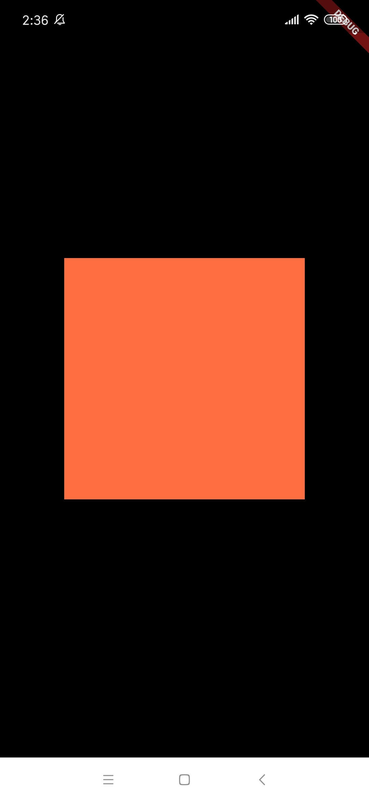
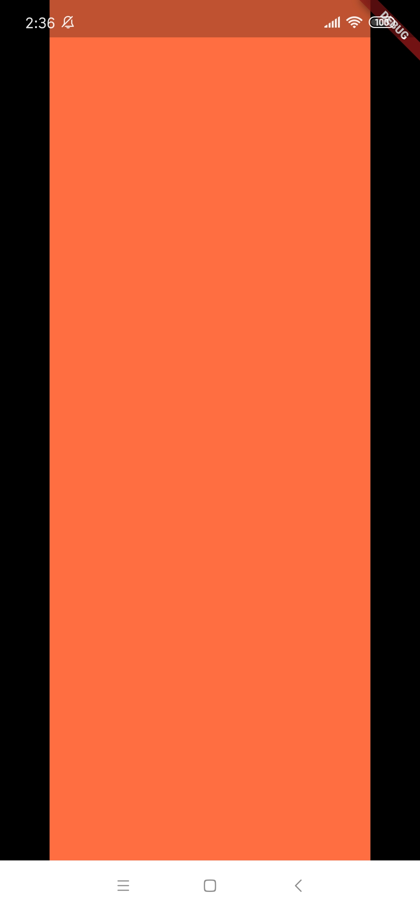
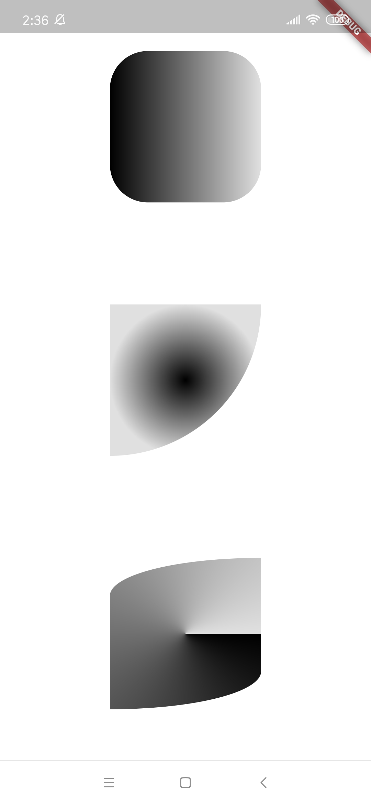

# 逐个击破 - Container

> "部件逐个击破" 是一个解析 Flutter 中常用 Wiget 使用姿势的文章集合。

## 概述

`Container` 部件可以说是 Flutter 中最常用的 Widget 了。

其继承关系和构造函数逻辑如下：

```dart
class Container extends StatelessWidget {
  Container({
    Key key,
    this.alignment,
    this.padding,
    Color color,
    Decoration decoration,
    this.foregroundDecoration,
    double width,
    double height,
    BoxConstraints constraints,
    this.margin,
    this.transform,
    this.child,
  }): ...
}
```

其中构造函数参数：

* `AlignmentGeometry alignment`: 指定 `child` 在 container 中的对齐方式。
* `EdgeInsetsGeometry padding`: 指定 container 的内边距。
* `Color color`: 背景色，实际上是 `decoration: BoxDecoration(color: color)` 的简写，所以 `color` 和 `decoration` 不能同时使用。
* `Decoration decoration`: 顾名思义，该属性是 container 的装饰配置。比如，通过 `decoration: BoxDecoration(color: Colors.green)` 来将其底色装饰城绿色。
* `Decoration foregroundDecoration`: 前景装饰配置。
* `double width`: 宽度。
* `double height`: 高度。
* `BoxConstraints constraints`: 指定 container 的约束，下文中我们会通过示例进行演示。
* `EdgeInsetsGeometry margin`: 指定 container 的外边距。
* `Matrix4 transform`: 指定 container 的变换。
* `Widget child`: 指定其子部件。

> 注意：
> * `color` 和 `decoration` 不能同时使用，否则会报错： `Cannot provide both a color and a decoration, The color argument is just a shorthand for "decoration: new BoxDecoration(color: color)".`


## 简单示例

在下面的实例中嵌套了三层 `Container` 部件。

| Normal | Show Debug Paint
| -- | --
|  | 


```dart
import 'package:flutter/material.dart';

class DemoPage extends StatefulWidget {
  @override
  _DemoPageState createState() => _DemoPageState();
}

class _DemoPageState extends State<DemoPage> {
  @override
  Widget build(BuildContext context) {
    return Container(                                 // 1
      alignment: Alignment.center,
      color: Colors.white,
      child: Container(                               // 2
        margin: const EdgeInsets.all(10.0),
        padding: const EdgeInsets.all(20.0),
        color: Colors.yellow[600],
        width: 156.0,
        height: 156.0,
        child: Container(                             // 3
          color: Colors.green,
        ),
      ),
    );
  }
}
```


* 首先，第一层 `Container` 作为页面的根组件并且没有显式指定其宽高，所以它的宽度和宽度会 "最大化"。也就是说，该 `Container` 会占满整个屏幕。其 `alignment` 属性可以用来控制其 `child` 的对齐方式：
* 接着，在第二层 `Container` 中我们显式指定了其宽高，并将其底色置为黄色。另外，我们指定了其外边距 (`margin`) 均为 10、其内边距 (`padding`) 均为 20，这个从上右侧的 'Show Debug Paint' 效果图中可以看出。
* 最后，在第三层 `Container` 中我们只将其底色置为绿色，并未指定其宽高。所以该 `Container` 会类似第一层 `Container` 那样将其宽高 "最大化"，但因为其父容器 (第二层 `Container` ) 已经显式指定宽高和内边距，所以其宽度为 `156.0 - 20.0 = 136.0`、其高度为 `156.0 - 20.0 = 136.0`。

附：

```dart
class Alignment extends AlignmentGeometry {
  ...
  /// 左上角
  static const Alignment topLeft = Alignment(-1.0, -1.0);

  /// 顶部居中
  static const Alignment topCenter = Alignment(0.0, -1.0);

  /// 右上角
  static const Alignment topRight = Alignment(1.0, -1.0);

  /// 垂直方向居中，水平方向居左
  static const Alignment centerLeft = Alignment(-1.0, 0.0);

  /// 垂直方向和水平方向均居中
  static const Alignment center = Alignment(0.0, 0.0);

  /// 垂直方向居中，水平方向居右
  static const Alignment centerRight = Alignment(1.0, 0.0);

  /// 左下角
  static const Alignment bottomLeft = Alignment(-1.0, 1.0);

  /// 底部居中
  static const Alignment bottomCenter = Alignment(0.0, 1.0);

  /// 右下角
  static const Alignment bottomRight = Alignment(1.0, 1.0);
}
```


## 参数详解

### `Matrix4 transform`

`Matrix4` 理解起来比较困难，可以自行检索关键字进行了解先。

为能够通过页面截图来理解 `transform` 属性的使用，我们先来封装一个仅接收 `transform` 参数的演示部件： 

```dart
class TransformContainer extends StatelessWidget {
  final Matrix4 transform;

  const TransformContainer({Key key, this.transform}) : super(key: key);

  @override
  Widget build(BuildContext context) {
    var example = Container(
      width: 250,
      height: 150,
      padding: const EdgeInsets.all(8.0),
      color: Colors.blue[600],
      alignment: Alignment.center,
      child: Text('Hello World',
          style: Theme.of(context)
              .textTheme
              .display1
              .copyWith(color: Colors.white)),
      // 通过构造函数参数来指定 transform 的值
      transform: transform,
    );
    return Center(
      child: example,
    );
  }
}
```

然后在 DemoPage 中以列的形式显示三个 `TransformContainer` 部件：

```dart
class DemoPage extends StatefulWidget {
  @override
  _DemoPageState createState() => _DemoPageState();
}

class _DemoPageState extends State<DemoPage> {
  @override
  Widget build(BuildContext context) {
    var child1 = TransformContainer();
    var child2 = TransformContainer();
    var child3 = TransformContainer();
    var child4 = TransformContainer();
    return Container(
      color: Colors.white,
      child: Column(
        children: <Widget>[
          Expanded(flex: 1, child: child1),
          Expanded(flex: 1, child: child2),
          Expanded(flex: 1, child: child3),
          Expanded(flex: 1, child: child4),
        ],
      ),
    );
  }
}
```

运行后，效果图如下：


然后，通过修改 `child1`、`child2`、`child3` 的值来看看效果。

**rotation**

```dart
// rotationX
var child1 = TransformContainer();
var child2 = TransformContainer(transform: Matrix4.rotationX(0.6));
var child3 = TransformContainer(transform: Matrix4.rotationX(0.8));
var child4 = TransformContainer(transform: Matrix4.rotationX(1.0));

// rotationY
var child1 = TransformContainer();
var child2 = TransformContainer(transform: Matrix4.rotationY(0.6));
var child3 = TransformContainer(transform: Matrix4.rotationY(0.8));
var child4 = TransformContainer(transform: Matrix4.rotationY(1.0));

// rotationZ
var child1 = TransformContainer();
var child2 = TransformContainer(transform: Matrix4.rotationZ(0.2));
var child3 = TransformContainer(transform: Matrix4.rotationZ(0.4));
var child4 = TransformContainer(transform: Matrix4.rotationZ(0.6));
```

| rotationX | rotationY | rotationZ
| -- | -- | --
|  |  | 

可以看出：
* 随着 `rotationX` 的增大，`TransformContainer` 在垂直方向上的压缩越发明显。
* 随着 `rotationY` 的增大，`TransformContainer` 在水平方向上的压缩越发明显。
* 随着 `rotationZ` 的增大，`TransformContainer` 在顺时针方向上的旋转角度越发明显。


**skew**

```dart
// skewX
var child1 = TransformContainer();
var child2 = TransformContainer(transform: Matrix4.skewX(0.2));
var child3 = TransformContainer(transform: Matrix4.skewX(0.6));
var child4 = TransformContainer(transform: Matrix4.skewX(1.0));

// skewY
var child1 = TransformContainer();
var child2 = TransformContainer(transform: Matrix4.skewY(0.2));
var child3 = TransformContainer(transform: Matrix4.skewY(0.6));
var child4 = TransformContainer(transform: Matrix4.skewY(1.0));

// skew
var child1 = TransformContainer();
var child2 = TransformContainer(transform: Matrix4.skew(0.2, 0.2));
var child3 = TransformContainer(transform: Matrix4.skew(0.6, 0.6));
var child4 = TransformContainer(transform: Matrix4.skew(1.0, 1.0));
```

| skewX | skewY | rotationZ
| -- | -- | --
|  |  | 

单词 skew 意为 "偏的，歪斜的"，从效果图可以看出：
* `skewX` 越大，`TransformContainer` 右下顶点越往右，X 轴歪斜越明显。
* `skewY` 越大，`TransformContainer` 右下顶点越往下，Y 轴歪斜越明显。
* `skew` 的效果图可以结合 `skewX` 和 `skewY` 来分析。


### `BoxConstraints constraints`

单词 constraints 意为 "约束条件"，那么 `BoxConstraints` 就可以理解为 "对一个盒子模型的约束条件"，比如 "约束最小宽度"、"约束最大宽度"、"约束最小高度"、"约束最大高度" 等。

我们先来看下 `BoxConstraints` 的继承关系和构造函数：

```dart
/// Immutable layout constraints for [RenderBox] layout.
class BoxConstraints extends Constraints {
  /// Creates box constraints with the given constraints.
  const BoxConstraints({
    this.minWidth = 0.0,
    this.maxWidth = double.infinity,
    this.minHeight = 0.0,
    this.maxHeight = double.infinity,
  });
  ...
}
```

有人说，直接使用 `BoxConstraints` 有点死板，所以 `BoxConstraints` 提供了一些命名构造函数来方便我们使用：

```dart
class BoxConstraints extends Constraints {
  ...
  /// 仅通过给定的 size 来创建盒子约束
  BoxConstraints.tight(Size size)
    : minWidth = size.width,
      maxWidth = size.width,
      minHeight = size.height,
      maxHeight = size.height;

  /// 通过给定的 width 和 height 来创建盒子约束
  const BoxConstraints.tightFor({
    double width,
    double height,
  }) : minWidth = width ?? 0.0,
       maxWidth = width ?? double.infinity,
       minHeight = height ?? 0.0,
       maxHeight = height ?? double.infinity;

  /// 禁止盒子的宽高大于给定的 size
  BoxConstraints.loose(Size size)
    : minWidth = 0.0,
      maxWidth = size.width,
      minHeight = 0.0,
      maxHeight = size.height;

  /// 创建一个能填充 "其它盒子约束" 的 "盒子约束""
  const BoxConstraints.expand({
    double width,
    double height,
  }) : minWidth = width ?? double.infinity,
       maxWidth = width ?? double.infinity,
       minHeight = height ?? double.infinity,
       maxHeight = height ?? double.infinity;
}
```

> 注：从 `Container` 的构造函数初始化代码中可以看出，其 `width` 和 `height` 最终也是通过 `BoxConstraints` 来实现的。

如果你想尽可能理解上述命名构造函数的区别，请多读几遍构造函数的初始化代码。下面列举了一些示例代码，有助于来加深你的理解。

**如果没有加任何约束：**

```dart
import 'package:flutter/material.dart';

class DemoPage extends StatefulWidget {
  @override
  _DemoPageState createState() => _DemoPageState();
}

class _DemoPageState extends State<DemoPage> {
  @override
  Widget build(BuildContext context) {
    return Center(
      child: Container(
        constraints: null,
        color: Colors.deepOrangeAccent,
      ),
    );
  }
}
```

运行效果图如下：


**如果加上 `BoxConstraints.tight` 约束：**

```dart
BoxConstraints.tight(Size(96, 124))
BoxConstraints.tight(Size.square(256))
```

运行效果图如下：

 


**如果加上 `BoxConstraints.expand` 约束：**

**如果加上 `BoxConstraints.tight` 约束：**

```dart
constraints: BoxConstraints.expand(width: 300)
constraints: BoxConstraints.expand(height: 300)
constraints: BoxConstraints.expand(width: 300, height: 300)
```

运行效果图如下：

| width: 300 | height: 300 | width: 300, height: 300
| -- | -- | --
|  |  | 


### `Decoration decoration`

终于到了 "修饰" 参数了，我们来选个风骚的紫色来对前面讲到的 "`Color color` 等同于 `const BoxDecoration(color: color)`" 给个现身说法：

```dart
import 'package:flutter/material.dart';

class DemoPage extends StatefulWidget {
  @override
  _DemoPageState createState() => _DemoPageState();
}

class _DemoPageState extends State<DemoPage> {
  @override
  Widget build(BuildContext context) {
    const decoration = BoxDecoration(color: Colors.deepPurpleAccent);
    return Center(
      child: Container(
        width: 300,
        height: 300,
        decoration: decoration,
      ),
    );
  }
}
```

运行后效果如下：


事实上，`Decoration decoration` 的可玩性远不止价格底色这么简单，它还可以帮我们实现设置圆角、增加阴影、渐变色、背景图等功能。瞎比比两分钟，不如多写几行示例代码。


**设置圆角**

```dart
// 1
const decoration = BoxDecoration(
  color: Colors.deepPurpleAccent,
  borderRadius: BorderRadius.all(Radius.circular(48)),
);

// 2
const decoration = BoxDecoration(
  color: Colors.deepPurpleAccent,
  borderRadius: BorderRadius.only(bottomRight: Radius.circular(150)),
);

// 3
const decoration = BoxDecoration(
  color: Colors.deepPurpleAccent,
  borderRadius: BorderRadius.only(
      bottomRight: Radius.elliptical(300, 50),
      topLeft: Radius.elliptical(300, 50)),
);
```

| 1 | 2 | 3
| -- | -- | --
|  |  | 


**增加阴影** 

```dart
import 'package:flutter/material.dart';

class DemoPage extends StatefulWidget {
  @override
  _DemoPageState createState() => _DemoPageState();
}

class _DemoPageState extends State<DemoPage> {
  Widget _buildContainer(BoxDecoration decoration) => Expanded(
        flex: 1,
        child: Center(
          child: Container(
            width: 160,
            height: 160,
            decoration: decoration,
          ),
        ),
      );

  @override
  Widget build(BuildContext context) {
    const decoration1 = BoxDecoration(
      color: Colors.deepPurpleAccent,
      borderRadius: BorderRadius.all(Radius.circular(40)),
      boxShadow: [
        BoxShadow(color: Colors.yellow, blurRadius: 5, spreadRadius: 5),
      ],
    );
    const decoration2 = BoxDecoration(
      color: Colors.deepPurpleAccent,
      borderRadius: BorderRadius.only(bottomRight: Radius.circular(160)),
      boxShadow: [
        BoxShadow(color: Colors.yellow, blurRadius: 5, spreadRadius: 10)
      ],
    );
    const decoration3 = BoxDecoration(
        color: Colors.deepPurpleAccent,
        borderRadius: BorderRadius.only(
            bottomRight: Radius.elliptical(160, 40),
            topLeft: Radius.elliptical(160, 40)),
        boxShadow: [
          BoxShadow(color: Colors.yellow, blurRadius: 20, spreadRadius: 10)
        ]);
    return Container(
      color: Colors.white,
      child: Column(
        children: <Widget>[
          _buildContainer(decoration1),
          _buildContainer(decoration2),
          _buildContainer(decoration3),
        ],
      ),
    );
  }
}
```

效果图如下：


由效果图可知：
* 阴影会随着圆角的变化而变化。
* 对比图形一和图形二可知，`blurRadius` 相同时，`spreadRadius` 越大，阴影越宽。
* 对比图形二和图形三可知，`spreadRadius` 相同时，`blurRadius` 越大，阴影越模糊。


**渐变色**

以上面 "增加阴影" 部分的代码为基础：
* `decoration1`
  * 去掉代码 `boxShadow: ...` 
  * 增加代码 `gradient: LinearGradient(colors: [Colors.black, Colors.black12])` 
* `decoration2`
  * 去掉代码 `boxShadow: ...` 
  * 增加代码 `gradient: RadialGradient(colors: [Colors.black, Colors.black12])` 
* `decoration3`
  * 去掉代码 `boxShadow: ...` 
  * 增加代码 `gradient: SweepGradient(colors: [Colors.black, Colors.black12])` 

运行后，得到效果图如下：




**背景图**

```dart
import 'package:flutter/material.dart';

class DemoPage extends StatefulWidget {
  @override
  _DemoPageState createState() => _DemoPageState();
}

class _DemoPageState extends State<DemoPage> {
  @override
  Widget build(BuildContext context) {
    const imageDecoration = BoxDecoration(
      image: DecorationImage(
        image: ExactAssetImage('lib/assets/images/bg_google_io.png'),
        fit: BoxFit.cover,
      ),
    );
    var textWidget = Text(
      '我是背景图上面的文字',
      style: TextStyle(
        fontSize: 12,
        color: Colors.white,
        decoration: TextDecoration.none,
      ),
    );
    var textContainer = Container(
      padding: EdgeInsets.only(right: 8),
      decoration: BoxDecoration(
        gradient: LinearGradient(colors: [Colors.black12, Colors.black]),
      ),
      alignment: Alignment.centerRight,
      child: textWidget,
    );
    return Center(
      child: Container(
        width: 300,
        height: 150,
        decoration: imageDecoration,
        alignment: Alignment.bottomCenter,
        child: SizedBox(
          height: 32,
          child: Center(
            child: textContainer,
          ),
        ),
      ),
    );
  }
}
```

| 背景图 | 效果图
| -- | -- 
|  | 

注意，记得在 pubspec.yaml 文件对应位置补上下面的资源声明代码噢：

```yaml
# To add assets to your application, add an assets section, like this:
assets:
  - lib/assets/images/
```


// TODO ...