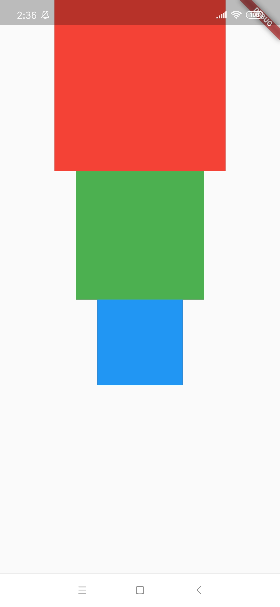
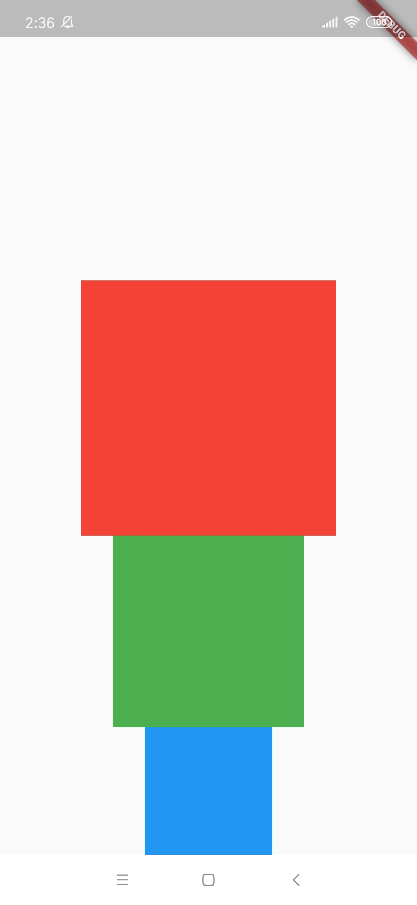
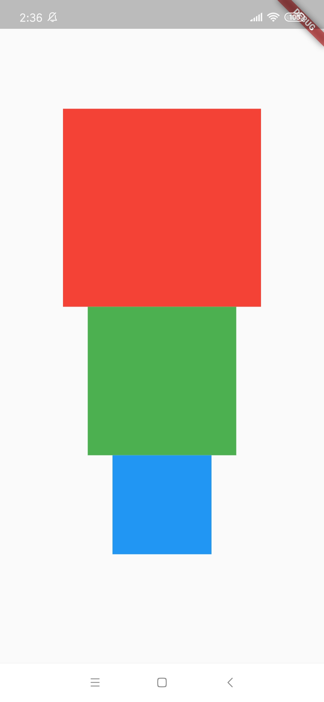
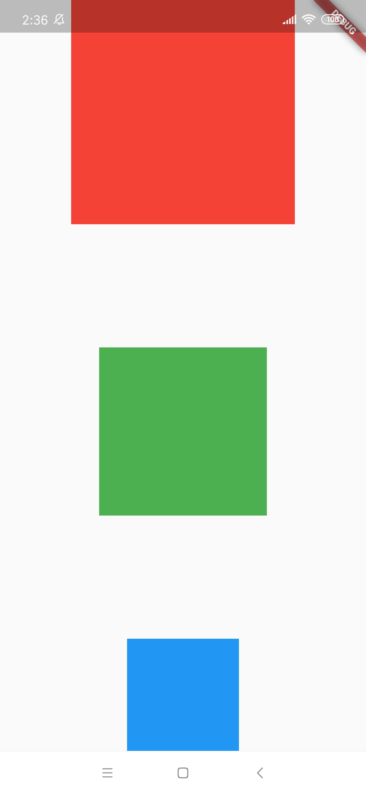
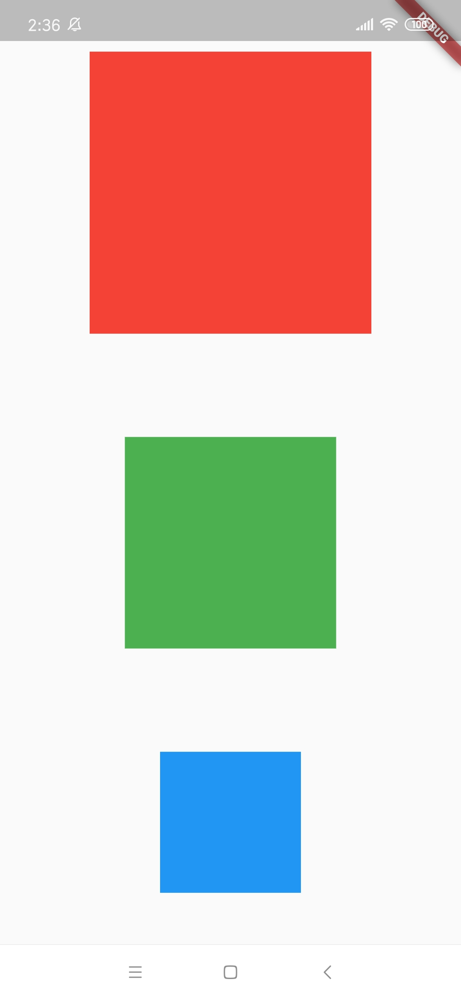
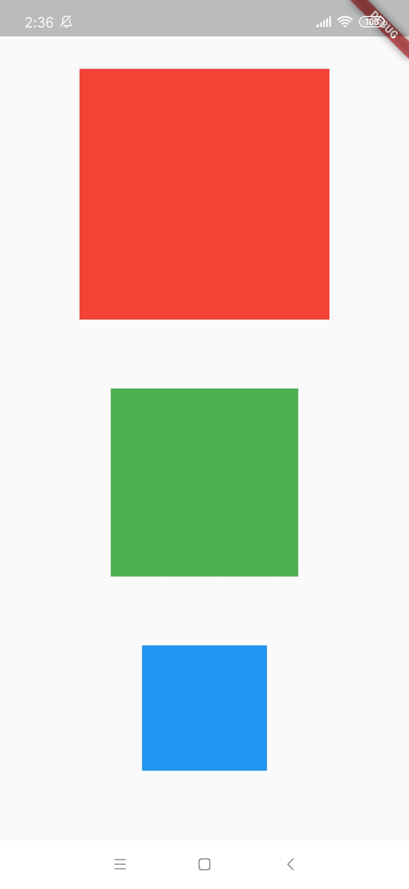
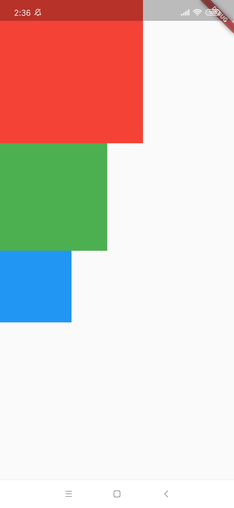
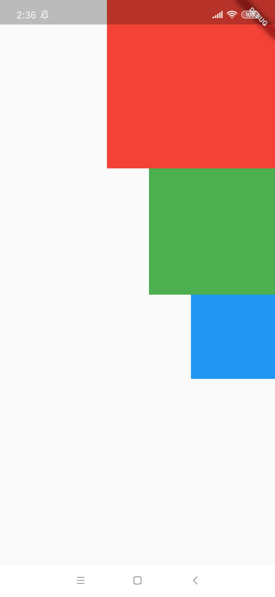
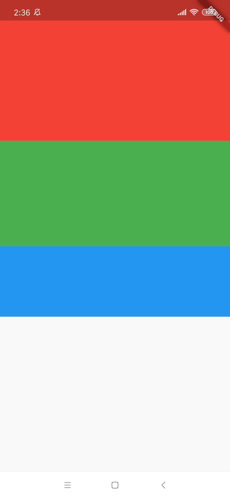

# 逐个击破 - Flex, Column 和 Row

## 概述


## Column 

顾名思义，[Column](https://api.flutter.dev/flutter/widgets/Column-class.html) 是一个将其 children 垂直显示的容器部件。

举个栗子：

```dart
import 'package:flutter/material.dart';

class DemoPage extends StatefulWidget {
  @override
  _DemoPageState createState() => _DemoPageState();
}

class _DemoPageState extends State<DemoPage> {
  @override
  Widget build(BuildContext context) {
    // sample-start
    var column = Column(
      children: <Widget>[
        Container(width: 240, height: 240, color: Colors.red),
        Container(width: 180, height: 180, color: Colors.green),
        Container(width: 120, height: 120, color: Colors.blue),
      ],
    );
    // sample-end
    return Scaffold(
      body: Container(
        width: double.infinity,  // 使得宽度占满
        child: column,
      ),
    );
  }
}
```

运行后，效果图如下：

 

通过上面右边的效果图可以看出：
* 在垂直方向上，`Column` 默认居上 (从上到下) 排列其 children。
* 在水平方向上，`Column` 默认居中 (中部对齐) 排列其 children。
* 另外，垂直方向上 `Column` 默认是占满屏幕的，尽管其 children 并不需要那么大的高度就可以完全呈现。
  
为什么默认是这样的呢？看下其构造函数就知道了：

```dart
Column({
  Key key,
  MainAxisAlignment mainAxisAlignment = MainAxisAlignment.start,
  MainAxisSize mainAxisSize = MainAxisSize.max,
  CrossAxisAlignment crossAxisAlignment = CrossAxisAlignment.center,
  TextDirection textDirection,
  VerticalDirection verticalDirection = VerticalDirection.down,
  TextBaseline textBaseline,
  List<Widget> children = const <Widget>[],
}) : super(...);
```

* `mainAxisAlignment` 默认值为 `MainAxisAlignment.start`。
* `crossAxisAlignment` 默认值为 `CrossAxisAlignment.center`。


### MainAxisAlignment

MainAxis 意为 "主轴"，即主要的轴，对于 `Column` 来说主要的轴就是竖直方向的轴。`MainAxisAlignment` 是一个枚举，它有六个可选值：
* `MainAxisAlignment.start`：
* `MainAxisAlignment.end`：
* `MainAxisAlignment.center`：
* `MainAxisAlignment.spaceBetween`：
* `MainAxisAlignment.spaceAround`：
* `MainAxisAlignment.spaceEvenly`：

我们为 `mainAxisAlignment` 分别指定不同的的值，然后运行，显示效果如下：

| tart | end | center | spaceBetween | spaceAround | spaceEvenly
| -- | -- | -- | -- | -- | --
|  |  |  |  |  | 

### CrossAxisAlignment

CrossAxis 可译为 "横跨轴"，即与主轴相垂直的轴。`CrossAxisAlignment` 也是一个枚举，但它只有五个可选值：
* `CrossAxisAlignment.start`：
* `CrossAxisAlignment.end`：
* `CrossAxisAlignment.center`：
* `CrossAxisAlignment.stretch`：
* `CrossAxisAlignment.baseline`：TODO。


类似上面为 `mainAxisAlignment` 分别指定不同值的示例，下面我们也为 `crossAxisAlignment` 指定不同的值：

| tart | end | center | stretch 
| -- | -- | -- | -- 
|  |  |  | 


## Row

[Row](https://api.flutter.dev/flutter/widgets/Row-class.html)


## Flex

[Flex](https://api.flutter.dev/flutter/widgets/Flex-class.html)


## 总结

TODO

